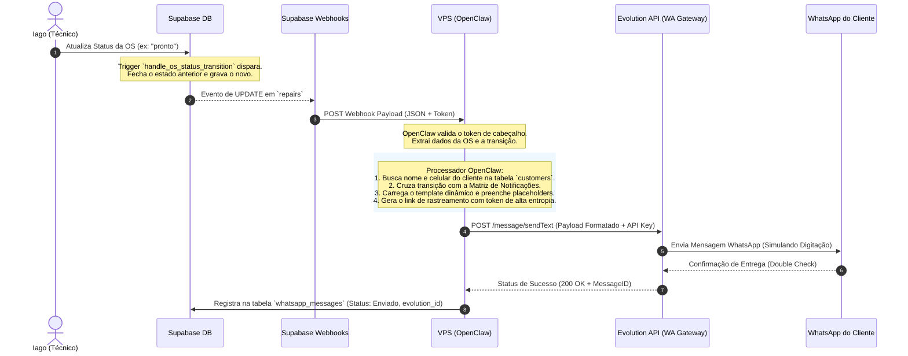

# Especificação: Acompanhamento Público de OS em Tempo Real e Bridge WhatsApp (OpenClaw)

**Feature:** `006-admin-os-tracking` (Extensão de `006-admin-os` com integração à `008-whatsapp-bridge`)  
**Status:** Planejamento Conceitual / Arquitetura  
**Criada:** 2026-05-20  
**Depende de:** `006-admin-os` (Core OS) · `005-admin-crm` (Clientes) · `008-whatsapp-bridge` (Fase 1)  
**Autor:** Service Flow Designer  

---

## 1. Contexto & Visão Geral

Para melhorar a experiência do cliente e reduzir o tempo de Iago respondendo manualmente a perguntas repetitivas no WhatsApp (ex: *"Iago, meu celular está pronto?"*), este design propõe um sistema integrado de rastreamento público de Ordens de Serviço (OS) com atualizações proativas via WhatsApp usando a infraestrutura do **OpenClaw** na VPS.

O fluxo de valor é simples, porém extremamente poderoso:
1. **Ação do Técnico:** Iago altera o status de uma OS no painel administrativo `/admin/os`.
2. **Lógica de Banco:** Um trigger no Supabase registra a transição de status na tabela `os_status_history`, gravando a hora exata da mudança e fechando o tempo decorrido no estado anterior.
3. **Disparo de Evento:** O Supabase dispara um Database Webhook seguro para a VPS rodando **OpenClaw**.
4. **Processamento Inteligente:** O OpenClaw intercepta o payload, resolve os placeholders do template, calcula links com tokens de alta entropia e envia uma notificação formatada para o WhatsApp do cliente através da **Evolution API**.
5. **Autonomia de Consulta:** O cliente recebe um link exclusivo de rastreamento (sem necessidade de login), onde visualiza uma timeline interativa contendo fotos reais do conserto e indicadores dinâmicos de tempo decorrido em cada etapa.

---

## 2. Modelo de Dados: Schema de Histórico de Status

Para realizar o rastreamento preciso do tempo que um aparelho passa em cada estágio do conserto, criamos a tabela `os_status_history` no Supabase.

### 2.1. Tabela `os_status_history`

| Coluna | Tipo | Restrições | Descrição |
|---|---|---|---|
| `id` | `UUID` | `PRIMARY KEY`, `DEFAULT gen_random_uuid()` | Identificador único da transição. |
| `os_id` | `UUID` | `REFERENCES repairs(id) ON DELETE CASCADE` | FK que aponta para a tabela principal de OS (`repairs`). |
| `status` | `VARCHAR` | `NOT NULL` | O status no qual a OS acabou de entrar (vide enum de estados). |
| `entered_at` | `TIMESTAMPTZ` | `NOT NULL DEFAULT NOW()` | Timestamp de entrada no status. |
| `exited_at` | `TIMESTAMPTZ` | `NULL` | Timestamp de saída do status (nulo enquanto for o status ativo). |
| `duration_seconds`| `BIGINT` | `NULL` | Tempo total em segundos decorrido nesta etapa. Preenchido na transição de saída. |
| `changed_by` | `UUID` | `REFERENCES auth.users(id) ON DELETE SET NULL` | ID do operador que realizou a mudança (ou NULL para automações/bot). |
| `notes` | `TEXT` | `NULL` | Comentário ou justificativa para a mudança (ex: "Aguardando chegada da tela do fornecedor X"). |

### 2.2. Triggers e Automação de Transição (PL/pgSQL)

Para manter a consistência de forma totalmente automatizada no banco de dados e evitar que a aplicação Web precise calcular a saída do status anterior, implementamos o trigger abaixo no PostgreSQL do Supabase:

```sql
-- Função para gerenciar transições de histórico de status da OS
CREATE OR REPLACE FUNCTION public.handle_os_status_transition()
RETURNS TRIGGER AS $$
DECLARE
    last_history_id UUID;
    entered_time TIMESTAMP WITH TIME ZONE;
BEGIN
    -- 1. Se for uma atualização, fechar o status anterior
    IF (TG_OP = 'UPDATE') THEN
        -- Só executa se o status realmente mudou de valor
        IF (OLD.status IS DISTINCT FROM NEW.status) THEN
            
            -- Busca o último histórico ativo desta OS (exited_at IS NULL)
            SELECT id, entered_at INTO last_history_id, entered_time
            FROM public.os_status_history
            WHERE os_id = NEW.id AND exited_at IS NULL
            ORDER BY entered_at DESC
            LIMIT 1;

            -- Se houver, calcula a duração e define data de saída
            IF last_history_id IS NOT NULL THEN
                UPDATE public.os_status_history
                SET 
                    exited_at = NOW(),
                    duration_seconds = EXTRACT(EPOCH FROM (NOW() - entered_time))::BIGINT
                WHERE id = last_history_id;
            END IF;

            -- Cria o novo registro correspondente ao novo status
            INSERT INTO public.os_status_history (os_id, status, entered_at, changed_by)
            VALUES (NEW.id, NEW.status, NOW(), auth.uid());
            
        END IF;
    
    -- 2. Se for uma criação (INSERT), inicia o histórico de status inicial (ex: rascunho)
    ELSIF (TG_OP = 'INSERT') THEN
        INSERT INTO public.os_status_history (os_id, status, entered_at, changed_by)
        VALUES (NEW.id, NEW.status, NOW(), auth.uid());
    END IF;
    
    RETURN NEW;
END;
$$ LANGUAGE plpgsql SECURITY DEFINER;

-- Trigger disparado ao atualizar o status de uma OS
CREATE OR REPLACE TRIGGER on_os_status_change
    AFTER UPDATE OF status ON public.repairs
    FOR EACH ROW
    WHEN (OLD.status IS DISTINCT FROM NEW.status)
    EXECUTE FUNCTION public.handle_os_status_transition();

-- Trigger disparado na criação de uma OS
CREATE OR REPLACE TRIGGER on_os_created
    AFTER INSERT ON public.repairs
    FOR EACH ROW
    EXECUTE FUNCTION public.handle_os_status_transition();
```

> [!TIP]
> **Performance de Analytics:** Com este design de banco, Iago consegue rodar queries rápidas como `SELECT status, AVG(duration_seconds) FROM os_status_history GROUP BY status` para identificar imediatamente gargalos na sua loja (ex: se o tempo em `aguardando_peça` é maior que o tempo em `em_conserto`).

---

## 3. Interface Pública de Acompanhamento (Timeline UI Interativa)

A página de acompanhamento público do cliente (`https://suporte.iflcosta.com.br/rastrear/{tracking_token}`) é desenhada com foco em **Mobile-First**, velocidade e transparência. 

### 3.1. Arquitetura da URL & Segurança de Acesso
- **Token Oculto:** O cliente **não precisa de login ou senha** para acessar seu status, evitando barreiras.
- **Entropia Segura:** Em vez de usar IDs sequenciais na URL (ex: `/rastrear/104`), utiliza-se uma coluna `tracking_token UUID DEFAULT gen_random_uuid()` indexada e única na tabela `repairs`. Exemplo de URL gerada:  
  `https://suporte.iflcosta.com.br/rastrear/e0a6d17b-bd76-47b2-bd77-1600a9446d3e`
- **LGPD & Privacidade:** Dados sensíveis do cliente (endereço, CPF, e-mail) não são exibidos nesta página pública. O telefone é omitido e o nome do cliente é formatado para exibir apenas o primeiro nome (ex: *"Olá, Maria!"*). O serial do aparelho é parcialmente mascarado (ex: `DX3G****2K23`).

### 3.2. Estrutura Visual da Página (UI Componentes)

```
+-------------------------------------------------------------+
|  [Logo Iago Assistência]                        OS #1084    |
+-------------------------------------------------------------+
|  Olá, Maria!                                                |
|  Seu iPhone 12 Azul está em:                                |
|                                                             |
|  +-------------------------------------------------------+  |
|  |             🔧  EM CONSERTO (EM ANDAMENTO)            |  |
|  |           Há 2 dias e 4 horas nesta etapa             |  |
|  +-------------------------------------------------------+  |
+-------------------------------------------------------------+
|  LINHA DO TEMPO DO SERVIÇO                                  |
|                                                             |
|  (🟢 Check) Orçamento Aprovado                              |
|             19/05 às 14:32 · Concluído em 4h                |
|                                                             |
|  (🟢 Check) Diagnóstico & Orçamento                         |
|             19/05 às 09:15 · Concluído em 5h e 17min        |
|                                                             |
|  (🔵 Pulse) Em Conserto (Etapa Atual)                       |
|             Iniciado em 19/05 às 14:32 (Há 2 dias e 4h)     |
|                                                             |
|  (⚪ Gray)  Pronto para Retirada                            |
|             Etapa seguinte                                  |
+-------------------------------------------------------------+
|  FOTOS DO SEU APARELHO (TRANSPARÊNCIA)                      |
|  [FOTO ANTES]    [FOTO INTERNA]    [FOTO APÓS TESTE]        |
+-------------------------------------------------------------+
|  [ Dúvidas? Falar com Iago no WhatsApp ]                   |
+-------------------------------------------------------------+
```

### 3.3. Recursos Funcionais & Contadores Dinâmicos
- **Live State Duration:** O card de destaque e a linha do tempo utilizam uma lógica dinâmica de atualização. Um script simples no front-end atualiza o tempo restante ou decorrido a cada minuto sem precisar recarregar a página.
- **Utilitário de Formatação de Tempo (TypeScript):**
```typescript
function formatDuration(seconds: number): string {
  if (seconds < 60) return "menos de 1 minuto";
  const minutes = Math.floor(seconds / 60);
  const hours = Math.floor(minutes / 60);
  const days = Math.floor(hours / 24);

  const remainingHours = hours % 24;
  const remainingMinutes = minutes % 60;

  let parts: string[] = [];
  if (days > 0) {
    parts.push(`${days} ${days === 1 ? "dia" : "dias"}`);
  }
  if (remainingHours > 0) {
    parts.push(`${remainingHours} ${remainingHours === 1 ? "hora" : "horas"}`);
  }
  if (remainingMinutes > 0 && days === 0) { // Não exibe minutos se o prazo for de vários dias
    parts.push(`${remainingMinutes} ${remainingMinutes === 1 ? "minuto" : "minutos"}`);
  }

  return parts.join(" e ");
}
```
- **Galeria de Transparência:** Renderização de miniaturas vindas do Supabase Storage associadas à OS pelo técnico na seção `repair_photos`, permitindo ao cliente expandir e verificar o estado real das placas e componentes substituídos.
- **CTA Flutuante Integrado:** Um botão persistente no rodapé da página que redireciona para o WhatsApp de Iago com uma mensagem pré-formatada em URL Encode:  
  `https://wa.me/5511999999999?text=Oi%20Iago!%20Estou%20acompanhando%20a%20OS%20#1084%20do%20meu%20iPhone%2012%20azul%20e%20gostaria%20de...`

---

## 4. Matriz de Notificações Proativas vs. Passivas

Nem toda alteração de status deve resultar em um WhatsApp ativo para o cliente para evitar sobrecarregá-lo (fadiga de notificações) e mitigar o risco de banimento de número do WhatsApp. 

| Status Origem | Status Destino | Tipo de Ação | Notificação WhatsApp (Conteúdo do Template) | Gatilho e Link Técnico |
|---|---|---|---|---|
| Qualquer | `diagnóstico` | **PASSIVO** | Nenhuma mensagem enviada. O cliente vê a transição apenas se atualizar a timeline. | Apenas gravação interna no histórico. |
| `diagnóstico` | `aguardando_aprovação` | **ATIVO** | "Olá *{{nome}}*! O diagnóstico do seu *{{equipamento}}* foi finalizado. Laudo: *{{laudo}}*.<br>O valor total ficou em *R$ {{valor}}* com entrega estimada em *{{prazo}}*.<br>Você pode aprovar e autorizar o início do conserto com 1 toque aqui: {{link_rastreamento}}" | Webhook disparado com botões de callback. |
| `aguardando_aprovação` | `aprovado` | **ATIVO** | "Oba! Seu orçamento foi aprovado. 🛠️ Já começamos a trabalhar no seu *{{equipamento}}*.<br>Acompanhe o andamento em tempo real pela sua timeline de serviço: {{link_rastreamento}}" | Gatilho automático ao registrar a aprovação (pelo cliente na Web ou Iago no Admin). |
| `aprovado` | `aguardando_peça` | **ATIVO** | "Olá *{{nome}}*! Tivemos que encomendar uma peça para concluir a manutenção do seu *{{equipamento}}*. Fique tranquilo, ela já foi comprada e deve chegar em breve.<br>Veja o status de trâmite da peça em: {{link_rastreamento}}" | Entrada em status logístico. |
| `aguardando_peça` | `em_conserto` | **PASSIVO** | Nenhuma mensagem enviada. A timeline muda para "Em Conserto" silenciosamente quando a peça é recebida e o reparo recomeça. | Apenas gravação interna no histórico. |
| `em_conserto` | `pronto` | **ATIVO** | "Seu *{{equipamento}}* está PRONTO! 🎉 Fizemos todos os testes de bancada de energia e sensores e ele passou com 100% de sucesso.<br>Pode retirar na loja hoje das *14h às 19h*.<br>Veja as fotos dele pronto e ligue no link: {{link_rastreamento}}" | Disparo crítico de término. |
| `pronto` | `entregue` | **ATIVO** | "Agradecemos a confiança, *{{nome}}*! Seu *{{equipamento}}* foi entregue.<br>A sua garantia é válida por *{{garantia_dias}}* dias (até *{{garantia_ate}}*).<br>O histórico completo das fotos e o certificado digital de garantia estão sempre disponíveis aqui: {{link_rastreamento}}" | Encerramento do ciclo de atendimento. |
| Qualquer | `cancelado` / `cliente_desistiu` | **ATIVO** | "Olá *{{nome}}*. Confirmamos o cancelamento do serviço para o seu *{{equipamento}}*. O aparelho já foi remontado e está disponível para retirada sem custos na loja.<br>Detalhes adicionais: {{link_rastreamento}}" | Disparo terminal de recusa. |

---

## 5. Arquitetura de Integração: VPS + OpenClaw + Evolution API

Para executar este ecossistema com custos próximos de zero e total controle dos dados de Iago, utilizamos uma arquitetura hospedada em uma VPS Docker com a seguinte orquestração de microsserviços.

### 5.1. Fluxo de Integração (Mermaid Sequence)



### 5.2. Componentes e Responsabilidades Técnicas

#### A. Supabase DB Webhook
Configurado em `Database` -> `Webhooks` no Supabase Dashboard:
- **Evento:** `UPDATE` na tabela `public.repairs`.
- **Condição de disparo:** `OLD.status IS DISTINCT FROM NEW.status`.
- **Cabeçalhos:** `Authorization: Bearer <SECURE_WEBHOOK_SECRET>` (chave compartilhada de criptografia para autenticar o payload na VPS).

**Estrutura de Exemplo do Payload Webhook:**
```json
{
  "type": "UPDATE",
  "table": "repairs",
  "schema": "public",
  "record": {
    "id": "e0a6d17b-bd76-47b2-bd77-1600a9446d3e",
    "customer_id": "c76f9d2a-43cf-424a-9ef8-132d7ab2b2a1",
    "equipamento": {
      "tipo": "Celular",
      "marca": "Apple",
      "modelo": "iPhone 12 azul",
      "serial": "DX3G7892K23"
    },
    "status": "pronto",
    "valor_cobrado": 280.00,
    "tracking_token": "e0a6d17b-bd76-47b2-bd77-1600a9446d3e",
    "prazo_prometido": "2026-05-22T17:00:00Z"
  },
  "old_record": {
    "id": "e0a6d17b-bd76-47b2-bd77-1600a9446d3e",
    "status": "em_conserto"
  }
}
```

#### B. VPS - Motor OpenClaw (Node.js/Python Runtime)
Responsável por interceptar a chamada do webhook, validar o segredo e rodar a máquina de estado:
1. **Verificação de Segurança:** Rejeita chamadas sem cabeçalho `Authorization` correspondente ao segredo criptográfico guardado em `.env`.
2. **Query Complementar:** Executa chamada rápida no Supabase (usando `supabase-js` com chave de serviço protegida) para capturar o nome do cliente e o telefone ativo formatado em padrão internacional (ex: `5511999999999`).
3. **Engine de Templates:** Processa o template usando sintaxe de placeholders simples, como Mustache ou Javascript templates, realizando a higienização do primeiro nome e o parse do objeto JSON do equipamento.
4. **Despacho Assíncrono:** Insere a tarefa de envio na fila.

#### C. Evolution API (WhatsApp Gateway)
Instância da Evolution API em container Docker, conectada a um número celular corporativo físico.
- **Chamada:** `POST https://api.iflcosta.com.br/message/sendText/{instancia_iago}`
- **Parâmetros de Humanização:** 
  Para evitar bloqueios de spam pelo algoritmo do Meta, a chamada especifica parâmetros de atraso dinâmico e simulação:
```json
{
  "number": "5511999999999",
  "options": {
    "delay": 2500,
    "presence": "composing"
  },
  "textMessage": {
    "text": "Seu Apple iPhone 12 azul está PRONTO! 🎉..."
  }
}
```
*Isto instrui o WhatsApp a exibir "Digitando..." por 2,5 segundos antes de disparar a mensagem final, simulando perfeitamente a escrita manual.*

---

## 6. Controle de Fluxo, Resiliência e Fila de Mensagens

Para garantir estabilidade e impedir o envio repetido de mensagens idênticas (spamming acidental por técnicos ansiosos clicando repetidamente no botão de salvar) ou perda de notificações por instabilidade temporária de internet na VPS, o OpenClaw implementa os seguintes mecanismos de controle de falhas:

### 6.1. Fila com Limitador de Taxa (Rate Limiting)
- As mensagens nunca são enviadas diretamente de forma síncrona com o banco. O webhook grava o trabalho em uma fila Redis robusta (ex: BullMQ in Node.js ou Celery in Python).
- O worker consome a fila respeitando um limitador estrito: **mínimo de 10 segundos de intervalo entre envios de mensagens na mesma linha celular**. Isso impede o envio em rajadas de notificações.

### 6.2. Mecanismo de Retentativa com Backoff Exponencial
Se a Evolution API estiver offline ou o celular perder a conexão à internet, a tarefa na fila falhará. O sistema age conforme a regra:
- **Máximo de Tentativas:** 3 tentativas.
- **Atraso Incremental (Backoff):**
  - Falha 1: Aguarda 30 segundos antes de tentar novamente.
  - Falha 2: Aguarda 5 minutos antes de tentar novamente.
  - Falha 3: Aguarda 15 minutos.
- **Canal de Pânico (Fallback Alert):** Se todas as 3 tentativas falharem, a tarefa é marcada como `failed` no banco e uma notificação urgente é enviada para um grupo de Telegram/WhatsApp pessoal de Iago: *"ALERTA DE FALHA: A notificação de OS pronta para Maria (OS #1084) falhou em todas as tentativas. Verifique a Evolution API."*

### 6.3. Garantia de Idempotência
Para impedir que dois cliques rápidos ou flutuações de conexão resultem em dois envios iguais:
- Cada tarefa na fila recebe uma chave de idempotência exclusiva baseada no formato: `os:{id_da_os}:transicao:{status_origem}_to_{status_destino}`.
- O worker verifica se essa chave já foi processada com sucesso no cache Redis nas últimas 24 horas. Em caso positivo, descarta a tarefa duplicada silenciosamente.

---

## 7. Próximos Passos & Roteiro de Implementação Futura

Este design de arquitetura é conceitual e pavimenta o caminho para a automatização futura do suporte técnico. O desenvolvimento técnico deve seguir estas fases:
1. **Fase 1 (Banco & UI):** Criar a tabela `os_status_history` no Supabase e instalar a trigger de transições. Construir a rota de rastreamento pública `/rastrear/[token]` em Next.js com a UI da timeline e consumo do bucket de imagens.
2. **Fase 2 (Instalação OpenClaw na VPS):** Instalar o container do OpenClaw em conjunto com Redis na VPS Docker existente e expor o endpoint de webhook com autenticação de Token.
3. **Fase 3 (Conexão Evolution API):** Ativar a instância corporativa e configurar o envio com delay e simulador de presença ativo.
4. **Fase 4 (Monitoramento & RLS):** Testar transições completas de fluxo real em aparelhos celulares de teste e afinar RLS para o token público.
