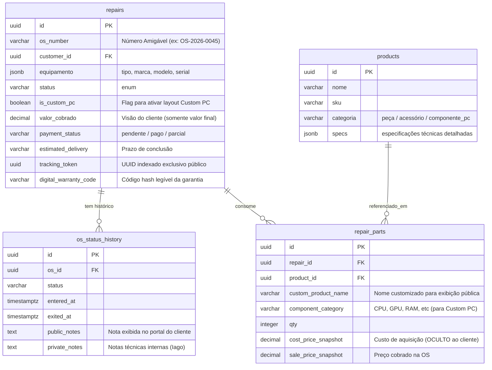

# Especificação: Acompanhamento Público de OS em Tempo Real (Upgrade Visual & de Dados)

**Feature:** `006-admin-os-tracking-upgrade` (Upgrade do portal `/rastrear?token=UUID`)  
**Status:** Implementado em produção (2026-05-21)  
**Criada:** 2026-05-21  
**Depende de:** `006-admin-os` (Core OS) · `007-admin-inventory` (Estoque/Componentes) · `008-whatsapp-bridge` (Notificações)  
**Autor:** Service Flow Designer  

---

> **Reconciliação (2026-05-21):** Esta é a **spec autoritativa** do portal `/rastrear`,
> substituindo divergências do `tracking_design.md`. Decisões finais consolidadas:
> - **URL:** `/rastrear?token=UUID` (query string), não path param.
> - **Conteúdo da timeline:** o portal exibe **fotos de bancada E notas técnicas públicas** — ambos.
> - **RLS:** conforme a migration `2026_05_21_create_tracking_upgrade.sql` — view sanitizada
>   `view_public_os_tracking` + policies de SELECT restritas a `tracking_token IS NOT NULL`.
> - **Endpoint:** `GET /api/admin/os/tracking?token=UUID` — público/anônimo, lê apenas a view sanitizada.
> - **Tema visual:** stylesheet dark glassmorphism autocontido — exceção documentada no ADR 0006.

---

## 1. Visão Geral & Filosofia de Negócio

Para elevar o nível de profissionalismo da assistência técnica do Iago e consolidar a venda de máquinas de alto valor do **Custom PC Builder**, o portal de rastreamento público precisa ser muito mais do que um simples "status passivo". Ele deve atuar como uma **vitrine de transparência** que gera confiança no cliente, reduz a ansiedade do suporte e valoriza a mão de obra do técnico.

### Princípios do Upgrade:
1. **Transparência Sem Vulnerabilidade:** O cliente visualiza cada peça trocada ou componente montado (essencial para atestar o uso de peças originais/novas), porém os **custos de aquisição, margens de lucro (markup) e detalhes de fornecedores nunca são expostos**.
2. **Combate à Ansiedade (Timeline Explicativa):** Em vez de status frios como "Em Conserto", a nova timeline expõe "Notas Públicas" que explicam exatamente o que está acontecendo (ex: *"Efetuando testes de estresse térmico no FurMark para garantir estabilidade sob carga"*).
3. **Valorização do Hardware (Custom PC Builder):** Quando a OS for de montagem de um PC Customizado, a página se transforma em um "Showcase" premium do computador, exibindo as especificações detalhadas de cada componente (CPU, GPU, RAM, etc.) em cards visuais modernos e organizados.
4. **Segurança de Acesso (Zero-Friction):** O acesso continua sendo por token UUID de alta entropia (ex: `e0a6d17b-bd76-47b2-bd77-1600a9446d3e`), livre de logins burocráticos, com proteção de dados pessoais (LGPD).

---

## 2. Design Visual System (Glassmorphism & Badges HSL)

O portal é desenhado com uma estética **Mobile-First de alta fidelidade**, utilizando uma interface fluida com efeito de vidro fosco (glassmorphism) sobre um fundo gradiente escuro e badges vibrantes baseados em HSL (Hue, Saturation, Lightness) para denotar o dinamismo do status.

### 2.1. Tokens de Estilo & Cores (Tailwind CSS Base)

```js
// Configurações do Design System para o Tailwind / CSS Custom Properties
const designTokens = {
  theme: {
    colors: {
      background: 'dark-slate-950', // #020617
      glass: {
        bg: 'rgba(30, 41, 59, 0.45)', // Slate 800 com 45% de opacidade
        border: 'rgba(255, 255, 255, 0.08)',
        shadow: 'rgba(0, 0, 0, 0.3)',
        blur: '16px',
      }
    },
    // Badges Dinâmicos HSL (Fáceis de ajustar para contraste WCAG)
    statusColors: {
      rascunho:           { h: 210, s: 20, l: 50, text: 'slate-300', bg: 'slate-900/50' },     // Cinza Slate
      diagnostico:        { h: 280, s: 65, l: 60, text: 'purple-300', bg: 'purple-950/40' },   // Roxo Vibrante
      aguardando_aprov:   { h: 32,  s: 95, l: 60, text: 'amber-300', bg: 'amber-950/40' },     // Laranja Alerta
      aprovado:           { h: 195, s: 85, l: 55, text: 'sky-300', bg: 'sky-950/40' },         // Azul Celeste
      aguardando_peca:    { h: 15,  s: 85, l: 55, text: 'orange-300', bg: 'orange-950/40' },   // Vermelho Tijolo
      em_conserto:        { h: 260, s: 80, l: 65, text: 'indigo-300', bg: 'indigo-950/40' },   // Indigo
      pronto:             { h: 142, s: 70, l: 45, text: 'emerald-300', bg: 'emerald-950/40' }, // Verde Sucesso
      entregue:           { h: 200, s: 15, l: 30, text: 'slate-400', bg: 'slate-950/60' },     // Cinza Omitido
      cancelado:          { h: 0,   s: 65, l: 50, text: 'rose-300', bg: 'rose-950/40' }        // Vermelho
    }
  }
}
```

### 2.2. CSS Utility para Glassmorphism
```css
.glass-container {
  background: rgba(15, 23, 42, 0.65);
  backdrop-filter: blur(16px);
  -webkit-backdrop-filter: blur(16px);
  border: 1px solid rgba(255, 255, 255, 0.08);
  box-shadow: 0 8px 32px 0 rgba(0, 0, 0, 0.37);
  border-radius: 1.25rem; /* 20px */
}

.glass-card-inner {
  background: rgba(30, 41, 59, 0.4);
  border: 1px solid rgba(255, 255, 255, 0.04);
  border-radius: 0.75rem; /* 12px */
}
```

---

## 3. Modelo de Dados Atualizado (Supabase)

Para viabilizar este nível de transparência técnica e de componentes sem misturar dados comerciais (custo/lucro), precisamos estender o banco de dados.

### 3.1. Visão Geral da Relação de Dados



### 3.2. Migration SQL de Atualização
O script de migração abaixo adiciona as colunas necessárias e cria a **View Pública de Segurança**, garantindo que nenhuma requisição pública possa, por engano ou bypass de API, ler o custo médio ou a margem da OS.

```sql
-- 1. Adicionar colunas necessárias na tabela principal de OS
ALTER TABLE public.repairs 
ADD COLUMN IF NOT EXISTS os_number VARCHAR(20) UNIQUE,
ADD COLUMN IF NOT EXISTS is_custom_pc BOOLEAN DEFAULT FALSE,
ADD COLUMN IF NOT EXISTS payment_status VARCHAR(20) DEFAULT 'pendente',
ADD COLUMN IF NOT EXISTS digital_warranty_code VARCHAR(32);

-- 2. Adicionar notas públicas e privadas no histórico
ALTER TABLE public.os_status_history
ADD COLUMN IF NOT EXISTS public_notes TEXT,
ADD COLUMN IF NOT EXISTS private_notes TEXT;

-- 3. Adicionar campos de exibição pública em peças gastas na OS
ALTER TABLE public.repair_parts
ADD COLUMN IF NOT EXISTS custom_product_name VARCHAR(100),
ADD COLUMN IF NOT EXISTS component_category VARCHAR(50);

-- 4. Função para auto-gerar número da OS legível (Ex: OS-2026-0001)
CREATE OR REPLACE FUNCTION generate_os_number()
RETURNS TRIGGER AS $$
DECLARE
    seq_num INT;
    year_str VARCHAR(4);
BEGIN
    year_str := TO_CHAR(NOW(), 'YYYY');
    
    -- Busca número incremental sequencial para o ano corrente
    SELECT COALESCE(COUNT(*), 0) + 1 INTO seq_num
    FROM public.repairs
    WHERE TO_CHAR(created_at, 'YYYY') = year_str;
    
    NEW.os_number := 'OS-' || year_str || '-' || LPAD(seq_num::TEXT, 4, '0');
    NEW.digital_warranty_code := 'WARR-' || year_str || '-' || UPPER(SUBSTRING(gen_random_uuid()::TEXT FROM 1 FOR 6));
    RETURN NEW;
END;
$$ LANGUAGE plpgsql;

CREATE TRIGGER trigger_generate_os_metadata
BEFORE INSERT ON public.repairs
FOR EACH ROW
EXECUTE FUNCTION generate_os_number();
```

> [!IMPORTANT]
> **Camada de Segurança (Segregação de API):** Para expor os dados ao portal do cliente, criaremos uma VIEW no Supabase que expõe exclusivamente as colunas públicas, bloqueando completamente colunas financeiras sensíveis de compra (`cost_price_snapshot`) ou dados de contato privado (CPF, E-mail do cliente).

```sql
-- View de Consulta Pública Exclusiva do Rastreamento
CREATE OR REPLACE VIEW public.view_public_os_tracking AS
SELECT 
    r.tracking_token,
    r.os_number,
    r.is_custom_pc,
    r.status,
    -- Dados mascarados para LGPD
    INITCAP(SPLIT_PART(c.name, ' ', 1)) AS customer_first_name,
    r.equipamento->>'tipo' AS equip_tipo,
    r.equipamento->>'marca' AS equip_marca,
    r.equipamento->>'modelo' AS equip_modelo,
    REGEXP_REPLACE(r.equipamento->>'serial', '(.{4}).*(.{2})', '\1****\2') AS equip_serial,
    -- Informações adicionais discretas
    r.valor_cobrado AS valor_final_servico,
    r.payment_status,
    r.estimated_delivery,
    r.digital_warranty_code,
    r.warranty_dias,
    r.updated_at AS ultima_atualizacao
FROM public.repairs r
LEFT JOIN public.customers c ON r.customer_id = c.id
WHERE r.is_active = TRUE;
```

---

## 4. UI/UX Wireframe Mobile-First (Alta Fidelidade Conceitual)

Aqui está a representação estrutural da interface do cliente, detalhando como os elementos visuais são posicionados, utilizando o container Glassmorphism e o grid de componentes.

```
+-------------------------------------------------------------+
| [🎨 BG GRADIENTE ESCURO: slate-950 com glows violetas/azuis ] |
+-------------------------------------------------------------+
|  [⚡ LOGO IAGO ASSISTÊNCIA]           [🎫 BADGE: #OS-2026-0045]  |
|                                                             |
|  Olá, Rodrigo!                                              |
|  Seu dispositivo está em constante acompanhamento.          |
|                                                             |
|  +-------------------------------------------------------+  |
|  | glass-container (Efeito Vidro Fosco)                  |  |
|  |                                                       |  |
|  |   ⚡  EM TESTES DE ESTRESSE (ETAPA 6 DE 8)              |  |
|  |   ⏱️  Há 1 dia e 4 horas nesta etapa                  |  |
|  |                                                       |  |
|  |   "O computador foi montado e o Windows instalado.    |  |
|  |    No momento, está rodando benchmarks térmicos de    |  |
|  |    GPU (FurMark) e CPU (Prime95) para atestar que as   |  |
|  |    temperaturas e desempenho estão 100% estáveis."    |  |
|  +-------------------------------------------------------+  |
|                                                             |
|  📋 DETALHES DO DISPOSITIVO                                 |
|  +-------------------------------------------------------+  |
|  | Dispositivo: Computador Customizado                   |  |
|  | Marca/Modelo: Custom PC Builder Premium               |  |
|  | Identificador/Serial: PC-RODR****99                   |  |
|  | [🖥️ Badge HSL: "CUSTOM PC" - Glow Roxo]               |  |
|  +-------------------------------------------------------+  |
|                                                             |
|  📊 HARDWARE SELECIONADO & COMPONENTES                      |
|  +-------------------------------------------------------+  |
|  |  [🎛️ PROCESSADOR]                                     |  |
|  |  AMD Ryzen 7 7800X3D (4.2GHz / 5.0GHz Turbo)           |  |
|  |  Qtd: 1 un · Estágio: [🟢 Montado & Verificado]        |  |
|  |  ---------------------------------------------------  |  |
|  |  [🎮 PLACA DE VÍDEO]                                   |  |
|  |  NVIDIA RTX 4070 Ti Super 16GB Galax                   |  |
|  |  Qtd: 1 un · Estágio: [🟢 Montado & Verificado]        |  |
|  |  ---------------------------------------------------  |  |
|  |  [🧠 MEMÓRIA RAM]                                      |  |
|  |  32GB DDR5 Corsair Vengeance RGB 6000MHz               |  |
|  |  Qtd: 2 un (Dual Channel) · Estágio: [🟢 Testado OK]   |  |
|  |  ---------------------------------------------------  |  |
|  |  [🗄️ ARMAZENAMENTO SSD]                                |  |
|  |  2TB SSD NVMe Kingston KC3000 PCIe 4.0                 |  |
|  |  Qtd: 1 un · Estágio: [🟢 Particionado & OS Instalado] |  |
|  +-------------------------------------------------------+  |
|                                                             |
|  🛠️ TIMELINE DE STATUS EVOLUTIVA (PÚBLICA)                  |
|  |                                                       |  |
|  |  (🟢 Check) Orçamento Aprovado · 19/05 às 14:32        |  |
|  |             Nota: "Cliente optou pela configuração    |  |
|  |             premium com foco em 4K e Ray Tracing."    |  |
|  |                                                       |  |
|  |  (🟢 Check) Triagem & Separação de Peças · 20/05 10:15 |  |
|  |             Nota: "Todas as peças retiradas do estoque|  |
|  |             e inspecionadas visualmente contra danos."|  |
|  |                                                       |  |
|  |  (🔵 Pulse) Testes de Estresse · Em Andamento          |  |
|  |             Nota: "Benchmark ativo: temperatura       |  |
|  |             estável a 72°C sob carga máxima."         |  |
|  |                                                       |  |
|  |  (⚪ Gray)  Pronto para Retirada / Envio               |  |
|  |             Nota: "Aguardando conclusão de testes."    |  |
|  +-------------------------------------------------------+  |
|                                                             |
|  🛡️ GARANTIA DIGITAL & DADOS ADICIONAIS                     |
|  +-------------------------------------------------------+  |
|  |  Previsão de Conclusão: 23/05/2026 às 18:00            |  |
|  |  Status do Pagamento: [💸 Parcialmente Pago - PIX]     |  |
|  |  Certificado de Garantia: WARR-2026-AB8927 (Ativo)     |  |
|  |  Período: 90 dias de cobertura integral balcão.        |  |
|  +-------------------------------------------------------+  |
|                                                             |
|  [ 💬 Falar com Iago no WhatsApp sobre esta OS ]            |
+-------------------------------------------------------------+
```

---

## 5. Detalhamento Técnico dos Componentes de Interface

Abaixo estão descritos os comportamentos, os estilos e as estruturas de código HTML/Tailwind recomendados para implementar cada um dos 5 pontos requeridos pelo cliente.

### 5.1. Componente 1: Header Visual da OS & Identificação do Aparelho
O cabeçalho do portal usa elementos de alta clareza para estabelecer a identidade do equipamento de forma rápida, exibindo a identificação da OS em destaque e aplicando o mascaramento LGPD automático.

```html
<!-- Componente: Header & Dispositivo -->
<div class="w-full flex flex-col gap-4">
  <!-- Top bar com logotipo e número da OS -->
  <div class="flex justify-between items-center w-full">
    <div class="flex items-center gap-2">
      <span class="text-xl font-bold tracking-tight text-white bg-clip-text bg-gradient-to-r from-violet-400 to-indigo-300">
        IAGO <span class="font-light text-slate-300">TECH</span>
      </span>
    </div>
    <span class="px-3 py-1 text-xs font-mono font-bold text-violet-300 border border-violet-500/30 bg-violet-950/40 rounded-full">
      #{{os_number}}
    </span>
  </div>

  <!-- Identificação do Cliente e do Aparelho (Glassmorphism Container) -->
  <div class="glass-container p-6 w-full flex flex-col gap-3">
    <div class="flex flex-col">
      <span class="text-slate-400 text-sm font-medium">Olá, {{customer_first_name}}!</span>
      <h2 class="text-xl font-bold text-white mt-1">Seu dispositivo está em manutenção</h2>
    </div>
    
    <div class="h-[1px] bg-slate-800 my-1"></div>
    
    <div class="flex justify-between items-center gap-4">
      <div>
        <p class="text-xs text-slate-400 font-semibold uppercase tracking-wider">Aparelho / Serviço</p>
        <p class="text-base font-semibold text-slate-200 mt-0.5">
          {{equip_marca}} {{equip_modelo}}
        </p>
        <span class="text-xs font-mono text-slate-400 block mt-1">
          N/S: <span class="tracking-widest">{{equip_serial}}</span>
        </span>
      </div>
      
      <!-- Badge de Identificação condicional: Custom PC -->
      <div v-if="is_custom_pc">
        <span class="relative flex h-3 w-3 mr-2 inline-block">
          <span class="animate-ping absolute inline-flex h-full w-full rounded-full bg-violet-400 opacity-75"></span>
          <span class="relative inline-flex rounded-full h-3 w-3 bg-violet-500"></span>
        </span>
        <span class="px-3 py-1.5 text-xs font-black uppercase tracking-widest text-violet-200 bg-violet-850/80 border border-violet-500/50 rounded-md shadow-[0_0_12px_rgba(139,92,246,0.3)]">
          🖥️ CUSTOM PC
        </span>
      </div>
    </div>
  </div>
</div>
```

---

### 5.2. Componente 2: Timeline Avançada com Notas Públicas
Este componente reestiliza a linha do tempo. Diferente da versão anterior que apenas listava os status, agora exibe **Notas Públicas detalhadas** inseridas pelo Iago para explicar o progresso científico dos testes e reparos, usando uma árvore de conexões verticais dinâmicas.

#### Exemplo de Estrutura da Timeline com Notas Públicas:

```html
<!-- Componente: Timeline -->
<div class="w-full mt-6">
  <h3 class="text-sm font-bold uppercase tracking-wider text-slate-400 mb-4 px-1">Linha do Tempo do Serviço</h3>
  
  <div class="relative pl-6 border-l-2 border-slate-800 flex flex-col gap-6 ml-3">
    
    <!-- LOOP DAS ETAPAS -->
    <div v-for="step in status_history" :key="step.id" class="relative">
      
      <!-- Icone de Estado da Timeline -->
      <div class="absolute -left-[31px] top-1 flex items-center justify-center">
        <!-- Concluído: Verde -->
        <span v-if="step.exited_at" class="h-4 w-4 rounded-full bg-emerald-500 border-4 border-slate-950 shadow-md"></span>
        
        <!-- Em Progresso: Pulse Azul/Indigo -->
        <span v-else-if="!step.exited_at" class="relative flex h-4 w-4">
          <span class="animate-ping absolute inline-flex h-full w-full rounded-full bg-violet-400 opacity-75"></span>
          <span class="relative inline-flex rounded-full h-4 w-4 bg-violet-500 border-2 border-slate-950"></span>
        </span>
        
        <!-- Futuro: Cinza Desativado -->
        <span v-else class="h-4 w-4 rounded-full bg-slate-800 border-4 border-slate-950"></span>
      </div>

      <!-- Detalhes do Status -->
      <div class="flex flex-col">
        <div class="flex justify-between items-start">
          <span class="font-bold text-sm" :class="step.exited_at ? 'text-slate-300' : 'text-white'">
            {{ getStatusLabel(step.status) }}
          </span>
          <span class="text-xs font-mono text-slate-400">
            {{ formatDateTime(step.entered_at) }}
          </span>
        </div>
        
        <!-- Duração no Estado (Apenas se já saiu ou se for o estado atual) -->
        <span v-if="step.exited_at" class="text-xs text-slate-500 mt-0.5">
          Concluído em: {{ formatDuration(step.duration_seconds) }}
        </span>
        <span v-else class="text-xs text-violet-400 font-medium mt-0.5 animate-pulse">
          Etapa atual · Há {{ getElapsedTime(step.entered_at) }}
        </span>

        <!-- Nota Pública (Crucial para conter a ansiedade e dar transparência) -->
        <div v-if="step.public_notes" class="mt-2 p-3 bg-slate-900/60 border border-slate-800/80 rounded-lg text-xs text-slate-300 leading-relaxed italic">
          💡 {{ step.public_notes }}
        </div>
      </div>
    </div>
  </div>
</div>
```

---

### 5.3. Componente 3: Lista de Peças Consumidas (Sem Exposição Comercial)
Este componente é desenhado para exibir os materiais aplicados na OS sem nunca vazar o preço de compra interna ou a margem da loja do Iago. Apenas os nomes públicos e quantidades são exibidos de forma limpa.

```html
<!-- Componente: Peças Utilizadas (Orçamento) -->
<div class="w-full mt-6 glass-container p-5">
  <div class="flex justify-between items-center mb-4">
    <h3 class="text-sm font-bold uppercase tracking-wider text-slate-300">Materiais & Peças Aplicadas</h3>
    <span class="px-2 py-0.5 text-[10px] font-semibold text-slate-400 border border-slate-800 bg-slate-900 rounded">
      Garantia Balcão Integrada
    </span>
  </div>

  <!-- Lista de Peças -->
  <div class="flex flex-col gap-3">
    <!-- Item de Peça -->
    <div v-for="part in parts_list" :key="part.id" class="glass-card-inner p-3 flex justify-between items-center">
      <div class="flex flex-col">
        <!-- Nome de exibição customizado e limpo, sem detalhes técnicos complexos -->
        <span class="text-sm font-bold text-slate-200">
          {{ part.custom_product_name || part.product.nome }}
        </span>
        <span class="text-xs text-slate-500 mt-0.5">
          Categoria: {{ getCategoryLabel(part.product.categoria) }}
        </span>
      </div>
      
      <!-- Apenas a Quantidade de Consumo é Exibida -->
      <div class="flex items-center gap-1.5">
        <span class="text-xs text-slate-400">Qtd:</span>
        <span class="px-2.5 py-1 text-xs font-mono font-bold text-white bg-slate-800 rounded">
          {{ part.qty }}x
        </span>
      </div>
    </div>
  </div>
</div>
```

---

### 5.4. Componente 4: Grid Premium do Custom PC Builder
Quando `is_custom_pc` é `TRUE`, o portal do cliente ganha esta seção em destaque, projetada para se comportar como um **vitrine de hardware high-end**. Ela organiza os componentes em cards visuais agrupados pelas principais categorias de montagem, fornecendo um visual limpo e extremamente chamativo.

#### Layout e Componentes do Custom PC Showcase:

```html
<!-- Componente: Custom PC Builder Showcase (Grid Visual por Categoria) -->
<div v-if="is_custom_pc" class="w-full mt-6">
  <div class="flex items-center gap-2 mb-4">
    <h3 class="text-sm font-bold uppercase tracking-wider text-violet-400">Especificações do Seu Setup Custom</h3>
    <div class="h-[1px] bg-violet-500/20 flex-grow"></div>
  </div>

  <!-- Grid de Hardware (2 colunas em telas médias, 1 coluna no mobile) -->
  <div class="grid grid-cols-1 md:grid-cols-2 gap-4">
    
    <!-- CARD DE COMPONENTE (Exemplo: Processador) -->
    <div class="glass-container p-4 flex flex-col gap-3 relative overflow-hidden group hover:border-violet-500/30 transition-all duration-300">
      <!-- Glow Decorativo no topo do card -->
      <div class="absolute -right-8 -top-8 w-24 h-24 bg-violet-600/10 rounded-full blur-xl group-hover:bg-violet-600/20 transition-all duration-300"></div>
      
      <div class="flex items-center justify-between">
        <span class="text-[10px] font-black uppercase tracking-widest text-violet-300 bg-violet-950/60 px-2 py-0.5 rounded border border-violet-500/20">
          ⚙️ PROCESSADOR (CPU)
        </span>
        <span class="text-[10px] font-semibold text-emerald-400 bg-emerald-950/40 px-2 py-0.5 rounded-full border border-emerald-500/20">
          Instalado
        </span>
      </div>

      <div class="flex flex-col">
        <h4 class="text-sm font-bold text-white group-hover:text-violet-300 transition-colors">
          {{ getComponentByCat('CPU').nome }}
        </h4>
        <p class="text-xs text-slate-400 mt-1 leading-relaxed">
          {{ getComponentByCat('CPU').specs.cores }} Cores / {{ getComponentByCat('CPU').specs.threads }} Threads · Socket {{ getComponentByCat('CPU').specs.socket }}
        </p>
      </div>
    </div>

    <!-- CARD DE COMPONENTE (Exemplo: Placa de Vídeo) -->
    <div class="glass-container p-4 flex flex-col gap-3 relative overflow-hidden group hover:border-violet-500/30 transition-all duration-300">
      <div class="absolute -right-8 -top-8 w-24 h-24 bg-violet-600/10 rounded-full blur-xl group-hover:bg-violet-600/20 transition-all duration-300"></div>
      
      <div class="flex items-center justify-between">
        <span class="text-[10px] font-black uppercase tracking-widest text-violet-300 bg-violet-950/60 px-2 py-0.5 rounded border border-violet-500/20">
          🎮 PLACA DE VÍDEO (GPU)
        </span>
        <span class="text-[10px] font-semibold text-emerald-400 bg-emerald-950/40 px-2 py-0.5 rounded-full border border-emerald-500/20">
          Instalado
        </span>
      </div>

      <div class="flex flex-col">
        <h4 class="text-sm font-bold text-white group-hover:text-violet-300 transition-colors">
          {{ getComponentByCat('GPU').nome }}
        </h4>
        <p class="text-xs text-slate-400 mt-1 leading-relaxed">
          {{ getComponentByCat('GPU').specs.vram }} VRAM · TDP {{ getComponentByCat('GPU').specs.tdp }}W · Pronto para 4K & VR
        </p>
      </div>
    </div>

    <!-- CARD DE COMPONENTE (Exemplo: Memória RAM) -->
    <div class="glass-container p-4 flex flex-col gap-3 relative overflow-hidden group hover:border-violet-500/30 transition-all duration-300">
      <div class="absolute -right-8 -top-8 w-24 h-24 bg-violet-600/10 rounded-full blur-xl group-hover:bg-violet-600/20 transition-all duration-300"></div>
      
      <div class="flex items-center justify-between">
        <span class="text-[10px] font-black uppercase tracking-widest text-violet-300 bg-violet-950/60 px-2 py-0.5 rounded border border-violet-500/20">
          🧠 MEMÓRIA RAM
        </span>
        <span class="text-[10px] font-semibold text-emerald-400 bg-emerald-950/40 px-2 py-0.5 rounded-full border border-emerald-500/20">
          Verificado Dual-Ch
        </span>
      </div>

      <div class="flex flex-col">
        <h4 class="text-sm font-bold text-white group-hover:text-violet-300 transition-colors">
          {{ getComponentByCat('RAM').nome }}
        </h4>
        <p class="text-xs text-slate-400 mt-1 leading-relaxed">
          Capacidade: {{ getComponentByCat('RAM').specs.capacity }}GB ({{ getComponentByCat('RAM').qty }}x {{ getComponentByCat('RAM').specs.single_capacity }}GB) · Velocidade: {{ getComponentByCat('RAM').specs.speed }}MHz DDR5
        </p>
      </div>
    </div>

    <!-- CARD DE COMPONENTE (Exemplo: Placa-Mãe) -->
    <div class="glass-container p-4 flex flex-col gap-3 relative overflow-hidden group hover:border-violet-500/30 transition-all duration-300">
      <div class="absolute -right-8 -top-8 w-24 h-24 bg-violet-600/10 rounded-full blur-xl group-hover:bg-violet-600/20 transition-all duration-300"></div>
      
      <div class="flex items-center justify-between">
        <span class="text-[10px] font-black uppercase tracking-widest text-violet-300 bg-violet-950/60 px-2 py-0.5 rounded border border-violet-500/20">
          🔌 PLACA-MÃE (MOTHERBOARD)
        </span>
        <span class="text-[10px] font-semibold text-emerald-400 bg-emerald-950/40 px-2 py-0.5 rounded-full border border-emerald-500/20">
          BIOS Atualizada
        </span>
      </div>

      <div class="flex flex-col">
        <h4 class="text-sm font-bold text-white group-hover:text-violet-300 transition-colors">
          {{ getComponentByCat('MOTHERBOARD').nome }}
        </h4>
        <p class="text-xs text-slate-400 mt-1 leading-relaxed">
          Chipset {{ getComponentByCat('MOTHERBOARD').specs.chipset }} · Suporte PCIe 5.0 · Wi-Fi 6E Integrado
        </p>
      </div>
    </div>

  </div>
</div>
```

---

### 5.5. Componente 5: Bloco de Garantia Digital & Detalhes Adicionais da OS
A parte inferior do rastreador unifica as informações contratuais cruciais de segurança física do aparelho, incluindo a garantia digital emitida após a conclusão e o status financeiro de forma extremamente discreta, para não causar constrangimento ao cliente em telas públicas.

```html
<!-- Componente: Garantia & Informações Finais -->
<div class="w-full mt-6 glass-container p-5 flex flex-col gap-4">
  <div class="flex items-center gap-2">
    <span class="text-base text-slate-300 font-bold">Resumo Contratual & Garantia</span>
  </div>

  <div class="grid grid-cols-2 gap-4">
    <!-- Data Estimada de Conclusão -->
    <div class="glass-card-inner p-3">
      <span class="text-[10px] text-slate-400 font-bold uppercase tracking-wider block">Entrega Estimada</span>
      <span class="text-xs font-semibold text-slate-200 mt-1 block">
        {{ formatDateTime(estimated_delivery) || 'Em Definição' }}
      </span>
    </div>

    <!-- Status do Pagamento (Discreto) -->
    <div class="glass-card-inner p-3 flex flex-col justify-between">
      <span class="text-[10px] text-slate-400 font-bold uppercase tracking-wider block">Situação Financeira</span>
      <div class="mt-1">
        <!-- Badge HSL Amigável -->
        <span v-if="payment_status === 'pago'" class="px-2 py-0.5 text-[10px] font-bold text-emerald-300 bg-emerald-950/40 border border-emerald-500/20 rounded">
          💸 Quitado / Pago
        </span>
        <span v-else-if="payment_status === 'parcial'" class="px-2 py-0.5 text-[10px] font-bold text-amber-300 bg-amber-950/40 border border-amber-500/20 rounded">
          💸 Entrada Paga (50%)
        </span>
        <span v-else class="px-2 py-0.5 text-[10px] font-bold text-slate-300 bg-slate-900 border border-slate-800 rounded">
          ⏳ Acerto na Retirada
        </span>
      </div>
    </div>
  </div>

  <!-- Bloco de Garantia Digital Emitida -->
  <div class="p-3 bg-violet-950/20 border border-violet-500/20 rounded-lg flex flex-col md:flex-row md:items-center justify-between gap-3">
    <div class="flex flex-col">
      <span class="text-xs font-bold text-violet-300 flex items-center gap-1.5">
        🛡️ Certificado de Garantia Digital Ativo
      </span>
      <span class="text-[10px] text-slate-400 mt-1">
        Válido por <span class="font-bold text-slate-200">{{ warranty_dias }} dias</span> a partir da data de retirada/entrega física.
      </span>
    </div>
    
    <!-- Código de Garantia Copiável/Validador -->
    <div class="flex items-center gap-2 self-start md:self-auto bg-slate-900 border border-slate-800 rounded px-2.5 py-1.5">
      <span class="text-[10px] font-mono text-emerald-400 font-bold uppercase tracking-widest">
        {{ digital_warranty_code }}
      </span>
      <!-- Botão Copiar -->
      <button onclick="navigator.clipboard.writeText('{{ digital_warranty_code }}')" class="hover:text-white text-slate-500 transition-colors">
        <svg xmlns="http://www.w3.org/2000/svg" class="h-3 w-3" fill="none" viewBox="0 0 24 24" stroke="currentColor">
          <path stroke-linecap="round" stroke-linejoin="round" stroke-width="2" d="M8 5H6a2 2 0 00-2 2v12a2 2 0 002 2h10a2 2 0 002-2v-1M8 5a2 2 0 002 2h2a2 2 0 002-2M8 5a2 2 0 012-2h2a2 2 0 012 2m0 0h2a2 2 0 012 2v3m2 4H10m0 0l3-3m-3 3l3 3" />
        </svg>
      </button>
    </div>
  </div>
</div>
```

---

## 6. Arquitetura de Segurança de Dados & Permissões (RLS)

É vital garantir que a chave UUID (`tracking_token`) dê acesso **exclusivamente de leitura** às informações de acompanhamento, evitando roubo de dados.

### Políticas de Segurança RLS (Row Level Security)

```sql
-- Habilitar RLS nas tabelas se não estiverem ativas
ALTER TABLE public.repairs ENABLE ROW LEVEL SECURITY;
ALTER TABLE public.os_status_history ENABLE ROW LEVEL SECURITY;
ALTER TABLE public.repair_parts ENABLE ROW LEVEL SECURITY;

-- 1. Política para visualização pública da Ordem de Serviço pelo Token UUID
CREATE POLICY select_public_repair_by_token ON public.repairs
    FOR SELECT
    USING (tracking_token IS NOT NULL AND tracking_token = tracking_token);

-- 2. Política para visualização pública das Peças Usadas pelo Token UUID da OS vinculada
CREATE POLICY select_public_parts_by_os_token ON public.repair_parts
    FOR SELECT
    USING (
        repair_id IN (
            SELECT id FROM public.repairs WHERE tracking_token IS NOT NULL
        )
    );

-- 3. Política para visualização pública do Histórico de Status pelo Token UUID da OS vinculada
CREATE POLICY select_public_history_by_os_token ON public.os_status_history
    FOR SELECT
    USING (
        os_id IN (
            SELECT id FROM public.repairs WHERE tracking_token IS NOT NULL
        )
    );
```

> [!CAUTION]
> **Bloqueio de Mutation:** Sob nenhuma circunstância a conexão anônima (`anon`) pode realizar `INSERT`, `UPDATE` ou `DELETE` no portal de rastreamento. As políticas RLS acima cobrem especificamente e exclusivamente o método `SELECT`.

---

## 7. Roteiro de Migração & Implementação Técnica (Upgrade)

Para que o Iago usufrua dessa evolução, o fluxo de trabalho deve ser executado seguindo os seguintes marcos técnicos:

### Fase 1: Atualização do Banco & Triggers (Supabase)
- [ ] Executar o script SQL de migration para criar a estrutura de dados (campos adicionais e triggers automáticos de metadados de OS e garantia).
- [ ] Criar a view de segurança pública `view_public_os_tracking` no banco de dados.
- [ ] Instalar as novas diretivas de políticas RLS exclusivas para consulta anônima por `tracking_token`.

### Fase 2: Painel Administrativo de OS (Admin UI)
- [ ] Implementar campo de checkbox na criação/edição da OS no admin: `"Fazer montagem de Custom PC (Ativar layout especial)"`.
- [ ] Adicionar inputs para "Notas Públicas" ao alterar o status no modal administrativo de transições.
- [ ] Conectar o seletor de peças da OS para registrar a categoria do componente (`component_category`) no banco quando for Custom PC.

### Fase 3: Rota do Cliente Pública (`/rastrear?token=UUID`)
- [ ] Construir a página responsive `/rastrear` que captura a query `token`.
- [ ] Implementar a condicional de layout: se `is_custom_pc` for `TRUE`, renderizar a seção de Hardware Showcase por categoria, caso contrário, renderizar a lista padrão de peças consumidas.
- [ ] Configurar os estilos dinâmicos de vidro fosco (glassmorphic containers) e os badges coloridos utilizando variáveis HSL dinâmicas.
