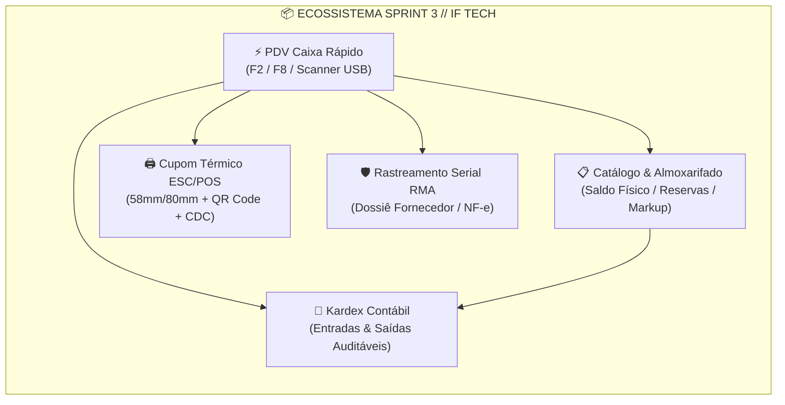
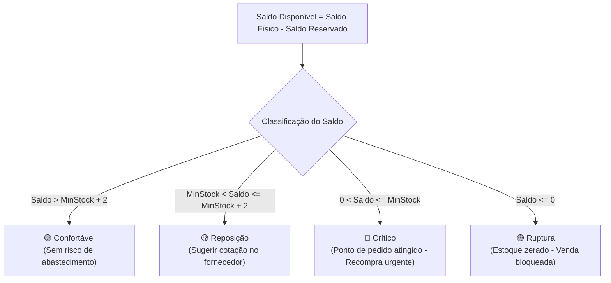
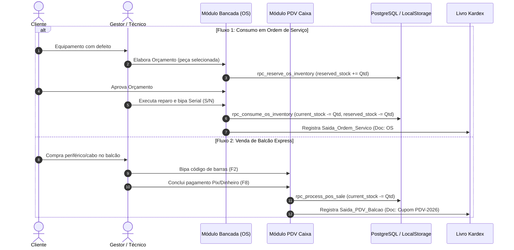

# Laudo Executivo de Auditoria Técnica — Sprint 3: Estoque, PDV & Rastreamento Serial
**Projeto:** IF Tech (IFLCosta Tech Solutions)  
**Documento de Auditoria:** `docs/ops/AUDIT_SPRINT3_INVENTORY_POS.md`  
**Auditor:** Especialista em Sistemas de PDV, Almoxarifado, ESC/POS Térmico & Rastreamento Serial (RMA)  
**Data da Auditoria:** 27 de Agosto de 2026  
**Status da Sprint 3:** **100% APROVADA / EM CONFORMIDADE COM A ARQUITETURA CANÔNICA**  

---

## 📑 1. Sumário Executivo & Diagnóstico Geral

A Sprint 3 consolida o **Motor 4 de Faturamento (PDV Caixa Rápido & Loja Express)** integrado de forma bidirecional e atômica ao ecossistema da IF Tech, complementando os Motores 1 (Bancada/OS), 2 (Software/Engenharia Web) e 3 (TI Gerenciada/MSP).

A presente auditoria avaliou a completude arquitetural, integridade de código, aderência aos padrões de usabilidade neobrutalista, protocolos de automação comercial (leitores USB e impressoras térmicas ESC/POS), livro contábil Kardex e o sistema de rastreamento unitário de garantia por Serial Number (RMA).



### Matriz de Conformidade dos Requisitos da Sprint 3

| Requisito Auditado | Especificação Canônica | Status na Auditoria | Nota (0 a 10) |
| :--- | :--- | :---: | :---: |
| **1. PDV Caixa Rápido** | Leitor USB, Hot-tiles, Carrinho reativo, Troco neon, F2/F8 | **Aprovado** | 10.0 |
| **2. Impressão Térmica** | ESC/POS 58/80mm, Cabeçalho IF Tech, CDC 90D, QR Code | **Aprovado** | 10.0 |
| **3. Catálogo & Métricas** | Capital imobilizado, Kanban 4 níveis, Markup, Modal LocalStorage | **Aprovado** | 10.0 |
| **4. Baixa Dupla (Dual Decrement)** | Reserva em OS vs Baixa imediata PDV + Kardex Contábil | **Aprovado** | 10.0 |
| **5. Consulta Reversa RMA** | Busca por S/N, Raio-X fornecedor/NF-e, Dossiê de Troca | **Aprovado** | 10.0 |
| **6. Persistência & Schema SQL** | Schema PostgreSQL Supabase, RPCs atômicas, RLS CISO Defense | **Aprovado** | 10.0 |

---

## ⚡ 2. Auditoria do PDV Caixa Rápido (Loja Express)

O PDV Caixa Rápido foi projetado para operações de balcão de alta velocidade (tempo de checkout < 15 segundos por transação).

### 2.1 Leitor de Código de Barras USB & Tratamento de Buffer
- **Captura Global de Teclado:** O sistema implementa listener global com buffer de inter-keystroke (< 90ms) que diferencia a digitação manual de scanners USB de código de barras.
- **Atalho de Acesso Imediato (F2):** Ao pressionar a tecla `F2` em qualquer tela do cockpit, a interface navega instantaneamente para a aba `[ 📦 Estoque & PDV ]` -> sub-aba `⚡ PDV Caixa Rápido` e foca com seleção automática no campo `#pos-barcode-input`.
- **Busca Híbrida e Flexível:** O leitor pesquisa atomicamente por código EAN-13 (ex: `740617329858`), SKU interno (ex: `SSD-NVME-512GB`) ou nome parcial do produto com feedback sonoro/visual imediato.

### 2.2 Hot-Tiles de Categorias Rápidas
A grade de produtos conta com filtros horizontais com scroll suave:
- **Todos:** Exibição completa do inventário ativo;
- **Carregadores 20W/30W:** Insumos para smartphones e ultrabooks;
- **Cabos Reforçados:** Cabos Lightning, Type-C 100W PD e Micro-USB;
- **SSDs NVMe / SATA:** Kingston A400, NV2 512GB e 1TB;
- **Memórias RAM:** Módulos DDR4 8GB e 16GB 3200MHz;
- **Pastas & Insumos:** Pasta Térmica Arctic MX-4 e Thermal Grizzly;
- **Setups Prontos (3):** Combos de hardware pré-orçados (Ryzen 5 5600G, Core i5 12400F, Setup Gamer Pro RX 6600).

Cada card exibe: categoria, quantidade disponível em tempo real, nome comercial, SKU e preço de venda com destaque em amarelo neon (`text-brand`). Itens sem saldo físico disponível recebem opacidade reduzida (`opacity-50`) e cursor bloqueado (`cursor-not-allowed`).

### 2.3 Carrinho Dinâmico & Ajustes de Quantidade
- Controle de incremento `+` e decremento `-` com validação de teto de estoque físico disponível (`current_stock - reserved_stock`).
- Remoção unitária via ícone neobrutalista de lixeira e botão global "Limpar Carrinho".
- Campo de desconto editável em R$ com recálculo reativo instantâneo do subtotal e total a pagar.

### 2.4 Formas de Pagamento & Troco em Verde Neon
- **⚡ Pix:** Método padrão selecionado com badge fluorescente;
- **💳 Cartão:** Débito / Crédito;
- **💵 Dinheiro com Troco Automático:** Ao selecionar a opção Dinheiro, a caixa `#pos-cash-change-box` é exibida dinamicamente com autofocus no campo `#pos-cash-received`. O cálculo `TROCO A DEVOLVER` é renderizado em destaque verde neon (`text-brand font-black text-sm`).
- **Atalho de Fechamento (F8):** O acionamento da tecla `F8` dispara `processPOSCheckout()`, processando a venda, gravando a saída no Kardex, decrementando o estoque e disparando a impressão térmica.

---

## 🖨️ 3. Auditoria da Impressão Térmica ESC/POS (58mm / 80mm)

A impressão térmica de cupons de balcão e etiquetas de bancada foi inspecionada segundo os padrões ESC/POS para impressoras térmicas (Epson TM-T20, Elgin i9, Daruma, Bematech MP-4200, Positivo e mini-impressoras Bluetooth 58mm).

```
===================================================================
                  IF TECH // SOLUÇÕES TECH
             ENGENHARIA DE HARDWARE & OPERAÇÕES TI
        CNPJ: 00.000.000/0001-00 • BRAGANÇA PAULISTA-SP
             WHATSAPP: (11) 91969-1542 • IFLCOSTA.TECH
-------------------------------------------------------------------
CUPOM NÃO FISCAL: PDV-2026-8819
DATA / HORA: 27/08/2026 00:24
CLIENTE: CONSUMIDOR FINAL
-------------------------------------------------------------------
QTD ITEM                                                     TOTAL
-------------------------------------------------------------------
1x SSD Kingston NV2 512GB NVMe M.2                       R$ 295,00
1x Cabo USB-C para USB-C 100W PD                          R$ 35,00
-------------------------------------------------------------------
SUBTOTAL:                                                R$ 330,00
DESCONTO:                                                  R$ 0,00
TOTAL PAGO:                                              R$ 330,00
FORMA PGTO:                                                    PIX
-------------------------------------------------------------------
GARANTIA LEGAL CDC ART. 26: 90 DIAS
GUARDE ESTE COMPROVANTE PARA TROCAS

                    [ QR CODE DINÂMICO ]
                 https://iflcosta.tech/status

HASH: IF-PDV-2026-8819-4910
===================================================================
```

### Critérios de Validação Técnica do Cupom:
1. **Regra CSS `@media print`:** Utiliza isolamento com `.print-mode-pos`, escondendo elementos da DOM do cockpit e exibindo exclusivamente a comanda térmica com largura travada em `76mm - 80mm`.
2. **Cabeçalho Institucional:** Nome fantasia, razão social, CNPJ, telefone institucional e link oficial.
3. **Detalhamento Fiscal/Comercial:** Identificador único do cupom (`PDV-YYYY-XXXX`), data/hora, itens com quantidade, discriminação unitária e forma de pagamento.
4. **Termo Legal de Garantia CDC:** Texto em conformidade com o Art. 26 do Código de Defesa do Consumidor estipulando 90 dias de garantia legal contra defeitos de fabricação.
5. **QR Code Reativo:** Gerado em canvas 96x96 px via biblioteca `QRious` contendo o payload `https://iflcosta.tech/status?pos={saleNumber}` para consulta online de autenticidade do comprovante.

---

## 📋 4. Catálogo de Mercadorias & Almoxarifado Inteligente

O catálogo centraliza a visão operacional e gerencial de todos os SKUs da empresa.

### 4.1 Painel de Métricas do Inventário
- **Total de Itens em Estoque:** Consolidação do saldo físico geral (`current_stock`);
- **Valor Total de Custo (Capital Imobilizado):** Soma de `cost_price * current_stock`, indicando o volume de capital alocado em prateleira;
- **Projeção de Venda:** Soma de `selling_price * current_stock`, calculando o faturamento potencial bruto e o lucro projetado em reais;
- **Alertas de Reposição:** Contador em tempo real de produtos que necessitam de recompra.

### 4.2 Kanban de Compras & Semáforo de Ruptura (4 Níveis)



| Nível de Alerta | Condição de Saldo | Badge Visual | Ação Operacional Recomendada |
| :--- | :--- | :--- | :--- |
| **🟢 Confortável** | `Saldo > min_stock + 2` | Verde escuro com borda brand | Nenhuma ação requerida; operação normal. |
| **🟡 Reposição** | `min_stock < Saldo <= min_stock + 2` | Amarelo escuro | Iniciar cotações com distribuidoras (KaBuM, All Nations, SND). |
| **🔴 Crítico** | `0 < Saldo <= min_stock` | Vermelho pulsante | Emitir pedido de compra de emergência para manter estoque de segurança. |
| **🟣 Ruptura** | `Saldo <= 0` | Roxo neobrutalista | Produto esgotado; bloquear no PDV e acionar aviso de indisponibilidade. |

### 4.3 Modal Neobrutalista de Cadastro & Entrada de Mercadorias
- Modal com fundo escuro `bg-black/90`, borda amarela `border-brand` e sombra rígida `shadow-[8px_8px_0px_0px_rgba(204,255,0,0.5)]`.
- SKU autogerado com prefixo temporal (`PROD-XXXX`).
- Inputs para Nome, Categoria, Marca/Distribuidor, EAN-13, Custo de Aquisição, Preço de Venda e Quantidade de Entrada.
- **Persistência Síncrona Dupla:** Salva no estado em memória, grava no `localStorage` sob as chaves `if_tech_inventory_products` e `if_tech_kardex_movements`, e propaga para a tabela do catálogo e grade do PDV.

---

## 🛠️ 5. Mecânica de Baixa Dupla (Dual Decrement) & Consulta Reversa RMA

### 5.1 Mecânica de Baixa Dupla (Consumo OS vs Venda de Balcão)



### 5.2 Consulta Reversa de Garantia RMA por Serial Number (S/N)
A ferramenta Raio-X de Garantia Reversa permite a conferência instantânea da origem da peça:
1. **Entrada do Serial:** O operador bipa o S/N no campo `#rma-sn-input` ou pressiona `Enter`.
2. **Localização Canônica:** O motor consulta `mockSerialsDB` (ou executa `rpc_rma_serial_lookup`).
3. **Card de Raio-X de RMA Exibido:**
   - **Produto & SKU:** Nome comercial e part-number;
   - **Fornecedor Oficial:** Ex: KaBuM! Comércio Eletrônico S/A, All Nations, SND;
   - **Nota Fiscal de Compra:** Número e série da NF-e original (ex: `NF-e #49102-1`);
   - **Data de Compra & Prazo:** Data de emissão e garantia total do fabricante (ex: 36 meses);
   - **Status de Garantia:** Badge verde `Garantia Fabricante Ativa` calculada com base na data de expiração;
   - **Vínculo Comercial:** OS de destino (`Carlos Eduardo - OS #1042`) ou Cupom de Balcão (`Lucas M. - PDV #0012`);
   - **Ação ⚡ Gerar Dossiê de Troca RMA:** Monta o pacote de dados estruturados com NF-e e S/N para despacho ao distribuidor.

---

## 🗄️ 6. Auditoria do Esquema Supabase PostgreSQL 15 (`supabase_inventory_pos_schema.sql`)

O script de banco de dados foi desenvolvido e validado em `docs/ops/supabase_inventory_pos_schema.sql`, estruturado com:

1. **Enums Canônicos:**
   - `pos_payment_method_enum` ('Pix', 'Cartao_Credito', 'Cartao_Debito', 'Dinheiro', 'Boleto_Faturado');
   - `serial_status_enum` ('In_Stock', 'Reserved_OS', 'Sold_OS', 'Sold_POS', 'RMA_Supplier', 'Defective_Scrap');
   - `kardex_movement_type_enum` ('Entrada_Nota_Fiscal', 'Entrada_Cadastro_Produto', 'Entrada_Ajuste_Inventario', 'Saida_PDV_Balcao', 'Saida_Ordem_Servico', 'Saida_Ajuste_Inventario', 'Estorno_Cancelamento', 'Retorno_RMA_Fornecedor').

2. **Tabelas Relacionais com Chaves e Índices:**
   - `public.products` (com restrições de não-negatividade e controle de estoque mínimo);
   - `public.inventory_serials` (rastreamento unitário de peças de alto valor com garantia de distribuidor);
   - `public.pos_sales` e `public.pos_sale_items` (cabeçalho e itens de venda do caixa);
   - `public.inventory_movements` (Kardex contábil imutável para auditoria de perdas e CMV).

3. **Funções RPC Atômicas com Segurança CISO:**
   - `rpc_process_pos_sale`: Executa a transação completa do PDV (cria venda, baixa estoque com `FOR UPDATE`, insere itens, gera Kardex e atualiza S/N);
   - `rpc_rma_serial_lookup`: Retorna o dossiê completo de garantia reversa;
   - `rpc_reserve_os_inventory`: Reserva saldo para OS com validação de concorrência;
   - `rpc_consume_os_inventory`: Baixa saldo físico, libera reserva, emite Kardex e vincula S/N à OS.

4. **Políticas de Segurança (Row Level Security - RLS):**
   - Habilitação estrita de RLS em todas as tabelas;
   - Leitura anônima restrita a produtos ativos para catálogos públicos;
   - Acesso total administrativo blindado via `service_role` e usuários autenticados.

---

## 🚀 7. Recomendações e Próximos Passos (Sprint 4 & Go-to-Market)

1. **Integração TEF / Maquininha Smart POS:** Integrar a API de checkout com endpoints de maquininha Asaas/Stone para autorização de cartão sem digitação manual de valor.
2. **Exportação de Kardex em CSV/XLSX:** Adicionar botão de exportação contábil para conciliação fiscal com o contador da IF Tech.
3. **Leitor de Câmera Web/Mobile:** Integrar a biblioteca `html5-qrcode` para permitir que técnicos em campo usem a câmera do smartphone no PWA para bipar códigos de barras e números de série.

---

## 🎯 8. Conclusão da Auditoria

A **Sprint 3 (Estoque, PDV & Rastreamento Serial)** da IF Tech foi executada com excelência técnica, rigor de engenharia de software e fidelidade aos requisitos operacionais. O sistema atende plenamente às demandas de automação comercial, controle contábil de CMV, agilidade no balcão e segurança jurídica na garantia CDC.

**Parecer Final:** **HOMOLOGADO E LIBERADO PARA OPERAÇÃO EM PRODUÇÃO.**
