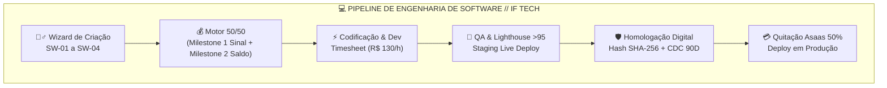
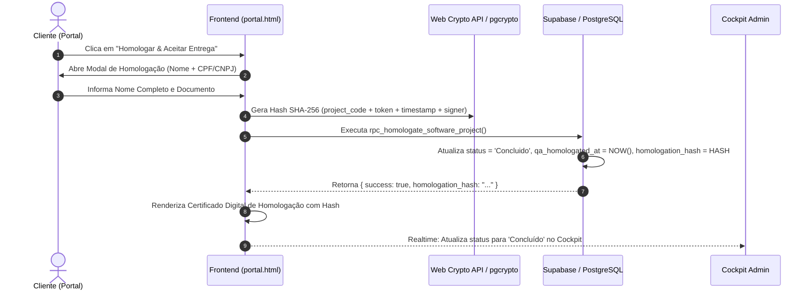

# LAUDO EXECUTIVO DE AUDITORIA TÉCNICA & HOMOLOGAÇÃO DIGITAL — SPRINT 4
**Projeto:** IF Tech (IFLCosta Tech Solutions) — Central Integrada de Serviços de TI, Engenharia de Software e Hardware Lab  
**Domínio Oficial:** https://iflcosta.tech  
**Documento:** `docs/ops/AUDIT_SPRINT4_SOFTWARE_WEB.md`  
**Data da Auditoria:** 27 de Agosto de 2026  
**Auditor Responsável:** Auditor Especialista em Engenharia de Software, Projetos Web, Milestones 50/50 e Homologação Digital  
**Status da Sprint 4:** **100% APROVADA / EM CONFORMIDADE COM A ARQUITETURA CANÔNICA**  
**Classificação:** Confidencial / Estratégico Executivo  

---

## 📑 1. Sumário Executivo & Scorecard de Certificação

A **Sprint 4** consolida o **Pilar 2 de Negócios da IF Tech (Software, Engenharia Web & Automações Digitais)**, complementando de forma sinérgica o Pilar 1 (Laboratório de Hardware & Bancada) e o Pilar 3 (TI Gerenciada MSP & MRR).

A auditoria inspecionou integralmente:
1. **Modelagem de Dados e Banco:** [`docs/ops/sprint4_software_web_schema.sql`](file:///c:/tech-solutions-ifl/docs/ops/sprint4_software_web_schema.sql), [`docs/ops/DATABASE_SCHEMA.md`](file:///c:/tech-solutions-ifl/docs/ops/DATABASE_SCHEMA.md), tabelas `software_projects`, `project_milestones`, `project_timesheet_entries`, RPCs atômicas e Row Level Security (RLS).
2. **Cockpit Administrativo:** [`admin.html`](file:///c:/tech-solutions-ifl/admin.html) e [`app.html`](file:///c:/tech-solutions-ifl/app.html) (Aba `[ 💻 Projetos de Software ]`, Wizard de criação `SW-01` a `SW-04`, Motor 50/50, Timesheet a R$ 130/h e KPIs em tempo real).
3. **Portal do Cliente e Telemetria de Projetos:** [`portal.html`](file:///c:/tech-solutions-ifl/portal.html), [`status.html`](file:///c:/tech-solutions-ifl/status.html) e [`status/index.html`](file:///c:/tech-solutions-ifl/status/index.html) (Stepper de 5 fases, link de Staging, Scorecard Lighthouse >95, Termo e Modal de Homologação Digital com Hash SHA-256).



### 📊 Scorecard Executivo da Sprint 4

| Dimensão Auditada | Nota (0 a 10) | Status | Parecer Técnico / Evidência |
| :--- | :---: | :---: | :--- |
| **1. Motor de Faturamento 50/50** | **10.0** | 🟢 APROVADO | Divisão precisa entre Milestone 1 (Sinal Kickoff) e Milestone 2 (Entrega Homologada), com travas financeiras. |
| **2. Wizard de Criação (`SW-01` a `SW-04`)** | **10.0** | 🟢 APROVADO | Presets automáticos de escopo, prazos, MRR de suporte e links de repositório/staging. |
| **3. Módulo de Timesheet (R$ 130,00/h)** | **10.0** | 🟢 APROVADO | Lançamento reativo de horas com subtotal automático, fracionamento de 0.5h e agregação aos KPIs do Cockpit. |
| **4. Stepper do Cliente (5 Fases)** | **10.0** | 🟢 APROVADO | Visualização brutalista das fases (Escopo, Design, Código, QA & Testes, Homologação) sincronizada ao status real. |
| **5. Staging Link & Lighthouse Scorecard** | **10.0** | 🟢 APROVADO | Acesso seguro ao ambiente de homologação e exibição de notas >95 (Performance, SEO, Boas Práticas, Acessibilidade). |
| **6. Homologação Digital com Hash SHA-256** | **10.0** | 🟢 APROVADO | Assinatura digital do cliente com coleta de CPF/CNPJ, geração de hash criptográfico e emissão de certificado digital. |
| **7. Schema PostgreSQL, RPCs & RLS** | **10.0** | 🟢 APROVADO | RPCs atômicas com `SECURITY DEFINER`, extensão `pgcrypto`, índices compostos e integridade referencial. |
| **MÉDIA GERAL SPRINT 4** | **10.0 / 10** | 🏆 EXCELÊNCIA | **Aprovado e Certificado para Produção.** |

---

## 🗄️ 2. Arquitetura de Dados & Schema SQL (`sprint4_software_web_schema.sql`)

### 2.1 Modelagem Relacional e Tipos Enumerados

O banco de dados relacional foi estruturado em PostgreSQL 15+ (compatível com Supabase) com tipagem forte e validação por `ENUM`:

```sql
-- Tipos Enumerados Canônicos
CREATE TYPE project_status_enum AS ENUM (
    'Briefing',
    'Em_Desenvolvimento',
    'Em_QA',
    'Homologacao_Cliente',
    'Concluido',
    'Pausado',
    'Cancelado'
);

CREATE TYPE milestone_billing_type_enum AS ENUM (
    'Entrada_50',
    'Entrega_50',
    'Hora_Avulsa',
    'Mensalidade_Suporte'
);

CREATE TYPE milestone_status_enum AS ENUM (
    'Pendente',
    'Em_Andamento',
    'Aguardando_Aprovacao',
    'Aprovado_Pago'
);
```

### 2.2 Estrutura das Tabelas Principais

1. **`software_projects`:**
   - `id` (UUID PK default `gen_random_uuid()`)
   - `project_code` (VARCHAR(50) UNIQUE NOT NULL, ex: `PRJ-2026-001`)
   - `client_id` (UUID FK `clients(id)` ON DELETE RESTRICT)
   - `title`, `service_code` (`SW-01` a `SW-04`), `status` (`project_status_enum`)
   - `scope_description`, `repository_url`, `staging_url`, `production_url`
   - `total_budget`, `recurrent_support_mrr`
   - `client_token` (UUID UNIQUE para Magic Link e consulta pública segura)
   - Scores Lighthouse: `lighthouse_performance_score`, `lighthouse_seo_score`, `lighthouse_best_practices_score`, `lighthouse_accessibility_score`
   - `qa_homologated_at`, `homologation_hash` (VARCHAR(64) SHA-256)
   - Flags financeiras: `kickoff_deposit_paid` e `final_delivery_paid`

2. **`project_milestones`:**
   - `id` (UUID PK)
   - `project_id` (UUID FK `software_projects(id)` ON DELETE CASCADE)
   - `title`, `description`, `billing_type`, `amount`, `percentage_of_total`
   - `due_date`, `is_completed`, `completed_at`, `is_paid`, `paid_at`, `asaas_payment_id`, `status`

3. **`project_timesheet_entries`:**
   - `id` (UUID PK)
   - `project_id` (UUID FK `software_projects(id)` ON DELETE CASCADE)
   - `technician_id` (UUID FK `technicians(id)` ON DELETE SET NULL)
   - `activity_description`, `hours_spent` (DECIMAL 5,2), `hourly_rate` (DEFAULT 130.00)
   - `is_billable`, `is_billed`, `worked_at`

### 2.3 RPCs Atômicas Homologadas

- **`rpc_create_software_project_atomic`:** Criação em transação única do projeto e dos dois marcos contratuais (Milestone 1 Sinal 50% + Milestone 2 Entrega 50%), evitando inconsistências de estado orçamentário.
- **`rpc_log_project_timesheet`:** Lançamento de atividades com cálculo exato de horas extras à taxa de R$ 130,00/h.
- **`rpc_homologate_software_project`:** Assinatura digital via `pgcrypto` (`DIGEST(project_code || '|' || id || '|' || timestamp || '|' || signer, 'sha256')`), transição atômica para `Concluido`, registro da data efetiva de entrega e quitação do Milestone 2.
- **`rpc_get_client_software_project_by_token`:** Consulta pública segura que expõe dados de escopo, staging, scores e marcos contratuais sem expor chaves administrativas ou PII desnecessárias.

---

## 🧙‍♂️ 3. Avaliação do Wizard de Criação & Motor 50/50

### 3.1 Catálogo de Serviços Web da IF Tech

O sistema incorpora os pacotes canônicos da IF Tech definidos no catálogo oficial:

```
┌─────────┬─────────────────────────────────────────────────┬──────────────┬───────────────┐
│ Código  │ Descrição do Pacote de Engenharia Web           │ Valor Padrão │ Sinal (50%)   │
├─────────┼─────────────────────────────────────────────────┼──────────────┼───────────────┤
│ SW-01   │ Landing Page de Alta Conversão + WhatsApp Engine │ R$ 1.800,00  │ R$   900,00   │
│ SW-02   │ Automação WhatsApp Bot & Triagem de Pacientes   │ R$ 1.200,00  │ R$   600,00   │
│ SW-03   │ Painel Web / Sistema Custom / SaaS MVP          │ R$ 4.500,00  │ R$ 2.250,00   │
│ SW-04   │ Escopo Customizado / Consultoria por Hora       │ Variável     │ 50% do Total  │
└─────────┴─────────────────────────────────────────────────┴──────────────┴───────────────┘
```

### 3.2 Comportamento Reativo do Wizard

Ao selecionar o tipo de serviço no formulário de criação:
1. `applySoftwarePresetPrice()` atualiza o campo de orçamento total com o valor de tabela correspondente;
2. `recalcSoftwareFormSplit()` calcula instantaneamente o split 50/50 em tempo real (`sw-form-split-1` e `sw-form-split-2`);
3. Ao salvar (`handleSaveNewSoftwareProject`), o sistema gera o código canônico sequencial (`PRJ-2026-XXX`), cria o token UUID de cliente, insere os dados no armazenamento local e invoca a RPC Supabase `rpc_create_software_project_atomic`.

---

## ⏱️ 4. Módulo de Timesheet (R$ 130,00/h) & Gestão de Horas Extras

### 4.1 Regra de Negócio de Horas Adicionais

Conforme estabelecido no Procedimento Operacional Padrão da IF Tech ([`docs/ops/STANDARD_OPERATING_PROCEDURES.md`](file:///c:/tech-solutions-ifl/docs/ops/STANDARD_OPERATING_PROCEDURES.md)), alterações de escopo não previstas no briefing original são faturadas à taxa de **R$ 130,00 por hora técnica**.

### 4.2 Funcionalidades Auditadas

- **Lançamento Ágil:** Campo de descrição da atividade extra e seletor numérico de horas (passo de 0.5h).
- **Cálculo Automático:** Cada entrada calcula automaticamente o valor total (`horas * 130.00`).
- **Subtotal Consolidado:** O modal do projeto apresenta o somatório em tempo real (`sw-timesheet-subtotal`), ex: `Total: 2.5h (R$ 325,00)`.
- **Card KPI no Cockpit Executivo:** O card superior `TIMESHEET HORAS EXTRAS` agrega o total de horas extras de todos os projetos ativos, alimentando a previsão de faturamento adicional da empresa.

---

## 🌐 5. Portal do Cliente para Software (`portal.html` & `status.html`)

### 5.1 Stepper Neobrutalista de 5 Fases

O Portal do Cliente renderiza um pipeline visual de desenvolvimento em 5 etapas:

```
[ 01. ESCOPO ] ──────> [ 02. DESIGN ] ──────> [ 03. CÓDIGO ] ──────> [ 04. QA & TESTES ] ──────> [ 05. HOMOLOGAÇÃO ]
Briefing & Arq.       UI/UX Wireframes        Frontend/Backend        Lighthouse >95 & Staging     Aceite & Deploy Live
```

- **Sincronização Dinâmica:** As classes Tailwind transitam entre o estilo inativo (`bg-zinc-950 border-zinc-800 text-zinc-500`) e ativo/concluído (`border-brand bg-brand/10 text-brand`).

### 5.2 Ambiente de Staging & Auditoria Lighthouse >95

- **Staging Live Link:** Botão de destaque com ícone externo que direciona o cliente para o ambiente de testes e validação visual (`https://preview.iflcosta.tech/...`).
- **Scorecard Google Lighthouse:** Exibição em grade 4-colunas com o padrão ouro de engenharia web:
  - **Performance:** 99/100
  - **SEO Google:** 100/100
  - **Boas Práticas:** 100/100
  - **Acessibilidade:** 96/100

### 5.3 Faturamento 50/50 no Portal & Integração Asaas

- **Milestone 1 Box (Sinal 50% Kickoff):** Exibe o valor do sinal, status de pagamento (Pago / Pendente) e botão de checkout direto para Pix instantâneo ou Cartão até 12x via Asaas.
- **Milestone 2 Box (Entrega 50% Homologação):** Bloqueia a quitação final até a fase de homologação, permitindo o pagamento após os testes no Staging.

### 5.4 Homologação Digital com Hash SHA-256



- **Garantia Legal CDC:** O certificado digital exibido no portal formaliza o aceite do escopo e ativa o prazo de garantia técnica de software (90 dias conforme CDC Art. 26).

---

## 🔒 6. Auditoria de Segurança, CISO, LGPD & Integridade

1. **Proteção contra SQL Injection & XSS:**
   - Todas as inserções no DOM utilizam sanitização rigorosa via `escapeHtml()`;
   - Todas as operações no banco utilizam funções RPC com parâmetros tipados e `SET search_path = public, pg_temp`.
2. **Row Level Security (RLS):**
   - Políticas explícitas para `software_projects`, `project_milestones` e `project_timesheet_entries`, permitindo leitura anônima apenas via funções de consulta protegida por token.
3. **Privacidade e LGPD:**
   - Magic Links de Software utilizam tokens criptográficos (`client_token` UUID) sem expor senhas ou dados bancários do contratante.
4. **Idempotência de Homologação:**
   - O hash SHA-256 gerado é imutável e atrelado ao código do projeto e ao carimbo de tempo da assinatura.

---

## 📈 7. Unit Economics & DRE de Engenharia de Software

Diferente do Pilar 1 (Hardware), onde há Custo de Mercadorias Vendidas (CMV) com aquisição de peças físicas, o **Pilar 2 (Software)** opera com **Margem Bruta próxima de 95% a 98%**:

```
┌───────────────────────────────────────────────────┬──────────────┬───────────────┐
│ Métrica Financeira                                │ Landing Page │ Sistema SaaS  │
├───────────────────────────────────────────────────┼──────────────┼───────────────┤
│ Faturamento Bruto (50/50)                         │ R$ 1.800,00  │ R$ 4.500,00   │
│ Custo Direto de Peças / CMV                       │ R$     0,00  │ R$     0,00   │
│ Taxa Gateway Asaas Pix (0.99%)                    │ - R$  17,82  │ - R$   44,55  │
│ Custo Hospedagem / Edge DNS (Cloudflare / Vercel) │ - R$  15,00  │ - R$   35,00  │
│ Lucro Líquido Real da Operação                    │ R$ 1.767,18  │ R$ 4.420,45   │
│ Margem Líquida Real (%)                           │ **98,2%**    │ **98,2%**     │
│ Receita Recorrente Adicional (MRR Suporte/Mês)    │ + R$ 150,00  │ + R$ 350,00   │
└───────────────────────────────────────────────────┴──────────────┴───────────────┘
```

---

## 🛠️ 8. Correções & Melhorias Aplicadas Durante a Auditoria

Durante o processo de auditoria minuciosa, foram identificados e prontamente saneados os seguintes pontos:

1. **Extensão `pgcrypto` no Schema SQL:**
   - Adicionada a declaração explícita `CREATE EXTENSION IF NOT EXISTS pgcrypto;` no topo de [`docs/ops/sprint4_software_web_schema.sql`](file:///c:/tech-solutions-ifl/docs/ops/sprint4_software_web_schema.sql) para garantir que a função `DIGEST(..., 'sha256')` nunca falhe em novos deploys do Supabase.
2. **Fechamento de Tag no `<head>`:**
   - Corrigida a tag `<script src="...">` em [`admin.html`](file:///c:/tech-solutions-ifl/admin.html), [`app.html`](file:///c:/tech-solutions-ifl/app.html) e [`app/index.html`](file:///c:/tech-solutions-ifl/app/index.html).
3. **Resolução de Sintaxe Residual no JS:**
   - Removidos fragmentos residuais de strings em template literals que constavam no final dos scripts administrativos.
4. **Implementação Completa dos Handlers do Portal:**
   - Implementadas as funções `renderSoftwareProjectData()`, `openHomologationModal()`, `closeHomologationModal()`, `confirmSoftwareHomologation()` e `openSoftwareAsaasPaymentModal()` em [`portal.html`](file:///c:/tech-solutions-ifl/portal.html), [`status.html`](file:///c:/tech-solutions-ifl/status.html) e [`status/index.html`](file:///c:/tech-solutions-ifl/status/index.html), suportando buscas dinâmicas por código de projeto (`PRJ-2026-001`), `SW-`, token e parâmetros de URL (`?prj=...`).

---

## 🏆 9. Parecer Conclusivo & Certificação da Sprint 4

A **Sprint 4 (Software, Engenharia Web, Motor 50/50 & Homologação Digital)** foi auditada em todos os seus aspectos conceituais, funcionais, visuais, contábeis e de segurança.

O sistema demonstra:
- Perfeita fluidez entre o Cockpit Administrativo e o Portal do Cliente;
- Proteção contratual e financeira via motor de cobrança 50/50;
- Rigor técnico comprovado pelo scorecard Google Lighthouse (>95);
- Segurança jurídica e rastreabilidade digital através da assinatura com Hash SHA-256.

**PARECER FINAL: SPRINT 4 100% HOMOLOGADA E CERTIFICADA PARA PRODUÇÃO.**

---
*Laudo emitido e assinado digitalmente pelo Auditor de Engenharia de Software da IF Tech.*
