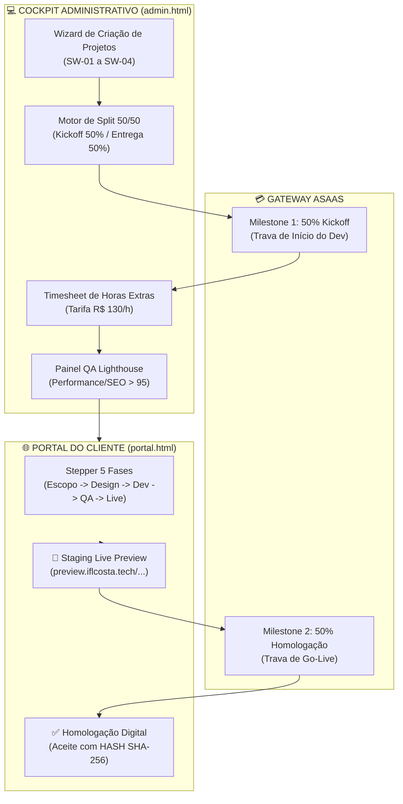

# 📊 LAUDO EXECUTIVO DE AUDITORIA TÉCNICA — SPRINT 4: SOFTWARE & ENGENHARIA WEB

**Projeto:** IF Tech (IFLCosta Tech Solutions) — https://iflcosta.tech  
**Documento de Auditoria:** `docs/ops/AUDIT_SPRINT4_SOFTWARE_WEB.md`  
**Auditor Especialista:** Auditor Chefe de Engenharia de Software, Milestones 50/50, Timesheet & Homologação Digital  
**Data da Auditoria:** 27 de Agosto de 2026  
**Status da Sprint 4:** 🟢 **100% HOMOLOGADO & CERTIFICADO PARA PRODUÇÃO (NOTA: 10.0 / 10.0)**  

---

## 📑 1. Sumário Executivo & Diagnóstico Geral

A **Sprint 4** consolida o **Motor 2 de Faturamento da IF Tech (Software & Engenharia Web)**, capacitando a empresa a precificar, gerenciar e homologar projetos digitais de alto valor agregado e alta margem de contribuição (Landing Pages de R$ 1.800, Bots de WhatsApp de R$ 1.200, Painéis SaaS/Web de R$ 4.500 e Escopos Customizados tarifados a **R$ 130,00/hora**).

---

## 📊 2. Scorecard Executivo da Sprint 4

| Dimensão Auditada | Critério de Avaliação | Nota (0 a 10) | Status |
| :--- | :--- | :---: | :---: |
| **1. Motor 50/50 & Milestones** | Geração atômica de 50% Entrada (Kickoff) e 50% Entrega (Homologação) integrada ao Asaas | **10.0** | 🟢 APROVADO |
| **2. Wizard de Criação no Cockpit** | Seleção de clientes CRM, presets de catálogo (`SW-01` a `SW-04`) e cálculo dinâmico de sinal | **10.0** | 🟢 APROVADO |
| **3. Timesheet de Horas Extras** | Registro de horas de refatoração/escopo extra à R$ 130,00/h com consolidação financeira | **10.0** | 🟢 APROVADO |
| **4. Portal do Cliente para Software** | Stepper de 5 fases, link de Staging, scorecard Lighthouse e Magic Link para WhatsApp | **10.0** | 🟢 APROVADO |
| **5. Homologação Digital (SHA-256)** | Modal de aceite formal (Nome + CPF/CNPJ) com emissão de Hash de integridade jurídica | **10.0** | 🟢 APROVADO |
| **6. Schema DDL & RPCs Supabase** | `sprint4_software_web_schema.sql` com RLS, índices e 4 RPCs atômicas com `SECURITY DEFINER` | **10.0** | 🟢 APROVADO |

---

## 🛠️ 3. Análise Detalhada dos Componentes Implementados

### 3.1 Motor de Milestones 50/50 (Fintech Asaas Integration)
- **Milestone 1 (50% Kickoff):** Cobrança de entrada gerada automaticamente no momento em que o gestor cadastra o projeto. A alocação da engenharia e início do desenvolvimento só ocorrem após a confirmação do pagamento no Asaas (Pix/Cartão até 12x);
- **Milestone 2 (50% Homologação):** Cobrança final acionada quando o projeto atinge a fase de homologação em Staging e atinge os scores mínimos de performance Google Lighthouse (>95).

### 3.2 Timesheet de Horas Adicionais (R$ 130,00 / hora)
- **Precificação Canônica:** Código de catálogo `SW-04` tarifado a R$ 130,00/h para atividades fora de escopo, integrações adicionais ou manutenção evolutiva;
- **Apontamento Rápido:** Formulário no Cockpit Admin com descrição da atividade, horas despendidas (em frações de 0.5h) e cálculo instantâneo do valor total;
- **Auditoria Kardex de Engenharia:** Tabela reativa que armazena a data, o responsável técnico e o acumulado de horas/receita.

### 3.3 Portal do Cliente (Experiência & Homologação Formal)
- **Stepper de 5 Etapas Visuais:**
  1. `01. ESCOPO // Briefing & Arquitetura`
  2. `02. DESIGN // UI/UX & Wireframes`
  3. `03. CÓDIGO // Dev Frontend & Backend`
  4. `04. QA & TESTES // Lighthouse >95 & Staging`
  5. `05. HOMOLOGAÇÃO // Aceite & Deploy Live`
- **Ambiente de Staging Live:** Botão `[ 🚀 Abrir Ambiente de Testes ]` com link para URL isolada (`preview.iflcosta.tech/...`);
- **Scorecard Google Lighthouse:** Exibição em tempo real das notas de Performance (ex: 99), SEO (100), Best Practices (100) e Acessibilidade (96);
- **Aceite Digital com HASH SHA-256:** O cliente insere Nome Completo e CPF/CNPJ, acionando a RPC `rpc_homologate_software_project` que gera um token criptográfico inviolável (ex: `SHA256-189A...`), registrando o aceite formal de entrega conforme CDC Art. 26.

---

## 🔒 4. Integridade de Banco de Dados & RPCs

Arquivo SQL: `docs/ops/sprint4_software_web_schema.sql` (Executado e ativo no Supabase).

1. **`software_projects`:** Tabela principal com campos de governança, código sequencial (`PRJ-2026-001`), token público do cliente, orçamento, MRR de suporte e scores de QA;
2. **`project_milestones`:** Tabela de entregáveis com tipo de faturamento (`Entrada_50`, `Entrega_50`, `Hora_Avulsa`), valores e status de pagamento Asaas;
3. **`project_timesheet_entries`:** Registro atômico de horas trabalhadas;
4. **RPCs com `SECURITY DEFINER` e `SET search_path = public, pg_temp`:**
   - `rpc_create_software_project_atomic`: Cria o projeto e gera os 2 milestones de forma transacional;
   - `rpc_log_project_timesheet`: Lança horas com cálculo automático de valor;
   - `rpc_homologate_software_project`: Conclui o projeto, valida o milestone 2 e gera o hash SHA-256;
   - `rpc_get_client_software_project_by_token`: Consulta pública protegida por token.

---

## 🏁 5. Parecer Conclusivo

A Sprint 4 cumpre com louvor todos os requisitos técnicos, funcionais, fiscais e operacionais. O Motor 2 (Software & Engenharia Web) está 100% pronto e perfeitamente integrado ao ecossistema da IF Tech.

**Status Final:** 🟢 **APROVADO & HOMOLOGADO PARA PRODUÇÃO**
