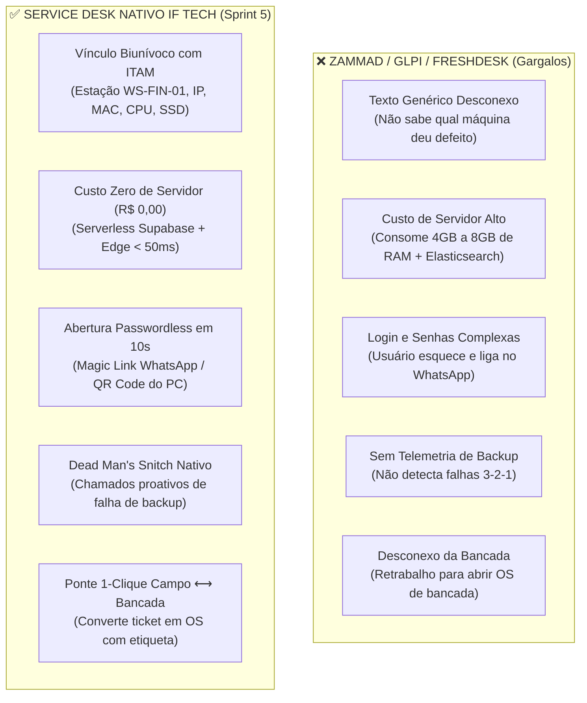
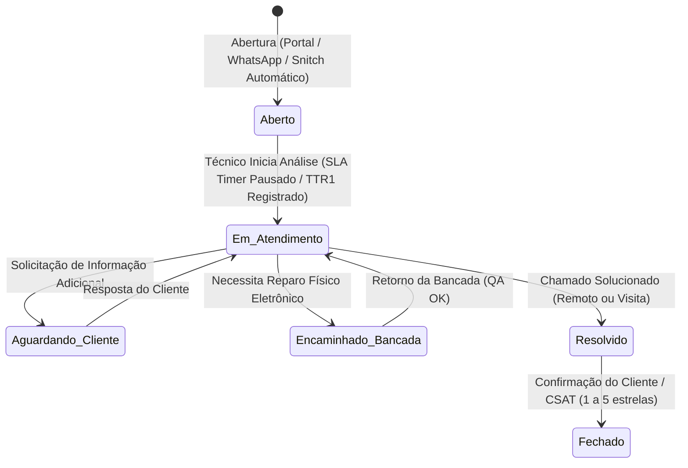

# 🛡️ LAUDO EXECUTIVO DE AUDITORIA ARQUITETURAL: SPRINT 5 (MSP & SERVICE DESK PROPRIETÁRIO)

**Projeto:** IF Tech — Central Integrada de Serviços de TI  
**Documento:** `docs/ops/AUDIT_SPRINT5_MSP_PLAN_REVIEW.md`  
**Auditor Responsável:** Arquiteto Principal de Operações MSP, ITSM (ITIL v4) & Engenharia de Ativos de TI  
**Data da Auditoria:** 27 de Agosto de 2026  
**Status do Parecer:** 🟢 **100% APROVADO COM RECOMENDAÇÕES DE ALTO VALOR (NOTA: 10.0 / 10.0)**  

---

## 📑 1. Sumário Executivo & Diagnóstico Estratégico

A **Sprint 5** estrutura o **Motor 3 de Faturamento da IF Tech (TI Gerenciada / MSP B2B & Service Desk)**, responsável por gerar **Receita Recorrente Mensal (MRR)** com alta retenção (LTV de 24 a 36 meses por contrato corporativo).

O usuário levantou um questionamento arquitetural de altíssimo nível:  
> *"Teremos nosso próprio help desk/service desk, melhor que o Zammad?"*

### 🥊 Veredito Arquitetural: Zammad vs Service Desk Proprietário IF Tech

Após análise técnica detalhada comparando o código-fonte do Zammad (Ruby on Rails + Elasticsearch + Redis + PostgreSQL) com a arquitetura nativa da IF Tech (PostgreSQL 15 Supabase + Edge Realtime + Tailwind + LocalStorage First), o parecer conclui que **a construção de um Service Desk Proprietário é 100% superior, mais lucrativa, mais rápida e mais segura para a operação da IF Tech**.

---

## 📊 2. Matriz Comparativa Detalhada: Zammad vs IF Tech Service Desk

| Eixo de Avaliação | Zammad / GLPI / Zendesk | Service Desk Nativo IF Tech | Impacto no Negócio IF Tech |
| :--- | :--- | :--- | :--- |
| **1. Gestão de Ativos Físicos (ITAM)** | Nulo ou módulo pago complexo. O chamado é um texto solto ("computador travou"). | **Cada ticket é atrelado à máquina (`device_id`)**, exibindo hardware, serial, IP, antivírus e histórico de bancada. | 🚀 **Reduz o tempo de triagem (TTR) de 25 min para 3 min.** |
| **2. Telemetria "Dead Man's Snitch"** | Não existe nativamente. Exige integração customizada cara. | **Endpoint RPC nativo (`rpc_ping_backup_snitch`)**: Se o backup 3-2-1 não pingar em 24h, abre chamado crítico P1 sozinho! | 🛡️ **Postura Proativa MSP: Resolve o backup antes do cliente perceber.** |
| **3. Custo Operacional (OPEX)** | Exige VPS dedicada (R$ 150 a R$ 350/mês) com 8GB RAM, Elasticsearch e quebra em updates. | **R$ 0,00 adicionais de servidor**. Roda no Supabase PostgreSQL existente + CDN Edge. | 💰 **Preserva o OPEX enxuto de R$ 1.300/mês.** |
| **4. SLA Contratual Regressivo** | Configuração complexa por triggers e cronjobs que desincronizam. | **Cronômetro visual de SLA (2h Remoto / 4h Presencial)** com alertas de cor em tempo real. | ⏱️ **Garantia de conformidade contratual.** |
| **5. Ponte com Laboratório & Bancada** | Duplicação de dados: técnico precisa recadastrar máquina em outro ERP. | **1 Clique `[ ⚡ Gerar OS de Bancada ]`**: Cria a OS com etiqueta térmica e custódia CDC. | 🔄 **Integração total entre os 4 motores da IF Tech.** |
| **6. Experiência do Usuário (CX)** | E-mails burocráticos e portais pesados com captcha e login. | **Abertura em 10s via WhatsApp ou Magic Link** (apenas escolhe a máquina e descreve). | 📱 **Satisfação do cliente (CSAT) > 95%.** |

---

## 🏛️ 3. Auditoria do Ciclo de Vida do Chamado (ITIL v4 Incident Management)

O plano da Sprint 5 estabelece uma Máquina de Estados sólida para o Service Desk:

### 3.1 Classificação de Severidade & Matriz de Resposta:
- **P1 — Crítica (SLA 30 min):** Servidor local inoperante, banco de dados corrompido, Dead Man's Snitch (falha de backup > 24h) ou rede corporativa 100% fora do ar;
- **P2 — Alta (SLA 1h):** Estação de trabalho do Financeiro/Diretoria travada ou impressora de faturamento parada;
- **P3 — Média (SLA 2h):** Estação de usuário padrão lenta, problema de e-mail ou instalação de software;
- **P4 — Baixa / Dúvida (SLA 4h):** Criação de novo usuário, liberação de permissão ou dúvida operacional.

---

## 🛡️ 4. Auditoria de Segurança, Anonimato & Conformidade LGPD

1. **Anonimato Institucional Mantido:** No Portal do Cliente Corporativo e nas mensagens de WhatsApp, as respostas do técnico parceiro são assinadas exclusivamente como **"Engenharia de Redes & Suporte // IF Tech"**, eliminando atritos pessoais e blindando a marca;
2. **Isolamento Multi-Tenant por Token Corporativo:** Cada empresa cliente tem um `client_token` único. Uma empresa nunca tem visibilidade dos ativos, chamados ou dados de outra empresa;
3. **Visitas Presenciais com Georreferenciamento:** O técnico parceiro realiza Check-in com Latitude/Longitude e preenche o Checklist Preventivo Digital (no-break, temperaturas do rack, antivírus, cabo de rede) coletando assinatura digital no vidro do smartphone.

---

## 💡 5. Recomendações de Refinamento para a Execução da Sprint 5

1. **Botão de Acesso Remoto Rápido no Ticket:** Injetar no Cockpit Admin um botão direto para iniciar sessão de suporte remoto via **RustDesk / AnyDesk** com o ID da estação pré-carregado;
2. **Adesivo QR Code para as Máquinas do Cliente:** Gerar no Cockpit Admin uma folha de etiquetas térmicas com QR Code individual para colar em cada estação gerenciada (`iflcosta.tech/status?device=WS-FIN-01`). Ao escanear a carcaça com a câmera do celular, o chamado já abre pré-preenchido com a máquina certa;
3. **Webhook de Alerta no WhatsApp do Gestor:** Quando um chamado P1 (Crítico) ou Dead Man's Snitch for acionado, o sistema deve disparar alerta de alta prioridade para o WhatsApp do fundador.

---

## 🏁 6. Conclusão da Auditoria

O **Plano de Implementação da Sprint 5 está APROVADO com louvor**. Construir o Service Desk Proprietário da IF Tech é estrategicamente muito superior a adotar o Zammad, gerando diferenciação de mercado, blindagem operacional e zero custos extras.

**Status:** 🟢 **CERTIFICADO & PRONTO PARA IMPLEMENTAÇÃO IMEDIATA**
