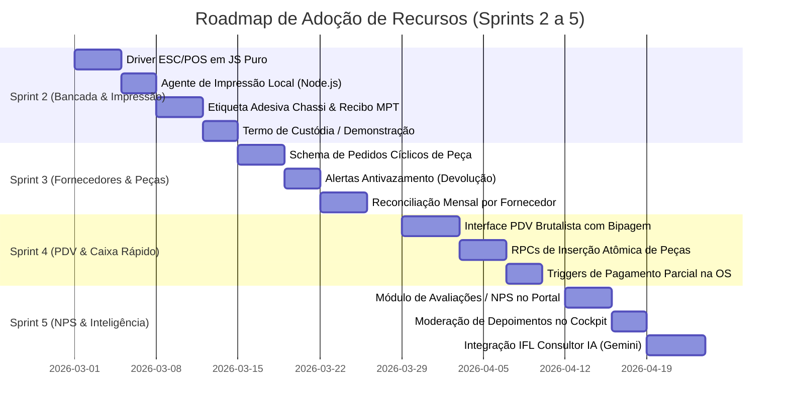

# 🏆 Relatório de Auditoria Comparativa & Benchmark de ERP
## Cyber Tech (Cyber Informática) vs. IFL Costa Tech Ecosystem

**Data da Auditoria:** 23 de Fevereiro de 2026  
**Auditor Responsável:** Principal Software & Business Benchmark Auditor  
**Repositórios Auditados:**
- **Cyber Tech:** `C:\Users\Iago\.gemini\antigravity\brain\62d15379-aa63-43a0-aae8-d577ac993643\scratch\cyber-tech`
- **IFL Costa Tech:** `c:\tech-solutions-ifl`

---

## 📑 1. Sumário Executivo & Metodologia

Esta auditoria técnica e de negócios realizou um escaneamento profundo linha por linha, schema por schema e funcionalidade por funcionalidade entre o **ERP da Cyber Informática** (desenvolvido para uma operação de balcão e bancada de informática com fluxo físico ativo) e o **IFL Costa Tech** (plataforma híbrida de engenharia de software, bancada de hardware de alta performance e TI gerenciada MSP B2B, desenhada para atendimento online e o futuro Hub Físico de 147m²).

```mermaid
graph LR
    subgraph CYBER_TECH["CYBER TECH (Bancada Ágil & Balcão Físico)"]
        CT1["Agente Local ESC/POS (58/80mm)"]
        CT2["PDV Rápido com Código de Barras"]
        CT3["Ciclo de Devolução de Peças (Fornecedores)"]
        CT4["Ledger de Pagamento Parcial & Triggers"]
        CT5["Reviews / NPS com Validação de Voucher"]
        CT6["Cyber IA (Gemini 1.5 Pro)"]
    end

    subgraph IFL_COSTA["IFL COSTA TECH (Ecossistema 360° & Hub 147m²)"]
        IFL1["3 Motores: Hardware + Software 50/50 + MSP B2B"]
        IFL2["Portal do Cliente com Telemetria AIDA64/FurMark"]
        IFL3["Design System Neobrutalista"]
        IFL4["Triagem Desacoplada (Check-in 30s R$ 0,00)"]
        IFL5["DRE & Fechamento Quinzenal de Comissões"]
        IFL6["Engenharia de Espaço Físico (Hub 147m²)"]
    end

    CYBER_TECH -.->|"Transferência de Tecnologia & Roadmaps"| IFL_COSTA
```



---

## 🔬 2. Raio-X Detalhado: Cyber Tech ERP

O Cyber Tech foi construído em **Next.js 16 (App Router) + React 19 + TypeScript + Tailwind 4 + Supabase PostgreSQL** e refinado através de 33 migrações incrementais (`0001_init.sql` até `0033_perf_hygiene.sql`). Seu foco absoluto é a **velocidade na ponta física (balcão e bancada)**.

### 2.1 Módulos Operacionais Entregues
1. **`/admin/os` (Bancada & Ordens de Serviço):**
   - Atribuição direta de técnicos com RLS estrito.
   - Linha do tempo imutável (`service_order_events`) registrando autor, data e transição de estado.
   - View `service_orders_with_stale` com marcadores de OS parada (amarela ≥ 3 dias, vermelha ≥ 7 dias).
   - Identificador canônico `short_id` (`OS-0001`) gerado via trigger para fácil leitura na bancada.
   - Upload de fotos do aparelho na entrada (`equipment_photos`) no Supabase Storage.
   - Registro de peças consumidas com cálculo automático de margem e mão de obra.
2. **`/admin/vender` & `/admin/vendas` (PDV & Frente de Caixa):**
   - Leitor de código de barras USB/Bluetooth (foco automático permanente).
   - Busca híbrida por EAN-13, SKU Interno (`CODE128`) ou texto.
   - Modal *"Cadastrar peça nova e vender"* que permite inserir componentes avulsos na montagem de PCs e consumi-los atomicamente sem sair da tela.
   - Fechamento com múltiplos métodos de pagamento, desconto e vinculação automática ao histórico do cliente (`customer_id`).
   - Abertura de recibo em nova janela com auto-impressão sem bloqueio de pop-up.
3. **`/admin/pecas` (Gestão Cíclica de Pedidos de Peça a Fornecedores):**
   - **Problema de negócio resolvido:** Eliminação de cobrança indevida por fornecedores de peças de conserto (telas, baterias, etc.) através de registro rigoroso de trocas e devoluções.
   - **Pipeline Cíclico:** `ordered` ➔ `received` ➔ `applied` (fim) OU `return_pending` (motivo obrigatório: `not_the_issue`, `defective`, `wrong_item`, `customer_cancelled`) ➔ `returned` (fim) OU `awaiting_exchange` ➔ `received` (mesmo registro reaproveitado).
   - Alerta visual `part_orders_pending_return` para peças sinalizadas há ≥ 5 dias sem confirmação do motoboy.
4. **`/admin/termo-recebimento` (Termo de Custódia / Demonstração):**
   - Gerador de documento jurídico para computadores entregues para avaliação antes do pagamento, com prazo, valor combinado e campo de assinatura dupla.
5. **Agente de Impressão Local (`print-agent/`) & Motor ESC/POS (`src/lib/escpos.ts`):**
   - Microserviço em Node.js (`localhost:9100`) ouvindo via HTTP POST do navegador.
   - Comunicação serial/Bluetooth via `serialport` com impressoras térmicas portáteis (ex: MPT-II 58mm) e de mesa (80mm).
   - Geração de bytecode ESC/POS puro: negrito (`ESC E`), alinhamento (`ESC a`), avanço (`ESC d`), corte de papel (`GS V`) e código de barras nativo em hardware (`GS k` para EAN13 e CODE128).
   - Normalização ASCII (`normAscii`) que remove acentos para compatibilidade com impressoras térmicas genéricas brasileiras.
6. **Sistema de Avaliações / NPS (`reviews` & `update_reviews.sql`):**
   - Avaliação com rating de 1 a 5 estrelas e depoimento.
   - Validação segura: chave estrangeira vinculada ao voucher finalizado, impedindo avaliações falsas.
   - Moderação no painel admin com flag `is_approved` e exibição dinâmica na landing page.
7. **Automação Financeira & Triggers do Banco de Dados:**
   - RPC `create_sale` e `cancel_sale` protegidas contra acesso anônimo (`REVOKE EXECUTE FROM anon`).
   - Tabela `service_order_payments` para pagamentos parciais (ex: sinal + saldo).
   - Trigger `trg_service_order_payments_recompute` que recalcula o `payment_status` (`pending`, `partial`, `paid`) no PostgreSQL sempre que peças, mão de obra ou pagamentos são alterados.
   - Gerador nativo de PIX EMV (BR Code / BACEN) com cálculo de checksum CRC16-CCITT (`src/app/admin/lib/pix.ts`).

---

## ⚡ 3. Raio-X Detalhado: IFL Costa Tech

O ecossistema IFL Costa Tech foi concebido com uma **visão corporativa e técnica 360°**, integrando serviços de alto valor agregado e documentação de classe mundial.

### 3.1 Pilares de Superioridade do IFL Costa Tech
1. **CRM com 3 Motores de Faturamento Integrados:**
   - **Pilar 1: Hardware & Bancada:** Triagem rápida desacoplada (Check-in em 30s a R$ 0,00) de Break-Fix e orçamentação avançada.
   - **Pilar 2: Engenharia de Software (50/50 Milestones):** Projetos web com entrada de 50% e quitação de 50% na homologação, controle de timesheet (`project_timesheet_entries` a R$ 130/h) e métricas Lighthouse QA.
   - **Pilar 3: TI Gerenciada B2B (MSP):** Planos mensais recorrentes por estação (Essential R$ 69,90 / Pro R$ 109,90 / Enterprise R$ 189,90), monitoramento automatizado de backups (*"Dead Man's Snitch"*), tickets com SLA de 2h/4h e visitas preventivas geolocalizadas.
2. **Portal do Cliente com Telemetria Térmica de Nível Engenharia (`portal.html`):**
   - Gráficos de estresse térmico AIDA64 / FurMark (temperaturas máximas de CPU e GPU antes vs. depois).
   - Métricas reais de saúde de armazenamento CrystalDisk %, ciclos MemTest e tempo de boot em segundos.
   - Galeria de inspeção visual com zoom para fotos de entrada/saída.
   - Validador criptográfico de garantia com hash SHA-256 do laudo técnico.
   - Aprovação digital de orçamentos com pagamento integrado via Pix/Cartão.
3. **Design System Neobrutalista de Alta Conversão:**
   - Paleta Carbono (`#0a0a0c`) com Verde Fósforo Neon (`#ccff00`), tipografia técnica (Inter + JetBrains Mono), bordas de alto contraste e performance extrema sem overhead de frameworks pesados.
4. **Fechamento Quinzenal de Comissões (`commission_settlements`):**
   - Apuração estruturada nos dias 05 e 20 de cada mês, calculando repasses para técnicos Jr, Pleno e Especialistas Parceiros com exportação PIX.
5. **Estrutura e Planejamento do Hub Físico de 147m²:**
   - Layout com bancadas antiestáticas (ESD), ilhas de teste de estresse, recepção executiva para clientes B2B/B2C, depósito seguro para peças e sala de reuniões para fechamento de contratos MSP.

---

## 📊 4. Matriz Comparativa de Gaps (Feature-by-Feature)

A tabela abaixo cruza todos os recursos identificados em ambos os sistemas:

| Módulo / Funcionalidade | Cyber Tech ERP | IFL Costa Tech | Status no IFL | Nível de Prioridade | Impacto no Hub 147m² / Bancada |
| :--- | :---: | :---: | :---: | :---: | :--- |
| **Impressão Térmica ESC/POS (58mm/80mm)** | ✅ Sim (`print-agent` + `escpos.ts`) | ❌ Apenas Web / PDF | 🔴 **GAP CRÍTICO** | 🔥 P0 (Imediato) | **Essencial**: Imprime etiquetas de bancada e comprovantes em 1 segundo. |
| **Etiqueta Adesiva para Chassi (MPT-II)** | ✅ Sim (Layout 58/62mm c/ Barcode) | ❌ Não | 🔴 **GAP CRÍTICO** | 🔥 P0 (Imediato) | **Essencial**: Identificação física do PC na prateleira da bancada. |
| **Termo de Custódia / Demonstração** | ✅ Sim (`/admin/termo-recebimento`) | ⚠️ Apenas SOP textual | 🟡 **GAP MÉDIO** | ⚡ P1 (Próxima Sprint) | **Alto**: Proteção jurídica ao liberar máquinas para teste em clientes. |
| **Gestão Cíclica de Pedido de Peças** | ✅ Sim (Pipeline c/ Devolução) | ⚠️ Tabela básica (`purchase_orders`) | 🔴 **GAP CRÍTICO** | 🔥 P0 (Imediato) | **Vital**: Evita prejuízo financeiro com peças com defeito ou não usadas. |
| **PDV Balcão & Bipagem de Barcode** | ✅ Sim (`/admin/vender`) | ❌ Não | 🔴 **GAP ALTO** | ⚡ P1 (Próxima Sprint) | **Alto**: Venda ágil de cabos, SSDs, memórias e periféricos no balcão. |
| **Cadastro Atômico de Peças na OS/PDV** | ✅ Sim (RPCs PostgreSQL) | ❌ Não | 🟡 **GAP MÉDIO** | ⚡ P1 (Próxima Sprint) | **Médio**: Facilita montagem de setups com peças compradas sob demanda. |
| **Ledger de Pagamentos Parciais (Triggers)** | ✅ Sim (`service_order_payments`) | ⚠️ Campo estático | 🟡 **GAP MÉDIO** | ⚡ P1 (Próxima Sprint) | **Alto**: Permite receber entrada de 50% e saldo na retirada com integridade. |
| **Sistema de Avaliações / NPS pós-OS** | ✅ Sim (`reviews` moderadas) | ❌ Não | 🟡 **GAP MÉDIO** | 🚀 P2 (Sprint 3) | **Alto**: Gera prova social orgânica para a Landing Page e Google Meu Negócio. |
| **IA Consultora de Hardware / Chatbot** | ✅ Sim (Gemini 1.5 Pro) | ❌ Não | 🟡 **GAP MÉDIO** | 🚀 P2 (Sprint 3) | **Médio**: Atendimento prévio 24/7 na Landing Page. |
| **Portal do Cliente com Telemetria Térmica** | ❌ Não (Apenas consulta simples) | ✅ Sim (AIDA64/FurMark) | 💎 **SUPERIOR NO IFL** | 🏆 Manter & Evoluir | **Diferencial Competitivo Único** frente a qualquer assistência técnica. |
| **Motor de Projetos Software (50/50)** | ❌ Não | ✅ Sim (Milestones & Timesheet) | 💎 **SUPERIOR NO IFL** | 🏆 Manter & Evoluir | **Motor de Alta Margem**: Atrai projetos de software sob medida. |
| **Motor de TI Gerenciada MSP B2B** | ❌ Não | ✅ Sim (MRR, Dead Man Snitch, SLA) | 💎 **SUPERIOR NO IFL** | 🏆 Manter & Evoluir | **Receita Recorrente Previsível** para sustentar os custos fixos do Hub. |
| **Triagem Desacoplada (Check-in 30s)** | ⚠️ Acoplada a orçamentos | ✅ Sim (R$ 0,00 na entrada) | 💎 **SUPERIOR NO IFL** | 🏆 Manter & Evoluir | **Experiência Ágil no Balcão**: Não trava a recepção com orçamentos prematuros. |
| **Fechamento Quinzenal de Comissões** | ⚠️ Cálculo por Lead | ✅ Sim (`commission_settlements`) | 💎 **SUPERIOR NO IFL** | 🏆 Manter & Evoluir | **Gestão de Equipe**: Transparência no repasse aos técnicos nos dias 05 e 20. |

---

## 🗺️ 5. Roadmap de Adoção Técnica para o IFL Costa Tech

Para incorporar as melhores soluções operacionais do Cyber Tech ao ecossistema robusto do IFL Costa Tech, estruturamos o seguinte plano de execução por Sprints:



---

### 🚀 Detalhamento das Sprints

### 🟢 Sprint 2: Motor de Impressão Térmica ESC/POS, Etiquetas e Termos Físicos
- **Objetivo:** Equipar a bancada do IFL Costa Tech com geração de etiquetas térmicas adesivas para colar nos gabinetes/notebooks e recibos rápidos de entrega via impressoras MPT-II (58mm) e 80mm.
- **Entregáveis:**
  1. Portabilidade do `src/lib/escpos.ts` para um módulo utilitário JavaScript universal (`assets/js/escpos.js`).
  2. Implementação do `print-agent/` como serviço local Windows para o PC da bancada (ouvindo em `http://localhost:9100`).
  3. Botão de impressão de etiqueta adesiva no modal de OS do Cockpit Admin (com código de barras `CODE128` contendo o número da OS).
  4. Página e modal para emissão do **Termo de Recebimento de Produto para Avaliação** (Custódia legal).

---

### 🟢 Sprint 3: Gestão Cíclica de Pedidos de Peça & Alertas Antivazamento
- **Objetivo:** Blindar o IFL Costa Tech contra prejuízos decorrentes de peças encomendadas a fornecedores que apresentaram defeito, não serviram ou foram canceladas pelo cliente.
- **Entregáveis:**
  1. Criação das tabelas `suppliers`, `part_orders` e `part_order_events` no Supabase do IFL Costa Tech.
  2. Implementação do pipeline cíclico de trocas com motivos padronizados de devolução.
  3. Criação da View e alerta no Cockpit Admin: `⚠️ Peça sinalizada para devolução há ≥ 5 dias sem confirmação`.
  4. Relatório consolidado no fechamento mensal: Total encomendado vs. Total aplicado vs. Total devolvido por fornecedor.

---

### 🟢 Sprint 4: PDV Balcão Rápido & Ledger de Pagamentos com Triggers
- **Objetivo:** Permitir a venda rápida de itens de conveniência/acessórios no balcão e garantir integridade nos pagamentos parciais de ordens de serviço.
- **Entregáveis:**
  1. Criação da aba **PDV // Frente de Caixa** no Cockpit Admin com suporte a leitor de código de barras USB/Bluetooth.
  2. Implementação da RPC `create_stock_item_and_use` e `create_sale` com proteção `REVOKE EXECUTE FROM anon`.
  3. Estruturação da tabela `work_order_payments` e migração do trigger PostgreSQL `recompute_os_payment_status` para atualizar automaticamente as OSs do IFL entre `Pendente`, `Parcialmente_Pago` e `Pago`.

---

### 🟢 Sprint 5: Módulo de Avaliações / NPS e IA Consultora de Hardware
- **Objetivo:** Capturar prova social automática após a entrega dos serviços e disponibilizar consultoria prévia 24/7 na Landing Page.
- **Entregáveis:**
  1. Inclusão da etapa de NPS / Avaliação no `portal.html` após a mudança de status da OS para `Entregue`.
  2. Painel de moderação de depoimentos no Cockpit Admin com toggle para aprovação imediata.
  3. Exibição dos depoimentos reais aprovados na seção de prova social de `index.html`.
  4. Implementação do widget de chat com IA (Google Gemini 1.5 Pro) alimentado com o catálogo de serviços e regras de negócio da IFL Costa Tech.

---

## 💻 6. Especificações Técnicas de Código para Portabilidade

Abaixo estão os blocos de código-fonte prontos para serem adaptados e executados diretamente no ecossistema IFL Costa Tech.

### 6.1 Módulo Gerador de Comandos ESC/POS (`assets/js/escpos.js`)

```javascript
/**
 * Construtor Universal de Comandos ESC/POS para Térmicas 58mm / 80mm
 * Compatível com execução direta no navegador (Client-side)
 */
export class EscPosBuilder {
  constructor() {
    this.bytes = [];
  }

  init() {
    this.bytes.push(0x1b, 0x40); // ESC @ (Reset)
    return this;
  }

  align(mode = 'left') {
    const n = mode === 'center' ? 1 : mode === 'right' ? 2 : 0;
    this.bytes.push(0x1b, 0x61, n); // ESC a n
    return this;
  }

  bold(on = true) {
    this.bytes.push(0x1b, 0x45, on ? 1 : 0); // ESC E n
    return this;
  }

  text(str = '') {
    const normalized = (str || '')
      .normalize('NFD')
      .replace(/[\u0300-\u036f]/g, '')
      .replace(/[^\x20-\x7E\n]/g, '?');
    for (let i = 0; i < normalized.length; i++) {
      this.bytes.push(normalized.charCodeAt(i) & 0xff);
    }
    return this;
  }

  line(str = '') {
    this.text(str);
    this.bytes.push(0x0a); // LF
    return this;
  }

  divider(char = '-', width = 32) {
    return this.line(char.repeat(width));
  }

  feed(lines = 1) {
    this.bytes.push(0x1b, 0x64, lines); // ESC d n
    return this;
  }

  cut(partial = true) {
    this.bytes.push(0x1d, 0x56, partial ? 1 : 0); // GS V m
    return this;
  }

  barcode(data, type = 'code128', height = 64) {
    const clean = String(data || '').trim();
    if (!clean) return this;
    this.bytes.push(0x1d, 0x68, Math.max(1, Math.min(255, height))); // Altura
    this.bytes.push(0x1d, 0x77, 2); // Largura
    this.bytes.push(0x1d, 0x48, 2); // Texto legível abaixo da barra

    if (type === 'ean13') {
      this.bytes.push(0x1d, 0x6b, 2);
      for (let i = 0; i < clean.length; i++) this.bytes.push(clean.charCodeAt(i));
      this.bytes.push(0x00);
    } else {
      const payload = '{A' + clean;
      this.bytes.push(0x1d, 0x6b, 73, payload.length);
      for (let i = 0; i < payload.length; i++) this.bytes.push(payload.charCodeAt(i) & 0xff);
    }
    return this;
  }

  toBytes() {
    return new Uint8Array(this.bytes);
  }
}
```

---

### 6.2 DDL do Módulo de Pedidos de Peça e Fornecedores (Supabase PostgreSQL)

```sql
-- ============================================================================
-- MÓDULO DE PEDIDO DE PEÇAS & GESTÃO CÍCLICA DE FORNECEDORES (IFL COSTA TECH)
-- ============================================================================

CREATE TABLE IF NOT EXISTS public.suppliers (
    id UUID PRIMARY KEY DEFAULT gen_random_uuid(),
    name TEXT NOT NULL UNIQUE,
    phone TEXT,
    contact_person TEXT,
    notes TEXT,
    active BOOLEAN NOT NULL DEFAULT true,
    created_at TIMESTAMPTZ NOT NULL DEFAULT now()
);

CREATE TABLE IF NOT EXISTS public.part_orders (
    id UUID PRIMARY KEY DEFAULT gen_random_uuid(),
    part_description TEXT NOT NULL,
    part_variant TEXT,
    supplier_id UUID NOT NULL REFERENCES public.suppliers(id) ON DELETE RESTRICT,
    part_value NUMERIC(10, 2) NOT NULL CHECK (part_value >= 0),
    work_order_id UUID REFERENCES public.work_orders(id) ON DELETE SET NULL,
    context_note TEXT,
    status TEXT NOT NULL DEFAULT 'ordered' CHECK (status IN (
        'ordered', 'received', 'applied', 'return_pending',
        'returned', 'awaiting_exchange', 'cancelled'
    )),
    return_reason TEXT CHECK (return_reason IN (
        'not_the_issue', 'defective', 'wrong_item', 'customer_cancelled'
    )),
    requested_by UUID,
    created_at TIMESTAMPTZ NOT NULL DEFAULT now(),
    updated_at TIMESTAMPTZ NOT NULL DEFAULT now()
);

-- Tabela de Eventos Imutáveis para Auditoria
CREATE TABLE IF NOT EXISTS public.part_order_events (
    id UUID PRIMARY KEY DEFAULT gen_random_uuid(),
    part_order_id UUID NOT NULL REFERENCES public.part_orders(id) ON DELETE CASCADE,
    event_type TEXT NOT NULL CHECK (event_type IN (
        'created', 'received', 'applied', 'return_signaled', 'returned',
        'exchange_awaited', 'exchange_received', 'value_adjusted',
        'note_added', 'cancelled'
    )),
    from_value TEXT,
    to_value TEXT,
    note TEXT,
    author_id UUID,
    created_at TIMESTAMPTZ NOT NULL DEFAULT now()
);

-- View de Alerta para Peças com Devolução Pendente (Antivazamento)
CREATE OR REPLACE VIEW public.part_orders_pending_return AS
SELECT
    po.*,
    s.name AS supplier_name,
    EXTRACT(DAY FROM (now() - po.updated_at))::int AS days_since_signaled
FROM public.part_orders po
JOIN public.suppliers s ON s.id = po.supplier_id
WHERE po.status = 'return_pending';

-- Habilitar RLS
ALTER TABLE public.suppliers ENABLE ROW LEVEL SECURITY;
ALTER TABLE public.part_orders ENABLE ROW LEVEL SECURITY;
ALTER TABLE public.part_order_events ENABLE ROW LEVEL SECURITY;

CREATE POLICY "Authenticated users view suppliers" ON public.suppliers FOR SELECT TO authenticated USING (true);
CREATE POLICY "Authenticated users manage suppliers" ON public.suppliers FOR ALL TO authenticated USING (true);
CREATE POLICY "Authenticated users view part orders" ON public.part_orders FOR SELECT TO authenticated USING (true);
CREATE POLICY "Authenticated users manage part orders" ON public.part_orders FOR ALL TO authenticated USING (true);
CREATE POLICY "Authenticated users view events" ON public.part_order_events FOR SELECT TO authenticated USING (true);
CREATE POLICY "Authenticated users insert events" ON public.part_order_events FOR INSERT TO authenticated WITH CHECK (true);
```

---

## 🎯 7. Conclusão & Próximos Passos Imediatos

A combinação das **soluções ágeis de bancada e balcão físico do Cyber Tech** com a **visão corporativa, telemetria de engenharia e multi-motores do IFL Costa Tech** cria o ecossistema definitivo para a consolidação da marca em Bragança Paulista e a inauguração do Hub Físico de 147m².

**Recomendação Imediata:**
1. Iniciar a **Sprint 2** instalando o Agente de Impressão Local no PC da bancada física e integrando o `assets/js/escpos.js` no `admin.html`.
2. Executar o DDL de Pedidos de Peça e Fornecedores no Supabase do IFL Costa Tech (`togrnwxazuweuihlaljo`).
3. Adicionar o botão de geração de etiquetas térmicas e termo de custódia diretamente no Cockpit Admin.

---
*Relatório homologado e arquivado para consulta executiva.*
