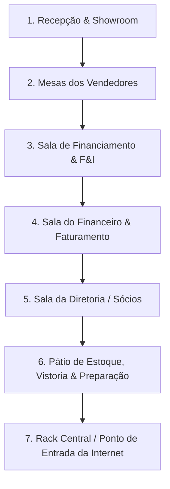
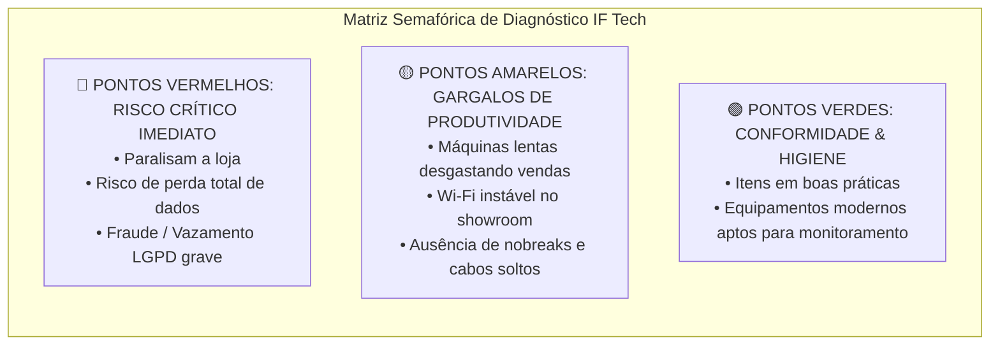

# 🚗 GUIA MESTRE & CHECKLIST DE AUDITORIA DE TI EM CAMPO: CONCESSIONÁRIAS & REVENDA DE VEÍCULOS
**IF Tech Solutions — Engenharia de TI, Infraestrutura & TI Gerenciada (MSP B2B)**  
**Documento Operacional de Campo:** `docs/ops/CHECKLIST_AUDITORIA_CONCESSIONARIA_TI.md`  
**Autor:** Iago Costa — Principal Arquiteto de Soluções MSP Corporativas & Engenharia de TI  
**Praça Base:** Bragança Paulista - SP & Região Bragantina  
**Versão:** 1.0 (Oficial de Campo)  

---

## 🎯 1. Contexto Tático & A Realidade de TI nas Lojas de Carro

Em uma concessionária ou loja de veículos multimarcas, **tempo parado é carro que não sai do pátio e cliente que desiste da compra**. O ticket médio de uma venda varia entre **R$ 50.000,00 e R$ 250.000,00**. 

Contudo, a esmagadora maioria das lojas opera com um cenário de infraestrutura precário e invisível aos olhos do proprietário:
- **Computadores lentos nas mesas de vendedores:** Clientes sentados aguardando 10 a 15 minutos para carregar o portal da financeira (BV, Santander Auto, Itaú, Pan, Bradesco) ou o estoque do site. A negociação esfria, o cliente perde a paciência;
- **O falso "Servidor":** Um computador desktop antigo e empoeirado, escondido debaixo da mesa do financeiro, sem nobreak adequado, rodando o banco de dados do sistema DMS (ex: Linx, Spress, Dealernet, Autoline, ou softwares legados em Firebird/SQL Server). Se o disco rígido desse PC queimar, a loja fica **cega**: perde histórico de estoque, margem de compra, comissões e fica impossibilitada de emitir NF-e de entrada ou saída;
- **Vazamento brutal de dados (Risco LGPD & Fraudes):** Dezenas de fotos de CNH, RG, comprovantes de renda, contracheques e consultas do Serasa espalhadas na pasta `Downloads` de vendedores com navegadores logados em contas pessoais do Gmail/WhatsApp Web;
- **Rede Wi-Fi caótica:** Clientes do showroom conectados na mesma senha do roteador onde trafegam os computadores da tesouraria, máquinas de cartão e o sistema emissor de notas fiscais;
- **Equipamentos periféricos negligenciados:** Impressoras térmicas e multifuncionais travando bem na hora da assinatura do contrato de financiamento e transferência no cartório/despachante.

> **Objetivo da Visita de Segunda-Feira:**  
> Não se trata de vender "conserto de computador". A IF Tech entra na concessionária como uma **consultoria de alta engenharia**, identificando onde a loja está perdendo dinheiro, onde está vulnerável a multas e fraudes, entregando um diagnóstico visual irrefutável e apresentando o plano definitivo: **Setup de Revitalização + Contrato Recorrente MSP Mensal**.

---

## 📋 2. O Checklist de Campo Prático (Passo a Passo Físico por Setor)

*Leve este roteiro no smartphone ou em prancheta de couro executiva. Faça a varredura visual e anotações discretas enquanto percorre as instalações com o gerente ou dono.*



---

### 📍 2.1. Setor 1: Recepção & Showroom de Vendas
*Área de primeiro contato com os clientes, circulação pública e exposição dos veículos.*

- [ ] **PC da Recepção / Balcão:**
  - Equipamento liga rápido ou demora minutos para carregar a tela de login?
  - É utilizado para cadastro inicial de clientes ou controle de fluxo de visitantes?
- [ ] **Rede Wi-Fi de Visitantes:**
  - Existe uma placa com senha exposta na parede? A senha é a mesma da rede interna dos computadores?
  - O sinal de Wi-Fi é estável no centro do salão de carros ou oscila conforme se anda entre os veículos?
- [ ] **Telas & Painéis de Mídia:**
  - Existem Smart TVs ou computadores dedicados exibindo o catálogo de veículos, campanhas ou tabela de preços?
  - Fiação de energia e HDMI organizada ou cabos pendurados aparentes atrás das TVs?
- [ ] **Telefonia & Atendimento Inicial:**
  - Aparelhos IP (VoIP) ou ramais analógicos conectados diretamente em tomadas telefônicas antigas?

---

### 📍 2.2. Setor 2: Mesas de Vendedores (Showroom / Boxes de Venda)
*Onde ocorre a negociação, o cálculo das parcelas e a simulação de troca de veículos.*

- [ ] **Perfil das Máquinas (Hardware):**
  - Quantidade total de estações de vendedores;
  - São desktops ou notebooks pessoais trazidos de casa (BYOD descontrolado)?
  - Há ruído excessivo de ventoinhas (cooler sujo/esforço térmico contínuo)?
  - Gabinetes no chão, aspirando poeira e fiapos do carpete/piso;
  - Teste de olho rápido: verifique o tempo de abertura do Google Chrome e do sistema interno de estoque;
  - Verifique se a unidade de disco é HD mecânico antigo (luz vermelha de disco 100% acesa contínua) ou SSD.
- [ ] **Organização Elétrica & Cabeamento:**
  - Existem benjamins ("tês") e extensões plásticas em cascata ligando PC, monitor, carregador de celular e luminária?
  - Cabos de rede RJ45 soltos sob os pés dos vendedores e clientes, com risco de tropeço ou desconexão acidental;
  - Pontas de cabos de rede com travas plásticas quebradas (ficam bambas na placa-mãe).
- [ ] **Sistemas & Navegação:**
  - Quais navegadores estão instalados? Existem barras de busca estranhas, pop-ups ou extensões suspeitas instaladas?
  - O WhatsApp Web dos vendedores é institucional ou pessoal?
  - Onde os vendedores consultam o estoque de carros disponíveis? (Planilha Excel no desktop? Sistema web da loja? Caderno físico?).

---

### 📍 2.3. Setor 3: Sala de Financiamentos (F&I - Finance & Insurance)
*O epicentro de risco de segurança da loja. Onde operam os operadores bancários e simulações de crédito.*

- [ ] **Segurança de Documentos Pessoais de Clientes:**
  - Inspecione a pasta `Downloads` e a `Área de Trabalho` de 1 ou 2 computadores do setor: há dezenas de arquivos PDF com nomes como `CNH_Fulano.pdf`, `Holerite_Cliente.pdf`, `Comprovante_Residencia.pdf`?
  - Esses documentos permanecem salvos localmente por semanas ou meses sem expurgo automático?
  - Há pastas compartilhadas na rede interna acessíveis por qualquer máquina da loja sem senha?
- [ ] **Portais Bancários & Simulações:**
  - Quais bancos são utilizados (Santander, BV, Itaú, Bradesco, Pan)?
  - As senhas dos portais bancários estão salvas automaticamente no navegador ou anotadas em post-its colados no monitor?
  - Há antivírus ativo ou apenas o Windows Defender desatualizado/desativado por falsos ativadores de Windows pirata?
- [ ] **Digitalização & Periféricos:**
  - Qual o estado do scanner/multifuncional que digitaliza documentos? Demora para enviar o PDF para a máquina?
  - Há impressora de mesa para contratos? Frequentemente atola papel ou falha no meio de impressão de 15 páginas?

---

### 📍 2.4. Setor 4: Sala do Financeiro & Faturamento (Contabilidade/Fiscal)
*Onde se emitem Notas Fiscais Eletrônicas (NF-e de compra e venda), recibos de transferência (ATPV-e) e fluxo de caixa.*

- [ ] **Certificados Digitais (e-CNPJ):**
  - O certificado é do tipo A1 (arquivo `.pfx` instalado no Windows) ou A3 (Token USB / Cartão com leitora)?
  - Onde está salva a cópia de segurança com senha do arquivo A1?
  - O token A3 fica espetado permanentemente em uma máquina ligada à internet?
- [ ] **Onde roda a base de dados do Sistema de Gestão (DMS/ERP):**
  - O sistema é em nuvem ou local (On-Premises)?
  - **Se local:** Qual máquina atua como "servidor"? É um servidor rack profissional com fonte redundante ou um desktop comum de escritório?
  - Essa máquina tem Nobreak senoidal puro ou está ligada num estabilizador antigo que queima placas-mãe?
  - Quem desliga esse computador no fim do dia? Fica ligado 24/7 sem reinicialização preventiva?
- [ ] **Rotina de Backup Existente:**
  - Existe rotina formal de backup do banco de dados?
  - O backup é feito manualmente num pendrive ou HD externo?
  - Quando foi a última vez que o backup foi testado e restaurado para validação?
  - O HD externo fica conectado permanentemente na porta USB da mesma máquina? *(Se um ransomware invadir a máquina, criptografa o PC e o backup simultaneamente).*

---

### 📍 2.5. Setor 5: Sala da Diretoria / Sócios
*Onde os tomadores de decisão trabalham. Seus computadores são o alvo primário de ataques de engenharia social (spear phishing).*

- [ ] **Computadores dos Sócios/Diretores:**
  - Desktops ou MacBooks/Notebooks premium?
  - Há criptografia de disco ativada (BitLocker / FileVault)? *(Se o notebook for roubado do carro, os dados da empresa e extratos bancários caem na mão de criminosos).*
  - Acesso a contas bancárias PJ com tokens físicos ou aplicativos de celular;
- [ ] **Acesso ao CFTV (Câmeras de Segurança):**
  - O dono consegue ver as câmeras do showroom e do pátio pelo celular de forma rápida e sem travar?
  - O aplicativo de CFTV cai com frequência ou a loja não tem IP fixo/DDNS configurado corretamente?
- [ ] **Visibilidade Gerencial:**
  - O proprietário tem relatórios em tempo real da saúde da loja ou depende de planilhas manuais que a equipe envia com atraso?

---

### 📍 2.6. Setor 6: Pátio de Veículos, Vistoria, Preparação & Guarita
*Área externa e operacional, muitas vezes esquecida pela TI.*

- [ ] **Conexão de Rede no Pátio/Oficina:**
  - Os avaliadores de carros usados e vistoriadores conseguem usar tablets/celulares para tirar fotos das avarias e consultar placas no sistema via Wi-Fi do pátio?
  - O sinal morre ao sair do showroom para a área de lavagem/preparação/estoque externo?
- [ ] **Computador de Vistoria / Laudo Cautelar:**
  - Máquina exposta à poeira, solventes e calor da oficina;
  - Gabinete limpo internamente ou obstruído por fuligem e terra?
- [ ] **CFTV do Pátio:**
  - Câmeras cobrem todos os ângulos dos veículos em estoque contra furtos de rodas, catalisadores e arranhões?
  - O cabeamento das câmeras externas está protegido em eletrodutos rígidos ou exposto a intempéries e cortes?

---

### 📍 2.7. Setor 7: Ponto Central de Internet, Roteadores & Rack (O "Coração")
*Geralmente em um canto do financeiro, almoxarifado ou CPD improvisado.*

- [ ] **Provedor e Conexão:**
  - Qual é a operadora de internet principal (Fibra óptica)?
  - Existe um segundo link de contingência (redundância 4G ou segunda operadora)? Se a fibra romper na rua, a loja para de emitir nota fiscal no sábado de manhã?
- [ ] **Roteadores & Switches:**
  - Estão usando apenas o modem/roteador Wi-Fi padrão da operadora (Vivo, Claro, operadora local) para gerenciar 20 a 30 dispositivos?
  - O roteador reinicia sozinho ou congela quando a loja está cheia de clientes conectados?
  - Os switches de rede são Gigabit (1000 Mbps) ou modelos obsoletos Fast Ethernet (100 Mbps) que gargalam a rede inteira?
- [ ] **Rack & Ventilação:**
  - Os equipamentos estão organizados em um mini-rack de parede trancado com chave, ou amontoados em cima de um armário/prateleira pegando poeira?
  - Há Nobreak sustentando modem, switch e servidor durante oscilações de energia comuns na rede elétrica?

---

## 🛠️ 3. Matriz de Inspeção dos 5 Pilares Críticos da IF Tech (Deep Dive Técnico)

Durante a auditoria, você usará os 5 pilares de engenharia da IF Tech para classificar cada problema encontrado:

```
┌────────────────────────────────────────────────────────────────────────┐
│             OS 5 PILARES DE BLINDAGEM & ENGENHARIA IF TECH             │
├──────────────────┬──────────────────┬──────────────────┬───────────────┤
│ A. ESTAÇÕES &    │ B. REDE & WI-FI  │ C. SEGURANÇA &   │ D. BACKUP 321 │
│    HARDWARE      │    CORPORATIVO   │    COMPLIANCE    │    & UPTIME   │
│ (Desempenho Real)│ (Isolamento VLAN)│ (Blindagem LGPD) │ (Zero Pânico) │
├──────────────────┴──────────────────┴──────────────────┴───────────────┤
│ E. PERIFÉRICOS CRÍTICOS & CFTV (Operação de Venda Ininterrupta)        │
└────────────────────────────────────────────────────────────────────────┘
```

### 🔬 Pilar A: Computadores & Estações de Trabalho
*A produtividade direta de quem fecha negócios.*

1. **Armazenamento:** Máquinas equipadas com HD mecânico SATA de 5400/7200 RPM apresentam uso constante de 100% de disco no Gerenciador de Tarefas do Windows 10/11. É a causa primária de 90% das reclamações de lentidão.
   - *Solução IF Tech:* Upgrade cirúrgico para **SSD NVMe M.2 Gen4 ou SSD SATA III** com migração e clonagem bit-a-bit do sistema, preservando programas e configurações.
2. **Memória RAM:** Máquinas com apenas 4GB ou 8GB DDR3/DDR4 sofrem congelamento severo ao abrir 10 abas do Chrome (portais de bancos, Webmotors, Detran) somadas ao ERP da loja.
   - *Solução IF Tech:* Padronização em **16GB RAM Dual-Channel** com tempos balanceados.
3. **Engenharia Térmica & Sujeira:** Máquinas de concessionárias acumulam muita poeira pela circulação constante de pessoas e portas abertas para a rua/pátio. Pasta térmica ressecada causa *thermal throttling* (processador reduz velocidade pela metade para não queimar).
   - *Solução IF Tech:* Limpeza física profunda com desmontagem química e aplicação de pasta térmica de alta condutividade **Arctic MX-4 / MX-6**.

---

### 🌐 Pilar B: Infraestrutura de Rede & Wi-Fi Corporativo
*A rodovia por onde trafegam vendas, notas fiscais e dados bancários.*

1. **Risco de Rede Única (Sem VLAN):** O cliente que senta no showroom para tomar café e conecta no Wi-Fi aberto fica no mesmo segmento de rede IP dos computadores do financeiro. Com um aplicativo simples de escaneamento de rede no celular (como Fing), o cliente enxerga as impressoras, os PCs e as pastas compartilhadas da loja!
   - *Solução IF Tech:* Implantação de roteador corporativo (MikroTik / UniFi) com **segmentação obrigatória de Redes Virtuais (VLANs)**:
     - **VLAN 10 (Administrativa/Financeira):** Restrita, blindada, sem acesso pelo Wi-Fi;
     - **VLAN 20 (Vendas/Showroom):** Apenas computadores da operação;
     - **VLAN 30 (Guest/Clientes):** Isolamento de clientes (Client Isolation), com controle de banda (QoS) para que clientes vendo vídeos no YouTube não saturem o envio de contratos da loja.
2. **Estabilidade de Roteamento:** Roteadores domésticos (TP-Link de R$ 150) travam suas tabelas NAT quando passam de 15 conexões simultâneas.
   - *Solução IF Tech:* Roteamento profissional com gerenciamento dinâmico de conexões e pontos de acesso (Access Points) dedicados com roaming suave entre showroom e pátio.

---

### 🔒 Pilar C: Segurança da Informação & LGPD em Financiamentos
*O passivo jurídico e reputacional que pode custar centenas de milhares de reais.*

1. **Manipulação de Documentos Sensíveis (F&I):** Uma loja de carros manipula diariamente dezenas de CNHs, RGs, certidões de casamento, comprovantes de renda, holerites e extratos bancários de clientes com alto poder aquisitivo.
   - **Cenário Comum Encontrado:** Esses arquivos ficam na pasta `Downloads`, sem expurgo, com nomes visíveis na tela. Se a máquina pegar um vírus do tipo *InfoStealer* (ladrão de senhas e arquivos) ou um funcionário mal-intencionado copiar para um pendrive, esses dados são vendidos no mercado negro para abertura de contas bancárias falsas e golpes de veículos;
   - *Solução IF Tech:* Política rígida de expurgo automático de arquivos temporários, criptografia de dados em repouso (BitLocker), remoção de permissões de administrador local para vendedores e instalação de antivírus corporativo gerenciado com monitoramento centralizado no Cockpit da IF Tech.
2. **Senhas & Autenticação:**
   - Senhas fracas compartilhadas entre múltiplos vendedores (`loja123`, `carro2026`);
   - Falta de autenticação de dois fatores (MFA/2FA) nos e-mails e portais bancários da loja.

---

### 💾 Pilar D: Backup 3-2-1, Banco de Dados DMS e Continuidade de Negócio
*O plano de sobrevivência da loja contra desastres e ransomwares.*

1. **A Regra de Ouro IF Tech (Backup 3-2-1):**
   - **3** Cópias de todos os dados vitais da loja (banco de dados do sistema, arquivos de NF-e XML, contratos digitais);
   - **2** Meios de armazenamento diferentes (ex: armazenamento local em contingência rápida + nuvem criptografada);
   - **1** Cópia completamente fora da empresa (Offsite Cloud Storage com retenção histórica e imutabilidade contra ransomware).
2. **O Monitoramento "Dead Man's Snitch":**
   - Na IF Tech, o backup não é uma promessa: é um protocolo auditado 24 horas por dia. O servidor da loja envia um "ping" criptografado diário para o Cockpit da IF Tech (`admin.html`). Se a rotina de backup falhar ou o servidor ficar em silêncio por mais de 24h, um chamado de severidade máxima (P1) é aberto automaticamente antes mesmo que o cliente perceba.

---

### 🖨️ Pilar E: Periféricos de Missão Crítica & CFTV
*Os instrumentos que finalizam a venda e protegem o patrimônio.*

1. **Impressoras de Contratos:**
   - Devem ter endereço IP fixo configurado e conexão via cabo de rede estruturado (jamais via Wi-Fi instável de operadora);
   - Fila de impressão monitorada para evitar travamentos de spooler do Windows no momento da assinatura.
2. **CFTV & Gravadores Digitais (DVR/NVR):**
   - O DVR que grava os veículos no pátio deve estar em rede isolada, com senha mestre segura (alteração obrigatória de senhas padrão `admin/admin`), sincronizado via NTP e com alerta de falha de gravação de HD.

---

## 🎙️ 4. As "Perguntas de Ouro" (Script de Entrevista com o Proprietário / Gerente Geral)

*Ao sentar para conversar com o tomador de decisão (dono, sócio-administrador ou gerente geral), **não fale sobre processadores, gigabytes ou cabeamento**. Fale sobre **vendas, perda de tempo, custos de paradas e segurança do patrimônio**.*

---

### 🎯 Bloco 1: O Impacto da Lentidão no Fechamento das Vendas
1. *"Quando o vendedor senta com o cliente para aprovar uma ficha cadastral no banco, quanto tempo demora para o sistema carregar a resposta? Vocês já perceberam o cliente desconfortável ou impaciente enquanto o vendedor fica olhando para uma tela de carregamento?"*
   - **Por que perguntar:** Toca diretamente no ego e na experiência do cliente. Venda de carro é emoção; se a tela trava, o comprador tem tempo de pensar e desistir.
2. *"Nas sextas-feiras à tarde e nos sábados de feirão, quando a loja está cheia, a internet ou os computadores costumam ficar mais lentos que o normal?"*
   - **Por que perguntar:** Todo dono sabe que no sábado a rede cai porque o roteador doméstico não aguenta 40 celulares conectados ao mesmo tempo.

---

### 🎯 Bloco 2: Continuidade Operacional & O Pânico da Parada
3. *"Se o computador principal onde roda o sistema de estoque e emissão de notas fiscais queimar o disco rígido agora às 11h, o que acontece com a loja hoje à tarde? Vocês conseguem faturar e entregar carros no sábado?"*
   - **Por que perguntar:** Expõe a vulnerabilidade fatal da falta de contingência e backup testado.
4. *"Quando foi a última vez que vocês fizeram um teste real de restauração do backup do sistema para ver se os arquivos não estão corrompidos?"*
   - **Por que perguntar:** 99% das empresas respondem: *"Nunca testamos, acho que o backup tá rodando num pendrive"*. Aqui se estabelece a necessidade imediata de engenharia.

---

### 🎯 Bloco 3: Segurança Jurídica, LGPD & Risco de Fraudes
5. *"Uma loja de veículos lida com centenas de CNHs, holerites e dados sigilosos por mês para aprovação de crédito. Onde esses arquivos ficam armazenados após o financiamento ser aprovado? Há uma rotina que apaga esses dados ou eles ficam salvos nas máquinas dos vendedores?"*
   - **Por que perguntar:** Cria a consciência do risco de processos judiciais de vazamento de dados (LGPD) e responsabilização pessoal dos sócios.
6. *"Se um funcionário for desligado hoje ou levar o notebook embora, a empresa tem certeza absoluta de que ele não tem mais acesso aos dados de clientes, planilhas de margem e senhas dos bancos?"*
   - **Por que perguntar:** Abre a porta para controle de acessos, desligamento seguro de contas e padronização corporativa.

---

### 🎯 Bloco 4: A Dor do "Técnico Que Some" (O Sobrinho / O Free-lancer)
7. *"Hoje, quando um computador trava ou a internet cai, quem vocês chamam? Essa pessoa demora quanto tempo para responder e aparecer na loja? Quanto custa cada hora de vendedor de braços cruzados esperando suporte?"*
   - **Por que perguntar:** Desqualifica o suporte reativo e amador de "chamar alguém quando quebra" e introduz o modelo de TI Gerenciada (MSP) da IF Tech com SLA garantido.

---

### 🛡️ Matriz de Quebra de Objeções Clássicas

| Objeção Típica do Dono | Realidade Oculta | Resposta de Mestre da IF Tech |
| :--- | :--- | :--- |
| *"Já temos um sobrinho/rapaz que conserta quando dá problema."* | Ele só atende depois que a loja já parou e levou prejuízo. | *"Compreendo perfeitamente. Mas me diga: quando o sistema para no sábado com a loja cheia, ele está aqui em 30 minutos com peças de reposição? A IF Tech não espera quebrar para consertar: nós prevenimos para que a sua equipe nunca pare de vender."* |
| *"Computador novo é muito caro, não quero gastar com máquinas agora."* | As máquinas atuais estão com lentidão por causa de HD velho e poeira, não precisam ser descartadas. | *"E você não precisa gastar R$ 4.000 em cada máquina nova. Nossa engenharia faz uma revitalização cirúrgica: com um investimento de menos de 15% desse valor em SSDs de alta velocidade e otimização de sistema, os computadores ficam até 10 vezes mais rápidos que no primeiro dia de uso."* |
| *"Nossos dados estão seguros, nunca fomos invadidos."* | Nunca foram avisados de que já estão vulneráveis. | *"A maioria dos vazamentos só é descoberta quando a empresa recebe uma notificação judicial ou o banco bloqueia o crédito por suspeita de fraude documental. Nosso trabalho é blindar o seu CNPJ para que esse dia nunca chegue."* |

---

## 📊 5. Estrutura do Dossiê / Laudo Pós-Visita (O Entregável de Autoridade)

Após a visita de campo, os apontamentos coletados devem ser compilados em um **Laudo Técnico Executivo com Padrão Semafórico da IF Tech**, assinado digitalmente com hash criptográfico SHA-256 no Cockpit da IF Tech (`admin.html`).



### 📋 Estrutura Canônica do Documento a Ser Entregue ao Dono:

1. **Capa Executiva:**
   - Identificação da Loja (Razão Social, Nome Fantasia, CNPJ, Endereço);
   - Responsável Técnico: Iago Costa — IF Tech Solutions;
   - Data da Auditoria & Versão do Laudo;
   - Hash SHA-256 de Autenticidade do Laudo.
2. **Sumário Executivo (Resumo para o Proprietário - 1 Página):**
   - Quantidade total de estações auditadas;
   - Índice Geral de Saúde de TI da Concessionária (ex: 38% - Nível de Risco Alto);
   - Estimativa financeira de perda de tempo da equipe de vendas em horas/mês convertida em R$;
   - Os 3 maiores riscos operacionais que exigem intervenção nos próximos 7 dias.
3. **Quadro de Apontamentos Semafóricos (Tabela Detalhada por Setor):**
   - Cada máquina e dispositivo avaliado com foto/descrição, classificação (🔴/🟡/🟢) e recomendação técnica direta.
4. **Parecer Jurídico & Técnico de Proteção de Dados (LGPD):**
   - Apontamento formal do fluxo de documentos de crédito e medidas de blindagem recomendadas para proteção do patrimônio dos sócios.
5. **Plano de Ação Proposto:**
   - Etapa 1: Resgate Operacional & Setup Inicial (dias 1 a 15);
   - Etapa 2: Sustentação Contínua & TI Gerenciada MSP (recorrência mensal).

---

## 💼 6. O Plano de Fechamento Comercial (A Oferta Irrecusável da IF Tech)

O fechamento comercial de uma concessionária estrutura-se em **duas etapas complementares e inegociáveis**:
1. **O Setup Inicial de Engenharia & Blindagem (Caixa de Ativação Pontual):** O trabalho cirúrgico que coloca a casa em ordem;
2. **O Contrato Mensal MSP de TI Gerenciada (Receita Recorrente - MRR):** A garantia de que a loja nunca mais voltará ao caos anterior.

---

### 🛠️ 6.1. Etapa 1: O Setup Inicial de Revitalização & Blindagem (Projeto Fechado)

*O Setup Inicial resolve as dores acumuladas de anos em 3 a 5 dias úteis, trabalhando fora do horário de pico de vendas para não paralisar o atendimento:*

| Módulo de Intervenção | Escopo dos Serviços de Engenharia IF Tech | Benefício Imediato para a Concessionária |
| :--- | :--- | :--- |
| **Revitalização de Máquinas (HW-04 / HW-03B)** | • Limpeza química profunda com desmontagem das estações críticas;<br>• Aplicação de pasta térmica **Arctic MX-4/MX-6**;<br>• Instalação de **SSDs de Alta Performance** e upgrade de RAM;<br>• Clonagem bit-a-bit (sem perda de dados, programas ou certificados). | Os computadores iniciam em 15 segundos. O vendedor abre os portais bancários e simulações de forma instantânea na frente do cliente. |
| **Reestruturação de Rede & Wi-Fi Seguro** | • Instalação e configuração de Roteador Corporativo MikroTik / UniFi;<br>• Criação de **VLANs isoladas** (VLAN 10 Financeiro / VLAN 20 Vendas / VLAN 30 Clientes);<br>• Organização de cabeamento de rede, conectorização profissional Cat6 e identificação de pontos;<br>• Configuração de QoS (prioridade total para tráfego do ERP e emissão de notas). | Clientes navegam em Wi-Fi rápido e isolado sem conseguir espiar nenhum dado da empresa. Fim das quedas de internet nos sábados. |
| **Implantação da Blindagem de Dados & Backup 3-2-1** | • Instalação de rotina automatizada de backup em nuvem criptografada offsite;<br>• Cópia local de contingência para restauração instantânea;<br>• Configuração do agente de monitoramento contínuo com sensor **Dead Man's Snitch**;<br>• Higienização de pastas temporárias e expurgo de arquivos sensíveis soltos em `Downloads`. | Blindagem total contra ransomware. Se a loja pegar fogo ou o disco queimar, 100% dos dados são restaurados sem perda de faturamento. |

---

### 🛡️ 6.2. Etapa 2: O Contrato Recorrente Mensal MSP (TI Gerenciada IF Tech)

*Precificado com base na matriz oficial de criticidade da IF Tech (`docs/ops/SERVICE_CATALOG_PRICING.md`):*

#### Tabela de Tiers da Concessionária:
- **Tier 1: Essential (R$ 69,90/máquina/mês):**
  - Destinado às máquinas de balcão, recepção, pátio e mesas gerais de vendedores;
  - Monitoramento preventivo 24/7 de saúde de hardware (temperatura, integridade de disco, uso de memória);
  - Antivírus corporativo gerenciado em nuvem;
  - Suporte remoto ilimitado sob demanda;
  - Acesso ao **Portal do Cliente B2B** (`portal.html`) para abertura de chamados com tracking em tempo real.
- **Tier 2: Professional (R$ 109,90/máquina/mês):**
  - Destinado às máquinas do F&I (Financiamento), Faturamento Fiscal e Tesouraria;
  - Tudo do Plano Essential;
  - **Rotina de Backup Diário Automatizado em Nuvem Criptografada** (arquivos fiscais, certificados e planilhas vitais);
  - Suporte prioritário com **SLA de resposta rápida de até 2 horas**;
  - 1 Limpeza preventiva física anual completa inclusa por máquina.
- **Tier 3: Enterprise / Missão Crítica (R$ 189,90/máquina ou servidor/mês):**
  - Destinado ao Servidor do Sistema DMS/ERP da loja e computadores dos Sócios-Diretores;
  - Monitoramento contínuo de Uptime 24/7 com snitch de telemetria;
  - Backup contínuo com capacidade de **Disaster Recovery (Recuperação Rápida de Desastre)**;
  - Atendimento presencial de emergência com **SLA de até 2 horas em Bragança Paulista**.

---

### 💰 6.3. Simulação de Proposta Comercial Realista: Concessionária Média (10 Dispositivos)

Considere uma revenda típica de seminovos ou concessionária de médio porte em Bragança Paulista com:
- 1 Servidor Central do Sistema de Gestão (DMS / ERP);
- 2 Máquinas do Financeiro & F&I (Financiamentos / Faturamento);
- 6 Mesas de Vendedores no Showroom;
- 1 Estação de Vistoria / Pátio.

#### 1. Setup Inicial de Engenharia & Blindagem (Investimento Único):
- Upgrade cirúrgico de 4 máquinas críticas (SSD 512GB NVMe/SATA + M.O. Clonagem Bit-a-Bit): `4x R$ 280,00 = R$ 1.120,00`
- Limpeza profunda & troca de pasta térmica Arctic MX-6 (4 PCs): `4x R$ 220,00 = R$ 880,00`
- Reestruturação física de rede, implantação de roteador corporativo com VLANs e isolamento Wi-Fi: `R$ 950,00`
- Implantação e homologação de rotina de Backup 3-2-1 + Dead Man's Snitch no Servidor: `R$ 450,00`
- **Total do Setup Inicial:** **R$ 3.400,00** *(Parcelável em até 3x ou entrada + saldo na homologação)*

#### 2. Mensalidade Recorrente do Contrato MSP (MRR Previsível):
- **1x Servidor DMS Local (Tier 3 Enterprise):** `1x R$ 189,90 = R$ 189,90 / mês`
- **2x Máquinas F&I / Financeiro (Tier 2 Professional):** `2x R$ 109,90 = R$ 219,80 / mês`
- **7x Máquinas Vendedores / Pátio (Tier 1 Essential):** `7x R$ 69,90 = R$ 489,30 / mês`
- **Total Mensal Recorrente da Concessionária:** **R$ 899,00 / mês**

> **O Argumento Matador de Fechamento:**  
> *"Por **R$ 899,00 por mês** — valor inferior a meia comissão de venda de um único carro popular —, a sua concessionária tem um departamento completo de engenharia de TI, com suporte presencial rápido, proteção contra sequestro de dados, monitoramento diário e a certeza de que nenhuma venda será perdida por lentidão de sistema."*

---

## 🧰 7. Kit de Ferramentas de Campo (O que Levar na Mochila de Segunda-Feira)

*Conforme as especificações de campo da IF Tech (`docs/ops/HARDWARE_LAB_AND_FIELD_TOOLKIT_SPECIFICATION.md`), Iago deve comparecer munido de seu kit de engenharia de alta autoridade:*

1. **Mochila Técnica com Fundo Rígido:** Postura formal, profissional e bem apresentada;
2. **2x Pendrives SanDisk Metal Ventoy:**
   - Ferramentas de diagnóstico autônomas: CrystalDiskInfo (para checar saúde de HDs/SSDs na hora na frente do cliente), HWMonitor (para ler temperatura de processador), MemTest86, Windows PE Strelec;
3. **Testador de Cabos de Rede Noyafa NF-8209 / Zumbidor:**
   - Para identificar cabos de rede quebrados, rotas e mapeamento rápido de cabos sem identificação no rack;
4. **Cabo de Console USB-RJ45 FTDI & Adaptador Gigabit USB-C:**
   - Para acesso e diagnóstico direto a roteadores e portas de rede;
5. **Testador de Tomada com Verificação de DR/Aterramento:**
   - Demonstra na hora para o cliente se a tomada onde o servidor está ligado tem aterramento real ou fase invertida;
6. **Caderno de Campo / Tablet Executivo:**
   - Para anotações dos números de série, marcas, modelos e mapa mental da planta da loja;
7. **2x Cartões de Visita com Verniz UV + Envelopes Executivos Lacrados:**
   - Para entrega formal do contato e agendamento da entrega do Laudo.

---

## 🚀 8. Próximos Passos Imediatos após a Visita de Campo

1. **Retorno à Base (Cockpit IF Tech):**
   - Cadastrar a concessionária no módulo de Clientes (`admin.html`);
   - Gerar o contrato prévio e cadastrar os dispositivos identificados no módulo ITAM;
2. **Emissão do Laudo Executivo:**
   - Gerar o PDF executivo com os pontos Semafóricos (Vermelho, Amarelo, Verde);
   - Assinar com o hash SHA-256 institucional;
3. **Reunião de Fechamento Comercial (Quarta ou Quinta-feira):**
   - Apresentação presencial de 20 minutos com o proprietário;
   - Entrega do Laudo impresso em pasta executiva e demonstração do **Portal do Cliente B2B** (`portal.html`);
   - Assinatura do Contrato MSP e agendamento do Setup Inicial para o fim de semana ou noite.
