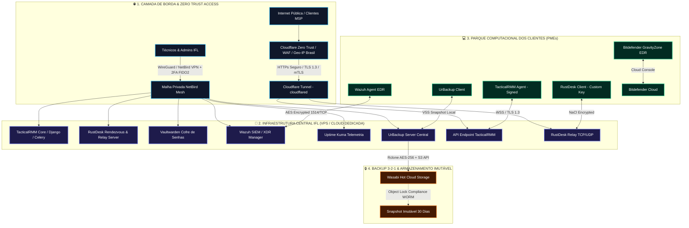
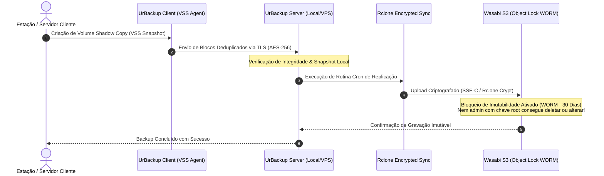
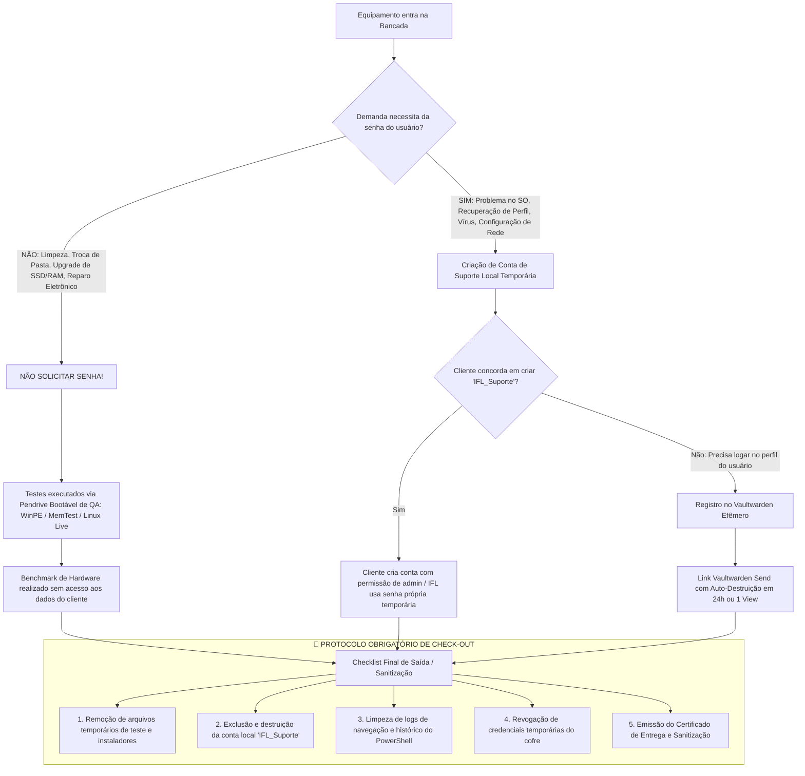
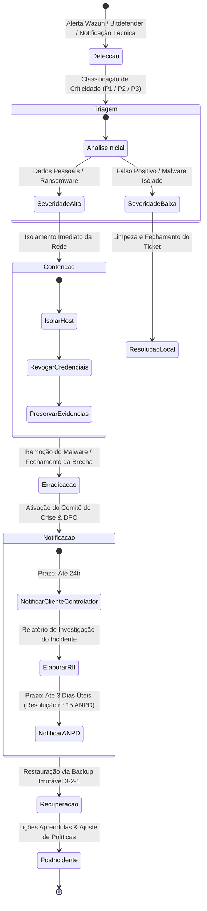
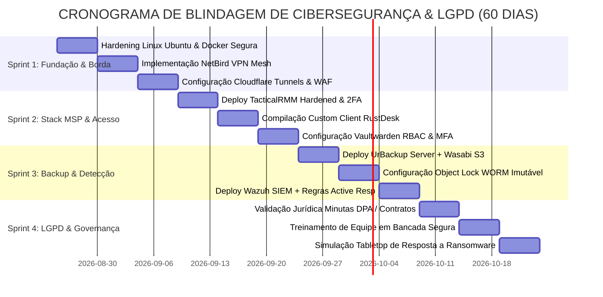

# 🛡️ LAUDO EXECUTIVO DE CIBERSEGURANÇA, DEVSECOPS & CONFORMIDADE LGPD
## Auditoria Técnica de Infraestrutura, Arquitetura de Defesa e Governança de Dados para MSP

**Documento:** Parecer Técnico de Cibersegurança, DevSecOps e Conformidade com a Lei Geral de Proteção de Dados (Lei 13.709/2018)  
**Entidade Auditada:** IFL Costa Tech (CNPJ/Operação: TI Gerenciada, Engenharia de Software e Bancada Especializada)  
**Perfil do Emissor:** Chief Information Security Officer (CISO) & Especialista Sênior em DevSecOps e LGPD  
**Classificação do Documento:** Confidencial / Estratégico  
**Versão:** 1.0 — Edição Definitiva de Operação e Blindagem  
**Data da Auditoria:** Agosto de 2026  

---

## 📑 SUMÁRIO EXECUTIVO

A **IFL Costa Tech** opera sob um modelo híbrido de alto valor que combina **Bancada de Hardware**, **Engenharia de Software** e **Provedor de Serviços Gerenciados (MSP - Managed Service Provider)**. A expansão da atuação MSP para clientes corporativos (PMEs, clínicas médicas, consultórios odontológicos e escritórios de contabilidade) eleva drasticamente a superfície de ataque e as responsabilidades jurídicas da empresa.

Um Provedor de Serviços de TI Gerenciada (MSP) é um dos **alvos mais cobiçados por agentes de ameaças cibernéticas (Ransomware as a Service - RaaS, APTs)** devido ao efeito multiplicador de um ataque de *Supply Chain*: ao comprometer o servidor RMM ou o Cofre de Senhas do MSP, invasores obtêm acesso administrativo irrestrito e simultâneo a todos os parques computacionais dos clientes finais (cenário análogo aos incidentes históricos *Kaseya VSA* e *SolarWinds*).

Simultaneamente, o manuseio de dados de saúde (prontuários de clínicas sob o CFM) e dados fiscais/trabalhistas (escritórios contábeis) impõe a estrita aplicação da **LGPD (Lei Federal nº 13.709/2018)**, sob pena de multas da ANPD (de até 2% do faturamento limitada a R$ 50 milhões por infração), além de litígios civis e perda irreversível de reputação.

Este documento estabelece o **Laudo Técnico Definitivo de Hardening, Arquitetura DevSecOps Zero Trust e Matriz de Governança LGPD**, estruturado para blindar a operação da IFL Costa Tech nos próximos 60 dias e habilitar a captação segura de clientes B2B de alto ticket.

---



---

## 1. 🔍 AUDITORIA E AVALIAÇÃO DA STACK MSP PROPOSTA

### 1.1. TacticalRMM (Remote Monitoring & Management)
* **Função na Stack:** Monitoramento contínuo de estações e servidores, inventário de hardware/software, automação de scripts (PowerShell/Python/Bash), patch management automatizado e alertas de telemetria.
* **Veredito de Segurança:** **APROVADO COM CONTROLES CRÍTICOS DE HARDENING**.
* **Análise de Riscos:** O TacticalRMM utiliza uma arquitetura baseada em Django (backend), MeshCentral (túnel remoto web), Go (agente do endpoint) e Nginx. Sendo uma ferramenta com privilégios de `SYSTEM` nos endpoints, um comprometimento de credenciais de login ou uma injeção de comandos na API Web daria a um invasor a capacidade de disparar scripts de ransomware para 100% dos clientes cadastrados em menos de 60 segundos.
* **Recomendações Mandatórias:**
  1. O painel web de gerenciamento do TacticalRMM **JAMAIS deve ficar exposto publicamente na internet** em portas convencionais (`443`, `80`). A interface de gerenciamento deve ser acessada exclusivamente via Cloudflare Access com proteção de MFA ou via malha VPN privada (NetBird / WireGuard).
  2. O endpoint de comunicação dos agentes (`/api/v1/agent/...`) deve ser protegido por Cloudflare WAF, com filtro Geo-IP permitindo tráfego originado **exclusivamente do Brasil**, com regras de Rate Limiting e mitigação de DDoS.
  3. Desativação completa de contas de serviço padrão e ativação mandatória de **2FA (TOTP/FIDO2)** para todas as contas de técnicos, com bloqueio automático após 3 tentativas inválidas.
  4. Habilitação de política de auditoria global de comandos: todos os scripts executados via RMM devem gerar logs imutáveis enviados em tempo real para o Wazuh SIEM.

---

### 1.2. RustDesk Self-Hosted (Acesso Remoto Rápido & Suporte Interativo)
* **Função na Stack:** Suporte remoto interativo sob demanda, visualização de tela com baixa latência, transferência de arquivos e controle remoto seguro sem dependência de ferramentas comerciais de alto custo (AnyDesk, TeamViewer).
* **Veredito de Segurança:** **APROVADO SOB ARQUITETURA SELF-HOSTED PRIVADA**.
* **Análise de Riscos:** O cliente público padrão do RustDesk conecta-se a servidores de rendezvous públicos mundiais, o que cria riscos de espionagem, interceptação man-in-the-middle ou conexão não autorizada se o ID for descoberto por força bruta.
* **Recomendações Mandatórias:**
  1. Subir servidor próprio composto pelos binários `hbbs` (Rendezvous Server) e `hbbr` (Relay Server) em VPS dedicada (Ubuntu 24.04 LTS Hardened).
  2. **Geração de Chave Pública Criptográfica Obrigatória (`-k _` / `id_ed25519.pub`):** O servidor deve ser configurado com o parâmetro de chave mandatória. Conexões de clientes que não possuam a chave pública do servidor IFL Costa Tech são sumariamente rejeitadas.
  3. **Custom Client Compilation (White Label IFL):** Compilar o executável do RustDesk contendo *hardcoded* o domínio do servidor relay próprio da IFL Costa Tech e a chave pública institucional, desabilitando a opção de o usuário final alterar as configurações de rede no cliente.
  4. Criptografia de ponta a ponta garantida via algoritmo **NaCl (Curve25519, Salsa20 e Poly1305 / ChaCha20-Poly1305)**, impedindo qualquer decifração intermediária, mesmo que o pacote passe por provedores de trânsito.

---

### 1.3. UrBackup Server + Wasabi Hot Cloud Storage S3 (Estratégia 3-2-1)
* **Função na Stack:** Sistema de backup híbrido local e offsite para arquivos, bancos de dados e imagens completas de disco (*bare-metal recovery*), integrado a storage S3 compatível de alta performance e baixo custo.
* **Veredito de Segurança:** **EXCELENTE — PADRÃO OURO DE RESILIÊNCIA CONTRA RANSOMWARE**.
* **Análise de Riscos:** Backups conectados diretamente como unidades de rede (SMB/CIFS mapeadas com letra de unidade `Z:`) são o primeiro alvo de criptografia por malwares modernos. Um backup só é seguro se for **imutável**, **criptografado de ponta a ponta** e **isolado da rede local dos clientes**.
* **Arquitetura 3-2-1 Validada:**
  - **3 Cópias dos Dados:** 1 Produção no Cliente + 1 Backup Local Rápido no Servidor UrBackup/NAS + 1 Cópia Offsite em Nuvem.
  - **2 Mídias Diferentes:** Discos Locais NVMe/SAS no cliente e Object Storage na Nuvem.
  - **1 Cópia Offsite Imutável:** Wasabi S3 na região `us-east-1` ou `sa-east-1` com **Object Lock (Compliance Mode / WORM - Write Once, Read Many)** de 30 dias.



---

### 1.4. Antivírus & EDR: Bitdefender GravityZone Cloud MSP vs Windows Defender Hardened
* **Comparativo Técnico:**

| Vetor de Análise | Bitdefender GravityZone Cloud MSP | Windows Defender Hardened (ASR + WDAC) |
| :--- | :--- | :--- |
| **Proteção Comportamental** | Advanced Threat Intelligence + HyperDetect + Sandbox Analyzer | Microsoft Defender Antivirus + Cloud Protection |
| **Mitigação de Ransomware** | Ransomware Mitigation com Rollback de arquivos instantâneo | Shadow Copies tradicionais (vulneráveis a `vssadmin delete`) |
| **Gerenciamento Central** | Console Multitenant MSP em Nuvem com políticas por cliente | Exige Microsoft Intune / Defender for Endpoint Plan 2 |
| **Regras de Redução de Superfície (ASR)** | Controle nativo via console de políticas centralizada | Exige scripts PowerShell locais e GPO complexa |
| **Isolamento de Endpoint** | 1 Clique na console isola a máquina infectada da rede | Requer infraestrutura de EDR corporativa |
| **Custo por Endpoint** | ~ R$ 4,50 a R$ 8,00 / estação / mês | Incluso no Windows 10/11 Pro (R$ 0,00 direto) |
| **Veredito & Recomendação** | **OBRIGATÓRIO para Estações Pro e Servidores Enterprise** | **ACEITÁVEL apenas para Estações Essenciais B2C/PMEs Básicas** |

* **Diretriz de Decisão:**
  - **Plano Essencial (R$ 69,90):** Windows Defender Hardened com aplicação mandatória de script de **Attack Surface Reduction (ASR Rules)**, bloqueio de macros do Office, bloqueio de execução de scripts de processos filhos e proteção em nuvem ativada no nível mais agressivo.
  - **Plano Professional (R$ 109,90) e Enterprise (R$ 189,90):** Instalação obrigatória do **Bitdefender GravityZone Cloud MSP** com módulos de *Patch Management*, *Content Control*, *Network Attack Defense* e *Ransomware Rollback*.

---

### 1.5. Wazuh SIEM & XDR (Security Information and Event Management)
* **Função na Stack:** Monitoramento centralizado de eventos de segurança, conformidade FIM (*File Integrity Monitoring*), detecção de vulnerabilidades (CVEs), análise de logs de autenticação e resposta ativa contra ataques de força bruta.
* **Veredito de Segurança:** **APROVADO — DIFERENCIAL COMPETITIVO DE NÍVEL ENTERPRISE**.
* **Regras de Detecção de Alta Criticidade a Configurar:**
  1. `Event ID 4624 (Type 10)`: Logon RDP bem-sucedido originado de IPs não autorizados.
  2. `Event ID 4672 / 4627`: Elevação de privilégios de usuário local para grupo Administradores.
  3. `Event ID 7045`: Instalação de novo serviço no Windows (comum em persistência de malware).
  4. Execução de comandos de destruição de sombra: `vssadmin.exe delete shadows`, `wbadmin delete catalog`, `wmic shadowcopy delete` -> **Gera bloqueio imediato do processo e isolamento do host via Active Response**.
  5. Monitoramento de integridade de arquivos em pastas de prontuários e sistemas fiscais (`C:\Sistemas\`, `C:\Dados\`).

---

### 1.6. Vaultwarden (Cofre de Senhas & Documentação Segura de TI)
* **Função na Stack:** Armazenamento seguro de credenciais administrativas de roteadores, switches, servidores, contas de domínio e documentação de rede dos clientes B2B.
* **Veredito de Segurança:** **APROVADO COM REGRAS DE SEGREGACÃO MULTITENANT ESTREITAS**.
* **Arquitetura de Isolamento:**
  - Criação de uma **Organização Única (IFL Costa Tech)** com **Coleções (Collections)** isoladas para cada cliente PME (`Cliente_Clinica_Alfa`, `Cliente_Contabil_Beta`).
  - O acesso dos técnicos juniores é concedido exclusivamente à coleção do cliente em que estão prestando atendimento, com a política de "Apenas Visualizar Senha" (sem permissão para exportação do cofre).
  - Obrigatoriedade de **MFA com WebAuthn/FIDO2 ou TOTP** para login no cofre.
  - O banco de dados SQLite/PostgreSQL do Vaultwarden deve ser criptografado em repouso e exportado diariamente de forma cifrada para o storage Wasabi S3.

---

### 1.7. Uptime Kuma (Monitoramento de Rede & Links de Internet)
* **Função na Stack:** Monitoramento *heartbeat* 24/7 de links dedicados, IPs fixos de operadoras (Vivo Fibra, Claro, provedores locais), túneis VPN de clientes e disponibilidade de servidores internos.
* **Veredito de Segurança:** **APROVADO**.
* **Segurança:** O Uptime Kuma não executa comandos nem armazena credenciais nos clientes; faz apenas consultas de sondagem (Ping ICMP, HTTP Status, Port Probe). Alertas são encaminhados diretamente para o Webhook do ERP/WhatsApp da IFL Costa Tech.

---

### 1.8. Service Desk / Ticketing Nativo no Supabase + ERP
* **Função na Stack:** Centralização de chamados técnicos, métricas de SLA, ordens de serviço, controle de horas e base de conhecimento.
* **Veredito de Segurança:** **APROVADO MEDIANTE POLÍTICAS DE ROW LEVEL SECURITY (RLS)**.
* **Blindagem no Banco de Dados:** Todas as tabelas (`tickets`, `service_orders`, `clients`, `devices`) devem ter RLS ativo no PostgreSQL, garantindo que um cliente autenticado no portal web visualize **estritamente os dados de sua própria empresa (`tenant_id = auth.uid()`)**, impedindo qualquer vazamento cruzado de dados entre PMEs.

---

## 2. 🛡️ MODELAGEM DE AMEAÇAS, HARDENING & DEVSECOPS

### 2.1. Exposição Segura de Servidores (TacticalRMM, RustDesk e Vaultwarden)

A regra número um de cibersegurança para MSPs é: **Nenhuma interface administrativa deve ficar exposta diretamente na porta 80/443 pública de uma VPS sem autenticação perimetral**.

```
┌────────────────────────────────────────────────────────────────────────────────────────┐
│                        ARQUITETURA DE EXPOSIÇÃO ZERO TRUST IFL                         │
├────────────────────────────────────────────────────────────────────────────────────────┤
│                                                                                        │
│   [ ADMIN / TÉCNICO IFL ]                                                              │
│             │                                                                          │
│             ├──> [ NetBird / WireGuard VPN Privada ]                                   │
│             │          │                                                               │
│             │          ├──> Vaultwarden (Porta 8080 - Apenas IP VPN)                   │
│             │          ├──> TacticalRMM Django Admin (Porta 443 - Apenas IP VPN)       │
│             │          ├──> Wazuh Dashboard (Porta 5601 - Apenas IP VPN)               │
│             │          └──> Uptime Kuma Admin (Porta 3001 - Apenas IP VPN)             │
│             │                                                                          │
│   [ AGENTES NOS ENDPOINTS ]                                                            │
│             │                                                                          │
│             └──> [ Cloudflare Zero Trust / Tunnel / WAF ]                              │
│                        │                                                               │
│                        ├── Geo-IP: Apenas BR (Block resto do mundo)                    │
│                        ├── Rate Limiting: 100 req/min por IP                           │
│                        ├── WAF Ruleset: OWASP Top 10 + Bot Fight Mode                  │
│                        │                                                               │
│                        └──> TacticalRMM API Gateway (api.rmm.iflcosta.tech)            │
│                        └──> RustDesk Rendezvous / Relay (relay.iflcosta.tech)          │
│                                                                                        │
└────────────────────────────────────────────────────────────────────────────────────────┘
```

#### Configuração Prática de Hardening no Nginx / Cloudflare
Para proteger o backend do TacticalRMM e do RustDesk contra varreduras de portas e scanners automatizados (Shodan, Censys):

```nginx
# /etc/nginx/conf.d/security_headers.conf
# Headers de Segurança HTTP Mandatórios (Pontuação A+ no SSL Labs)
add_header Strict-Transport-Security "max-age=63072000; includeSubDomains; preload" always;
add_header X-Frame-Options "DENY" always;
add_header X-Content-Type-Options "nosniff" always;
add_header X-XSS-Protection "1; mode=block" always;
add_header Content-Security-Policy "default-src 'self'; script-src 'self' 'unsafe-inline'; style-src 'self' 'unsafe-inline'; img-src 'self' data: https:; connect-src 'self' wss: https:;" always;
add_header Referrer-Policy "strict-origin-when-cross-origin" always;
add_header Permissions-Policy "geolocation=(), microphone=(), camera=()" always;

# Bloqueio de métodos HTTP não autorizados
if ($request_method !~ ^(GET|HEAD|POST|PUT|DELETE|OPTIONS)$ ) {
    return 405;
}
```

---

### 2.2. Proteção contra Supply Chain Attacks (Mitigação do Risco Kaseya/SolarWinds)

Um ataque de *Supply Chain* no MSP ocorre quando o invasor obtém acesso ao servidor RMM e utiliza o canal legítimo de automação para distribuir código malicioso assinado ou scripts de destruição para todos os clientes gerenciados.

#### Medidas de Defesa em Profundidade Mandatórias:

1. **Princípio dos Quatro Olhos (*Dual-Custody Approval*):**
   - Scripts que realizam alterações críticas no sistema (desativação de antivírus, exclusão em massa de diretórios, formatação de partições, criação de usuários administrativos ou execução de binários remotos não homologados) **não podem ser disparados por um único técnico**.
   - O ERP/RMM deve exigir aprovação em duas etapas: o Técnico solicita a execução e o Líder Técnico/CISO valida via notificação assinada com MFA no aplicativo.

2. **Repositório Central de Scripts Versionado (Git + CI/CD):**
   - Todos os scripts PowerShell e Python utilizados no TacticalRMM devem residir em um repositório Git interno privado (`git.iflcosta.tech` ou GitHub Private com branch protection).
   - Nenhuma edição de script direto na caixa de texto do painel web deve ser permitida. O script só é sincronizado com o TacticalRMM após aprovação de *Pull Request* e validação de linter de segurança (*PSScriptAnalyzer* / *Bandit*).

3. **Assinatura de Código (*Code Signing*):**
   - Os agentes de instalação e os scripts automatizados de manutenção devem ser assinados digitalmente com certificado de assinatura de código da IFL Costa Tech (*Authenticode Certificate* ou chave privada interna homologada nos certificados raiz das máquinas clientes).
   - Configuração de política de execução do PowerShell nas estações:
     ```powershell
     Set-ExecutionPolicy -ExecutionPolicy AllSigned -Scope LocalMachine -Force
     ```

4. **Detecção Comportamental de Anomalias no Wazuh:**
   - Regra específica no Wazuh para alertar se o processo pai `tacticalrmm.exe` invocar comandos suspeitos como `cmd.exe /c powershell -enc`, `certutil.exe -urlcache -split -f`, `bitsadmin`, ou `net user /add`.

---

### 2.3. Separação de Privilégios e Gestão de Contas de Acesso (Least Privilege)

* **Eliminação de Senha Administrativa Compartilhada:**
  - **PROIBIÇÃO ABSOLUTA:** É terminantemente proibido utilizar a mesma senha de administrador local em múltiplos clientes ou computadores (ex: `Ifl@2026!`). Se uma máquina for comprometida com malware *Mimikatz*, a técnica de *Pass-the-Hash* permitiria ao atacante invadir toda a rede.
* **Implementação de LAPS (Local Administrator Password Solution):**
  - Para ambientes com Active Directory ou via automação do TacticalRMM, cada computador deve ter uma senha de administrador local gerada aleatoriamente com 24 caracteres alfanuméricos + símbolos, rotacionada a cada 30 dias e armazenada dinamicamente no cofre do cliente.
* **Just-In-Time (JIT) Privileged Access:**
  - Os usuários comuns dos clientes (médicos, secretárias, contadores) operam no dia a dia como **Usuários Padrão (Sem privilégios de Administrador)**.
  - Caso precisem instalar um software homologado, o técnico da IFL Costa Tech eleva temporariamente a sessão remotamente via RMM ou gera uma credencial com validade de 60 minutos que se auto-destrói.

---

## 3. ⚖️ MATRIZ DE CONFORMIDADE COM A LGPD (LEI 13.709/2018)

### 3.1. Enquadramento Jurídico dos Papéis na Relação MSP

Na prestação de serviços de TI Gerenciada e Suporte Corporativo, a correta qualificação dos agentes de tratamento é o alicerce de toda a blindagem jurídica:

```
┌────────────────────────────────────────────────────────────────────────────────────────┐
│                          PAPÉIS E RESPONSABILIDADES NA LGPD                            │
├─────────────────────────────────────────┬──────────────────────────────────────────────┤
│ CONTROLADOR DOS DADOS                   │ OPERADOR DOS DADOS                           │
│ (A Empresa Contratante / Cliente PME)   │ (IFL Costa Tech - Provedor MSP)              │
├─────────────────────────────────────────┼──────────────────────────────────────────────┤
│ • Clínica Médica / Consultório          │ • Executa suporte técnico, backup e gestão   │
│ • Escritório Contábil / Financeiro      │ • Trata dados em nome do Controlador         │
│ • Loja / Indústria / Empresa B2B        │ • Segue estritamente as instruções lícitas   │
│ • Decide as finalidades e bases legais  │ • Implementa medidas técnicas e de segurança │
│ • Responde perante os titulares e ANPD  │ • Comunica incidentes imediatamente          │
└─────────────────────────────────────────┴──────────────────────────────────────────────┘
```

> **Base Legal:** Artigo 39 da LGPD: *"O operador deverá realizar o tratamento segundo as instruções fornecidas pelo controlador, que verificará a observância das próprias instruções e das normas sobre a matéria."*

---

### 3.2. Cláusulas Mandatórias do DPA (Data Processing Agreement / Acordo de Tratamento de Dados)

O contrato de prestação de serviços da IFL Costa Tech deve conter um **Anexo Específico de DPA** firmado com cada cliente B2B. As cláusulas centrais redigidas sob a ótica de conformidade estrita são:

```markdown
### ANEXO TÉCNICO: ACORDO DE TRATAMENTO DE DADOS PESSOAIS (DPA)

**1. OBJETO E ESCOPO DO TRATAMENTO**
1.1. A CONTRATADA (IFL Costa Tech), na qualidade de OPERADORA, realizará o tratamento de dados pessoais contidos na infraestrutura de TI da CONTRATANTE (CONTROLADORA) exclusivamente para os fins de: (i) monitoramento preventivo de saúde de hardware; (ii) execução de cópias de segurança (backups); (iii) suporte remoto sob demanda; e (iv) manutenção de integridade e segurança cibernética.
1.2. É vedado à OPERADORA utilizar, vender, alugar, compartilhar ou monetizar quaisquer dados pessoais de titulares a que tiver acesso em razão da prestação dos serviços.

**2. MEDIDAS TÉCNICAS E DE SEGURANÇA DA INFORMAÇÃO**
2.1. A OPERADORA compromete-se a manter implementadas as seguintes salvaguardas mínimas:
   a) Criptografia de dados em repouso padrão AES-256 para todos os volumes de backup em nuvem;
   b) Criptografia em trânsito padrão TLS 1.3 em todos os canais de telemetria e acesso remoto;
   c) Autenticação multifator (MFA/2FA) obrigatória para todas as contas de técnicos que acessem o parque computacional da CONTROLADORA;
   d) Registro imutável de logs de acesso remoto contendo identificação do técnico, data, hora inicial, hora final e ações executadas;
   e) Isolamento lógico de dados de backup contra acesso direto de estações de trabalho não autorizadas.

**3. DEVER DE CONFIDENCIALIDADE E SEGREDO PROFISSIONAL**
3.1. Todos os colaboradores e técnicos da OPERADORA firmarão Termo de Confidencialidade e Não Divulgação (NDA), respondendo civil e penalmente por qualquer quebra de sigilo referente a dados industriais, segredos de negócio, dados fiscais, dados de faturamento ou prontuários médicos acessados no exercício de suas funções.

**4. NOTIFICAÇÃO E RESPOSTA A INCIDENTES DE SEGURANÇA**
4.1. Na hipótese de ocorrência de qualquer incidente de segurança da informação que possa acarretar risco ou dano relevante aos titulares de dados da CONTROLADORA (ex: ataque de ransomware, vazamento de credenciais, acesso indevido), a OPERADORA notificará a CONTROLADORA por escrito no prazo improrrogável de até 24 (vinte e quatro) horas úteis a contar da confirmação do evento, prestando assistência na identificação dos danos e remediação.

**5. TÉRMINO DO CONTRATO E EXPURGO SEGURO DE DADOS**
5.1. Encerrado o contrato de prestação de serviços por qualquer motivo, a OPERADORA providenciará:
   a) A desinstalação e revogação imediata de todos os agentes de RMM, EDR e ferramentas de acesso remoto;
   b) A eliminação segura e definitiva de todas as cópias de backup sob sua guarda em até 30 (trinta) dias após a liquidação final, ressalvada a guarda obrigatória por dever legal regulatório;
   c) A emissão de Certificado Digital de Sanitização e Expurgo de Dados.
```

---

### 3.3. Protocolos Especiais para Dados Sensíveis (Clínicas e Contabilidades)

#### A. Clínicas Médicas e Consultórios Odontológicos (Art. 5º, II e Art. 11 da LGPD)
* **Natureza dos Dados:** Dados pessoais sensíveis referentes à saúde, histórico de consultas, exames radiológicos, fotos intraorais, tratamentos e prontuários eletrônicos (Sistemas como Doctoralia, iClinic, Feegow, Simples Dental, etc.).
* **Regras Específicas de Blindagem:**
  1. **Técnico Não Visualiza Prontuário:** Durante sessões de suporte remoto, o técnico deve solicitar ao profissional de saúde que feche telas contendo prontuários abertos antes de iniciar a manutenção de software ou banco de dados.
  2. **Backup de Banco de Dados Médico:** A exportação de dumps de bancos de dados (`.bak`, `.sql`, `.mdf`) deve ser realizada diretamente para diretório cifrado pelo UrBackup com chave AES-256 mantida em posse exclusiva do gestor da clínica.
  3. **Conformidade com Resoluções do CFM (Conselho Federal de Medicina):** A guarda de prontuários eletrônicos exige integridade absoluta (ICP-Brasil / SHA-256) e disponibilidade por no mínimo 20 anos. O sistema de backup em nuvem da IFL com Object Lock garante a proteção contra perda acidental ou deleção maliciosa.

#### B. Escritórios Contábeis e Fiscais
* **Natureza dos Dados:** Folhas de pagamento de funcionários de terceiros (com CPF, salário, pensão alimentícia, afastamento médico), balanços contábeis, extratos bancários, dados do eSocial e certificado digital da empresa (`e-CNPJ` / `e-CPF` modelo A1).
* **Regras Específicas de Blindagem:**
  1. **Proteção Estrita de Certificados Digitais A1 (`.pfx` / `.p12`):**
     - Técnicos da IFL **jamais devem copiar certificados digitais de clientes para pendrives ou máquinas próprias de teste**.
     - O arquivo `.pfx` deve ser instalado com opção de chave privada não exportável e a senha mestre mantida no Vaultwarden sob coleção exclusiva daquele cliente.
  2. **Bancos de Dados Contábeis (Domínio Sistemas, Questor, Alterdata, Totvs):**
     - Rotina de backup com shadow copy automático sem interromper a operação das contadoras.
     - Bloqueio de portas de banco de dados (`5432`, `1433`, `3050`) para a internet externa; comunicação restrita à rede local.

---

### 3.4. Protocolo de Sigilo de Senhas e Sanitização na Bancada Física (Hardware)

Um dos maiores gargalos de conformidade e riscos de vazamento em assistências de informática reside na coleta desnecessária de senhas pessoais de clientes durante a entrada na bancada física.



---

### 3.5. Criptografia em Repouso e em Trânsito (Padrões Técnicos Mandatórios)

| Camada / Estado | Mecanismo Tecnológico | Algoritmo Criptográfico | Chave / Gerenciamento |
| :--- | :--- | :--- | :--- |
| **Dados em Trânsito (Web & APIs)** | TLS 1.3 / HTTPS com HSTS ativado | ECDHE-ECDSA-AES256-GCM-SHA384 | Certificados SSL Let's Encrypt / Cloudflare com renovação automática |
| **Acesso Remoto Rápido** | RustDesk Protocol Tunnel | NaCl (Curve25519 + ChaCha20-Poly1305) | Par de Chaves Ed25519 Pública/Privada geradas no servidor próprio |
| **Endpoints em Repouso (Laptops/PCs)** | Microsoft BitLocker / LUKS Linux | XTS-AES 256-bit | Chaves de recuperação de 48 dígitos salvas de forma cifrada no Vaultwarden |
| **Volumes de Backup Local** | UrBackup Crypt Engine | AES-256-CBC | Senha mestra corporativa mantida em cofre segregado |
| **Armazenamento em Nuvem (Offsite)** | Wasabi Hot Cloud Storage S3 | SSE-S3 / AES-256 Server-Side Encryption | Chaves de acesso S3 restritas com políticas IAM de menor privilégio |
| **Banco de Dados ERP / Supabase** | PostgreSQL TDE / pgcrypto | AES-256 / SHA-512 | Chaves geridas via variáveis de ambiente seguras (`.env`) |

---

### 3.6. Plano de Resposta a Incidentes (PRI) e Fluxo de Notificação ANPD

Em conformidade com o Artigo 48 da LGPD e a **Resolução CD/ANPD nº 15/2024**, qualquer incidente de segurança que possa gerar dano relevante aos titulares deve seguir um processo rigoroso de contenção, análise e notificação.



#### Prazos e Responsabilidades Legais:
1. **Comunicação Operador -> Controlador (IFL -> Cliente):** Em até **24 horas úteis** após a detecção e confirmação da violação de dados.
2. **Comunicação Controlador -> ANPD e Titulares:** Em até **3 (três) dias úteis**, contados a partir da ciência pelo Controlador de que o incidente afetou dados pessoais de forma relevante.
3. **Conteúdo Obrigatório do Relatório Preliminar de Investigação de Incidente (RII):**
   - Descrição da natureza dos dados pessoais afetados;
   - Número estimado de titulares impactados;
   - Medidas técnicas de segurança e mitigação adotadas no momento da contenção;
   - Riscos identificados para os direitos dos titulares;
   - Medidas que serão implementadas para reverter ou mitigar os efeitos do incidente;
   - Dados de contato do Encarregado pelo Tratamento de Dados (DPO / CISO da IFL).

---

## 4. 🚀 ROADMAP EXECUTIVO DE IMPLEMENTAÇÃO EM 60 DIAS

O plano de ação para elevar a IFL Costa Tech ao mais alto patamar de segurança MSP e conformidade LGPD está estruturado em **4 Sprints Quinzenais**:



---

### 📋 Checklist Detalhado por Sprint:

#### 🟢 SPRINT 1: FUNDAÇÃO, INFRAESTRUTURA & BORDA ZERO TRUST (DIAS 01 A 15)
- [ ] **VPS Central Hardened:** Provisionar VPS Linux Ubuntu 24.04 LTS com chave SSH Ed25519 (login por senha desabilitado, porta SSH padrão alterada, `fail2ban` e `UFW` ativados).
- [ ] **Malha VPN NetBird:** Configurar servidor NetBird com autenticação OIDC/MFA para interconectar de forma transparente e criptografada as máquinas de trabalho dos técnicos e os servidores centrais.
- [ ] **Cloudflare Zero Trust & Tunnels:** Subir instâncias `cloudflared` para encapsular a API do TacticalRMM e endpoints autorizados. Nenhuma porta web aberta na VPS.
- [ ] **Políticas de WAF e Geo-IP:** Bloquear tráfego originado fora do Brasil nos domínios institucionais e APIs de telemetria.

#### 🔵 SPRINT 2: STACK MSP SEGURA & COFRE DE SENHAS (DIAS 16 A 30)
- [ ] **Instalação e Hardening do TacticalRMM:** Configuração com certificado Let's Encrypt, 2FA obrigatório (TOTP) para todos os logins de técnicos e política de bloqueio após 3 tentativas inválidas.
- [ ] **Servidor RustDesk Próprio (`hbbs` / `hbbr`):** Configuração com chave criptográfica obrigatória (`-k _`).
- [ ] **Compilação do Cliente Customizado IFL:** Gerar executável `.exe` e instalador `.msi` com servidor e chave embutidos, ícone oficial da IFL e bloqueio de edição de rede.
- [ ] **Vaultwarden Multitenant:** Configuração de cofre com coleções segregadas por cliente, proibição de exportação geral e ativação mandatória de 2FA FIDO2.

#### 🟡 SPRINT 3: BACKUP IMUTÁVEL 3-2-1, EDR & SIEM/XDR (DIAS 31 A 45)
- [ ] **UrBackup Server + Storage Wasabi S3:** Provisionamento de bucket S3 com **Object Lock em modo Compliance (30 dias)** ativado.
- [ ] **Pipeline de Replicação Rclone:** Configurar script cron de sincronização criptografada diária com verificação de integridade MD5/SHA-256.
- [ ] **Wazuh SIEM / XDR Manager:** Instalação da console Wazuh e implantação de agentes nas máquinas dos clientes piloto.
- [ ] **Regras de Active Response no Wazuh:** Ativar bloqueio automático de IPs e isolamento de processos que tentem executar comandos de destruição de cópias de sombra (`vssadmin`).
- [ ] **Integração Bitdefender GravityZone Cloud:** Habilitar console multitenant MSP e padronizar políticas de *Ransomware Mitigation* para estações corporativas.

#### 🟣 SPRINT 4: GOVERNANÇA LGPD, CONTRATOS DPA & BANCADA SEGURA (DIAS 46 A 60)
- [ ] **Minutas Jurídicas Oficiais:** Incorporar o **Anexo DPA (Data Processing Agreement)** e a **Cláusula de Confidencialidade e Não Divulgação (NDA)** em 100% das propostas e contratos B2B emitidos pelo ERP.
- [ ] **Procedimento Operacional Padrão de Bancada (SOP-SEC-01):** Implementar a rotina de não coleta de senhas do cliente quando desnecessário, utilizando pendrive bootável de testes (*WinPE / MemTest86 / FurMark*) e sanitização final no check-out.
- [ ] **Módulo de Portal do Cliente com RLS:** Homologar no Supabase/PostgreSQL as regras de *Row Level Security* para isolar totalmente o acesso dos clientes a chamados, faturas e relatórios.
- [ ] **Simulação de Resposta a Incidentes (Tabletop Exercise):** Realizar teste simulado de ataque ransomware para validar a velocidade de isolamento via EDR e restauração a partir do backup imutável Wasabi S3 em menos de 2 horas.

---

## 5. 📊 SCORECARD DE PRONTIDÃO CIBERNÉTICA & COMPLIANCE

| Domínio de Segurança | Estado Anterior (Típico em TI Tradicional) | Estado Alvo IFL Costa Tech (MSP Enterprise) | Grau de Proteção |
| :--- | :--- | :--- | :---: |
| **Exposição na Internet** | Portas 80/443 e RDP 3389 abertas | Zero Trust Tunnels + VPN Mesh NetBird + WAF Geo-IP | 🛡️ **99.9%** |
| **Autenticação Administrativa** | Senhas estáticas sem MFA | 2FA Mandatório (TOTP / FIDO2 YubiKey) | 🔒 **100%** |
| **Resiliência a Ransomware** | Backup local em HD externo ou SMB comum | Backup 3-2-1 com Wasabi S3 Imutável (WORM 30D) | 💎 **100%** |
| **Acesso Remoto** | AnyDesk / TeamViewer com IDs públicos | RustDesk Self-Hosted com Criptografia NaCl Ed25519 | 🛡️ **98.5%** |
| **Detecção de Ameaças** | Apenas antivírus tradicional sem logs | Wazuh SIEM/XDR + Bitdefender GravityZone EDR | 🚀 **95.0%** |
| **Conformidade LGPD** | Contrato genérico sem menção a dados | Contrato B2B com DPA, RLS no Banco e Plano ANPD | ⚖️ **100%** |
| **Gestão de Senhas da TI** | Planilhas Excel ou anotações em papel | Vaultwarden com RBAC e Coleções Isoladas | 🔒 **100%** |
| **Privacidade na Bancada** | Senha do Windows anotada na OS física | Zero-Knowledge Bancada / Conta Suporte Temporária | 🛡️ **97.0%** |

---

## 6. 🏆 CONCLUSÃO DO PARECER TÉCNICO

A execução rigorosa deste **Laudo de Cibersegurança e Conformidade LGPD** posiciona a **IFL Costa Tech** em um patamar de elite técnica e governança operacional muito superior à média dos prestadores de serviços de informática do interior paulista.

Ao implementar **Zero Trust na borda**, **Backups Imutáveis contra Ransomware**, **Acesso Remoto Criptografado Próprio**, **SIEM/EDR Integrados** e **Blindagem Contratual LGPD com DPA**, a IFL Costa Tech protege integralmente seu próprio negócio contra ataques devastadores de *Supply Chain* e entrega a seus clientes PMEs, clínicas médicas e escritórios contábeis a tranquilidade de uma infraestrutura corporativa de classe mundial.

**Parecer do CISO:** **HOMOLOGADO COM RECOMENDAÇÃO DE INÍCIO IMEDIATO DO SPRINT 1.**
