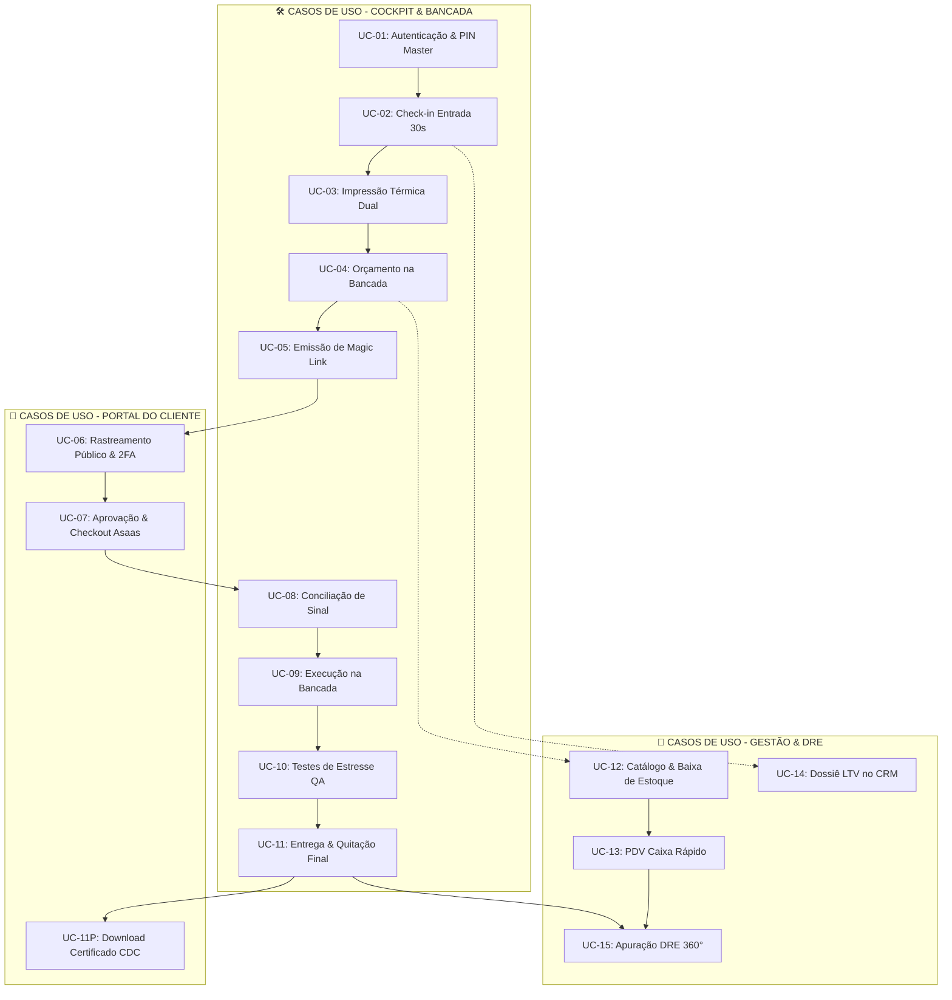

# 📋 MATRIZ COMPLETA DE CASOS DE USO & ESPECIFICAÇÕES DE TESTE (UCM)
**Sistema:** IF Tech Unified Platform (Cockpit ERP/CRM • Portal do Cliente • Motores de Receita)
**Autor:** Engenharia de Qualidade & QA Arquitetural IF Tech
**Versão:** 6.0 • **Data:** 29/08/2026

---

## 🎯 MAPEAMENTO DE CASOS DE USO (UC-01 A UC-15)

---

### [UC-01] Autenticação e Desbloqueio do Cockpit Admin
* **Ator:** Técnico / Gestor
* **Pré-condição:** Acessar `https://iflcosta.tech/app` com tela bloqueada.
* **Fluxo Principal:**
  1. O usuário digita o PIN Master `982601` e pressiona Enter.
  2. O sistema valida o hash/PIN, armazena `if_tech_auth_session` no `sessionStorage`, desbloqueia o Cockpit e renderiza o Kanban de OSs e os KPIs de DRE.
* **Critério de Aceite:** O dashboard abre instantaneamente e mantém a sessão ativa ao navegar entre abas ou dar F5.

---

### [UC-02] Check-in Rápido de Entrada (30s)
* **Ator:** Atendente / Técnico de Balcão
* **Pré-condição:** Cockpit desbloqueado na aba Bancada (`Alt+1`).
* **Fluxo Principal:**
  1. Usuário clica em `+ CHECK-IN ENTRADA (30S)` ou aperta `Alt+N`.
  2. Preenche: Nome do Cliente, WhatsApp, Canal de Atendimento (Balcão ou Leva-e-Traz), Marca/Modelo, Defeito Relatado e Senha/PIN do aparelho.
  3. Clica em `Salvar OS`.
* **Pós-condição:** O sistema cria a OS sequencial (ex: #1051), gera o `public_tracking_token`, insere o card na coluna `01. Triagem` e cadastra o cliente no CRM.

---

### [UC-03] Impressão Térmica Dual (Adesivo de Bancada + Recibo CDC 90D)
* **Ator:** Técnico
* **Pré-condição:** OS criada no sistema.
* **Fluxo Principal:**
  1. Usuário abre a OS e clica em `🏷️ Etiqueta de Bancada`: Gera layout térmico 58mm com OS, aparelho, PIN, defeito e QR Code técnico para colar na carcaça.
  2. Usuário clica em `🧾 Recibo do Cliente`: Gera comprovante térmico não fiscal com dados do equipamento, acessórios deixados, termo de custódia e garantia legal CDC 90 Dias.
* **Critério de Aceite:** Ambos os layouts formatados em largura padrão de 58mm/80mm prontos para envio à impressora térmica.

---

### [UC-04] Elaboração de Orçamento na Bancada & Trava Financeira
* **Ator:** Técnico Especialista
* **Pré-condição:** OS na coluna `01. Triagem`.
* **Fluxo Principal:**
  1. Usuário clica em `Definir Orçamento` na OS.
  2. Adiciona itens de hardware com `Preço de Custo` e `Preço de Venda`.
  3. Informa o valor da `Mão de Obra`.
  4. A barra de rodapé fixa (Sticky Footer) calcula em tempo real o Lucro Bruto da Mão de Obra e o Valor Total.
  5. Clica em `✓ Salvar Orçamento & Emitir Proposta`.
* **Pós-condição:** Status da OS muda para `Orcamento_Aguardando_Aprovacao`. Se houver peças, ativa a trava de sinal (`parts_deposit_status = PENDING`).

---

### [UC-05] Emissão de Magic Link & Envio de Proposta pelo WhatsApp
* **Ator:** Técnico / Atendimento
* **Pré-condição:** Orçamento salvo na OS.
* **Fluxo Principal:**
  1. Usuário clica no botão `Link Pix p/ WhatsApp`.
  2. O sistema formata a mensagem com o Magic Link único `https://iflcosta.tech/status?token=...` e copia para a área de transferência com toast de confirmação.
* **Critério de Aceite:** Ao colar no WhatsApp, a mensagem contém o resumo do laudo e o link direto sem exigir senha complexa do cliente.

---

### [UC-06] Rastreamento Público da OS & Sigilo de Custo
* **Ator:** Cliente Final
* **Pré-condição:** Cliente acessa `https://iflcosta.tech/status` com o token ou busca por número da OS + WhatsApp.
* **Fluxo Principal:**
  1. O Portal carrega a OS via Supabase RPC ou fallback local resiliente.
  2. Renderiza o Stepper na etapa `02. Orçamento`.
  3. Exibe a discriminação de peças e mão de obra com total transparência.
* **Regra de Segurança Inviolável:** O preço de custo das peças **JAMAIS** é exibido ou transmitido ao cliente.

---

### [UC-07] Aprovação de Orçamento pelo Cliente & Checkout Asaas Pix/Cartão
* **Ator:** Cliente Final
* **Pré-condição:** OS com status de orçamento e peças a comprar.
* **Fluxo Principal:**
  1. Cliente clica em `APROVAR ORÇAMENTO & SOLICITAR PEÇAS`.
  2. O sistema abre o Modal de Checkout Asaas com o valor exato do sinal de 100% das peças.
  3. Gera QR Code Pix dinâmico, código Copia-e-Cola e campos de Cartão de Crédito até 12x.
  4. No ambiente de testes, o cliente clica em `⚡ Simular Pagamento Aprovado`.
* **Pós-condição:** Status de sinal é atualizado para `CONFIRMED`, `parts_deposit_paid = true` e o Portal exibe o badge de sinal quitado.

---

### [UC-08] Sincronização Cross-Tab em Tempo Real (Cockpit ⟷ Portal)
* **Atores:** Técnico e Cliente
* **Pré-condição:** Cockpit e Portal abertos em abas simultâneas.
* **Fluxo Principal:**
  1. O técnico confirma o sinal ou avança a OS para `Na Bancada` no Cockpit.
  2. O listener `window.addEventListener('storage')` no Portal detecta o evento instantaneamente.
  3. A aba do cliente atualiza o Stepper para `03. Em Execução na Bancada` em tempo real sem F5.

---

### [UC-09] Execução na Bancada & Laudo de Fotos
* **Ator:** Técnico
* **Pré-condição:** OS na coluna `03. Na Bancada`.
* **Fluxo Principal:**
  1. Técnico realiza o reparo físico/montagem do equipamento.
  2. Atualiza fotos de bancada e anotações do laudo de engenharia.
* **Pós-condição:** Dados sincronizados e visíveis no Portal do Cliente.

---

### [UC-10] Testes de Estresse QA & Telemetria Térmica AIDA64
* **Ator:** Técnico de QA
* **Pré-condição:** Montagem/reparo concluído.
* **Fluxo Principal:**
  1. Técnico avança a OS para `04. Testes QA`.
  2. Executa teste de estresse térmico contínuo de 15 minutos (FurMark / AIDA64).
  3. Informa temperatura máxima estável (ex: 64°C, delta de -18°C).
* **Pós-condição:** Telemetria validada e habilitada para o laudo final de garantia CDC.

---

### [UC-11] Conclusão, Entrega ao Cliente & Certificado CDC 90D em PDF
* **Atores:** Técnico e Cliente
* **Pré-condição:** OS aprovada nos testes de QA.
* **Fluxo Principal:**
  1. Técnico avança para `05. Pronto p/ Retirada` e clica em `Entregar ao Cliente / Quitar`.
  2. No Portal do Cliente, o cliente clica em `Imprimir Certificado de Garantia (PDF)`.
  3. O sistema gera o laudo técnico oficial com HASH SHA-256 e termos legais do CDC Art. 26.
* **Pós-condição:** OS marcada como quitada e faturamento enviado ao DRE.

---

### [UC-12] Catálogo de Estoque & Baixa Dupla (Bancada vs Balcão)
* **Ator:** Gestor / Almoxarife
* **Pré-condição:** Aba `3. Estoque & PDV` (`Alt+3`).
* **Fluxo Principal:**
  1. Cadastro de produto com Custo, Preço de Venda, Estoque Atual e Mínimo.
  2. Ao utilizar a peça em uma OS ou vender no balcão, o sistema executa baixa atômica no estoque.
* **Pós-condição:** Saldo atualizado e alertas de reposição no Kanban de Compras.

---

### [UC-13] PDV Caixa Rápido com Leitor USB & Cupom Não Fiscal
* **Ator:** Operador de Caixa / Vendedor
* **Pré-condição:** Cliente no balcão adquirindo produtos avulsos.
* **Fluxo Principal:**
  1. Bipagem de produtos via leitor USB de código de barras ou atalhos de categoria (`F2`).
  2. Seleção de forma de pagamento com cálculo automático de troco em verde neon.
  3. Fechamento da venda (`F8`) e emissão imediata do Cupom Térmico Não Fiscal (ESC/POS).
* **Pós-condição:** Registro da receita no DRE e baixa de saldo no estoque.

---

### [UC-14] Dossiê LTV do Cliente no CRM 360°
* **Ator:** Gestor Comercial
* **Pré-condição:** Aba `4. Clientes & CRM` (`Alt+4`).
* **Fluxo Principal:**
  1. Listagem de clientes com filtro B2C (Pessoa Física) e B2B (Empresas).
  2. Clique em `👁️ Ver Dossiê` do cliente: exibe o Lifetime Value (LTV), total de equipamentos atendidos e histórico completo de OSs.

---

### [UC-15] DRE 360°, CMV de Peças & Apuração do Lucro Real
* **Ator:** Gestor Financeiro / Diretor
* **Pré-condição:** Aba `7. DRE 360°` (`Alt+7`).
* **Fluxo Principal:**
  1. Consolidação automática das 4 fontes de receita (Hardware OS, Software, MSP B2B e PDV Balcão).
  2. Subtração do CMV (Custo das Peças Vendidas) e apuração do Lucro Líquido Real.
  3. Simulador dinâmico de viabilidade de ponto comercial (R$ 1.300/mês).
