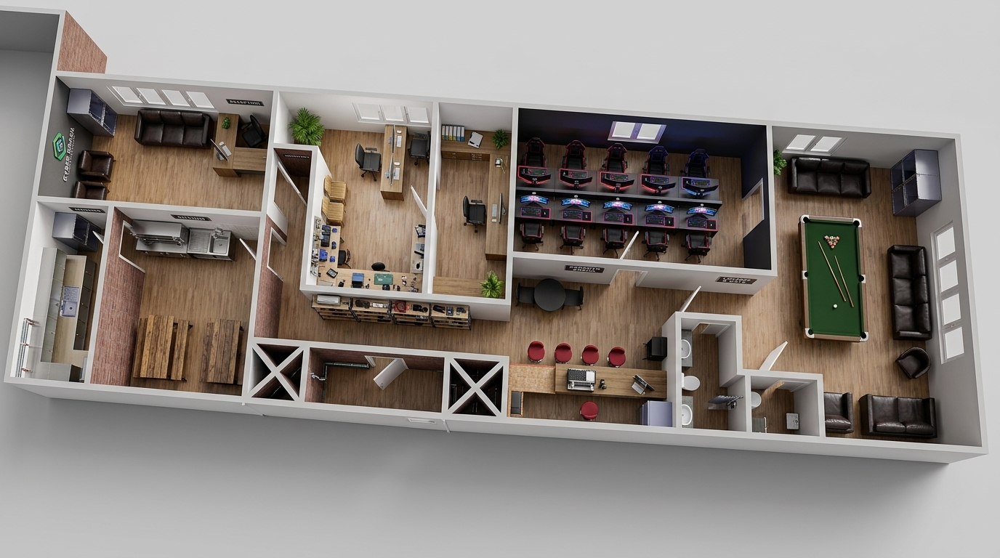
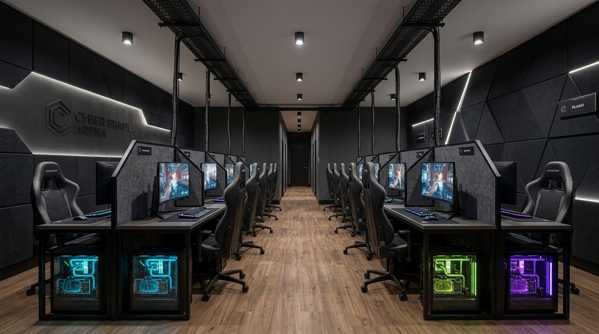
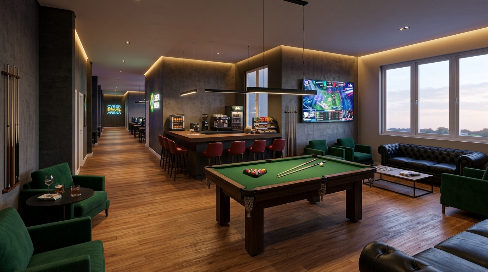
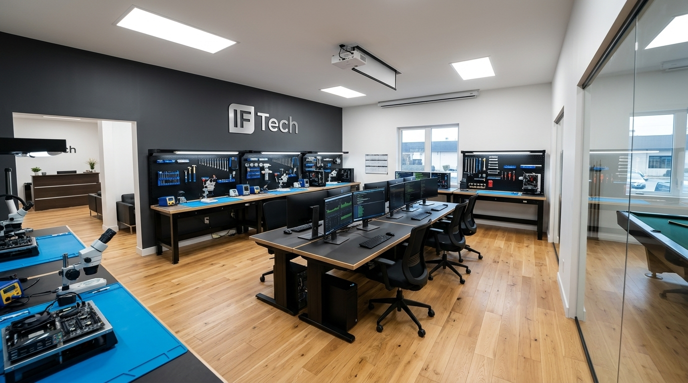

# Blueprint Executivo: Cyber Brasil Arena + Lounge & IF Tech HQ
**Empreendimento:** Cyber Brasil Arena + Lounge  
**Divisão Tecnológica & B2B:** IF Tech (Laboratório Avançado & NOC MSP)  
**Localização:** Centro de Bragança Paulista / SP  
**Dimensões da Sede:** 29.5 m de comprimento × 6.0 m a 7.63 m de largura (~190 m² a 210 m²)  
**Status do Projeto:** Planejamento Executivo de Expansão (Fase 3 do Masterplan)  
**Versão:** 1.0 (Canônica Oficial)  

---

## 1. Galeria Visual do Projeto Arquitetônico 3D

### 1.1. Planta Isométrica Aérea Master (Corte Arquitetônico 3D Completo)

*Visão aérea em corte fotorrealista da Cyber Brasil Arena (29.5m): Recepção executiva, cozinha/refeitório, IF Tech Lab & NOC, sala de reuniões/diretoria, Arena Gamer 5v5, Lounge com Sinuca, Bar/Cafeteria e Sanitários.*

---

### 1.2. Setor A: Arena Competitiva eSports 5v5 (Torneios & Bootcamps)

*Layout de palco competitivo frente-a-frente (5v5) com divisórias acústicas, PCs com watercooling RGB, monitores 240Hz, isolamento acústico e cabeamento estruturado Cat6A/Fibra dedicado.*

---

### 1.3. Setor B: Mega Lounge de Convivência, Sinuca Oficial & Café/Bar

*Espaço de descompressão e faturamento recorrente: Sinuca de alta precisão (pano verde), sofás Chesterfield e poltronas verdes esmeralda, TV 85" para transmissão de finais de campeonatos e balcão de snacks/cafeteria com banquetas.*

---

### 1.4. Setor C: Laboratório Técnico IF Tech & Centro de Operações MSP (NOC)

*Infraestrutura técnica de ponta da IF Tech integrada à Arena: Mantas antiestáticas (ESD), microscópios de microsolda, estações digitais de retrabalho BGA/SMD, organizadores 5S e bancada de monitoramento contínuo de clientes corporativos MSP.*

---

## 2. Resumo Executivo & Tese de Negócio

### 2.1. O Problema de Mercado na Região Bragantina
* **Escassez de Espaços Gamer de Alta Performance:** Jovens, entusiastas e competidores de Bragança Paulista e cidades vizinhas (Atibaia, Itatiba, Extrema) não possuem uma infraestrutura profissional de eSports com ping ultrabaixo, hardware de ponta e ambiente imersivo.
* **Falta de Ambientes Híbridos de Tecnologia & Socialização:** Ou existem cafeterias tradicionais ou lan houses antigas e degradadas. Não há um ponto de encontro "terceiro lugar" (*Third Place*) que combine lazer, gastronomia rápida, torneios e tecnologia corporativa.
* **Vitrine e Autoridade para Serviços de TI:** Pequenas e médias empresas locais contratam TI às cegas. Ao ver uma megaestrutura física com laboratório visível e servidores monitorados, a percepção de valor dos contratos de MSP e desenvolvimento de software da **IF Tech** dispara.

### 2.2. A Solução: Cyber Brasil Arena + Lounge
Um ecossistema híbrido de alta rentabilidade que opera com **5 motores de receita complementares**, retroalimentados pela autoridade e expertise de engenharia da **IF Tech**.

---

## 3. Zoneamento Arquitetônico e Fluxos do Imóvel (29.5 m × 6.0 m)

De acordo com as plantas 2D cotadas e 3D do projeto, o imóvel é organizado em um fluxo linear inteligente que separa o movimento público/lounge da área restrita/técnica:

| Setor | Metragem / Posição | Finalidade Principal | Equipamentos & Mobiliário |
| :--- | :--- | :--- | :--- |
| **Recepção / Diretoria** | Topo Esquerdo (14.42 m²) | Atendimento executivo, reuniões VIP e fechamento de contratos de alto valor | Mesa executiva em L, sofá preto, armários de arquivo |
| **Cozinha Industrial & Copa** | Fundo Inferior Esquerdo | Preparo de snacks, lanches rápidos, cafés especiais, sucos e drinks sem álcool | Bancada de aço inox com pia dupla, cooktop, refrigeradores e despensa |
| **Refeitório / Dining Hall** | 6.01 m de comprimento | Área de alimentação para staff, jogadores de bootcamps e clientes em refeição | 2 mesas comunais de madeira maciça estilo rústico com bancos |
| **IF Tech Lab & NOC** | Centro Superior (Sala 1) | Manutenção de hardware, montagem de PCs, microsolda e monitoramento MSP | 4 bancadas técnicas com ESD, microscópios, 2 ilhas centrais de dev/NOC |
| **Sala de Gestão / Reuniões** | Centro Superior (Sala 2) | Gestão estratégica, reuniões de patrocinadores e sala de streaming | Mesa ampla em U, poltrona de diretoria ergonômica, tela de conferência |
| **Arena Gamer 5v5** | Centro Superior (Sala 3) | 10 estações competitivas de eSports para locação por hora, treinos e campeonatos | 10 PCs Watercooled, 240Hz, cadeiras gamer, divisórias acústicas, mesa tática |
| **Balcão Central Café/PDV** | Corredor Central (Nicho) | Check-in de entrada, liberação de horas, venda de snacks, bebidas e hardware de balcão | Balcão de madeira nobre, banquetas vermelhas, PDV IF Tech, geladeira expositora |
| **Mega Lounge & Sinuca** | Extrema Direita (Salão Nobre) | Descompressão, socialização, transmissão de jogos e convivência | Sinuca oficial verde, sofás Chesterfield, poltronas verdes, TV 85" 4K |
| **Instalações Sanitárias** | Corredor Central (1.57m e 1.89m) | Sanitários higienizados com acessibilidade para o público e colaboradores | Banheiros completos com cubas modernas e espelhos com LED |

---

## 4. O Plano de Transição de Carreira & Acúmulo de Capital em 3 Fases

```
┌─────────────────────────────────────────────────────────────────────────────┐
│ FASE 1: ACÚMULO DE CAPITAL & VALIDAÇÃO ENGENHARIA (MOMENTO ATUAL)           │
│ - Trabalho estável CLT como base de segurança                               │
│ - IF Tech operando sob modelo Leva-e-Traz + Lab Domiciliar                  │
│ - Foco em atingir a Reserva Estratégica de R$ 15.000                        │
│ - Alocação dos primeiros contratos B2B de Suporte MSP (Recorrência/MRR)     │
└──────────────────────────────────────┬──────────────────────────────────────┘
                                       ▼
┌─────────────────────────────────────────────────────────────────────────────┐
│ FASE 2: LAB FÍSICO IF TECH NO CENTRO (BRAGANÇA PAULISTA)                    │
│ - Aporte dos R$ 15.000 para a primeira sede comercial no centro             │
│ - Espaço de 21 m² (Bancada em U, Cockpit Dev, Microsolda e Staging QA)      │
│ - Consolidação de carteira de R$ 10k a R$ 25k/mês em contratos B2B/MSP      │
│ - Estruturação dos processos operacionais, POPs e fornecedores de hardware  │
└──────────────────────────────────────┬──────────────────────────────────────┘
                                       ▼
┌─────────────────────────────────────────────────────────────────────────────┐
│ FASE 3: CYBER BRASIL ARENA + LOUNGE & IF TECH HQ (EXPANSÃO DEFINITIVA)      │
│ - Ponto comercial amplo (~190 m² a 210 m², 29.5 m de extensão)              │
│ - Financiado pelo fluxo de caixa acumulado da IF Tech + Aportes Estratégicos│
│ - Modelo de Gestão Delegada: Gerente Geral de Operações + Atendentes de PDV │
│ - Fundador focado como Diretor de Tecnologia (CTO/Estrategista do Grupo)    │
└─────────────────────────────────────────────────────────────────────────────┘
```

---

## 5. Modelagem de Receita da Cyber Brasil Arena (5 Motores Integrados)

### Motor 1: Locação de Estações Gamer (Horas / Passes / Bootcamps)
* **Horas Avulsas:** R$ 15,00 a R$ 25,00 / hora (períodos de pico e finais de semana).
* **Passes Noturnos ("Corujão"):** R$ 70,00 a R$ 90,00 (das 22h às 06h com direito a 1 café/energético).
* **Bootcamps Fechados (Equipes de eSports):** Locação da Arena 5v5 com exclusividade (R$ 350,00 a R$ 600,00 o bloco de 4 horas para treinos de equipes amadoras e semiprofissionais).

### Motor 2: Lounge, Sinuca & Gastronomia Rápida (Alimentos & Bebidas)
* **Mesa de Sinuca Oficial:** R$ 25,00 / hora ou R$ 5,00 / ficha (alta margem de contribuição).
* **Cafeteria & Snacks:** Cafés especiais, energéticos, refrigerantes, salgados gourmet, sanduíches artesanais e combos gamers (Margem de lucro de 60% a 75%).

### Motor 3: Torneios, Eventos & Transmissões (Watch Parties)
* **Inscrições de Campeonatos:** Torneios quinzenais de CS2, Valorant, League of Legends, FC24 e Street Fighter com premiações e taxas de inscrição.
* **Watch Parties de Finais Mundiais:** Cobrança de entrada/consumação mínima para assistir finais mundiais (Worlds, Major de CS, CBLOL) no telão do Lounge.
* **Eventos Corporativos de TI / Hackathons:** Locação do espaço para dinâmicas de empresas e campeonatos internos de times de tecnologia locais.

### Motor 4: Vitrine de Hardware & Custom Builds (Bancada IF Tech)
* Os 10 computadores da arena servem como **vitrine viva** para a venda de setups prontos montados pela IF Tech.
* Clientes testam a máquina jogando na Arena e podem encomendar um setup idêntico ou comprar peças de reposição (SSDs, memórias, mouses, teclados, pastas térmicas) diretamente no PDV da recepção.

### Motor 5: Centro de Operações MSP & Serviços Corporativos (IF Tech)
* As salas técnicas dedicadas garantem que a empresa mantenha a operação de manutenção de hardware, suporte B2B e contratos de TI corporativos rodando silenciosamente e com máxima rentabilidade em paralelo ao movimento do lounge.

---

## 6. Governança Operacional & Blindagem de Tempo do Fundador

Para que a Cyber Brasil Arena não se torne uma "prisão operacional" para o fundador, o modelo de negócios adota a **Diretriz de Gestão Delegada**:

1. **Equipe de Frente (Front-of-House):**
   * **1 Gerente Geral de Operações:** Responsável pelo caixa diário, abertura/fechamento, compras de insumos da lanchonete, gestão da equipe de atendentes e escala de horários.
   * **2 a 3 Atendentes de Balcão/Caixa:** Turnos alternados para recepção de clientes, controle do sistema de horas, preparo de cafés/lanches e higienização das estações.
2. **Papel Estratégico do Fundador (Diretoria & Engenharia):**
   * Manter o controle da **Arquitetura de Sistemas, Automação do ERP, Infraestrutura de Redes e Governança Financeira**;
   * Focar no crescimento dos contratos corporativos B2B da IF Tech (que geram previsibilidade e alta margem sem dependência de presença no balcão);
   * Definir campanhas estratégicas, parcerias com fornecedores de hardware e torneios de grande porte.

---

## 7. Diretriz de Integração com a IF Tech
Este documento passa a ser a **referência canônica oficial** da visão de expansão da Cyber Brasil Arena. Qualquer decisão sobre arquitetura de software, automação de PDV, infraestrutura de rede, plano de contas do DRE ou estratégias de marketing no repositório `c:\tech-solutions-ifl` deve respeitar e alimentar essa trajetória de crescimento!
