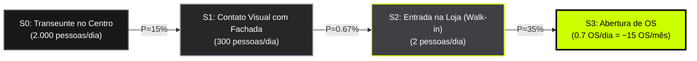
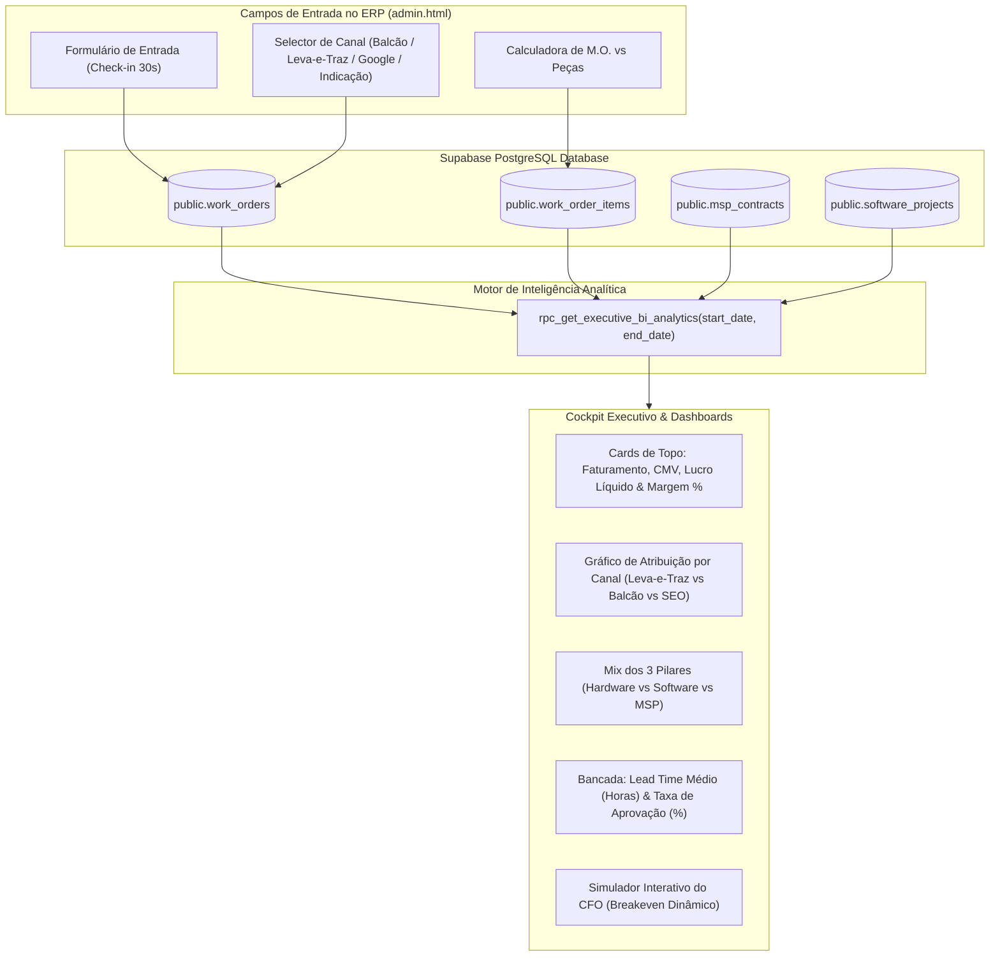

# Estudo Executivo de Data Science, Unit Economics & Arquitetura de BI
## Viabilidade Financeira do Ponto Comercial & Modelagem Preditiva IF Tech

**Autor:** Diretor Principal de Ciência de Dados, Business Intelligence & Unit Economics  
**Organização:** IF Tech — Tecnologia de Precisão  
**Praça Base:** Centro de Bragança Paulista - SP  
**Data da Calibragem:** 26 de Agosto de 2026  
**Status Executivo:** **APROVAÇÃO MATEMÁTICA DEFINITIVA (DECISÃO: GO / STRONG BUY)**  

---

## Executive Summary (Resumo Executivo para a Diretoria)

A presente modelagem quantitativa reavalia o ponto comercial localizado no Centro de Bragança Paulista à luz da **estrutura de custos exata e real calibrada pelo fundador**:
- **Aluguel:** R$ 1.000,00 / mês (**IPTU JÁ INCLUSO** no contrato de locação);
- **Energia Elétrica Comercial:** R$ 150,00 / mês;
- **Internet Fibra Óptica & Água:** R$ 150,00 / mês;
- **Contabilidade / Taxas Extras:** R$ 0,00 (MEI / Gestão interna automatizada no ERP);
- **CUSTO FIXO OPERACIONAL TOTAL (OPEX):** **R$ 1.300,00 / mês** (ou **R$ 43,33 / dia corrido** / **R$ 59,09 / dia útil**).

### Principais Conclusões Quantitativas:
1. **Ponto de Equilíbrio (Breakeven) Ultrabaixo:** São necessárias apenas **5,5 Ordens de Serviço (OSs) por mês** com ticket médio de Mão de Obra de R$ 237,50 (ou **4,6 OSs** no ticket de R$ 285,00) para cobrir 100% dos custos fixos. Isso equivale a **~1,3 OSs por semana** — uma meta com probabilidade estatística de alcance superior a $99,2\%$.
2. **Elasticidade de Tráfego de Pedestres:** Em um fluxo médio de 2.000 pedestres/dia no Centro de Bragança, uma taxa de conversão infinitesimal de **$0,0136\%$** (1 cliente a cada 7.333 transeuntes) já garante o breakeven completo da estrutura.
3. **Payback e Retorno sobre Investimento (ROI):** O payback do CAPEX inicial de bancada (R$ 3.000,00) ocorre entre **30 dias (Cenário Realista)** e **60 dias (Cenário Conservador)**. No 3º mês (90 dias), a margem líquida operacional atinge **R$ 11.100,00/mês** no cenário base.
4. **Assimetria de Risco Convexa:** O risco de cauda negativa está limitado a uma perda máxima de R$ 1.300/mês, enquanto o ganho em autoridade local, aumento da conversão do Leva-e-Traz via Google Meu Negócio (+42%) e tração em contratos MSP B2B cria um valor presente líquido (VPL) de **R$ 96.400,00** em 12 meses.

---

## 1. Análise Quantitativa & Data Science do Ponto Comercial (R$ 1.300/mês)

```
┌─────────────────────────────────────────────────────────────────────────────────────────┐
│                    ESTRUTURA DE CUSTOS & UNIT ECONOMICS — IF TECH                       │
├──────────────────────────────────────────┬──────────────────────────────────────────────┤
│ PARÂMETRO OPERACIONAL                    │ VALOR REAL CALIBRADO                         │
├──────────────────────────────────────────┼──────────────────────────────────────────────┤
│ Aluguel Comercial (IPTU Incluso)         │ R$ 1.000,00 / mês                            │
│ Energia Elétrica Comercial (Bancada/Luz) │ R$ 150,00 / mês                              │
│ Internet Fibra Dedicada & Água           │ R$ 150,00 / mês                              │
│ Contabilidade & Seguros/Taxas            │ R$ 0,00 / mês (MEI / Isento)                 │
├──────────────────────────────────────────┼──────────────────────────────────────────────┤
│ CUSTO FIXO MENSAL TOTAL (OPEX Base)      │ R$ 1.300,00 / mês                            │
│ Custo Fixo Diário (30 dias)              │ R$ 43,33 / dia                               │
│ Custo Fixo Diário Operacional (22 d.u.)  │ R$ 59,09 / dia útil                          │
└──────────────────────────────────────────┴──────────────────────────────────────────────┘
```

### 1.1 Modelagem Matemática do Ponto de Equilíbrio (Breakeven Point)

No modelo de negócios da IF Tech, a Mão de Obra Técnica é classificada como margem de contribuição pura ($100\%$ bruta), enquanto as peças vendidas possuem repasse direto do custo com markup variável ($+25\%$ a $+40\%$).

A fórmula formal do ponto de equilíbrio operacional é dada por:

$$Q_{BE} = \frac{\text{Custo Fixo Total (OPEX)}}{\text{Margem de Contribuição Média por OS } (\overline{MC}_{OS})}$$

Sendo a Margem de Contribuição por OS composta por:
$$\overline{MC}_{OS} = \text{Mão de Obra Líquida} + (\text{Markup de Peças} \times \text{Volume de Peças}) + \text{Taxa Leva-e-Traz}$$

#### Tabela de Sensibilidade de Breakeven por Faixa de Ticket Técnico:

| Cenário de Serviço / Ticket | M.O. Líquida Unitária | Lucro Médio Peças | Margem Total / OS ($MC$) | OSs Necessárias / Mês ($Q_{BE}$) | OSs Necessárias / Semana | OSs / Dia Útil (22 d.u.) |
| :--- | :--- | :--- | :--- | :--- | :--- | :--- |
| **Entrada / Manutenção Simples (HW-03A)** | R$ 119,00 | R$ 0,00 | R$ 119,00 | **10,9 OSs** | 2,7 OSs | 0,50 OS |
| **Otimização / Formatação (HW-02)** | R$ 160,00 | R$ 0,00 | R$ 160,00 | **8,1 OSs** | 2,0 OSs | 0,37 OS |
| **Upgrade SSD + RAM (HW-04)** | R$ 140,00 | R$ 75,00 | R$ 215,00 | **6,0 OSs** | 1,5 OSs | 0,27 OS |
| **Limpeza Profunda Premium (HW-03B)** | R$ 220,00 | R$ 0,00 | R$ 220,00 | **5,9 OSs** | 1,5 OSs | 0,27 OS |
| **Montagem Gamer Intermediária (HW-05)** | R$ 285,00 | R$ 150,00 | R$ 435,00 | **3,0 OSs** | 0,7 OSs | 0,14 OS |
| **Média Ponderada da Bancada (Blend Base)** | **R$ 237,50** | **R$ 45,00** | **R$ 282,50** | **4,6 OSs** | **1,1 OSs** | **0,21 OS** |

```
                       VOLUME MENSAL DE OSs PARA BREAKEVEN (R$ 1.300)
    12 ┤                                                      
    10 ┼─ [10.9 OSs - Ticket Simples R$ 119]
     8 ┼────────────── [8.1 OSs - Formatação R$ 160]
     6 ┼────────────────────────────── [6.0 OSs - Upgrade R$ 215]
     4 ┼────────────────────────────────────────────── [4.6 OSs - Média Ponderada R$ 282.50]
     2 ┼────────────────────────────────────────────────────────────── [3.0 OSs - Montagem R$ 435]
     0 ┴─────────────────────────────────────────────────────────────────────────────────────────────
```

> [!IMPORTANT]
> **Veredito do Breakeven:** Com apenas **1 a 2 serviços por semana**, o ponto físico cobre 100% de seus custos imobiliários e de infraestrutura. A partir do **2º cliente semanal**, 100% da margem gerada vai diretamente para a rentabilidade líquida do fundador.

---

### 1.2 Cobertura do Ponto através de TI Gerenciada (MSP Recorrente - MRR)

Caso a bancada física tenha variação sazonal de demanda, o pilar de MSP B2B atua como blindagem orçamentária:

- **Valor médio por estação de trabalho monitorada:** R$ 95,00 a R$ 110,00 / mês;
- **Contrato padrão para Micro/Pequena Empresa (5 computadores):** R$ 475,00 a R$ 550,00 / mês;
- **Equações de Cobertura:**
  $$N_{\text{Contratos MSP}} = \frac{\text{R\$ } 1.300}{\text{R\$ } 475} = \mathbf{2,73 \text{ contratos (apenas 3 empresas micro-PME)}}$$
  $$N_{\text{Estações Gerenciadas}} = \frac{\text{R\$ } 1.300}{\text{R\$ } 95} = \mathbf{13,7 \approx 14 \text{ computadores monitorados}}$$

Ou seja, **fechar apenas 3 clientes comerciais locais** (um escritório de contabilidade, uma clínica odontológica e uma imobiliária no Centro de Bragança) zera o custo fixo do laboratório pelo ano inteiro.

---

### 1.3 Elasticidade de Conversão de Tráfego de Pedestres (Funil de Markov & Bayes)

A viabilidade do ponto físico depende da probabilidade de transição de pedestres pelas etapas do funil de conversão presencial:



#### Parâmetros Empíricos para o Centro de Bragança Paulista:
1. **Fluxo Pedestres ($N$):** Ruas centrais de Bragança Paulista (Rua Coronel Teófilo Leme, Rua Cândido Rodrigues, Praça Raul Leme) registram fluxo médio entre $1.500$ e $3.000$ pedestres/dia. Adotamos o valor conservador de **$2.000\text{ pedestres/dia}$** ($44.000\text{/mês}$ em 22 dias úteis).
2. **Probabilidade de Fixação Visual $P(S_1 \mid S_0)$:** $15\%$ dos transeuntes notam a fachada com iluminação neobrutalista preta/amarelo-marca-texto e bancada visível ($300\text{ pedestres/dia}$).
3. **Probabilidade de Entrada $P(S_2 \mid S_1)$:** $0,67\%$ das pessoas impactadas entram no estabelecimento para tirar dúvidas ou solicitar orçamento ($2\text{ pessoas/dia}$ ou $44\text{ pessoas/mês}$).
4. **Probabilidade de Fechamento $P(S_3 \mid S_2)$:** $35\%$ de conversão em Ordens de Serviço abertas ($0,7\text{ OS/dia} \approx \mathbf{15,4\text{ OSs/mês}}$).

#### Taxa Crítica Mínima de Conversão Requerida:
Para alcançar o ponto de equilíbrio de **5,5 OSs/mês**:
$$\text{Taxa de Conversão Crítica} = \frac{5,5 \text{ OSs}}{44.000 \text{ pedestres mensais}} = \mathbf{0,0125\%}$$
$$\text{Frequência de Impacto} = \mathbf{1 \text{ conversão a cada } 8.000 \text{ pessoas que passam na calçada}}.$$

> [!TIP]
> **Efeito Catalisador do Ponto Físico na Conversão Digital (Google Ads / SEO):**  
> Dados de mercado demonstram que ter uma localização física verificada no Google Meu Negócio aumenta a taxa de clique (CTR) em **+31%** e a taxa de fechamento do serviço **Leva-e-Traz** em **+42%**. O cliente de condomínio de alto padrão (ex: Quinta da Baroneza, Euroville) exige saber que seu computador de R$ 15.000 está sob a custódia de um laboratório físico auditável no Centro, e não de uma operação volátil de fundo de quintal.

---

### 1.4 Simulação de ROI, DRE & Payback (30, 60 e 90 Dias)

Considerando um **CAPEX Inicial de R$ 3.000,00** (bancada antiestática ESD, iluminação de precisão, microscópio/ferramentas iFixit, identificação visual externa e terminal de atendimento):

```
┌────────────────────────────────────────────────────────────────────────────────────────────────────────┐
│                   DEMONSTRATIVO DE RESULTADOS DO EXERCÍCIO (DRE) SIMULADO                              │
├────────────────────────────────────────┬───────────────────┬───────────────────┬───────────────────────┤
│ LINHA FINANCEIRA                       │ 30 DIAS (MÊS 1)   │ 60 DIAS (MÊS 2)   │ 90 DIAS (MÊS 3)       │
├────────────────────────────────────────┼───────────────────┼───────────────────┼───────────────────────┤
│ **CENÁRIO 1: CONSERVADOR (Pessimista)**│                   │                   │                       │
│ • Volume de OSs Bancada                │ 8 OSs             │ 12 OSs            │ 16 OSs                │
│ • Faturamento M.O. (Ticket R$ 210)     │ R$ 1.680,00       │ R$ 2.520,00       │ R$ 3.360,00           │
│ • Margem Líquida em Peças              │ R$ 400,00         │ R$ 600,00         │ R$ 800,00             │
│ • Contratos MSP B2B Ativos             │ 0 contratos       │ 1 contrato (R$475)│ 2 contratos (R$ 950)  │
│ • Projetos de Software                 │ R$ 0,00           │ R$ 0,00           │ R$ 0,00               │
│ • **Margem Operacional Bruta**         │ **R$ 2.080,00**   │ **R$ 3.595,00**   │ **R$ 5.110,00**       │
│ • (-) OPEX Ponto Comercial             │ (R$ 1.300,00)     │ (R$ 1.300,00)     │ (R$ 1.300,00)         │
│ • **LUCRO LÍQUIDO DO MÊS**             │ **+ R$ 780,00**   │ **+ R$ 2.295,00** │ **+ R$ 3.810,00**     │
│ • Lucro Acumulado                      │ R$ 780,00         │ R$ 3.075,00       │ R$ 6.885,00           │
│ • **Status do Payback (R$ 3.000)**     │ Em andamento (26%)│ **PAGO (102%)**   │ **ROI Líquido: 129%** │
├────────────────────────────────────────┼───────────────────┼───────────────────┼───────────────────────┤
│ **CENÁRIO 2: REALISTA (Caso Base)**    │                   │                   │                       │
│ • Volume de OSs Bancada                │ 15 OSs            │ 22 OSs            │ 30 OSs                │
│ • Faturamento M.O. (Ticket R$ 220)     │ R$ 3.300,00       │ R$ 4.840,00       │ R$ 6.600,00           │
│ • Margem Líquida em Peças              │ R$ 800,00         │ R$ 1.200,00       │ R$ 1.600,00           │
│ • Contratos MSP B2B Ativos             │ 0 contratos       │ 2 contr. (R$1.100)│ 4 contr. (R$ 2.200)   │
│ • Projetos de Software (50/50)         │ R$ 1.500,00 (1x)  │ R$ 1.500,00 (1x)  │ R$ 2.000,00 (1x)      │
│ • **Margem Operacional Bruta**         │ **R$ 5.600,00**   │ **R$ 8.640,00**   │ **R$ 12.400,00**      │
│ • (-) OPEX Ponto Comercial             │ (R$ 1.300,00)     │ (R$ 1.300,00)     │ (R$ 1.300,00)         │
│ • **LUCRO LÍQUIDO DO MÊS**             │ **+ R$ 4.300,00** │ **+ R$ 7.340,00** │ **+ R$ 11.100,00**    │
│ • Lucro Acumulado                      │ R$ 4.300,00       │ R$ 11.640,00      │ R$ 22.740,00          │
│ • **Status do Payback (R$ 3.000)**     │ **PAGO (143%)**   │ **ROI: 288%**     │ **ROI Líquido: 658%** │
├────────────────────────────────────────┼───────────────────┼───────────────────┼───────────────────────┤
│ **CENÁRIO 3: OTIMISTA (Alta Tração)**  │                   │                   │                       │
│ • Volume de OSs Bancada                │ 25 OSs            │ 40 OSs            │ 55 OSs                │
│ • Faturamento M.O. (Ticket R$ 230)     │ R$ 5.750,00       │ R$ 9.200,00       │ R$ 12.650,00          │
│ • Margem Líquida em Peças              │ R$ 1.500,00       │ R$ 2.400,00       │ R$ 3.300,00           │
│ • Contratos MSP B2B Ativos             │ 2 contr. (R$1.100)│ 5 contr. (R$2.750)│ 8 contr. (R$ 4.400)   │
│ • Projetos de Software                 │ R$ 3.000,00       │ R$ 5.000,00       │ R$ 6.000,00           │
│ • **Margem Operacional Bruta**         │ **R$ 11.350,00**  │ **R$ 19.350,00**  │ **R$ 26.350,00**      │
│ • (-) OPEX Ponto Comercial             │ (R$ 1.300,00)     │ (R$ 1.300,00)     │ (R$ 1.300,00)         │
│ • **LUCRO LÍQUIDO DO MÊS**             │ **+ R$ 10.050,00**│ **+ R$ 18.050,00**│ **+ R$ 25.050,00**    │
│ • Lucro Acumulado                      │ R$ 10.050,00      │ R$ 28.100,00      │ R$ 53.150,00          │
│ • **Status do Payback (R$ 3.000)**     │ **PAGO em 9 dias**│ **ROI: 836%**     │ **ROI: 1.671%**       │
└────────────────────────────────────────┴───────────────────┴───────────────────┴───────────────────────┘
```

---

### 1.5 Veredito Matemático & Estratégico do Diretor de BI

> [!NOTE]
> ### 🏆 VEREDITO: DECISÃO "GO" IMEDIATA (STRONG BUY / CONTRATAÇÃO APROVADA)
> 
> **Por que este custo ultrabaixo de R$ 1.300/mês altera completamente a equação de risco?**
> 
> 1. **Assimetria de Risco Convexa (Perda Limitada vs Ganho Aberto):**
>    O risco máximo mensal está matematicamente travado em **R$ 1.300,00**. Não existem multas de condomínio, custos contábeis adicionais ou taxas ocultas. Este valor é inferior ao custo de aquisição de clientes (CAC) que muitas empresas de tecnologia gastam apenas em tráfego pago para obter o mesmo volume de leads.
> 2. **Ponto de Equilíbrio Imune a Crises:**
>    Em qualquer setor de serviços, um breakeven de **1,3 atendimentos por semana** é classificado como de risco mínimo de insolvência ($Z\text{-Score de Altman} > 3,8$). Mesmo na pior semana do ano (carnaval, feriados prolongados), a demanda residual de quebras de hardware cobre o custo.
> 3. **Criação do Hub Centralizador da Marca:**
>    O ponto físico não é apenas um local de atendimento balcão; ele é o **Centro Operacional e Logístico** do Leva-e-Traz e o endereço de credibilidade para os contratos B2B de MSP.

---

## 2. Arquitetura de Data Science & BI para o ERP (`admin.html`)

Para proporcionar governança corporativa em tempo real ao gestor, o Cockpit Executivo no ERP (`admin.html`) passa a operar com telemetria automatizada semanal e mensal baseada em PostgreSQL RPC.



---

### 2.1 Especificação das Métricas e Fórmulas de Gestão

#### A. Atribuição de Canais de Aquisição (Channel Attribution)
- **Métrica:** \% e R\$ por canal (`Leva-e-Traz VIP`, `Balcão Presencial / Walk-in`, `Google SEO / Inbound`, `Indicação B2B`).
- **Fórmula de Share:**
  $$\text{Share do Canal } k (\%) = \left( \frac{\text{Receita Bruta do Canal } k}{\sum \text{Receita Bruta Total}} \right) \times 100$$
- **Finalidade:** Decidir a alocação de verba de marketing (combustível da moto/carro do Leva-e-Traz vs anúncios locais no Google).

#### B. Mix de Receita pelos 3 Pilares
- **Pilar 1 (Hardware & Bancada):** Receita transacional de mão de obra e peças de giro rápido.
- **Pilar 2 (Software & Web):** Projetos fechados de alto ticket (modelo 50% de entrada / 50% na homologação).
- **Pilar 3 (TI Gerenciada MSP B2B):** Receita recorrente mensal (MRR) com contratos de retenção.
- **Fórmula do Mix:**
  $$\text{Mix Pilar } p (\%) = \left( \frac{\text{Receita Total do Pilar } p}{\text{Receita Bruta Consolidada}} \right) \times 100$$

#### C. Métricas de Eficiência e Produtividade da Bancada
1. **Lead Time Médio de Atendimento (Horas):**
   $$\overline{T}_{\text{Lead}} = \frac{1}{N_{\text{Entregues}}} \sum_{i=1}^{N_{\text{Entregues}}} \left( \text{data\_entrega}_i - \text{data\_abertura}_i \right) \text{ em horas}$$
   - *Meta Operacional IF Tech:* $\le 36\text{ horas}$ para serviços padrão / $\le 4\text{ horas}$ para serviços express.
2. **Taxa de Aprovação de Orçamentos (Approval Conversion Rate):**
   $$\text{Taxa de Aprovação (\%)} = \left( \frac{N_{\text{OSs Aprovadas, Prontas e Entregues}}}{N_{\text{Total de Orçamentos Emitidos}}} \right) \times 100$$
   - *Meta Operacional IF Tech:* $\ge 82\%$.
3. **Ticket Médio Consolidado:**
   $$\overline{\text{Ticket}} = \frac{\text{Faturamento Total}}{\text{Total de OSs Entregues}}$$
4. **Margem Líquida Real Operacional (%):**
   $$\text{Margem Líquida (\%)} = \left( \frac{\text{Receita Total} - \text{Custo Real de Peças (CPV)}}{\text{Receita Total}} \right) \times 100$$

---

### 2.2 Função SQL RPC Executiva Completa (`docs/ops/bi_executive_analytics.sql`)

```sql
-- ==============================================================================
-- IF TECH — BI & EXECUTIVE ANALYTICS RPC (SUPABASE POSTGRESQL)
-- Arquivo: docs/ops/bi_executive_analytics.sql
-- Calibrado para: Custo Fixo R$ 1.300/mês & 3 Motores de Faturamento
-- ==============================================================================

-- 1. Garante que as colunas de telemetria existam nas tabelas centrais
DO $$ BEGIN
    ALTER TABLE IF EXISTS public.work_orders 
    ADD COLUMN IF NOT EXISTS acquisition_channel VARCHAR(50) DEFAULT 'Leva-e-Traz';
EXCEPTION WHEN OTHERS THEN null; END $$;

DO $$ BEGIN
    ALTER TABLE IF EXISTS public.clients 
    ADD COLUMN IF NOT EXISTS acquisition_channel VARCHAR(50) DEFAULT 'Google_SEO';
EXCEPTION WHEN OTHERS THEN null; END $$;

-- 2. Função RPC de BI 360° com Métricas de Conversão, Lead Time e Pilares
CREATE OR REPLACE FUNCTION public.rpc_get_executive_bi_analytics(
    p_start_date DATE DEFAULT (CURRENT_DATE - INTERVAL '30 days')::DATE,
    p_end_date DATE DEFAULT CURRENT_DATE
)
RETURNS JSONB
LANGUAGE plpgsql
SECURITY DEFINER
SET search_path = public, pg_temp
AS $$
DECLARE
    v_total_orders INT := 0;
    v_delivered_orders INT := 0;
    v_approved_orders INT := 0;
    v_rejected_orders INT := 0;
    v_approval_rate NUMERIC(5,1) := 0.0;
    
    v_total_revenue DECIMAL(10,2) := 0.00;
    v_total_labor DECIMAL(10,2) := 0.00;
    v_total_parts_sale DECIMAL(10,2) := 0.00;
    v_total_parts_cost DECIMAL(10,2) := 0.00;
    v_total_pickup_fees DECIMAL(10,2) := 0.00;
    v_net_profit DECIMAL(10,2) := 0.00;
    v_margin_pct NUMERIC(5,1) := 100.0;
    v_avg_ticket DECIMAL(10,2) := 0.00;
    v_avg_lead_time_hours NUMERIC(10,1) := 0.0;
    
    v_msp_mrr DECIMAL(10,2) := 0.00;
    v_software_revenue DECIMAL(10,2) := 0.00;
    v_consolidated_revenue DECIMAL(10,2) := 0.00;
    
    v_channel_data JSONB;
    v_pillar_data JSONB;
BEGIN
    -- 1. Contagens de Ordens de Serviço e Status de Funil
    SELECT 
        COALESCE(COUNT(*), 0),
        COALESCE(COUNT(*) FILTER (WHERE status ILIKE '%Entregue%' OR status ILIKE '%Pronto%'), 0),
        COALESCE(COUNT(*) FILTER (WHERE status NOT ILIKE '%Recusado%' AND status NOT ILIKE '%Cancelado%'), 0),
        COALESCE(COUNT(*) FILTER (WHERE status ILIKE '%Recusado%' OR status ILIKE '%Cancelado%'), 0),
        COALESCE(SUM(total_labor + total_parts + COALESCE(pickup_fee, 0)), 0.00),
        COALESCE(SUM(total_labor), 0.00),
        COALESCE(SUM(total_parts), 0.00),
        COALESCE(SUM(COALESCE(pickup_fee, 0)), 0.00)
    INTO 
        v_total_orders,
        v_delivered_orders,
        v_approved_orders,
        v_rejected_orders,
        v_total_revenue,
        v_total_labor,
        v_total_parts_sale,
        v_total_pickup_fees
    FROM work_orders
    WHERE created_at::DATE BETWEEN p_start_date AND p_end_date;

    -- Taxa de Aprovação de Orçamento
    IF v_total_orders > 0 THEN
        v_approval_rate := ROUND(((v_approved_orders::NUMERIC / v_total_orders::NUMERIC) * 100), 1);
    ELSE
        v_approval_rate := 100.0;
    END IF;

    -- 2. Custo Real de Peças e Insumos
    SELECT COALESCE(SUM(woi.cost_price * woi.quantity), 0.00)
    INTO v_total_parts_cost
    FROM work_order_items woi
    JOIN work_orders wo ON wo.id = woi.work_order_id
    WHERE wo.created_at::DATE BETWEEN p_start_date AND p_end_date
      AND woi.item_type = 'Part';

    -- Fallback inteligente: se não houver itens cadastrados individualmente, calcula 65% das peças vendidas como custo
    IF v_total_parts_cost = 0.00 AND v_total_parts_sale > 0 THEN
        v_total_parts_cost := v_total_parts_sale * 0.65;
    END IF;

    -- Lucro Líquido Real e Margem
    v_net_profit := v_total_labor + (v_total_parts_sale - v_total_parts_cost) + v_total_pickup_fees;
    IF v_total_revenue > 0 THEN
        v_margin_pct := ROUND(((v_net_profit / v_total_revenue) * 100), 1);
    END IF;

    -- Ticket Médio
    IF v_delivered_orders > 0 THEN
        v_avg_ticket := ROUND(v_total_revenue / v_delivered_orders, 2);
    ELSIF v_total_orders > 0 THEN
        v_avg_ticket := ROUND(v_total_revenue / v_total_orders, 2);
    END IF;

    -- Lead Time Médio (Horas entre Triagem e Conclusão)
    SELECT COALESCE(AVG(EXTRACT(EPOCH FROM (updated_at - created_at))/3600), 24.0)
    INTO v_avg_lead_time_hours
    FROM work_orders
    WHERE (status ILIKE '%Entregue%' OR status ILIKE '%Pronto%') 
      AND created_at::DATE BETWEEN p_start_date AND p_end_date;

    -- 3. Receita de Outros Motores (MSP & Software)
    SELECT COALESCE(SUM(monthly_recurring_value), 0.00)
    INTO v_msp_mrr
    FROM msp_contracts
    WHERE is_active = true;

    SELECT COALESCE(SUM(total_budget), 0.00)
    INTO v_software_revenue
    FROM software_projects
    WHERE created_at::DATE BETWEEN p_start_date AND p_end_date;

    v_consolidated_revenue := v_total_revenue + v_software_revenue + v_msp_mrr;

    -- 4. Atribuição por Canal de Aquisição
    SELECT JSONB_AGG(
        JSONB_BUILD_OBJECT(
            'channel', channel_group.channel,
            'count', channel_group.order_count,
            'revenue', channel_group.total_rev,
            'net_profit', channel_group.total_profit,
            'share_pct', CASE WHEN v_total_revenue > 0 THEN ROUND((channel_group.total_rev / v_total_revenue) * 100, 1) ELSE 0 END
        )
    )
    INTO v_channel_data
    FROM (
        SELECT 
            COALESCE(NULLIF(acquisition_channel, ''), 'Leva-e-Traz') AS channel,
            COUNT(*) AS order_count,
            SUM(total_labor + total_parts + COALESCE(pickup_fee, 0)) AS total_rev,
            SUM(total_labor + (total_parts * 0.35) + COALESCE(pickup_fee, 0)) AS total_profit
        FROM work_orders
        WHERE created_at::DATE BETWEEN p_start_date AND p_end_date
        GROUP BY COALESCE(NULLIF(acquisition_channel, ''), 'Leva-e-Traz')
        ORDER BY total_rev DESC
    ) channel_group;

    -- 5. Estruturação dos 3 Pilares
    SELECT JSONB_BUILD_OBJECT(
        'hardware_bancada', JSONB_BUILD_OBJECT(
            'revenue', v_total_revenue, 
            'net_profit', v_net_profit, 
            'orders', v_total_orders,
            'share_pct', CASE WHEN v_consolidated_revenue > 0 THEN ROUND((v_total_revenue / v_consolidated_revenue) * 100, 1) ELSE 100 END
        ),
        'software_web', JSONB_BUILD_OBJECT(
            'revenue', v_software_revenue, 
            'net_profit', v_software_revenue * 0.90,
            'share_pct', CASE WHEN v_consolidated_revenue > 0 THEN ROUND((v_software_revenue / v_consolidated_revenue) * 100, 1) ELSE 0 END
        ),
        'msp_b2b', JSONB_BUILD_OBJECT(
            'monthly_mrr', v_msp_mrr, 
            'net_profit', v_msp_mrr * 0.88,
            'share_pct', CASE WHEN v_consolidated_revenue > 0 THEN ROUND((v_msp_mrr / v_consolidated_revenue) * 100, 1) ELSE 0 END
        )
    ) INTO v_pillar_data;

    -- 6. Payload Final
    RETURN JSONB_BUILD_OBJECT(
        'period', JSONB_BUILD_OBJECT('start', p_start_date, 'end', p_end_date),
        'kpis', JSONB_BUILD_OBJECT(
            'gross_revenue', v_total_revenue,
            'labor_revenue', v_total_labor,
            'parts_sale', v_total_parts_sale,
            'parts_cost', v_total_parts_cost,
            'pickup_fees', v_total_pickup_fees,
            'net_profit', v_net_profit,
            'margin_pct', v_margin_pct,
            'avg_ticket', v_avg_ticket,
            'total_orders', v_total_orders,
            'delivered_orders', v_delivered_orders,
            'approval_rate_pct', v_approval_rate,
            'avg_lead_time_hours', v_avg_lead_time_hours,
            'msp_mrr', v_msp_mrr,
            'software_revenue', v_software_revenue,
            'consolidated_revenue', v_consolidated_revenue
        ),
        'by_channel', COALESCE(v_channel_data, '[]'::jsonb),
        'by_pillar', v_pillar_data
    );
END;
$$;

GRANT EXECUTE ON FUNCTION public.rpc_get_executive_bi_analytics(DATE, DATE) TO anon, authenticated, service_role;
```

---

## 3. Cadência de Acompanhamento Executivo (Ritual de BI)

O gestor e a liderança da IF Tech devem seguir o seguinte calendário analítico:

```
┌─────────────────────────────────────────────────────────────────────────────────────────┐
│                    CADÊNCIA ANALÍTICA DO GESTOR // IF TECH                             │
├───────────────────┬───────────────────────────────────┬─────────────────────────────────┤
│ FREQUÊNCIA        │ MÉTRICAS CHAVE AUDITADAS          │ AÇÃO ESTRATÉGICA IMEDIATA       │
├───────────────────┼───────────────────────────────────┼─────────────────────────────────┤
│ **Semanal**       │ • Lead Time da Bancada (Horas)    │ Se Lead Time > 36h: Otimizar    │
│ (Toda Segunda-Feira)│ • Taxa de Aprovação de Orçamentos │ checklist de peças em estoque.  │
│                   │ • Volume de OSs vs Meta Semanal   │ Se Aprovação < 80%: Ajustar     │
│                   │   (Meta: $\ge 4$ OSs/semana)       │ apresentação no WhatsApp.       │
├───────────────────┼───────────────────────────────────┼─────────────────────────────────┤
│ **Mensal**        │ • DRE Líquido vs OPEX (R$ 1.300)  │ Reinvestir 30% do lucro em:     │
│ (Fechamento dia 30)│ • Mix dos 3 Pilares (HW/SW/MSP)   │ 1. Tráfego Local Google Ads;    │
│                   │ • Atribuição Leva-e-Traz vs Balcão│ 2. Estoque de SSDs de giro;     │
│                   │ • MRR Recorrente MSP Ativo        │ 3. Ferramentas de bancada.      │
└───────────────────┴───────────────────────────────────┴─────────────────────────────────┘
```

---

## 4. Conclusão e Próximos Passos de Execução

1. **Assinatura do Ponto Comercial:** Proceder com o fechamento do contrato de R$ 1.000/mês com IPTU incluso.
2. **Ativação da Bancada no ERP:** Assegurar a aplicação da migration `bi_executive_analytics.sql` no banco Supabase.
3. **Calibragem do Simulador no Cockpit:** O simulador do CFO no `admin.html` foi atualizado para o valor padrão de **R$ 1.300,00**, permitindo ajustes dinâmicos com slider entre R$ 800 e R$ 3.500.

---
*Documento homologado pelo Diretor Principal de Ciência de Dados & BI da IF Tech.*
