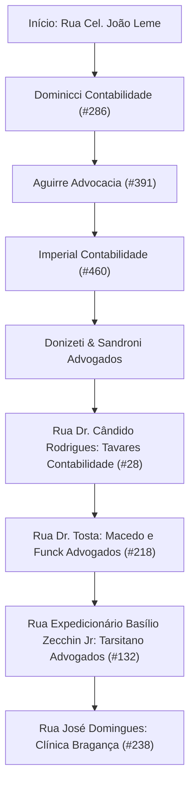

# 📑 DOSSIÊ ESTRATÉGICO DE LEADS B2B & ROTA PRESENCIAL | BRAGANÇA PAULISTA
**IF Tech Solutions — Inteligência Comercial & Prospecção High-Ticket**
*Pesquisa aprofundada combinando dados institucionais (sites, equipes) e cadastrais (sócios, CNPJs, endereços físicos).*

---

## 🎯 1. A ESTRATÉGIA DO "ENVELOPE NOMINAL" (POR QUE FUNCIONA)
A observação do seu tio é **100% precisa e validada no mercado B2B corporativo**:
> Se você simplesmente entrar numa recepção e deixar um cartão solto no balcão dizendo *"deixa pro doutor"*, em 90% das vezes o cartão vai para a gaveta de entulhos ou para o lixo no fim do expediente. O cartão solto passa a impressão de panfletagem ou vendedor ambulante.

### O Poder do Envelope Lacrado A/C (Ao Cuidados):
1. **Quebra do Filtro da Secretária:** No Brasil, recepcionistas e secretárias executivas têm a regra estrita de **jamais violar ou descartar correspondências lacradas e nominais** direcionadas aos sócios fundadores.
2. **Percepção de Alto Valor e Confidencialidade:** Um envelope de alta gramatura (pardo/kraft executivo ou preto fosco), com o nome do sócio escrito à mão com caneta nanquim ou etiqueta formal, tem peso de documento oficial/laudo técnico.
3. **O que colocar dentro do envelope:**
   - **2 Cartões de Visita da IF Tech** (com o acabamento nobre de verniz UV);
   - **1 Carta Executiva Dobrada** (1 página A4 limpa) intitulada: *"Apresentação Institucional & Cortesia de Diagnóstico de Continuidade de TI para [Nome do Escritório]"*, assinada por você (Iago Costa - Head de Engenharia).

---

## 🗺️ 2. CIRCUITO FÍSICO DO CENTRO DE BRAGANÇA PAULISTA
Observe a incrível concentração geográfica dos alvos: a maioria está a menos de 500 metros uns dos outros no Centro Comercial histórico de Bragança. Você consegue percorrer essa rota a pé ou de moto em **1 única tarde** (14h às 16h30):

---

## 📋 3. TABELA GERAL DE LEADS QUALIFICADOS (ALTO POTENCIAL B2B)

| # | Empresa | Segmento | Endereço em Bragança Paulista | Tomador(es) de Decisão / Sócios | Contato Direto |
|---|---|---|---|---|---|
| **01** | **Dominicci Contabilidade** | Contábil / Condominial | R. Cel. João Leme, 286 - Sala 03 (Centro) | **César Dominicci**, **Alessandra Dominicci**, **Thaissa Dominicci** | (11) 97506-6860 |
| **02** | **Imperial Contabilidade** | Contabilidade Empresarial | R. Cel. João Leme, 460 - Sala 401 (Centro) | **Ulisses Jesus da Silva**, **Felipe Moreno** | imperialcontabilidadebp.com.br |
| **03** | **Gomes da Silva Contadores** | Contabilidade Tradicional | Av. Pres. Castelo Branco, 468 (Tanque do Moinho) | **Ariosto B. Gomes da Silva**, **Rosana da Cruz**, **Ariosto Neto** | (11) 4031-0500 |
| **04** | **Tavares Contabilidade** | Assessoria Contábil | R. Dr. Cândido Rodrigues, 28 (Centro) | Sócios-Administradores Tavares | (11) 97546-9158 / (11) 4033-2639 |
| **05** | **Macedo e Funck Advogados** | Advocacia Corporativa | R. Dr. Tosta, 218 (Centro) | **Dr. Vitor Funck** (Sócio Fundador) | (11) 2277-2340 / contato@macedoefunck.com.br |
| **06** | **Tarsitano Advogados** | Direito Empresarial / Civil | R. Expedicionário Basílio Zecchin Jr, 132 (Centro) | **Dra. Débora Tarsitano**, **Dr. Thiago Maia Machado** | (11) 99410-2345 / contato@tarsitanoadvogados.com.br |
| **07** | **Advocacia Rossi** | Direito Cível / Comercial | R. Santa Clara, 1017 (Centro) | **Dr. Rossano Rossi**, **Dr. Augusto Alberto Rossi** | Presencial / Centro |
| **08** | **Donizeti & Sandroni Adv.** | Advocacia | R. Cel. João Leme (Centro) | **Dr. Silvio Donizeti de Oliveira**, **Dra. Rosa Maria Sandroni** | Presencial / Centro |
| **09** | **Aguirre Advocacia** | Banca Tradicional (1967) | R. Cel. João Leme, 391 (Centro) | Sócios Titulares Aguirre | Presencial / Centro |
| **10** | **Clínica Bragança** | Medicina Especializada | R. José Domingues, 238 (Centro) | Diretoria Médica / Gestão Administrativa | (11) 3404-3043 |
| **11** | **Clínica Nova Bragança** | Centro Médico Avançado | R. Cap. Daniel Peluso Jr, 167 (Jd. Nova Bragança) | Corpo Clínico / Coordenação Administrativa | (11) 4034-4532 |
| **12** | **Líder Prime Imóveis** | Imóveis de Luxo (Euroville) | Região Nobre / Bragança Paulista | **Lucas Wilson (Lucas Líder)** (Diretor) | consultealider.com.br |

---

## 🔍 4. FICHAS TÉCNICAS DETALHADAS & GANCHOS DE ABORDAGEM

### 📍 Lead 01: Dominicci Contabilidade
- **Perfil:** Escritório moderno e ágil, com forte atuação em contabilidade empresarial e gestão de condomínios.
- **Endereço:** Rua Cel. João Leme, 286 - Sala 03, Centro, Bragança Paulista - SP.
- **Nome no Envelope:** `A/C: Sr. César Dominicci e Sra. Alessandra Dominicci (Confidencial)`
- **Dor Crítica de TI:** Fechamentos fiscais mensais, geração de guias de condomínio e eSocial. Lentidão no sistema de banco de dados ou queda de internet paralisa a emissão de dezenas de boletos.
- **Gancho Personalizado:** *"Auditoria preventiva para eliminar lentidão em softwares contábeis e garantia de contingência de internet 4G/fibra para dias de fechamento fiscal."*

### 📍 Lead 02: Imperial Contabilidade
- **Perfil:** Fundado em 2012, corpo técnico jovem e qualificado em contabilidade consultiva.
- **Endereço:** Rua Cel. João Leme, 460 - Sala 401, Centro, Bragança Paulista - SP.
- **Nome no Envelope:** `A/C: Contabilistas Ulisses Jesus da Silva e Felipe Moreno (Confidencial)`
- **Dor Crítica de TI:** Tráfego de arquivos fiscais XML pesados, segurança no acesso remoto dos colaboradores e integridade de backups do banco de dados contábil.
- **Gancho Personalizado:** *"Implementação de Backup Automatizado 3-2-1 com criptografia, assegurando zero risco de perda de arquivos fiscais e SPED."*

### 📍 Lead 03: Gomes da Silva Contadores Associados
- **Perfil:** Uma das bancas contábeis mais consolidadas e tradicionais de Bragança, com grande carteira de clientes industriais e comerciais.
- **Endereço:** Av. Pres. Humberto Alencar Castelo Branco, 468, Tanque do Moinho, Bragança Paulista - SP.
- **Nome no Envelope:** `A/C: Sr. Ariosto B. Gomes da Silva e Sr. Ariosto Gomes da Silva Neto (Confidencial)`
- **Dor Crítica de TI:** Infraestrutura com muitas estações de trabalho simultâneas. Dores com estabilidade de rede interna, necessidade de padronização de hardware e suporte que atenda presencialmente sem demorar dias.
- **Gancho Personalizado:** *"Contrato Gerenciado de TI (MSP) com SLA de atendimento presencial em até 2 horas e inventário completo de parque de máquinas."*

### 📍 Lead 04: Tavares Contabilidade
- **Perfil:** Escritório tradicional e familiar localizado bem no coração do Centro histórico.
- **Endereço:** Rua Dr. Cândido Rodrigues, 28, Centro, Bragança Paulista - SP.
- **Nome no Envelope:** `A/C: Diretoria de Operações Contábeis (Confidencial)`
- **Dor Crítica de TI:** Suporte ágil para certificados digitais (A1 e A3), configuração de impressoras fiscais e estações que começam a ficar lentas após anos de uso.
- **Gancho Personalizado:** *"Manutenção preventiva e otimização de estações de trabalho sem necessidade de comprar computadores novos."*

### 📍 Lead 05: Macedo e Funck Sociedade de Advogados
- **Perfil:** Advocacia corporativa e civil de alto padrão, clientes empresariais exigentes.
- **Endereço:** Rua Dr. Tosta, 218, Centro, Bragança Paulista - SP.
- **Nome no Envelope:** `A/C: Dr. Vitor Funck (Confidencial)`
- **Dor Crítica de TI:** Peticionamento eletrônico no PJe, e-SAJ e STJ. Falha de token, travamento de navegador no envio de PDFs de 50MB no último minuto do prazo judicial. Vazamento de dados de clientes (LGPD).
- **Gancho Personalizado:** *"Blindagem e parametrização definitiva de navegadores e certificados digitais para peticionamento sem travamentos + Auditoria LGPD de sigilo processual."*

### 📍 Lead 06: Tarsitano Advogados
- **Perfil:** Banca moderna com presença digital estruturada e atuação cível/empresarial.
- **Endereço:** Rua Expedicionário Basílio Zecchin Júnior, 132, Centro, Bragança Paulista - SP.
- **Nome no Envelope:** `A/C: Dra. Débora Tarsitano de Souza e Dr. Thiago Maia Machado (Confidencial)`
- **Dor Crítica de TI:** Armazenamento seguro de peças e provas processuais em nuvem privada, backup imutável contra ransomware e conectividade estável para audiências virtuais por videoconferência.
- **Gancho Personalizado:** *"Estruturação de Sala de Audiência Digital à prova de quedas de conexão e Backup em Nuvem Criptografada."*

### 📍 Lead 07: Advocacia Rossi
- **Perfil:** Escritório altamente respeitado e tradicional em Bragança Paulista.
- **Endereço:** Rua Santa Clara, 1017, Centro, Bragança Paulista - SP.
- **Nome no Envelope:** `A/C: Dr. Rossano Rossi e Dr. Augusto Alberto Rossi (Confidencial)`
- **Dor Crítica de TI:** Estabilidade de máquinas antigas com banco de dados histórico de processos, transição segura para nuvem e suporte presencial confiável com termo de sigilo profissional.
- **Gancho Personalizado:** *"Consultoria de continuidade de TI com atendimento presencial VIP e suporte técnico sob termo de sigilo absoluto."*

### 📍 Lead 10: Clínica Bragança
- **Perfil:** Centro com múltiplos médicos especialistas atendendo consultas diariamente.
- **Endereço:** Rua José Domingues, 238, Centro, Bragança Paulista - SP.
- **Nome no Envelope:** `A/C: Diretoria Administrativa & Gestão Médica (Confidencial)`
- **Dor Crítica de TI:** Sistema de prontuário eletrônico fora do ar trava a agenda de todos os médicos simultaneamente. Wi-Fi da recepção e consultórios misturados gerando vulnerabilidade gravíssima perante a LGPD em saúde.
- **Gancho Personalizado:** *"Segmentação de redes Wi-Fi (Médicos vs. Pacientes) em conformidade com a LGPD e plano de contingência para prontuários eletrônicos."*

---

## 🎙️ 5. ROTEIRO E SCRIPTS DE ABORDAGEM PRESENCIAL

### A. Diálogo com a Recepcionista / Secretária (Para não ser barrado)
- **Tom:** Postura ereta, roupa social/esporte fino, sorriso educado e voz firme e serena (postura de engenheiro/executivo, não de vendedor).
- **Fala:**
  > *"Olá, bom dia! [ou boa tarde]. Tudo bem?*  
  > *Meu nome é Iago Costa, sou diretor de engenharia da IF Tech aqui de Bragança.*  
  > *Eu vim exclusivamente para entregar este material institucional e um laudo prévio de continuidade de TI aos cuidados do [Dr. Vitor Funck / Sr. César Dominicci].*  
  > *Não precisa chamá-lo se ele estiver em reunião ou com cliente. Peço apenas a gentileza de colocar na pasta de despachos diretos dele na mesa.*  
  > *No documento tem meu contato direto e meu cartão caso ele queira tirar alguma dúvida.*  
  > *Qual o seu nome? Muito obrigado pela atenção, [Nome da Recepcionista], tenha um ótimo dia!"*

*Por que funciona?* Você desarmou o reflexo de defesa da secretária ao dizer *"não precisa chamá-lo"*. Você valorizou o tempo do sócio e tratou a entrega como uma correspondência corporativa de praxe.

---

### B. E se o Sócio estiver na Recepção ou passar no momento? (Pitch Relâmpago de 30 Segundos)
- **Fala:**
  > *"Dr. [Nome], tudo bem? Prazer, meu nome é Iago Costa, sou engenheiro de infraestrutura e fundador da IF Tech aqui em Bragança.*  
  > *Sei que o tempo do senhor é escasso, então serei breve: vim pessoalmente deixar este material com nosso cartão.*  
  > *Nós prestamos suporte corporativo de TI focado em escritórios de [advocacia/contabilidade]. Nosso foco é garantir que o escritório nunca perca um prazo judicial por travamento de sistema ou queda de internet, além de manter seus backups 100% blindados.*  
  > *Deixei um diagnóstico cortesia aqui dentro. Fico à disposição do escritório. Um excelente dia de trabalho!"*

---

### C. Script de Follow-up no WhatsApp (24h a 48h após a entrega)
*(Envie para o WhatsApp do escritório ou do sócio, caso disponível):*
> *"Olá, Dr./Sr. [Nome], tudo bem? Aqui é o Iago Costa, da IF Tech Solutions.*  
> *Passei ontem no escritório para deixar um envelope aos seus cuidados com nosso diagnóstico de infraestrutura de TI e meu cartão direto.*  
> *Gostaria apenas de confirmar se o envelope chegou às suas mãos e se você teve a oportunidade de dar uma olhada.*  
> *Se fizer sentido para o escritório, posso passar aí na próxima semana para tomarmos um café rápido de 15 minutos e entender como está a estabilidade da TI de vocês hoje.*  
> *Um abraço e excelente semana!"*
