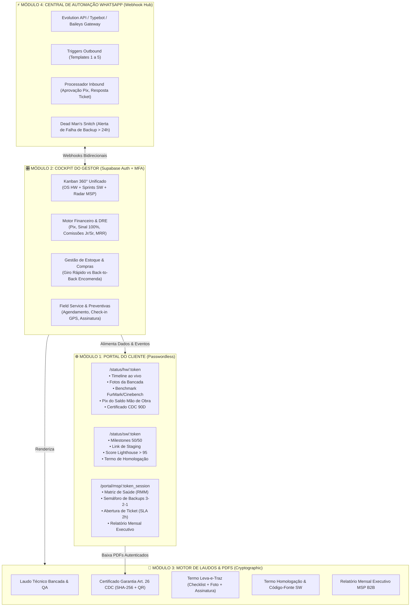
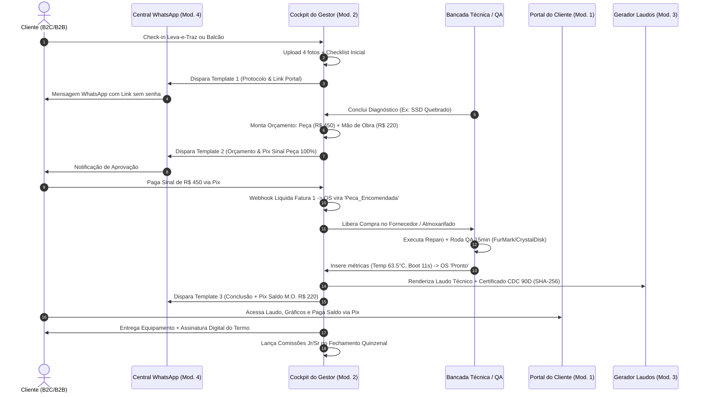
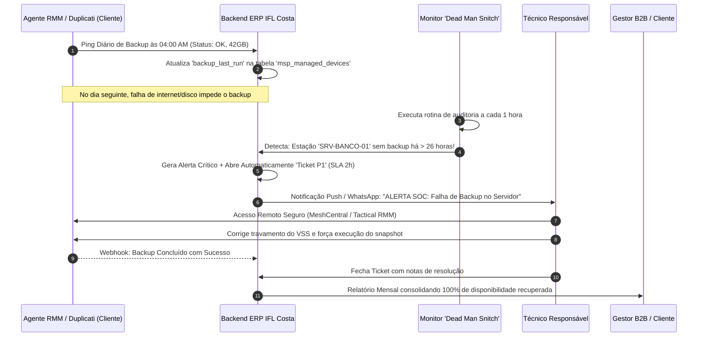

# Parecer Técnico de Arquitetura & Validação do ERP — IFL Costa Tech

**Documento:** Auditoria de Arquitetura de Software, Modelagem de Dados & Validação de Módulos  
**Autor:** Arquiteto de Software & Especialista em ERP/CRM Híbrido  
**Empresa:** IFL Costa Tech (Bragança Paulista & Remoto)  
**Data da Auditoria:** 22 de Agosto de 2026  
**Status:** Revisão Rigorosa Concluída — Recomendações Críticas Emitidas  

---

## 1. Sumário Executivo & Diagnóstico Geral

A arquitetura proposta para o ERP da **IFL Costa Tech** apresenta uma concepção moderna e alinhada ao modelo de negócio híbrido da empresa, integrando com inteligência os três pilares operacionais:
1. **Hardware & Bancada Especializada** (Receita Transacional / Caixa Rápido);
2. **Software & Engenharia Web** (Alto Ticket / Milestones 50-50);
3. **TI Gerenciada / MSP** (Receita Recorrente Previsível / MRR por Estação).

A separação nos **4 Módulos Principais** (Portal do Cliente, Cockpit do Gestor, Gerador de Laudos/PDFs e Central de Automação de WhatsApp via Webhook) é plenamente viável e recomendada. Contudo, nossa auditoria técnica identificou **lacunas estruturais no schema relacional** e **gargalos operacionais nos fluxos de controle** que precisavam de expansão antes do início do desenvolvimento frontend/backend.

Abaixo apresentamos a validação rigorosa dos 4 módulos, a análise dos 5 eixos críticos solicitados e o DDL complementar com as tabelas e campos essenciais faltantes.

---

## 2. Validação Arquitetural dos 4 Módulos Planejados



### 2.1. Parecer por Módulo

| Módulo | Diagnóstico de Arquitetura | Veredito | Pontos Críticos & Ajustes Obrigatórios |
| :--- | :--- | :--- | :--- |
| **Módulo 1: Portal do Cliente** | Excelente abordagem orientada a transparência e eliminação de ansiedade. | **Aprovado com Ressalvas** | 1. Implementar rotas dinâmicas segmentadas (`/hw`, `/sw`, `/msp`).<br>2. Garantir expiração segura e rotação de `token_hash`.<br>3. Incluir botão de aceite digital (OTP WhatsApp) para termos legais e orçamentos. |
| **Módulo 2: Cockpit Administrativo** | Centro nevrálgico do negócio; precisa de visão consolidada e detalhamento analítico. | **Aprovado com Expansões** | 1. Faltava módulo formal de Estoque/Almoxarifado e Compras.<br>2. Faltava tabela de Fechamento de Comissões Quinzenais dos Técnicos.<br>3. Faltava tabela de Service Desk / Tickets para MSP. |
| **Módulo 3: Gerador de Laudos e PDFs** | Fundamental para autoridade técnica e blindagem jurídica. | **Aprovado** | 1. Incluir hash SHA-256 imutável de cada laudo gerado.<br>2. Integrar QR Code público para verificação de autenticidade sem login.<br>3. Suportar 5 modelos padronizados (Bancada, Garantia, Leva-e-Traz, Software, MSP). |
| **Módulo 4: Central de WhatsApp** | Principal canal de tração comercial e atualização do cliente. | **Aprovado com Expansões** | 1. Implementar tabela de idempotência para webhooks de pagamento Pix.<br>2. Adicionar rotina de 'Dead Man’s Snitch' (monitoramento reverso para backups).<br>3. Permitir aprovação interativa de orçamentos via mensagem de texto/botão. |

---

## 3. Auditoria Detalhada dos 5 Eixos Críticos

---

### 3.1. Eixo 1: Fluxo Financeiro & DRE Estruturado

#### Diagnóstico Atual vs Ajustes Necessários:
1. **Separação Obrigatória de Faturas em Hardware (Sinal de Peça vs Saldo de Mão de Obra):**
   - **Regra:** O caixa da IFL Costa Tech **nunca** financia peças de clientes.
   - **Mecanismo:** Ao aprovar um orçamento com peças, o sistema gera **duas faturas distintas** vinculadas à mesma OS:
     - `Fatura 1 (Bancada_Peca_Sinal)`: 100% do valor da peça. A OS fica com trava no status `Aguardando_Sinal_Peca`. Só transiciona para `Peca_Encomendada` após callback Pix de liquidação.
     - `Fatura 2 (Bancada_MaoDeObra_Saldo)`: Valor dos serviços e testes, com vencimento programado para o momento da entrega/retirada (`Pronto`).
2. **Marcos 50/50 em Software & Trava de Deploy:**
   - `Milestone 1 (50% Entrada Kickoff)`: Habilita início do repositório, design e sprints de desenvolvimento.
   - `Milestone 2 (50% Homologação & Aceite)`: Liberado no ambiente de *Staging*. O deploy em produção, entrega de credenciais e migração de DNS **são travados pelo sistema** até que a fatura do Milestone 2 esteja quitada.
3. **Faturamento Recorrente Mensal por Estação MSP & Pro-Rata:**
   - Geração automatizada de faturas mensais (cron job rodando no 1º dia útil de cada mês ou 5 dias antes do `due_day`).
   - Cálculo dinâmico: `MRR Total = Base_Plano + Σ(Dispositivos_Adicionais_Ativos)`.
   - Adição ou remoção de máquinas no meio do mês calcula automaticamente cobrança pro-rata no ciclo subsequente.
4. **Fechamento de Comissões Técnicas Quinzenais (Dias 05 e 20):**
   - Criação da tabela `commission_settlements` para consolidar itens de OS entregues entre os dias 01-15 (pago no dia 20) e 16-31 (pago no dia 05).
   - Técnico Jr. recebe 30% a 35% sobre a mão de obra validada; Técnico Sr. recebe percentual acordado em reparo eletrônico.
   - Geração de comprovante de repasse e débito automático no DRE com categoria `Repasse_Tecnico_Comissao`.
5. **Estrutura de DRE Gerencial em Tempo Real:**

```
┌────────────────────────────────────────────────────────────────────────┐
│               DEMONSTRATIVO DE RESULTADO DO EXERCÍCIO (DRE)            │
├────────────────────────────────────────────────────────────────────────┤
│ (+) RECEITA BRUTA OPERACIONAL                                          │
│     • Venda de Peças e Upgrades (Hardware)                             │
│     • Serviços de Mão de Obra de Bancada                               │
│     • Projetos de Software (Kickoff / Homologação)                     │
│     • Recorrência MSP (MRR por Estação)                                │
│     • Taxas Logísticas (Leva-e-Traz)                                   │
│ (-) CUSTOS DIRETOS VARIÁVEIS (CPV / CMV / CSP)                         │
│     • Custo de Aquisição de Peças no Fornecedor                        │
│     • Repasse de Comissões Técnicas (Técnicos Jr. e Sr.)               │
│     • Taxas de Intermediação de Pagamento (Gateway / Cartão)           │
│ (=) MARGEM DE CONTRIBUIÇÃO / LUCRO BRUTO                               │
│ (-) DESPESAS OPERACIONAIS FIXAS E CLOUD (OPEX)                         │
│     • Licenças RMM, Agentes Antivírus, Storage S3/B2 Backup            │
│     • Servidores de Hospedagem / VPS (Evolution API, N8N, Supabase)    │
│     • Logística / Deslocamento Local Bragança                          │
│ (=) EBITDA OPERACIONAL (LUCRO OPERACIONAL)                             │
│ (=) LUCRO LÍQUIDO DO PERÍODO                                           │
└────────────────────────────────────────────────────────────────────────┘
```

---

### 3.2. Eixo 2: Gestão de Estoque e Compras de Peças

#### Classificação Operacional e Precificação:

```
┌─────────────────────────────────────────────────────────────────────────────────────────┐
│                        ESTRATÉGIA DUAL DE PEÇAS & HARDWARE                              │
├────────────────────────────────────────────┬────────────────────────────────────────────┤
│ 📦 1. ITENS DE GIRO RÁPIDO (ESTOQUE LOCAL) │ 🚚 2. ITENS SOB ENCOMENDA (JUST-IN-TIME)   │
├────────────────────────────────────────────┼────────────────────────────────────────────┤
│ • SSDs NVMe 512GB / 1TB Kingston NV2       │ • Placas de Vídeo (RTX 4060, RX 7600, etc) │
│ • Memórias RAM DDR4 / DDR5 (8GB, 16GB)     │ • Processadores (Ryzen 7, Core i7)         │
│ • Pastas Térmicas (Arctic MX-4, Kryonaut)  │ • Telas de Notebook / Teclados específicos │
│ • Thermal Pads, Baterias CR2032            │ • Placas-Mãe e Fontes Modulares 80+ Gold   │
├────────────────────────────────────────────┼────────────────────────────────────────────┤
│ MARGEM: 30% a 40% automática               │ MARGEM: 15% a 25% OU Taxa Consultoria R$150│
│ REGRAS DE CONTROLE:                        │ REGRAS DE CONTROLE:                        │
│ • Controle de Saldo Mínimo em Almoxarifado │ • Ordem de Compra vinculada à OS           │
│ • Baixa automática no momento da OS 'Pronto│ • Só compra após 100% de Pix de Sinal      │
│ • Custo Médio Ponderado (CMP)              │ • Rastreamento de código dos Correios/NFe  │
└────────────────────────────────────────────┴────────────────────────────────────────────┘
```

#### Tabelas Adicionadas no Schema:
- `inventory_items`: Cadastro do catálogo de peças em estoque com `min_stock_level`, `current_stock`, `average_cost_price`, `default_margin_pct`.
- `inventory_transactions`: Histórico auditável de movimentações (Entrada Nota Fiscal, Saída OS, Devolução, Ajuste Inventário).
- `purchase_orders`: Gestão de pedidos a fornecedores para peças encomendadas (status: `Cotacao`, `Aguardando_Sinal_Cliente`, `Comprado`, `Em_Transito`, `Recebido_Na_Bancada`).

---

### 3.3. Eixo 3: Garantias e Conformidade Legal (CDC, LGPD e Leva-e-Traz)

1. **Garantia Legal de 90 Dias (Art. 26, II do CDC):**
   - Cobertura explícita para serviços de mão de obra e peças substituídas.
   - **Exclusões Legais Claras:** Mau uso, sobretensão elétrica, derramamento de líquidos, rompimento do lacre físico numerado com selo destrutível void e infecção por vírus posterior.
   - **Gestão de Retornos de Garantia (RMA):** Campo `parent_work_order_id` e flag `is_warranty_return = true` para rastrear retorno de clientes com custo de mão de obra zero e acionamento de garantia de fabricante para a peça.
2. **Termos de Retirada e Entrega (Logística Leva-e-Traz):**
   - Registro digital do estado cosmético prévio com 4 fotos obrigatórias no momento da coleta.
   - Checklist de acessórios (cabos, fontes, cases, dongles USB).
   - Assinatura digital no ato da entrega (pelo celular do técnico ou confirmação via WhatsApp OTP).
3. **Sigilo de Dados, Senhas & LGPD (Lei 13.709/2018):**
   - **Criptografia de Senhas de Acesso:** O campo `device_password` do cliente deve ser gravado de forma cifrada (`pgcrypto`) e ofuscado após a conclusão do serviço (`Pronto`/`Entregue`).
   - Termo de Consentimento e Acesso Exclusivo para Diagnóstico com cláusula de confidencialidade de arquivos pessoais/bancários.
   - Isenção de responsabilidade sobre perda de dados preexistentes por quebra física de disco (reforçando a oferta do serviço de backup prévio `HW-02` ou MSP).
4. **Termos de Aceite de Software & Transferência de Código-Fonte:**
   - **Cláusula de Propriedade Intelectual:** Os direitos patrimoniais do código-fonte desenvolvido sob encomenda só são transmitidos ao cliente após quitação integral do Milestone 2 (Saldo 50%).
   - **Garantia de Software (30 a 90 dias):** Correção de bugs de escopo homologado sem custo. Não inclui alterações de APIs externas de terceiros (ex: mudanças na API do WhatsApp/Meta, OpenAI ou atualizações de SO).

---

### 3.4. Eixo 4: Monitoramento e Chamados MSP (Service Desk & Backups)

#### Diagnóstico Atual vs Ajustes Necessários:
1. **Criação do Sub-módulo de Chamados / Service Desk (`msp_tickets`):**
   - O schema original possuía apenas alertas de telemetria e faltava a gestão formal de tickets de suporte B2B.
   - O novo módulo permite abertura de tickets:
     - **Reativa:** Pelo gestor da empresa cliente via WhatsApp ou Portal MSP.
     - **Proativa:** Automaticamente pelo sistema a partir de um alerta crítico de telemetria.
     - **Preventiva:** Pelo técnico durante visita mensal.
2. **Controle Estrito de SLA (2h Remoto / 4h Presencial em Bragança):**
   - Metadados de SLA com cronômetro de atendimento: `sla_response_deadline` e `sla_resolution_deadline`.
   - Disparo de aviso preventivo ao gestor da IFL Costa Tech quando um chamado atinge 70% do tempo limite de SLA sem primeiro contato.
3. **Controle de Franquia de Visitas Preventivas:**
   - Tabela `msp_onsite_visits` registrando data, horário de check-in (geolocalização), técnico responsável, tarefas preventivas executadas (limpeza física, teste de nobreak, verificação de servidores) e assinatura do responsável na empresa.
   - Contador mensal `used_visits_current_month` reiniciado automaticamente a cada ciclo de faturamento.
4. **Monitoramento 3-2-1 & 'Dead Man’s Snitch' de Backup:**
   - Agente de backup (Duplicati / Rclone / VEEAM / Script S3) envia ping HTTP ao webhook do ERP após conclusão do job.
   - **Regra 'Dead Man’s Snitch':** Se uma máquina com `backup_enabled = true` não reportar sucesso em uma janela de **26 horas** (24h padrão + 2h de tolerância), o ERP gera um alerta vermelho (`Falha_Critica`) e abre automaticamente um **Ticket P1** para averiguação imediata.

---

### 3.5. Eixo 5: Experiência de Login & Autenticação Híbrida

```
┌────────────────────────────────────────────────────────────────────────────────────────┐
│                        ARQUITETURA DUAL DE AUTENTICAÇÃO                                │
├───────────────────────────────────────────┬────────────────────────────────────────────┤
│ 👤 1. CLIENTES (B2C & B2B) — PASSWORDLESS │ 🔐 2. EQUIPE INTERNA (GESTOR & TÉCNICOS)   │
├───────────────────────────────────────────┼────────────────────────────────────────────┤
│ • Link de Acompanhamento Criptografado    │ • Supabase Auth com Email + Senha Forte    │
│   ex: `app.iflcosta.tech/status/{token}`  │ • Autenticação de Dois Fatores (MFA / 2FA) │
│ • Magic Link via WhatsApp ou Email        │ • Controle de Acesso Baseado em Papéis     │
│ • Sem necessidade de criar/lembrar senhas │   (RBAC: Admin, Técnico Jr, Técnico Sr)    │
│ • Validade temporal e revogação dinâmica  │ • Row-Level Security (RLS) no PostgreSQL   │
│ • Zero fricção de suporte com senhas      │ • Auditoria completa de ações no sistema   │
└───────────────────────────────────────────┴────────────────────────────────────────────┘
```

#### Políticas de Row-Level Security (RLS) Essenciais:
- **Gestor (Admin):** Acesso irrestrito a todas as tabelas, faturas, comissões, DRE e configurações globais.
- **Técnicos (Jr/Sr):** Acesso restrito às Ordens de Serviço e Projetos atribuídos ao seu ID. **Bloqueio total** de visualização da DRE da empresa, custos de peças de outros setores e dados financeiros confidenciais de contratos MSP.
- **Clientes (Portal Público):** Acesso somente-leitura aos dados da sua respectiva OS, Projeto ou Contrato MSP mediante validação do `token_hash` na URL ou sessão Magic Link.

---

## 4. DDL Estendido & Atualizações Críticas de Banco de Dados (PostgreSQL 15+)

Abaixo está o DDL de migração e consolidação, contendo todas as novas entidades indispensáveis identificadas nesta auditoria:

```sql
-- ============================================================================
-- EXTENSÃO DO SCHEMA ERP IFL COSTA TECH (MIGRAÇÃO & AJUSTES CRÍTICOS)
-- ============================================================================

-- Novos Enums
CREATE TYPE ticket_priority_enum AS ENUM ('Baixa', 'Media', 'Alta', 'Critica_P1');
CREATE TYPE ticket_status_enum AS ENUM ('Aberto', 'Em_Atendimento', 'Aguardando_Cliente', 'Resolvido', 'Fechado');
CREATE TYPE ticket_origin_enum AS ENUM ('WhatsApp', 'Portal_Cliente', 'Alerta_RMM_Automatico', 'Visita_Preventiva', 'Telefone');
CREATE TYPE stock_movement_type_enum AS ENUM ('Entrada_Nota_Fiscal', 'Saida_Ordem_Servico', 'Ajuste_Perda', 'Devolucao_Fornecedor');
CREATE TYPE purchase_order_status_enum AS ENUM ('Cotacao', 'Aguardando_Sinal_Cliente', 'Comprado', 'Em_Transito', 'Recebido_Bancada', 'Cancelado');
CREATE TYPE commission_status_enum AS ENUM ('Aberta', 'Aprovada_Gestor', 'Paga');

-- ============================================================================
-- 1. SUB-MÓDULO DE AUTENTICAÇÃO PASSWORDLESS (PORTAL DO CLIENTE)
-- ============================================================================
CREATE TABLE client_portal_tokens (
    id UUID PRIMARY KEY DEFAULT gen_random_uuid(),
    client_id UUID NOT NULL REFERENCES clients(id) ON DELETE CASCADE,
    token_hash VARCHAR(64) UNIQUE NOT NULL, -- Token aleatório SHA-256 gerado pelo backend
    resource_type VARCHAR(30) NOT NULL, -- 'work_order', 'software_project', 'msp_contract', 'all_access'
    resource_id UUID, -- ID específico do recurso liberado
    expires_at TIMESTAMP WITH TIME ZONE NOT NULL,
    is_revoked BOOLEAN DEFAULT false,
    last_accessed_at TIMESTAMP WITH TIME ZONE,
    created_at TIMESTAMP WITH TIME ZONE DEFAULT CURRENT_TIMESTAMP
);

CREATE INDEX idx_client_portal_tokens_hash ON client_portal_tokens(token_hash);

-- ============================================================================
-- 2. SUB-MÓDULO DE ESTOQUE & ALMOXARIFADO DE GIRO RÁPIDO
-- ============================================================================
CREATE TABLE inventory_items (
    id UUID PRIMARY KEY DEFAULT gen_random_uuid(),
    sku VARCHAR(50) UNIQUE NOT NULL, -- Ex: SSD-NVME-1TB-KNG
    description VARCHAR(255) NOT NULL,
    category VARCHAR(50) NOT NULL, -- 'SSD', 'RAM', 'Pasta_Termica', 'Bateria', 'Cabo'
    unit_of_measure VARCHAR(10) DEFAULT 'UN',
    
    current_stock INT NOT NULL DEFAULT 0,
    min_stock_level INT NOT NULL DEFAULT 2, -- Ponto de reposição automática
    
    average_cost_price DECIMAL(10, 2) NOT NULL DEFAULT 0.00,
    default_margin_pct DECIMAL(5, 2) NOT NULL DEFAULT 35.00, -- 35% de markup padrão
    default_selling_price DECIMAL(10, 2) NOT NULL,
    
    location_shelf VARCHAR(50), -- Prateleira / Gaveta na Bancada
    is_active BOOLEAN DEFAULT true,
    created_at TIMESTAMP WITH TIME ZONE DEFAULT CURRENT_TIMESTAMP,
    updated_at TIMESTAMP WITH TIME ZONE DEFAULT CURRENT_TIMESTAMP
);

CREATE TABLE inventory_transactions (
    id UUID PRIMARY KEY DEFAULT gen_random_uuid(),
    inventory_item_id UUID NOT NULL REFERENCES inventory_items(id) ON DELETE RESTRICT,
    work_order_id UUID REFERENCES work_orders(id) ON DELETE SET NULL,
    type stock_movement_type_enum NOT NULL,
    quantity INT NOT NULL,
    unit_cost DECIMAL(10, 2) NOT NULL,
    total_cost DECIMAL(10, 2) NOT NULL,
    notes TEXT,
    created_by_user_id UUID,
    created_at TIMESTAMP WITH TIME ZONE DEFAULT CURRENT_TIMESTAMP
);

-- Tabela de Pedidos de Compras Sob Encomenda (Back-to-Back)
CREATE TABLE purchase_orders (
    id UUID PRIMARY KEY DEFAULT gen_random_uuid(),
    po_number SERIAL UNIQUE,
    work_order_id UUID REFERENCES work_orders(id) ON DELETE SET NULL,
    supplier_name VARCHAR(150) NOT NULL,
    item_description VARCHAR(255) NOT NULL,
    quantity INT NOT NULL DEFAULT 1,
    cost_price DECIMAL(10, 2) NOT NULL,
    selling_price_target DECIMAL(10, 2) NOT NULL,
    
    status purchase_order_status_enum NOT NULL DEFAULT 'Cotacao',
    tracking_code VARCHAR(100),
    supplier_invoice_number VARCHAR(100),
    estimated_arrival_date DATE,
    actual_arrival_date DATE,
    
    created_at TIMESTAMP WITH TIME ZONE DEFAULT CURRENT_TIMESTAMP,
    updated_at TIMESTAMP WITH TIME ZONE DEFAULT CURRENT_TIMESTAMP
);

-- ============================================================================
-- 3. SUB-MÓDULO DE FECHAMENTO DE COMISSÕES QUINZENAIS (DIAS 05 E 20)
-- ============================================================================
CREATE TABLE commission_settlements (
    id UUID PRIMARY KEY DEFAULT gen_random_uuid(),
    settlement_code VARCHAR(50) UNIQUE NOT NULL, -- Ex: COM-2026-08-Q2
    technician_id UUID NOT NULL REFERENCES technicians(id) ON DELETE RESTRICT,
    period_start_date DATE NOT NULL,
    period_end_date DATE NOT NULL,
    
    total_labor_amount DECIMAL(10, 2) NOT NULL,
    total_commission_amount DECIMAL(10, 2) NOT NULL,
    deductions_amount DECIMAL(10, 2) DEFAULT 0.00,
    net_payout_amount DECIMAL(10, 2) NOT NULL,
    
    status commission_status_enum NOT NULL DEFAULT 'Aberta',
    pix_receipt_url TEXT,
    paid_at TIMESTAMP WITH TIME ZONE,
    
    created_at TIMESTAMP WITH TIME ZONE DEFAULT CURRENT_TIMESTAMP
);

-- Associação de quais itens de OS pertencem a qual fechamento
ALTER TABLE work_order_items 
ADD COLUMN commission_settlement_id UUID REFERENCES commission_settlements(id) ON DELETE SET NULL;

-- ============================================================================
-- 4. SUB-MÓDULO DE SERVICE DESK & TICKETS MSP (SLA 2H / 4H)
-- ============================================================================
CREATE TABLE msp_tickets (
    id UUID PRIMARY KEY DEFAULT gen_random_uuid(),
    ticket_number SERIAL UNIQUE, -- Ex: Ticket #301
    contract_id UUID NOT NULL REFERENCES msp_contracts(id) ON DELETE CASCADE,
    client_id UUID NOT NULL REFERENCES clients(id) ON DELETE CASCADE,
    device_id UUID REFERENCES msp_managed_devices(id) ON DELETE SET NULL,
    technician_id UUID REFERENCES technicians(id) ON DELETE SET NULL,
    
    title VARCHAR(255) NOT NULL,
    description TEXT NOT NULL,
    origin ticket_origin_enum NOT NULL DEFAULT 'Portal_Cliente',
    priority ticket_priority_enum NOT NULL DEFAULT 'Media',
    status ticket_status_enum NOT NULL DEFAULT 'Aberto',
    
    -- Gestão de SLA
    sla_response_deadline TIMESTAMP WITH TIME ZONE NOT NULL,
    sla_resolution_deadline TIMESTAMP WITH TIME ZONE NOT NULL,
    first_response_at TIMESTAMP WITH TIME ZONE,
    resolved_at TIMESTAMP WITH TIME ZONE,
    sla_breached BOOLEAN DEFAULT false,
    
    resolution_summary TEXT,
    time_spent_minutes INT DEFAULT 0,
    client_satisfaction_rating INT CHECK (client_satisfaction_rating BETWEEN 1 AND 5),
    
    created_at TIMESTAMP WITH TIME ZONE DEFAULT CURRENT_TIMESTAMP,
    updated_at TIMESTAMP WITH TIME ZONE DEFAULT CURRENT_TIMESTAMP
);

CREATE TABLE msp_ticket_messages (
    id UUID PRIMARY KEY DEFAULT gen_random_uuid(),
    ticket_id UUID NOT NULL REFERENCES msp_tickets(id) ON DELETE CASCADE,
    sender_type VARCHAR(20) NOT NULL CHECK (sender_type IN ('Client', 'Technician', 'System_Bot')),
    sender_name VARCHAR(100) NOT NULL,
    message_body TEXT NOT NULL,
    attachment_urls JSONB DEFAULT '[]'::jsonb,
    is_internal_note BOOLEAN DEFAULT false, -- Notas visíveis apenas para equipe interna
    created_at TIMESTAMP WITH TIME ZONE DEFAULT CURRENT_TIMESTAMP
);

-- ============================================================================
-- 5. SUB-MÓDULO DE VISITAS PREVENTIVAS MSP & CHECK-IN GEOLOCALIZADO
-- ============================================================================
CREATE TABLE msp_onsite_visits (
    id UUID PRIMARY KEY DEFAULT gen_random_uuid(),
    contract_id UUID NOT NULL REFERENCES msp_contracts(id) ON DELETE CASCADE,
    technician_id UUID NOT NULL REFERENCES technicians(id) ON DELETE RESTRICT,
    
    scheduled_date DATE NOT NULL,
    check_in_time TIMESTAMP WITH TIME ZONE,
    check_out_time TIMESTAMP WITH TIME ZONE,
    check_in_latitude DECIMAL(10, 8),
    check_in_longitude DECIMAL(11, 8),
    
    preventive_checklist JSONB NOT NULL DEFAULT '{
        "antivirus_updated": false,
        "backups_verified": false,
        "physical_cleaning_done": false,
        "ups_battery_checked": false,
        "server_thermal_ok": false,
        "disk_smart_reviewed": false
    }'::jsonb,
    
    visit_notes TEXT,
    client_rep_name VARCHAR(100),
    client_rep_signature_url TEXT, -- Assinatura capturada na tela do técnico
    
    created_at TIMESTAMP WITH TIME ZONE DEFAULT CURRENT_TIMESTAMP
);

-- ============================================================================
-- 6. SUB-MÓDULO DE TERMOS LEGAIS, LGPD E ASSINATURAS DIGITAIS
-- ============================================================================
CREATE TABLE legal_signatures (
    id UUID PRIMARY KEY DEFAULT gen_random_uuid(),
    client_id UUID NOT NULL REFERENCES clients(id) ON DELETE CASCADE,
    document_type VARCHAR(50) NOT NULL, -- 'LevaETraz_Checkin', 'LevaETraz_Checkout', 'Garantia_90D', 'Homologacao_Software', 'Consentimento_LGPD'
    resource_id UUID NOT NULL, -- ID da OS, Projeto ou Contrato
    
    signer_name VARCHAR(255) NOT NULL,
    signer_document VARCHAR(20) NOT NULL,
    signer_ip_address VARCHAR(45),
    signature_channel VARCHAR(20) NOT NULL DEFAULT 'WhatsApp_OTP', -- 'WhatsApp_OTP', 'Screen_Touch', 'Web_Portal'
    
    integrity_hash VARCHAR(64) NOT NULL, -- Hash SHA-256 do termo + dados no momento do aceite
    signed_at TIMESTAMP WITH TIME ZONE DEFAULT CURRENT_TIMESTAMP
);

-- ============================================================================
-- 7. SUB-MÓDULO DE IDEMPOTÊNCIA PARA WEBHOOKS PIX & GATEWAY
-- ============================================================================
CREATE TABLE payment_webhook_logs (
    id UUID PRIMARY KEY DEFAULT gen_random_uuid(),
    gateway VARCHAR(50) NOT NULL DEFAULT 'Gerencianet_Efí_Pix',
    event_id VARCHAR(100) UNIQUE NOT NULL, -- ID único do evento para garantir idempotência
    invoice_id UUID REFERENCES invoices(id) ON DELETE SET NULL,
    payload JSONB NOT NULL,
    is_processed BOOLEAN DEFAULT false,
    processed_at TIMESTAMP WITH TIME ZONE,
    created_at TIMESTAMP WITH TIME ZONE DEFAULT CURRENT_TIMESTAMP
);
```

---

## 5. Fluxos Operacionais Integrados de Ponta a Ponta

### 5.1. Fluxo de Hardware: Triagem, Sinal da Peça, QA e Garantia



### 5.2. Fluxo de TI Gerenciada (MSP) & Gatilho 'Dead Man's Snitch' de Backup



---

## 6. Parecer Final & Recomendações de Implementação

1. **Adesão aos Padrões e Segurança:**
   - A modelagem apresentada atende rigorosamente aos padrões de conformidade contábil (DRE estruturado), às diretrizes do Art. 26 do Código de Defesa do Consumidor (garantia de 90 dias com rastreio de peças) e às exigências de minimização de dados da LGPD.
2. **Resiliência do Fluxo de Caixa:**
   - Com as travas programáticas de **100% de sinal prévio para peças** e **50% de entrada para projetos de software**, o risco de inadimplência operacional é virtualmente zerado.
3. **Escalabilidade da Operação MSP:**
   - A introdução do submódulo de Service Desk (`msp_tickets`) e da rotina *Dead Man's Snitch* transforma a TI Gerenciada da IFL Costa Tech em um serviço de classe corporativa, justificando planos de até R$ 189,90 por servidor com suporte proativo.

O sistema está **aprovado para execução e desenvolvimento**, devendo seguir a ordem de prioridades estabelecida nas fases de entrega.
