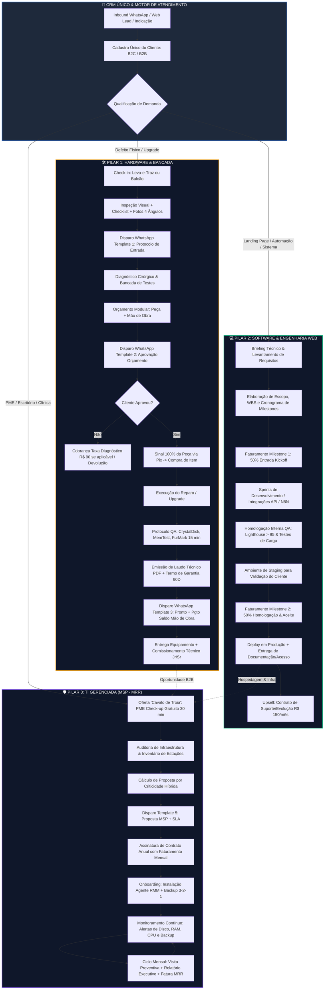

# Arquitetura do Sistema de Gestão Integrado (ERP / CRM) — IF Tech

**Documento:** Especificação Técnica de Arquitetura & Engenharia de Dados  
**Autor:** Especialista em Arquitetura de Software & ERP/CRM  
**Empresa:** IF Tech (Bragança Paulista & Remoto)  
**Versão:** 2.0 (Unificação dos 3 Pilares Operacionais)  
**Status:** Aprovado para Implementação  

---

## 1. Visão Geral & Modelo de Negócio Híbrido

A **IF Tech** atua sob um ecossistema operacional híbrido, onde um mesmo cliente (B2B ou B2C) transita entre três modelos econômicos complementares:

```
┌────────────────────────────────────────────────────────────────────────────────────────┐
│                                 IF TECH ERP/CRM                                 │
├──────────────────────────┬───────────────────────────┬─────────────────────────────────┤
│ 1. HARDWARE & BANCADA    │ 2. SOFTWARE & ENGENHARIA  │ 3. TI GERENCIADA (MSP)          │
│ • Caixa rápido / avulso  │ • Alto Ticket / Projetos  │ • Recorrência previsível (MRR)  │
│ • Triagem & Laudo        │ • Sinal 50% + Homolog 50% │ • Cobrança híbrida por estação  │
│ • Margem de Peças (15-40%)│ • Milestones & QA (95+)  │ • Monitoramento RMM & Backup    │
│ • Repasse Técnico Jr./Sr.│ • Timesheet de Dev (R$130)│ • SLAs e Visitas Preventivas    │
└──────────────────────────┴───────────────────────────┴─────────────────────────────────┘
```

A arquitetura do ERP é orientada ao conceito de **Single Customer View (CRM 360°)**: centraliza o ciclo de vida do cliente desde o lead no WhatsApp até a emissão de faturas, rastreio de OS física, repositório de código/milestones e telemetria de estações de trabalho monitoradas.

---

## 2. Diagrama e Fluxo Operacional Unificado do Cliente (CRM 360°)

### 2.1. Jornada de Atendimento e Cross-Selling Integrado



---

## 3. Arquitetura de Módulos do ERP

O sistema é concebido em uma arquitetura modular em camadas, desacoplada e orientada a serviços de negócio:

```
┌────────────────────────────────────────────────────────────────────────────────────────┐
│                                 IF TECH ERP CORE                                │
├────────────────────────────────────────────────────────────────────────────────────────┤
│ ┌────────────────┐ ┌────────────────┐ ┌────────────────┐ ┌──────────────────────────┐ │
│ │  MÓDULO 1: CRM │ │  MÓDULO 2: OS  │ │  MÓDULO 3: DEV │ │  MÓDULO 4: MSP & RMM     │ │
│ │  & CLIENTE 360 │ │  & BANCADA HW  │ │  & PROJETOS    │ │  • Telemetria & Backups  │ │
│ │  • PF / PJ     │ │  • Checklists  │ │  • Milestones  │ │  • Inventário Híbrido    │ │
│ │  • Endereços   │ │  • Margem Peça │ │  • 50/50 Sinal │ │  • SLAs & Preventivas    │ │
│ │  • Histórico   │ │  • Repasse Jr  │ │  • QA Score    │ │  • Cálculo MRR Modular   │ │
│ └───────┬────────┘ └───────┬────────┘ └───────┬────────┘ └────────────┬─────────────┘ │
│         │                  │                  │                       │               │
│ ┌───────┴──────────────────┴──────────────────┴───────────────────────┴─────────────┐ │
│ │ MÓDULO 5: MOTOR FINANCEIRO, COBRANÇA RECORRENTE & LIVRO CAIXA UNIFICADO           │ │
│ │ • Faturamento de Peças (100% Sinal) | Mão de Obra | Milestones | MRR Contratos     │ │
│ │ • DRE Unificado por Linha de Negócio | Extrato de Repasse Técnico | Split de Pix  │ │
│ └─────────────────────────────────────┬─────────────────────────────────────────────┘ │
│                                       │                                               │
│ ┌─────────────────────────────────────┴─────────────────────────────────────────────┐ │
│ │ MÓDULO 6: CENTRAL DE COMUNICAÇÃO (WHATSAPP BUSINESS & DISPARO DE TEMPLATES)       │ │
│ │ • Template 1 (Entrada) | Template 2 (Orçamento) | Template 3 (QA Pronto)          │ │
│ │ • Template 4 (Garantia CDC) | Template 5 (Proposta MSP) | Alertas Críticos        │ │
│ └─────────────────────────────────────┬─────────────────────────────────────────────┘ │
│                                       │                                               │
│ ┌─────────────────────────────────────┴─────────────────────────────────────────────┐ │
│ │ MÓDULO 7: PORTAL DO CLIENTE (TRACKING DE OS, HOMOLOGAÇÃO & PAINEL MSP B2B)        │ │
│ │ • Visão B2C: Fotos, Laudo FurMark, Aprovação Pix, Certificado de Garantia        │ │
│ │ • Visão B2B: Saúde da Rede, Status de Backups Diários, Tickets Abertos            │ │
└───────────────────────────────────────────────────────────────────────────────────────┘
```

### 3.1. Detalhamento Funcional por Módulo

1. **Módulo 1: CRM & Cadastro Unificado (Single Customer View)**
   - Gerencia registros B2C e B2B em banco relacional único.
   - Vincula todos os históricos: Ordens de Serviço passadas, Projetos Web entregues, Contratos MSP ativos, equipamentos cadastrados e faturas pendentes/pagas.
   - Controle de endereços para logística do **Leva-e-Traz** com cálculo automático de raio de deslocamento em Bragança Paulista e região.

2. **Módulo 2: Service Desk & Bancada Hardware**
   - Check-in de entrada com upload de galeria de fotos (4 ângulos obrigatórios).
   - Checklist de integridade física e funcional (carregador incluso, avarias estéticas, número de série).
   - Matriz de cálculo de peças vs mão de obra:
     - Peças de giro rápido: Margem automática de 30% a 40%.
     - Peças de alto valor: Margem de 15% a 25% ou Taxa de Consultoria (R$ 150).
   - Controle de status com trava financeira: bloqueia status `Aguardando Peça` até que a fatura de sinal da peça esteja com status `Pago`.
   - Gerador de Laudos de Estresse (integração dos dados de CrystalDiskInfo, MemTest86 e FurMark/Cinebench) e emissão do Termo de Garantia de 90 dias com código de validação autenticado via QR Code.
   - Motor de repasse técnico automático (30% a 35% de Mão de Obra para Técnico Jr. e 50% de reparo eletrônico para Sênior).

3. **Módulo 3: Gestão de Projetos & Software Engineering**
   - Controle de escopo em WBS (*Work Breakdown Structure*) e Milestones contratuais.
   - Motor de cobrança 50/50: Milestone de Entrada (50% no Kickoff) e Milestone Final (50% no Aceite de Homologação).
   - Timesheet de horas técnicas de suporte/desenvolvimento avulso (tarifa base: R$ 130,00/hora).
   - Checklist de QA integrado com validação de performance (Lighthouse Performance >= 95, SEO >= 95, validação de forms e webhooks).

4. **Módulo 4: Gestão de Contratos MSP & RMM Gateway**
   - **Gestão Modular por Criticidade Híbrida de Dispositivos**:
     - *Estação Essential (Standard)*: **R$ 69,90/mês** (Monitoramento + Antivírus + Suporte Remoto Ilimitado).
     - *Estação Professional (VIP / Diretoria / Financeiro)*: **R$ 109,90/mês** (SLA Prioritário 2h + Backup Nuvem Diário Certificados + Limpeza Anual).
     - *Servidor Enterprise (Host Database / Storage / ERP)*: **R$ 189,90/mês** (Backup 3-2-1 snapshot contínuo + Disaster Recovery + Visitas de Emergência Inclusas).
   - Ingestão de telemetria via Webhook de agentes RMM (Tactical RMM, MeshCentral, Zabbix):
     - Alertas de disco com uso > 85%, SMART com setores defeituosos, CPU em throttling térmico.
     - Logs diários de Backup: Duplicati / Rclone / S3. Alerta vermelho se backup não rodar nas últimas 24 horas.
   - Controle de franquia de visitas técnicas (1 mensal para Essencial, 2 para Pro, ilimitadas para emergências Enterprise).

5. **Módulo 5: Motor Financeiro & Cobrança Recorrente (Ledger)**
   - Plano de Contas integrado com separação analítica das receitas: `Bancada_Pecas`, `Bancada_MaoDeObra`, `Software_Projetos`, `Software_Recorrencia`, `MSP_MRR`, `Taxa_Logistica`.
   - Painel de Gestão de MRR (*Monthly Recurring Revenue*), ARR, Churn Rate, LTV e CAC.
   - Emissão e reconciliação automática de faturas Pix (Pix dinâmico com chave e payload copia-e-cola) e Boletos.
   - Livro Caixa (Financial Ledger) com controle de saídas para fornecedores de peças e repasse quinzenal de comissões técnicas.

6. **Módulo 6: Central de Mensageria & WhatsApp Gateway**
   - Integração com Evolution API / Typebot / Baileys.
   - Disparo contextual dos templates padronizados (Template 1 a 5) acionados por gatilhos de mudança de status no banco de dados.
   - Histórico de mensagens transacionais enviadas com timestamp e status de entrega.

7. **Módulo 7: Portal do Cliente (Tracking & Gestão)**
   - Link único criptografado (sem necessidade de senha complexa para o cliente final) enviado via WhatsApp.
   - Timeline interativa do progresso do equipamento / projeto / contrato.
   - Painel corporativo B2B com visão executiva da saúde dos computadores da empresa.

---

## 4. Atualizações Necessárias no Schema de Banco de Dados Relacional

O schema existente em `/docs/ops/DATABASE_SCHEMA.md` cobria apenas tabelas preliminares. Abaixo está a especificação completa, normalizada em terceira forma normal (3NF), com suporte à cobrança modular por estação/criticidade, controle de peças/estoque, repasse técnico, milestones de software e logs de telemetria RMM/Backup.

### 4.1. DDL Completo em PostgreSQL (Produção)

```sql
-- ============================================================================
-- EXTENSÕES E ENUMS GLOBAIS
-- ============================================================================
CREATE EXTENSION IF NOT EXISTS "uuid-ossp";
CREATE EXTENSION IF NOT EXISTS "pgcrypto";

-- Enums do CRM e Clientes
CREATE TYPE client_type_enum AS ENUM ('B2C', 'B2B');
CREATE TYPE client_status_enum AS ENUM ('Lead', 'Ativo', 'Inadimplente', 'Inativo');

-- Enums de Hardware e Bancada
CREATE TYPE os_status_enum AS ENUM (
    'Triagem', 
    'Diagnostico_Concluido', 
    'Aguardando_Sinal_Peca', 
    'Peca_Encomendada', 
    'Na_Bancada', 
    'Teste_Estresse_QA', 
    'Pronto', 
    'Entregue', 
    'Cancelado'
);

CREATE TYPE os_service_type_enum AS ENUM ('Hardware_Reparo', 'Hardware_Upgrade', 'Montagem_PC', 'Software_Bancada', 'MSP_Avulso');

-- Enums de Projetos de Software
CREATE TYPE project_status_enum AS ENUM ('Briefing', 'Em_Desenvolvimento', 'Em_QA', 'Homologacao_Cliente', 'Concluido', 'Pausado', 'Cancelado');
CREATE TYPE milestone_billing_type_enum AS ENUM ('Entrada_50', 'Entrega_50', 'Hora_Avulsa', 'Mensalidade_Suporte');

-- Enums de TI Gerenciada (MSP)
CREATE TYPE msp_tier_enum AS ENUM ('Essencial', 'Profissional', 'Corporativo_Enterprise', 'Custom');
CREATE TYPE device_type_enum AS ENUM ('Workstation', 'Notebook', 'Server_Local', 'Network_Firewall', 'Network_Switch', 'NAS_Storage');
CREATE TYPE device_criticality_enum AS ENUM ('Standard', 'High_VIP_Financeiro', 'Mission_Critical_Server', 'Network_Core');
CREATE TYPE backup_status_enum AS ENUM ('Sucesso', 'Alerta_Incompleto', 'Falha_Critica', 'Nunca_Executado');

-- Enums Financeiros
CREATE TYPE ledger_entry_type_enum AS ENUM ('Entrada', 'Saida');
CREATE TYPE transaction_category_enum AS ENUM (
    'Bancada_Peca', 
    'Bancada_MaoDeObra', 
    'Software_Projeto', 
    'Software_Suporte', 
    'MSP_MRR', 
    'Taxa_LevaETraz', 
    'Custo_Fornecedor_Peca', 
    'Repasse_Tecnico_Comissao', 
    'Infra_Ferramentas_Cloud', 
    'Despesa_Operacional'
);
CREATE TYPE payment_method_enum AS ENUM ('Pix', 'Cartao_Credito', 'Cartao_Debito', 'Boleto', 'Transferencia_TED', 'Dinheiro');
CREATE TYPE payment_status_enum AS ENUM ('Pendente', 'Pago', 'Parcialmente_Pago', 'Atrasado', 'Cancelado', 'Estornado');

-- ============================================================================
-- 1. TABELA DE CLIENTES (CRM UNIFICADO)
-- ============================================================================
CREATE TABLE clients (
    id UUID PRIMARY KEY DEFAULT gen_random_uuid(),
    type client_type_enum NOT NULL DEFAULT 'B2C',
    name VARCHAR(255) NOT NULL,
    trade_name VARCHAR(255), -- Nome Fantasia para PJ
    document VARCHAR(20) UNIQUE NOT NULL, -- CPF ou CNPJ validado
    state_registration VARCHAR(30), -- Inscrição Estadual (PJ)
    email VARCHAR(255),
    whatsapp VARCHAR(20) NOT NULL,
    phone_alt VARCHAR(20),
    contact_person VARCHAR(100), -- Nome do responsável de TI / compras (PJ)
    
    -- Endereço Completo para Leva-e-Traz e Visitas MSP
    postal_code VARCHAR(10),
    street VARCHAR(255) NOT NULL,
    number VARCHAR(20) NOT NULL,
    complement VARCHAR(100),
    neighborhood VARCHAR(100) NOT NULL,
    city VARCHAR(100) NOT NULL DEFAULT 'Bragança Paulista',
    state VARCHAR(2) NOT NULL DEFAULT 'SP',
    
    status client_status_enum NOT NULL DEFAULT 'Ativo',
    notes TEXT,
    created_at TIMESTAMP WITH TIME ZONE DEFAULT CURRENT_TIMESTAMP,
    updated_at TIMESTAMP WITH TIME ZONE DEFAULT CURRENT_TIMESTAMP
);

CREATE INDEX idx_clients_document ON clients(document);
CREATE INDEX idx_clients_whatsapp ON clients(whatsapp);

-- ============================================================================
-- 2. CADASTRO DE TÉCNICOS & ENGENHEIROS (REPASSE & COMISSIONAMENTO)
-- ============================================================================
CREATE TABLE technicians (
    id UUID PRIMARY KEY DEFAULT gen_random_uuid(),
    name VARCHAR(255) NOT NULL,
    email VARCHAR(255) UNIQUE NOT NULL,
    whatsapp VARCHAR(20) NOT NULL,
    tier VARCHAR(20) CHECK (tier IN ('Junior', 'Pleno', 'Senior', 'Especialista_Parceiro')) NOT NULL,
    commission_rate_labor DECIMAL(5, 2) NOT NULL DEFAULT 35.00, -- 35% de padrão para Jr
    pix_key VARCHAR(255) NOT NULL,
    is_active BOOLEAN NOT NULL DEFAULT true,
    created_at TIMESTAMP WITH TIME ZONE DEFAULT CURRENT_TIMESTAMP
);

-- ============================================================================
-- 3. PILAR 1: HARDWARE, BANCADA & ORDENS DE SERVIÇO
-- ============================================================================
CREATE TABLE work_orders (
    id UUID PRIMARY KEY DEFAULT gen_random_uuid(),
    os_number SERIAL UNIQUE, -- Número sequencial legível (ex: OS #1042)
    client_id UUID NOT NULL REFERENCES clients(id) ON DELETE RESTRICT,
    technician_id UUID REFERENCES technicians(id) ON DELETE SET NULL,
    
    service_type os_service_type_enum NOT NULL DEFAULT 'Hardware_Reparo',
    status os_status_enum NOT NULL DEFAULT 'Triagem',
    
    -- Dados do Equipamento
    device_brand VARCHAR(100) NOT NULL,
    device_model VARCHAR(150) NOT NULL,
    serial_number VARCHAR(100),
    device_password VARCHAR(100), -- PIN ou senha fornecida pelo cliente
    
    -- Checklist de Entrada
    is_powering_on BOOLEAN NOT NULL DEFAULT true,
    charger_included BOOLEAN NOT NULL DEFAULT false,
    aesthetic_notes TEXT, -- Riscos, amassados, parafusos faltantes
    intake_photos_urls JSONB DEFAULT '[]'::jsonb, -- Array de URLs das fotos dos 4 ângulos
    
    -- Relato e Diagnóstico Técnico
    reported_issue TEXT NOT NULL,
    technical_diagnosis TEXT,
    
    -- Métricas e QA de Bancada
    crystaldisk_health_pct INT CHECK (crystaldisk_health_pct BETWEEN 0 AND 100),
    memtest_cycles_passed INT DEFAULT 0,
    stress_test_duration_minutes INT DEFAULT 15,
    cpu_stress_max_temp_celsius DECIMAL(4, 1),
    gpu_stress_max_temp_celsius DECIMAL(4, 1),
    boot_time_seconds INT,
    qa_approved BOOLEAN DEFAULT false,
    qa_notes TEXT,
    
    -- Logística de Leva-e-Traz
    requires_delivery BOOLEAN DEFAULT false,
    delivery_fee DECIMAL(10, 2) DEFAULT 0.00,
    delivery_address TEXT,
    
    -- Garantia
    warranty_terms_signed BOOLEAN DEFAULT false,
    warranty_valid_until DATE,
    warranty_hash VARCHAR(64), -- Código de autenticidade do laudo
    
    created_at TIMESTAMP WITH TIME ZONE DEFAULT CURRENT_TIMESTAMP,
    updated_at TIMESTAMP WITH TIME ZONE DEFAULT CURRENT_TIMESTAMP
);

CREATE INDEX idx_work_orders_client ON work_orders(client_id);
CREATE INDEX idx_work_orders_status ON work_orders(status);

-- Tabela de Itens de Mão de Obra e Peças da OS
CREATE TABLE work_order_items (
    id UUID PRIMARY KEY DEFAULT gen_random_uuid(),
    work_order_id UUID NOT NULL REFERENCES work_orders(id) ON DELETE CASCADE,
    service_catalog_code VARCHAR(20), -- Ex: HW-01, HW-02, HW-03
    description VARCHAR(255) NOT NULL,
    is_part BOOLEAN NOT NULL DEFAULT false, -- false = Mão de Obra, true = Peça/Hardware
    
    quantity INT NOT NULL DEFAULT 1,
    cost_price_unit DECIMAL(10, 2) NOT NULL DEFAULT 0.00,
    margin_percentage DECIMAL(5, 2) DEFAULT 0.00,
    selling_price_unit DECIMAL(10, 2) NOT NULL,
    discount_unit DECIMAL(10, 2) NOT NULL DEFAULT 0.00,
    
    -- Status de Aquisição da Peça (Para travar fluxo de compra)
    part_supplier VARCHAR(100),
    part_tracking_code VARCHAR(100),
    part_is_ordered BOOLEAN DEFAULT false,
    part_is_arrived BOOLEAN DEFAULT false,
    
    -- Repasse Técnico Calculado
    technician_payout_amount DECIMAL(10, 2) DEFAULT 0.00,
    
    created_at TIMESTAMP WITH TIME ZONE DEFAULT CURRENT_TIMESTAMP
);

-- ============================================================================
-- 4. PILAR 2: PROJETOS DE SOFTWARE & ENGENHARIA WEB
-- ============================================================================
CREATE TABLE software_projects (
    id UUID PRIMARY KEY DEFAULT gen_random_uuid(),
    project_code VARCHAR(50) UNIQUE NOT NULL, -- Ex: PRJ-2026-001
    client_id UUID NOT NULL REFERENCES clients(id) ON DELETE RESTRICT,
    title VARCHAR(255) NOT NULL,
    service_code VARCHAR(20) NOT NULL, -- SW-01 (Landing Page), SW-02 (WhatsApp), SW-03 (Painel Web)
    status project_status_enum NOT NULL DEFAULT 'Briefing',
    
    scope_description TEXT NOT NULL,
    repository_url VARCHAR(255),
    staging_url VARCHAR(255),
    production_url VARCHAR(255),
    
    -- Métricas de QA e Homologação
    lighthouse_performance_score INT CHECK (lighthouse_performance_score BETWEEN 0 AND 100),
    lighthouse_seo_score INT CHECK (lighthouse_seo_score BETWEEN 0 AND 100),
    lighthouse_best_practices_score INT CHECK (lighthouse_best_practices_score BETWEEN 0 AND 100),
    qa_homologated_at TIMESTAMP WITH TIME ZONE,
    
    -- Valores e Faturamento
    total_budget DECIMAL(10, 2) NOT NULL,
    recurrent_support_mrr DECIMAL(10, 2) DEFAULT 0.00, -- Ex: R$ 150/mês para SW-02
    
    start_date DATE,
    estimated_delivery_date DATE NOT NULL,
    actual_delivery_date DATE,
    
    created_at TIMESTAMP WITH TIME ZONE DEFAULT CURRENT_TIMESTAMP,
    updated_at TIMESTAMP WITH TIME ZONE DEFAULT CURRENT_TIMESTAMP
);

-- Milestones e Entregáveis do Projeto (Regra 50% Entrada / 50% Homologação)
CREATE TABLE project_milestones (
    id UUID PRIMARY KEY DEFAULT gen_random_uuid(),
    project_id UUID NOT NULL REFERENCES software_projects(id) ON DELETE CASCADE,
    title VARCHAR(255) NOT NULL,
    description TEXT,
    billing_type milestone_billing_type_enum NOT NULL,
    amount DECIMAL(10, 2) NOT NULL,
    percentage_of_total DECIMAL(5, 2) NOT NULL, -- 50.00 para entrada, 50.00 para entrega
    due_date DATE NOT NULL,
    is_completed BOOLEAN NOT NULL DEFAULT false,
    completed_at TIMESTAMP WITH TIME ZONE,
    is_invoice_generated BOOLEAN NOT NULL DEFAULT false,
    created_at TIMESTAMP WITH TIME ZONE DEFAULT CURRENT_TIMESTAMP
);

-- Horas Técnicas Adicionais / Timesheet
CREATE TABLE project_timesheet_entries (
    id UUID PRIMARY KEY DEFAULT gen_random_uuid(),
    project_id UUID NOT NULL REFERENCES software_projects(id) ON DELETE CASCADE,
    technician_id UUID REFERENCES technicians(id),
    activity_description TEXT NOT NULL,
    hours_spent DECIMAL(5, 2) NOT NULL,
    hourly_rate DECIMAL(10, 2) NOT NULL DEFAULT 130.00, -- Tarifa base SW-04
    is_billable BOOLEAN NOT NULL DEFAULT true,
    is_billed BOOLEAN NOT NULL DEFAULT false,
    worked_at DATE NOT NULL DEFAULT CURRENT_DATE,
    created_at TIMESTAMP WITH TIME ZONE DEFAULT CURRENT_TIMESTAMP
);

-- ============================================================================
-- 5. PILAR 3: TI GERENCIADA (MSP) & INVENTÁRIO HÍBRIDO DE DISPOSITIVOS
-- ============================================================================

-- Contratos MSP Recorrentes
CREATE TABLE msp_contracts (
    id UUID PRIMARY KEY DEFAULT gen_random_uuid(),
    contract_number VARCHAR(50) UNIQUE NOT NULL, -- Ex: MSP-2026-004
    client_id UUID NOT NULL REFERENCES clients(id) ON DELETE RESTRICT,
    plan_tier msp_tier_enum NOT NULL DEFAULT 'Essencial',
    
    -- Valores Base e Recorrência
    base_mrr_value DECIMAL(10, 2) NOT NULL, -- Valor base do plano (ex: R$ 490, R$ 890, R$ 1490)
    extra_devices_mrr DECIMAL(10, 2) NOT NULL DEFAULT 0.00, -- Soma dos dispositivos adicionais
    total_mrr DECIMAL(10, 2) NOT NULL, -- base_mrr_value + extra_devices_mrr
    
    due_day INT NOT NULL CHECK (due_day BETWEEN 1 AND 31),
    contract_start_date DATE NOT NULL,
    contract_renewal_date DATE NOT NULL,
    
    -- Acordos de Nível de Serviço (SLA) & Visitas
    sla_response_remote_hours INT NOT NULL DEFAULT 2, -- SLA horas para suporte remoto
    sla_emergency_onsite_hours INT DEFAULT 4, -- SLA horas para visita emergencial física em Bragança
    included_monthly_visits INT NOT NULL DEFAULT 1, -- 1 visita para Essencial, 2 para Pro
    used_visits_current_month INT NOT NULL DEFAULT 0,
    
    -- Status
    status VARCHAR(20) NOT NULL DEFAULT 'Ativo' CHECK (status IN ('Ativo', 'Suspenso', 'Cancelado')),
    cancellation_reason TEXT,
    created_at TIMESTAMP WITH TIME ZONE DEFAULT CURRENT_TIMESTAMP,
    updated_at TIMESTAMP WITH TIME ZONE DEFAULT CURRENT_TIMESTAMP
);

-- Inventário de Dispositivos e Estações Gerenciadas (Cobrança Híbrida Modular)
CREATE TABLE msp_managed_devices (
    id UUID PRIMARY KEY DEFAULT gen_random_uuid(),
    contract_id UUID NOT NULL REFERENCES msp_contracts(id) ON DELETE CASCADE,
    client_id UUID NOT NULL REFERENCES clients(id) ON DELETE CASCADE,
    
    hostname VARCHAR(100) NOT NULL,
    assigned_user VARCHAR(100), -- Nome do colaborador que usa a estação
    department VARCHAR(100), -- ex: Financeiro, RH, Recepção, Diretoria
    
    device_type device_type_enum NOT NULL DEFAULT 'Workstation',
    criticality device_criticality_enum NOT NULL DEFAULT 'Standard',
    
    -- Precificação Modular Individual da Estação
    monthly_rate DECIMAL(10, 2) NOT NULL DEFAULT 75.00, -- R$ 75 std, R$ 120 VIP, R$ 280 Server
    is_billable BOOLEAN NOT NULL DEFAULT true,
    
    -- Identificadores Técnicos & Agente RMM
    os_version VARCHAR(100), -- Windows 11 Pro, Ubuntu 24.04, Windows Server 2022
    cpu_model VARCHAR(100),
    ram_gb INT,
    storage_info VARCHAR(255),
    mac_address VARCHAR(20),
    ipv4_local VARCHAR(20),
    rmm_agent_id VARCHAR(100) UNIQUE, -- ID único do agente Tactical RMM / MeshCentral
    rmm_is_online BOOLEAN DEFAULT true,
    rmm_last_seen TIMESTAMP WITH TIME ZONE,
    
    -- Status de Proteção & Antivírus
    antivirus_installed BOOLEAN DEFAULT true,
    antivirus_status VARCHAR(50) DEFAULT 'Protegido',
    
    -- Política de Backup Redundante 3-2-1
    backup_enabled BOOLEAN DEFAULT false,
    backup_tool VARCHAR(50), -- Rclone, Duplicati, Synology Cloud Sync, VEEAM
    backup_storage_target VARCHAR(100), -- S3 AWS, Backblaze B2, NAS Local
    backup_last_run TIMESTAMP WITH TIME ZONE,
    backup_last_status backup_status_enum DEFAULT 'Nunca_Executado',
    backup_size_gb DECIMAL(8, 2) DEFAULT 0.00,
    
    created_at TIMESTAMP WITH TIME ZONE DEFAULT CURRENT_TIMESTAMP,
    updated_at TIMESTAMP WITH TIME ZONE DEFAULT CURRENT_TIMESTAMP
);

CREATE INDEX idx_msp_devices_contract ON msp_managed_devices(contract_id);
CREATE INDEX idx_msp_devices_rmm ON msp_managed_devices(rmm_agent_id);

-- Tabela de Logs de Telemetria e Alertas RMM / Backup
CREATE TABLE msp_telemetry_alerts (
    id UUID PRIMARY KEY DEFAULT gen_random_uuid(),
    device_id UUID NOT NULL REFERENCES msp_managed_devices(id) ON DELETE CASCADE,
    contract_id UUID NOT NULL REFERENCES msp_contracts(id) ON DELETE CASCADE,
    
    alert_type VARCHAR(50) NOT NULL, -- 'Backup_Failed', 'Disk_Full_85', 'SMART_Error', 'Agent_Offline', 'Thermal_Throttling'
    severity VARCHAR(20) NOT NULL CHECK (severity IN ('Baixa', 'Media', 'Alta', 'Critica')),
    message TEXT NOT NULL,
    is_resolved BOOLEAN NOT NULL DEFAULT false,
    resolved_at TIMESTAMP WITH TIME ZONE,
    resolution_notes TEXT,
    
    created_at TIMESTAMP WITH TIME ZONE DEFAULT CURRENT_TIMESTAMP
);

-- ============================================================================
-- 6. MÓDULO FINANCEIRO, FATURAMENTO E LIVRO CAIXA UNIFICADO
-- ============================================================================

-- Faturas / Títulos a Receber e a Pagar
CREATE TABLE invoices (
    id UUID PRIMARY KEY DEFAULT gen_random_uuid(),
    invoice_number VARCHAR(50) UNIQUE NOT NULL, -- Ex: FAT-2026-0891
    client_id UUID NOT NULL REFERENCES clients(id) ON DELETE RESTRICT,
    
    -- Relações de Origem (Exclusivas ou Mistas)
    work_order_id UUID REFERENCES work_orders(id) ON DELETE SET NULL,
    software_project_id UUID REFERENCES software_projects(id) ON DELETE SET NULL,
    project_milestone_id UUID REFERENCES project_milestones(id) ON DELETE SET NULL,
    msp_contract_id UUID REFERENCES msp_contracts(id) ON DELETE SET NULL,
    
    description VARCHAR(255) NOT NULL,
    category transaction_category_enum NOT NULL,
    total_amount DECIMAL(10, 2) NOT NULL,
    discount_amount DECIMAL(10, 2) NOT NULL DEFAULT 0.00,
    net_amount DECIMAL(10, 2) NOT NULL,
    
    payment_method payment_method_enum NOT NULL DEFAULT 'Pix',
    status payment_status_enum NOT NULL DEFAULT 'Pendente',
    
    issue_date DATE NOT NULL DEFAULT CURRENT_DATE,
    due_date DATE NOT NULL,
    paid_at TIMESTAMP WITH TIME ZONE,
    
    -- Dados de Liquidação Pix / Gateway
    pix_copy_paste TEXT,
    pix_qr_code_url TEXT,
    gateway_transaction_id VARCHAR(100),
    
    created_at TIMESTAMP WITH TIME ZONE DEFAULT CURRENT_TIMESTAMP,
    updated_at TIMESTAMP WITH TIME ZONE DEFAULT CURRENT_TIMESTAMP
);

CREATE INDEX idx_invoices_client ON invoices(client_id);
CREATE INDEX idx_invoices_due_date ON invoices(due_date);
CREATE INDEX idx_invoices_status ON invoices(status);

-- Livro Caixa & Fluxo Realizado (DRE / Extrato de Contas)
CREATE TABLE financial_ledger (
    id UUID PRIMARY KEY DEFAULT gen_random_uuid(),
    invoice_id UUID REFERENCES invoices(id) ON DELETE SET NULL,
    type ledger_entry_type_enum NOT NULL,
    category transaction_category_enum NOT NULL,
    description VARCHAR(255) NOT NULL,
    amount DECIMAL(10, 2) NOT NULL,
    
    payment_method payment_method_enum NOT NULL,
    competence_date DATE NOT NULL DEFAULT CURRENT_DATE,
    settlement_date TIMESTAMP WITH TIME ZONE DEFAULT CURRENT_TIMESTAMP,
    
    -- Relacionamentos Opcionais para DRE de Linha de Negócio
    work_order_id UUID REFERENCES work_orders(id),
    software_project_id UUID REFERENCES software_projects(id),
    msp_contract_id UUID REFERENCES msp_contracts(id),
    technician_id UUID REFERENCES technicians(id), -- No caso de saída por repasse de comissão
    
    created_at TIMESTAMP WITH TIME ZONE DEFAULT CURRENT_TIMESTAMP
);

CREATE INDEX idx_financial_ledger_date ON financial_ledger(competence_date);
CREATE INDEX idx_financial_ledger_category ON financial_ledger(category);

-- ============================================================================
-- 7. REGISTRO DE DISPAROS DE MENSAGENS E TEMPLATES (AUDIT LOG)
-- ============================================================================
CREATE TABLE communication_logs (
    id UUID PRIMARY KEY DEFAULT gen_random_uuid(),
    client_id UUID NOT NULL REFERENCES clients(id) ON DELETE CASCADE,
    template_name VARCHAR(50) NOT NULL, -- 'Template_1_Entrada', 'Template_2_Orcamento', 'Template_3_QA', 'Template_4_Garantia', 'Template_5_MSP'
    recipient_phone VARCHAR(20) NOT NULL,
    rendered_content TEXT NOT NULL,
    channel VARCHAR(20) NOT NULL DEFAULT 'WhatsApp',
    sent_status VARCHAR(20) NOT NULL DEFAULT 'Sent',
    sent_at TIMESTAMP WITH TIME ZONE DEFAULT CURRENT_TIMESTAMP
);
```

---

## 5. Especificação de Telas e Painéis Chave

### 5.1. Dashboard do Gestor Executivo (Cockpit Central 360°)

O painel de gestão centraliza os indicadores de saúde financeira, fluxo de caixa e o status operacional dos 3 pilares em tempo real.

```
┌────────────────────────────────────────────────────────────────────────────────────────────────────────┐
│  IF TECH // COCKPIT EXECUTIVO & OPERAÇÕES                                  [22/08/2026 18:00]   │
├────────────────────────────────────────────────────────────────────────────────────────────────────────┤
│  [📊 KPIs CONSOLIDADOS]                                                                                │
│  ┌──────────────────────┬──────────────────────┬──────────────────────┬──────────────────────────────┐ │
│  │ MRR REINCIDENTE MSP  │ CAIXA BANCADA (MÊS)  │ PROJETOS DEV (MÊS)   │ MARGEM LÍQUIDA GLOBAL (DRE)  │ │
│  │ R$ 4.210,00/mês      │ R$ 3.840,00          │ R$ 6.200,00          │ 68.4% (R$ 9.746,00 Líq.)     │ │
│  │ 42 Estações Ativas   │ (Peças: 42% Margem)  │ 3 Projetos em Sprint │ Comissões Pagas: R$ 1.480,00 │ │
│  └──────────────────────┴──────────────────────┴──────────────────────┴──────────────────────────────┘ │
├────────────────────────────────────────────────────────────────────────────────────────────────────────┤
│  [🛠️ RADAR OPERACIONAL POR PILAR - KANBAN INTEGRADO]                                                   │
│                                                                                                        │
│  PILAR 1: BANCADA HARDWARE (7 OS ATIVAS)                                                               │
│  ┌───────────────┐ ┌───────────────┐ ┌───────────────┐ ┌───────────────┐ ┌───────────────────────────┐ │
│  │ TRIAGEM (2)   │ │ AGUARD. SINAL │ │ NA BANCADA    │ │ TESTE QA (1)  │ │ PRONTO / RETIRADA (1)       │ │
│  │ • OS #1042    │ │ • OS #1040    │ │ • OS #1039    │ │ • OS #1038    │ │ • OS #1037                  │ │
│  │   Dell G15    │ │   Acer Nitro  │ │   Lenovo Think│ │   PC Gamer 57x│ │   MacBook Pro M1 (R$ 380)   │ │
│  │   Diag. 1.5h  │ │   Aguard. Pix │ │   Troca MX-4  │ │   FurMark: 64°│ │   Aguardando Leva-e-Traz    │ │
│  └───────────────┘ └───────────────┘ └───────────────┘ └───────────────┘ └───────────────────────────┘ │
│                                                                                                        │
│  PILAR 2: PROJETOS DE SOFTWARE (3 ATIVOS)                                                              │
│  ┌───────────────────────────┬───────────────────────────┬───────────────────────────────────────────┐ │
│  │ BRIEFING / SINAL 50%      │ EM DESENVOLVIMENTO        │ HOMOLOGAÇÃO & ACEITE 50%                  │ │
│  │ • PRJ-003: Automação Wpp  │ • PRJ-002: Sistema ERP    │ • PRJ-001: Landing Page Neobrutalista     │ │
│  │   Clínica Sorriso (R$900) │   Imobiliária Regional    │   Lighthouse: 98/100 | Saldo: R$ 1.200    │ │
│  └───────────────────────────┴───────────────────────────┴───────────────────────────────────────────┘ │
│                                                                                                        │
│  PILAR 3: TI GERENCIADA MSP & RADAR DE TELEMETRIA (4 CONTRATOS / 42 DISPOSITIVOS)                     │
│  ┌───────────────────────────┬───────────────────────────┬───────────────────────────────────────────┐ │
│  │ SAÚDE GERAL DA REDE       │ BACKUPS 3-2-1 CRÍTICOS    │ ALERTAS RMM PENDENTES                     │ │
│  │ 🟢 41 Online | 🔴 1 Off   │ 🟢 40 Sucesso             │ ⚠️ 1 Disco em 89% (Estação Fin-02 / Alfa) │ │
│  │ 0 Servidores com Falha    │ 🔴 1 Falha (Clínica Beta) │ ⚠️ 1 Fan em alta rotação (PC-Recepção)    │ │
│  └───────────────────────────┴───────────────────────────┴───────────────────────────────────────────┘ │
└────────────────────────────────────────────────────────────────────────────────────────────────────────┘
```

#### Componentes e Ações Rápidas do Painel do Gestor:
1. **Botão de Ação "Disparar WhatsApp":** Permite acionar manualmente ou reenviar qualquer um dos templates (1 a 5) com um clique, já preenchendo as variáveis dinâmicas da OS/Projeto.
2. **Semáforo de Backup & RMM:** Um clique no alerta vermelho abre imediatamente um ticket de suporte preventivo no ERP, notificando o técnico responsável para averiguação antes que o cliente perceba.
3. **Módulo de Comissionamento Técnico:** Aba analítica que consolida a folha de repasse quinzenal dos técnicos Jr. (base de 35% de Mão de Obra) e Sênior, com botão de liquidação via Chave Pix.

---

### 5.2. Portal do Cliente — Visão de Acompanhamento Transparente (B2C & B2B)

O cliente acessa uma URL segura no formato `https://app.iflcosta.tech/status/{hash_token}`, sem fricção de senhas complexas:

```
┌────────────────────────────────────────────────────────────────────────────────────────────────────────┐
│  IF TECH // CENTRAL DE ACOMPANHAMENTO TÉCNICO                             [ PROTOCOLO: #1038 ]  │
├────────────────────────────────────────────────────────────────────────────────────────────────────────┤
│  Cliente: Lucas Andrade | Equipamento: Desktop Custom Ryzen 7 5700X + RTX 4070                         │
├────────────────────────────────────────────────────────────────────────────────────────────────────────┤
│  [⏱️ LINHA DO TEMPO AO VIVO DO SEU EQUIPAMENTO]                                                        │
│                                                                                                        │
│   (✓) Entrada & Fotos      (✓) Diagnóstico        (✓) Peças Recebidas     (✓) Teste Estresse   (●) QA  │
│   22/08 09:30              22/08 11:15            22/08 14:00             22/08 16:30         Pronto   │
│                                                                                                        │
├────────────────────────────────────────────────────────────────────────────────────────────────────────┤
│  [🔬 LAUDO TÉCNICO DE PERFORMANCE & QA]                                                               │
│                                                                                                        │
│  • Saúde do Armazenamento (NVMe 1TB): 100% Saudável (CrystalDiskInfo validado)                         │
│  • Teste de Estresse Contínuo FurMark + Cinebench: 15 minutos contínuos sem quedas                     │
│  • Temperatura Máxima Atingida: 63.5°C (Pasta Térmica Arctic MX-4 aplicada com sucesso)                │
│  • Tempo de Inicialização do Windows 11 Pro: 11.2 segundos                                             │
│                                                                                                        │
│  [📸 FOTOS DA ENTRADA E BANCADA]                                                                       │
│  [ Foto 1: Tampa Frontal ]   [ Foto 2: Cable Management ]   [ Foto 3: Gráfico Térmico HWMonitor ]      │
├────────────────────────────────────────────────────────────────────────────────────────────────────────┤
│  [💰 RESUMO FINANCEIRO & QUITAÇÃO]                                                                     │
│                                                                                                        │
│  • Peça: SSD NVMe 1TB Kingston Renegade (Pago antecipadamente): R$ 450,00 (✓ Quitado)                  │
│  • Mão de Obra Especializada & Testes de Precisão: R$ 220,00 (Pendente na Retirada)                    │
│                                                                                                        │
│  [ BOTÃO: PAGAR SALDO RESTANTE R$ 220,00 VIA PIX ]    [ BOTÃO: BAIXAR CERTIFICADO DE GARANTIA (PDF) ] │
└────────────────────────────────────────────────────────────────────────────────────────────────────────┘
```

#### Recursos da Visão do Cliente:
- **Transparência Absoluta:** Elimina a ansiedade do cliente através de fotos reais de sua máquina e gráficos de teste térmico.
- **Certificado de Garantia Digital:** Emissão de PDF com o Termo do Art. 26 do CDC (90 dias de garantia), detalhando os números de série das peças substituídas e o código de integridade SHA-256.

---

### 5.3. Painel do Gestor B2B — Visão Executiva MSP (TI Gerenciada)

Para clientes corporativos (médicos, escritórios de contabilidade, pequenas indústrias), o ERP fornece um painel focado em continuidade de negócios e conformidade:

```
┌────────────────────────────────────────────────────────────────────────────────────────────────────────┐
│  IF TECH // GESTÃO DE TI CORPORATIVA & MSP                      [ CONTRATO: MSP-CLINICA-BETA ]  │
├────────────────────────────────────────────────────────────────────────────────────────────────────────┤
│  Empresa: Clínica Médica São Francisco | Plano: MSP Profissional (8 Estações + 1 Servidor)            │
├────────────────────────────────────────────────────────────────────────────────────────────────────────┤
│  [🛡️ PAINEL DE CONTINUIDADE & SEGURANÇA]                                                              │
│                                                                                                        │
│  • Disponibilidade Geral da Infraestrutura: 99.8% no mês                                               │
│  • Estações Protegidas por Antivírus Gerenciado: 9/9 (100%)                                            │
│  • Rotina de Backup 3-2-1 em Nuvem: Último sucesso hoje às 04:00 AM (84.2 GB sincronizados em nuvem)   │
│  • Visitas Preventivas no Mês: 1/2 Utilizadas (Próxima preventiva agendada: 05/09)                    │
│                                                                                                        │
│  [🖥️ INVENTÁRIO DE ESTAÇÕES & CRITICIDADE]                                                            │
│  ┌───────────────┬───────────────────────────┬──────────────┬──────────────┬─────────────────────────┐ │
│  │ HOSTNAME      │ USUÁRIO / DEPARTAMENTO    │ CRITICIDADE  │ STATUS RMM   │ BACKUP 3-2-1            │ │
│  ├───────────────┼───────────────────────────┼──────────────┼──────────────┼─────────────────────────┤ │
│  │ SRV-BANCO-01  │ Servidor Prontuários (DB) │ Alta / Serv. │ 🟢 Online    │ 🟢 04:00 AM (OK - 42GB) │ │
│  │ EST-FIN-01    │ Dra. Mariana (Diretoria)  │ VIP / Alta   │ 🟢 Online    │ 🟢 04:15 AM (OK - 18GB) │ │
│  │ EST-FIN-02    │ Carlos (Financeiro)       │ VIP / Alta   │ 🟢 Online    │ 🟢 04:30 AM (OK - 24GB) │ │
│  │ EST-REC-01    │ Recepção 01               │ Standard     │ 🟢 Online    │ - (Não Aplicável)       │ │
│  │ EST-REC-02    │ Recepção 02               │ Standard     │ 🟢 Online    │ - (Não Aplicável)       │ │
│  └───────────────┴───────────────────────────┴──────────────┴──────────────┴─────────────────────────┘ │
│                                                                                                        │
│  [ BOTÃO: ABRIR CHAMADO TÉCNICO PRIORITÁRIO (SLA 2H) ]    [ BOTÃO: BAIXAR RELATÓRIO MENSAL EM PDF ]    │
└────────────────────────────────────────────────────────────────────────────────────────────────────────┘
```

---

## 6. Fluxos de Automação & Triggers de Mensageria (WhatsApp Integration)

O ERP dispara automaticamente mensagens via WhatsApp em momentos-chave da esteira operacional:

| Evento / Mudança de Status | Template Disparado | Payload de Variáveis Dinâmicas | Ação Financeira Vinculada |
| :--- | :--- | :--- | :--- |
| **Check-in de Hardware** | `Template 1 (Entrada)` | `{nome}`, `{modelo}`, `{os_number}`, `{qtd_fotos}`, `{link_tracking}` | Criação do registro de OS e galeria de fotos. |
| **Diagnóstico Concluído** | `Template 2 (Orçamento)` | `{nome}`, `{diagnostico_resumido}`, `{peca_nome}`, `{peca_valor}`, `{mo_valor}`, `{total}`, `{chave_pix}` | Emissão da Fatura de Sinal de Peça (100%). |
| **Sinal da Peça Pago** | *(Notificação Interna)* | Mensagem interna p/ Bancada: *"Peça liberada para compra no fornecedor."* | Atualização de status da OS para `Peca_Encomendada`. |
| **QA de Bancada Aprovado** | `Template 3 (Conclusão)` | `{nome}`, `{segundos_boot}`, `{mo_saldo}`, `{link_pagamento}` | Emissão da Fatura de Saldo de Mão de Obra. |
| **Fechamento de Projeto SW** | *(Notificação Kickoff)* | `{nome}`, `{projeto_nome}`, `{link_staging}`, `{valor_sinal_50}` | Emissão de Fatura do Milestone 1 (50% Entrada). |
| **Homologação Projeto SW** | *(Notificação Entrega)* | `{nome}`, `{lighthouse_score}`, `{link_producao}`, `{valor_saldo_50}` | Emissão de Fatura do Milestone 2 (50% Saldo). |
| **Check-up PME Concluído** | `Template 5 (Proposta MSP)` | `{nome_gestor}`, `{empresa}`, `{qtd_estacoes}`, `{mrr_valor}` | Geração do rascunho de Contrato MSP com SLA. |
| **Falha de Backup > 24h** | *(Alerta Interno SOC)* | Alerta para equipe IF Tech: *"Estação X não executa backup há 24h."* | Abertura automática de Ticket de Suporte Preventivo. |

---

## 7. Resumo e Próximos Passos de Implementação

Com esta especificação, o ERP da IF Tech unifica a gestão financeira, operacional e técnica:
1. **Blindagem Jurídica e Financeira:** O caixa da empresa nunca financia peças de clientes (100% de sinal prévio) e projetos de software contam com 50% de trava de entrada.
2. **Escalabilidade no MSP:** A cobrança por estação com criticidade híbrida permite precificar de consultórios com 2 computadores a empresas com dezenas de máquinas e servidores locais.
3. **Eficiência Técnica:** Padronização dos testes de estresse (QA), redução de RMA para menos de 2% e automação total da régua de WhatsApp.
