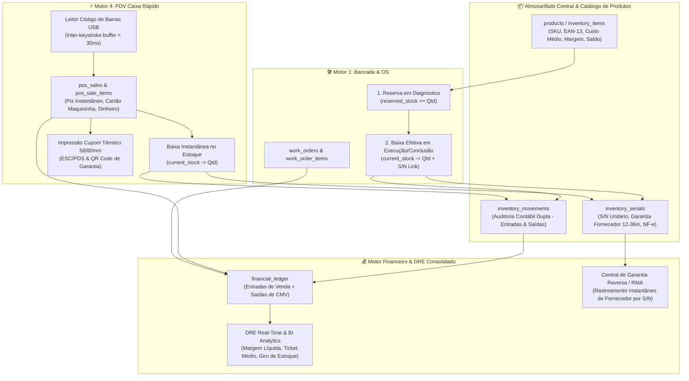

# Laudo Arquitetural & Engenharia de Sistemas: Módulo de Estoque, PDV & Rastreamento Serial
**Projeto:** IF Tech (IFLCosta Tech Solutions)  
**Documento Técnico:** `docs/ops/INVENTORY_AND_POS_ARCHITECTURE_BLUEPRINT.md`  
**Autor:** Principal POS & Inventory Systems Architect  
**Data:** 26 de Agosto de 2026  
**Status:** Aprovado para Implementação / Arquitetura Canônica  
**Alvo:** Supabase PostgreSQL 15+, Cockpit Administrativo (`admin.html`), Portal do Cliente (`portal.html`), Protocolo ESC/POS Térmico e Leitores de Código de Barras USB  

---

## 📑 Sumário Executivo

O presente laudo estabelece a arquitetura canônica para a integração do novo módulo de **Estoque, Almoxarifado Inteligente e PDV Caixa Rápido** ao ecossistema tecnológico da IF Tech.

A IF Tech consolida sua operação em **4 Motores de Faturamento**:
1. **Pilar 1 — Hardware, Bancada & Montagem:** Ordens de Serviço (reparos complexos em microeletrônica, upgrades e custom builds);
2. **Pilar 2 — Software & Engenharia Web:** Projetos de desenvolvimento sob medida com faturamento 50/50 e horas técnicas;
3. **Pilar 3 — TI Gerenciada (MSP) & B2B:** Contratos de infraestrutura com receita recorrente mensal (MRR) e cobrança híbrida por estação;
4. **Pilar 4 (NOVO) — PDV Balcão & Loja Express:** Venda ágil de periféricos, cabos de alto desempenho, fontes GaN, insumos térmicos premium (Arctic MX-4 / Thermal Grizzly) e hardware a pronta-entrega, operado com leitores de código de barras USB e emissão instantânea de cupons térmicos (58mm / 80mm).



---

## 1. Auditoria do Sistema Atual & Identificação de Gaps

### 1.1 Como a Bancada consome peças hoje
Na modelagem atual (`docs/ops/DATABASE_SCHEMA.md` e `fix_update_budget_rpc.sql`):
- A tabela `work_order_items` possui as colunas `cost_price`, `unit_price`, `quantity`, `is_part` (ou `item_type`) e chave estrangeira opcional `inventory_item_id`.
- Ao elaborar o orçamento pelo modal (`admin.html`: `actionBudgetFromOS`), o gestor digita a descrição da peça, o custo de aquisição e o preço de venda para o cliente.
- A RPC `rpc_update_work_order_budget` atualiza a OS, definindo `total_parts` e `total_labor`.

### 1.2 Como o DRE e o Dashboard Financeiro apuram o faturamento e o custo
- No frontend (`admin.html`: `renderFinancialDashboard`):
  - Faturamento Bruto = Soma(total_labor + total_parts + pickup_fee)
  - CMV Peças = Soma(total_parts_cost)
  - Lucro Líquido Bancada = total_labor + (total_parts - total_parts_cost) + pickup_fee
- Na RPC de BI (`docs/ops/bi_executive_analytics.sql`):
  Consolida os dados de `work_orders`, `msp_contracts` e `software_projects`.

### 1.3 Lacunas (Gaps) Identificadas no Sistema Atual
1. **Ausência de Baixa Atômica de Estoque:** Não existia amarração transacional entre salvar a OS e subtrair o saldo físico de `products.current_stock`.
2. **Inexistência de Venda de Balcão Rápida (PDV):** Itens avulsos (cabos, pastas térmicas, carregadores) exigiam a abertura burocrática de uma OS para serem vendidos.
3. **Falta de Rastreamento Unitário de Números de Série (S/N):** Quando um cliente retorna com um SSD Kingston com defeito após 10 meses, o sistema não permitia bipar o S/N para identificar em qual distribuidor (KaBuM, All Nations, SND, Terabyte) foi comprado e qual a NF-e original de entrada para acionamento de RMA.
4. **Sem Alerta Visual de Ponto de Reposição (Kanban de Compras):** O gestor precisava inspecionar visualmente as gavetas da bancada para saber se o estoque de pasta Arctic MX-4 ou SSD NVMe 1TB estava zerando.
5. **DRE Cego para o Balcão:** Vendas avulsas não alimentavam o `financial_ledger` nem o DRE executivo.

---

## 2. Mecânica de Baixa Dupla (Dual Decrement Engine)

```
                  ┌────────────────────────────────────────────────────────┐
                  │                 ALMOXARIFADO CENTRAL                   │
                  │   Saldo Físico (current_stock)                         │
                  │   Saldo Reservado (reserved_stock)                     │
                  │   Saldo Disponível = current_stock - reserved_stock    │
                  └───────────┬────────────────────────────────┬───────────┘
                              │                                │
                              ▼                                ▼
              ┌──────────────────────────────┐ ┌──────────────────────────────┐
              │      ORIGEM 1: BANCADA       │ │       ORIGEM 2: PDV          │
              │     (Ordens de Serviço)      │ │      (Venda de Balcão)       │
              ├──────────────────────────────┤ ├──────────────────────────────┤
              │ 1. Orçamento Aprovado:       │ │ 1. Cliente escolhe o produto │
              │    Reserva Saldo Disponível  │ │ 2. Operador bipa código bar  │
              │ 2. Execução na Bancada:      │ │ 3. Pagamento Pix/Cartão/Din  │
              │    Baixa Física + Vincula S/N│ │ 4. Baixa Física Imediata     │
              │ 3. Cancelamento da OS:       │ │ 5. Cupom Térmico 58mm/80mm   │
              │    Liberação da Reserva      │ │ 6. Kardex + DRE instantâneo  │
              └──────────────────────────────┘ └──────────────────────────────┘
```

### 2.1 Origem 1: Consumo de Peças na Bancada Técnica (OS)
1. **Fase de Orçamento:** O técnico seleciona o componente no seletor. O sistema valida o saldo disponível e reserva (`reserved_stock += qtd`);
2. **Fase de Execução:** O técnico pega a peça física na gaveta e **bipa o Número de Série (S/N)** na OS. A baixa física ocorre (`current_stock -= qtd`), vinculando o S/N à OS;
3. **Cancelamento:** Se o cliente recusar o orçamento, a reserva é liberada atomicamente.

### 2.2 Origem 2: Venda Rápida de Balcão no PDV (Loja Express)
1. **Captura por Leitor USB:** Operador bipa o código de barras (EAN-13 ou SKU); o item entra instantaneamente no carrinho com bipe sonoro de confirmação;
2. **Fechamento Ágil (F8):** Escolha de Pix (QR Code dinâmico), Cartão (Débito/Crédito até 12x) ou Dinheiro (com cálculo automático de troco em verde neon);
3. **Efetivação Atômica:** Executa `rpc_process_pos_sale`, baixando o estoque, gravando o Kardex e alimentando o DRE;
4. **Impressão de Cupom Térmico:** Emissão de cupom 58mm/80mm com dados da IF Tech, itens, S/N e termo de garantia CDC 90D.

---

## 3. Rastreamento de Garantia de Fornecedor por Número de Série (S/N)

| Estado (`status`) | Significado Operacional | Onde se Encontra |
| :--- | :--- | :--- |
| `In_Stock` | Disponível fisicamente no almoxarifado | Na gaveta/prateleira identificada |
| `Reserved_OS` | Alocado em OS aprovada aguardando montagem | Separado na caixa da OS do cliente |
| `Sold_OS` | Instalado no equipamento do cliente | Com o cliente (vinculado a `work_order_id`) |
| `Sold_POS` | Vendido diretamente no caixa do balcão | Com o cliente (vinculado a `pos_sale_id`) |
| `RMA_Supplier` | Retornou com defeito e despachado p/ fornecedor | Em trânsito / laboratório do distribuidor |
| `Defective_Scrap` | Danificado sem cobertura ou sucata | Descarte / Sucata técnica |

---

## 4. Alerta de Estoque Mínimo & Reposição (Kanban de Compras)

- **🟢 Confortável:** Saldo > Ponto de Reposição (Sem risco);
- **🟡 Ponto de Reposição:** Saldo <= Ponto de Pedido (Sugerir cotação no distribuidor);
- **🔴 Crítico:** Saldo <= Estoque Mínimo de Segurança (Comprar imediatamente);
- **🟣 Ruptura:** Saldo = 0 (Peça esgotada no balcão).

---

## 5. DRE 360° Unificado com o Novo Motor de PDV

```
========================================================================================
IF TECH // DEMONSTRATIVO DE RESULTADOS DO EXERCÍCIO (DRE CONSOLIDADO)
========================================================================================
(+) RECEITA BRUTA TOTAL
    ├── (+) Serviços de Bancada (Mão de Obra OS)
    ├── (+) Peças Aplicadas em Bancada (OS)
    ├── (+) Vendas de Balcão & Acessórios (PDV Caixa Rápido)  <-- NOVO MOTOR 4
    ├── (+) Taxas de Logística Leva-e-Traz
    ├── (+) Projetos de Software & Engenharia Web
    └── (+) Contratos Mensais de TI Gerenciada (MSP MRR)
(-) DEDUÇÕES & CUSTOS DIRETOS (CMV & TAXAS)
    ├── (-) CMV: Custo de Aquisição de Peças (Bancada)
    ├── (-) CMV: Custo de Aquisição de Mercadorias (PDV)      <-- NOVO MOTOR 4
    ├── (-) Taxas de Pagamento Maquininhas POS / Asaas (1.9% a 3.5%)
    └── (-) Repasse de Comissões de Técnicos (35% M.O.)
(=) LUCRO BRUTO OPERACIONAL
(-) DESPESAS OPERACIONAIS FIXAS
    ├── (-) Infraestrutura, Ferramentas Cloud & Aluguel Lab (R$ 1.300,00 fixo calibrado)
    └── (-) Despesas Administrativas & Marketing Local
(=) LUCRO LÍQUIDO DO EXERCÍCIO (EBITDA REAL)
========================================================================================
```
