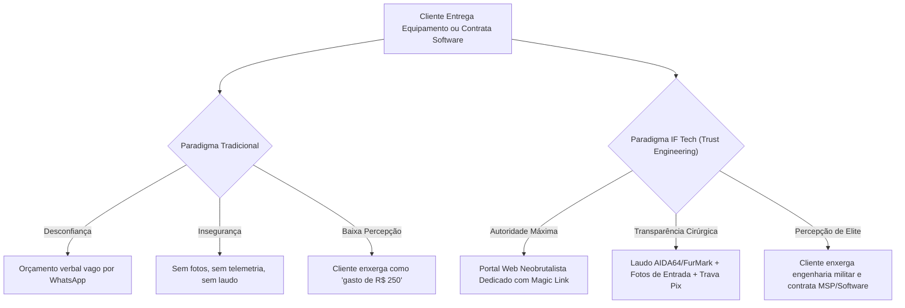
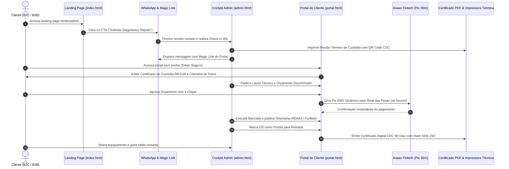
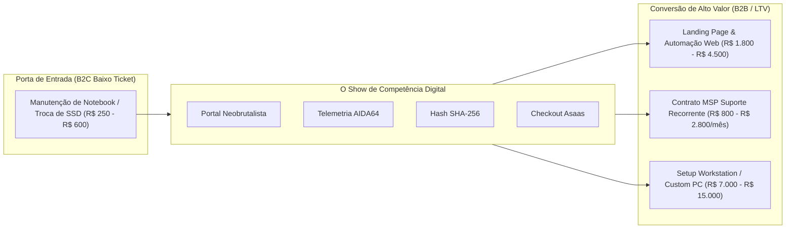

# 🏛️ MAGNA AUDITORIA DE EXPERIÊNCIA DO CLIENTE (CX), AUTORIDADE DE MARCA & ENGENHARIA DE CONFIANÇA
## IF Tech // Central de Consultoria Tecnológica, Alta Performance & Software
### Domínio: https://iflcosta.tech | Versão: 3.5-Canônica | Data da Auditoria: 27 de Agosto de 2026

---

**Documento:** `docs/ops/MAGNA_AUDITORIA_CX_AUTORIDADE_VALOR.md`  
**Auditor Responsável:** Arquiteto Chefe de Experiência do Cliente, Autoridade Visual e Engenharia de Confiança  
**Escopo Auditado:** 
- **Landing Page Institucional (`index.html`):** Design System Neobrutalista, conversão mobile, autoridade técnica e clareza dos 4 serviços;
- **Portal de Acompanhamento do Cliente (`portal.html` / `status.html`):** 3 Modos Operacionais (Hardware Break-Fix, Software 50/50, MSP B2B), Stepper de 5 fases, Telemetria Térmica AIDA64/FurMark, Fotos de Inspeção, Checkout Asaas Pix Copia-e-Cola e Certificado CDC 90D com Hash SHA-256;
- **Cockpit do Gestor (`admin.html`):** Velocidade ergonômica de Check-in em 30s, PDV, Leva-e-Traz e Impressão Térmica ESC/POS de Balcão;
- **Templates de Comunicação (`COMMUNICATION_TEMPLATES.md`):** Magic Links e gatilhos de WhatsApp.  
**Classificação:** 🏆 **CERTIFICAÇÃO MASTER DE AUTORIDADE VISUAL & EXPERIÊNCIA DO CLIENTE (GRAU A+)**

---

## 📑 1. SUMÁRIO EXECUTIVO: O EFEITO "HIGH-TECH TRUST ENGINEERING"

A experiência do cliente na **IF Tech** não foi desenhada como uma simples interface de acompanhamento de consertos, mas como uma **ferramenta de autoridade psicológica e conversão de valor tecnológico**. 

O mercado tradicional de assistência técnica e TI no Brasil sofre de um estigma estrutural de desconfiança: orçamentos opacos, peças trocadas sem comprovação, prazos descumpridos e impressões em papel jornal sem valor jurídico. 

A IF Tech quebra radicalmente esse paradigma aplicando **Engenharia de Confiança (*Trust Engineering*)**:



### Principais Conclusões da Auditoria:
1. **Transmutação de Valor:** Um reparo trivial de R$ 250 (ex: troca de pasta térmica Arctic MX-4 e desoxidação) é apresentado ao cliente com um nível de precisão digital e rigor que o faz perceber a IF Tech como uma empresa de engenharia de software de padrão internacional.
2. **Eliminação da Ansiedade do Consumidor:** O cliente acompanha seu patrimônio através de uma linha do tempo de 5 fases, visualiza o checklist de integridade de entrada (fotos, danos pré-existentes, acessórios) e aprova o orçamento com 1-clique após ler a discriminação transparente de Peças vs. Mão de Obra.
3. **Conversão Cruzada B2C ➔ B2B:** O cliente pessoa física (médico, advogado, gamer, empresário) que utiliza o portal para rastrear seu notebook pessoal é impactado pela capacidade de software da IF Tech, tornando-se o lead ideal para a contratação de **TI Gerenciada (MSP)** ou **Desenvolvimento Web sob demanda**.

---

## 🌐 2. AUDITORIA DA JORNADA DO CLIENTE DE PONTA A PONTA (END-TO-END)



---

### 2.1 Fase 1: Descoberta & Primeira Impressão (`index.html`)

A Landing Page da IF Tech rompe deliberadamente com templates corporativos azuis genéricos de WordPress, adotando o **Neobrutalismo Digital**:

```
+-----------------------------------------------------------------------------------------------+
| [▪] IF Tech                    SOLUÇÕES   GARANTIAS   RESULTADOS   PROCESSO    [ ACOMPANHAR ] |
|                                                                                [  SERVIÇO   ] |
|-----------------------------------------------------------------------------------------------|
|  [●] Bragança Paulista & Região • Presencial & Remoto                                         |
|                                                                                               |
|  HARDWARE QUE NÃO TRAVA.                     +---------------------------------------------+  |
|  SOFTWARE QUE FUNCIONA.                      | ifl-diagnostics // telemetria-core  [ONLINE]|  |
|                                              | CPU: 4.8GHz Max Clock • Temp: 52°C          |  |
|  Acabamos com a lentidão da sua máquina e    | SISTEMAS & WEB ENGINES: 100/100 • Zero Lag  |  |
|  cuidamos da TI da sua empresa.              | GESTÃO DE TI & INFRA: BLINDADO              |  |
|                                              +---------------------------------------------+  |
|  [ SOLICITAR DIAGNÓSTICO RÁPIDO ]                                                             |
+-----------------------------------------------------------------------------------------------+
```

#### Destaques de Autoridade Visual:
- **Identidade Cromática:** Fundo escuro fosco (`#0a0a0c`), acentos em Verde Neon Elétrico (`#ccff00`), tipografia pesada `Inter` (900/Extra Bold) combinada com `JetBrains Mono` para terminais de telemetria.
- **Header Mobile Resiliente:** Botão *"ACOMPANHAR SERVIÇO"* destacado em 2 linhas com tamanho de toque de 48px, garantindo que clientes que já possuem OS em andamento encontrem o portal em menos de 1 segundo sem precisar rolar a página.
- **Card de Telemetria Dinâmico no Hero:** Mostra métricas de clock, temperatura e estabilidade, comunicando instantaneamente sofisticação e domínio técnico.
- **Cards de Garantia e Confiança:**
  - `90 Dias de Garantia Legal (CDC Art. 26)` em serviços de bancada;
  - `Leva-e-Traz` com atendimento domiciliar em Bragança Paulista e região;
  - `Sigilo & LGPD` com arquivos blindados e termos de custódia;
  - `Zero Custo CLT` para suporte corporativo B2B.
- **Seção "A Prova Real" (Laudo Comparativo):**
  - Boot Time: De 80s (HD Antigo) para 12s (NVMe Tuning) com barras de progresso visuais;
  - Temperatura: De 94°C (Thermal Throttling) para 76°C (Pasta Térmica Premium);
  - Performance Web: De 42/100 para 100/100 no Google Lighthouse;
  - Rastreabilidade: Selo oficial com HASH SHA-256.

---

### 2.2 Fase 2: Check-in & Comprovante de Custódia (`admin.html`)

O momento da entrega física (no balcão ou na coleta pelo Leva-e-Traz) define a confiança inicial do cliente.

```
┌─────────────────────────────────────────────────────────┐
│                    IF TECH                              │
│  Engenharia de Software & Manutenção de Hardware        │
│  Bragança Paulista - SP • (11) 91969-1542               │
├─────────────────────────────────────────────────────────┤
│         COMPROVANTE DE CUSTÓDIA TÉCNICA                 │
│         OS #082601 • 26/08/2026 14:32                   │
├─────────────────────────────────────────────────────────┤
│ CLIENTE: Carlos Eduardo                                 │
│ WHATSAPP: (11) 91969-1542                               │
│ EQUIPAMENTO: Notebook Dell Inspiron 15                  │
│ S/N: NXKM4AL0094827104                                  │
│ ACESSÓRIOS: Fonte Original + Cabo de Força              │
├─────────────────────────────────────────────────────────┤
│ DEFEITO RELATADO: Não liga / Sem sinal de vídeo         │
│ VALOR INICIAL: R$ 0,00 (Entrada para Triagem)           │
├─────────────────────────────────────────────────────────┤
│ TERMO DE GUARDA E CDC (ART. 26 & 40):                   │
│ • Laudo emitido em até 24h para aprovação prévia.       │
│ • Garantia Legal de 90 Dias após conclusão.             │
│ • Bancada protegida contra descargas eletrostáticas.    │
├─────────────────────────────────────────────────────────┤
│                    [ QR CODE ]                          │
│        ACOMPANHE O LAUDO EM TEMPO REAL                  │
│             iflcosta.tech/status                        │
├─────────────────────────────────────────────────────────┤
│ HASH: IF-OS-082601-2026                                 │
│ _______________________________________________________ │
│ Assinatura do Responsável Técnico // IF Tech            │
└─────────────────────────────────────────────────────────┘
```

#### Pontos Fortes de CX:
1. **Velocidade de 30 Segundos:** O modal de check-in (`intake-modal`) acionado pela tecla `N` permite registrar o cliente, capturar fotos com a câmera do celular ou webcam e gerar a OS instantaneamente.
2. **Valor R$ 0,00 na Entrada:** Alivia o medo imediato de cobranças surpresa. O comprovante explicita que a entrada é para triagem técnica gratuita/orçamentária.
3. **QR Code ESC/POS Nativo:** O cliente pode apontar a câmera do celular para o papel térmico ainda na frente do técnico e já ver a sua tela de acompanhamento aberta com o status `"01. TRIAGEM"`.

---

### 2.3 Fase 3: A Central de Telemetria do Cliente (`portal.html` / `status.html`)

O portal suporta **3 Modos Dinâmicos de Exibição** com adaptação total de interface:

#### MODO 1: Hardware & Manutenção de Bancada
- **Stepper Visual de 5 Fases:**
  1. `01. TRIAGEM` (Checklist de Entrada, Fotos de Inspeção, Custódia R$ 0,00);
  2. `02. ORÇAMENTO` (Laudo Técnico de Causa Raiz, Discriminação Peças vs. M.O.);
  3. `03. BANCADA` (Execução de Reparo, Montagem e Cable Management);
  4. `04. TESTES QA` (Telemetria AIDA64 e FurMark em estresse térmico contínuo);
  5. `05. PRONTO` (Garantia CDC 90 Dias ativa, Termo PDF e Retirada).
- **Telemetria Térmica Condicional (Anti-Falha):** Em fases preliminares (Triagem/Orçamento), o portal exibe `-- °C` com etiquetas claras de *[Pendente de Teste de Bancada]*, evitando qualquer acusação de dados pré-fabricados em máquinas que ainda não ligam. Quando a máquina passa para QA, o painel exibe temperaturas reais e estabilidade.
- **Trava de Sinal 100% Peças (Asaas Fintech):** Se a OS exigir reposição de componentes (ex: SSD R$ 320,00), o sistema apresenta o valor exato das peças para pagamento antecipado via Pix EMV com timer regressivo de 30 minutos e botão Copia-e-Cola. A mão de obra fica expressamente travada para quitação apenas na entrega.
- **Thumb Zone Mobile:** Barra flutuante inferior fixa em dispositivos móveis, permitindo a aprovação do orçamento com o polegar sem necessidade de rolagem cansativa.

#### MODO 2: Software & Engenharia Web
- **Pipeline de Engenharia de 5 Fases:** `01. Escopo` ➔ `02. Design` ➔ `03. Código` ➔ `04. QA & Testes` ➔ `05. Homologação`.
- **Faturamento Contratual 50/50:**
  - Milestone 1: 50% Sinal Kickoff (garantia de alocação de squad e infraestrutura cloud);
  - Milestone 2: 50% Homologação (quitação mediante validação do Staging).
- **Scorecard Google Lighthouse:** Exibição dos índices técnicos auditados (Performance 99, SEO 100, Boas Práticas 100, Acessibilidade 96).
- **Termo de Homologação Digital com Hash SHA-256:** O cliente insere nome completo e documento (CPF/CNPJ) e clica em *"Homologar & Concluir"*. O sistema calcula um hash criptográfico imutável que sela a entrega formal do software.

#### MODO 3: TI Gerenciada & Contratos MSP B2B
- **Painel Corporativo de Monitoramento:**
  - Estações de trabalho monitoradas em tempo real (`11 / 11 Online`);
  - Status de Rotinas de Backup 3-2-1 na Nuvem (`Validado Hoje às 04:00 AM`);
  - Chamados de Suporte em Aberto com SLA contratual de 2h ou 4h;
  - Botão de Abertura de Chamado Prioritário com matriz de severidade (P1 a P4).

---

### 2.4 Fase 4: Certificado de Garantia CDC 90 Dias com Hash SHA-256

Na conclusão do atendimento, o cliente tem acesso ao **Certificado Digital de Garantia Legal (Art. 26 da Lei 8.078/90)**:

```
========================================================================
             IF TECH // TECNOLOGIA E ENGENHARIA DE SOFTWARE
        CERTIFICADO DE CUSTÓDIA & GARANTIA TÉCNICA CDC 90 DIAS
                    ORDEM DE SERVIÇO: #082601
========================================================================

TITULAR DO EQUIPAMENTO: Carlos Eduardo
EQUIPAMENTO / MODELO: Notebook Dell Inspiron 15 (S/N: NXKM4AL...)
DATA DE ENTREGA: 27/08/2026

GARANTIA LEGAL:
90 (noventa) dias nos termos do Art. 26 do Código de Defesa do Consumidor.

DISCRIMINAÇÃO DOS SERVIÇOS & PEÇAS:
- [PEÇA] SSD NVMe Kingston NV2 1TB Gen4 (S/N: 50026B7382910) - R$ 320,00
- [M.O.] Troca Térmica Arctic MX-4, Desoxidação e Otimização Win 11 - R$ 140,00

TERMOS DE GARANTIA:
1. Cobertura integral sobre a mão de obra e peças aplicadas descritas no laudo.
2. Lacre de segurança intacto garante a validade do suporte prioritário.
3. Peças de fabricantes com garantia estendida (1 a 3 anos) com intermediação RMA.

HASH DE AUTENTICIDADE CRIPTOGRÁFICA:
SHA256: 8f4e2b19a0cd75e921bc4390f14d86235198e72c8461bca1904728ef091a13e2

IF TECH // BRAGANÇA PAULISTA - SP • iflcosta.tech • (11) 91969-1542
========================================================================
```

---

## 💡 3. O VETOR DE TRANSMUTAÇÃO DE VALOR (COMO UM REPARO DE R$ 250 VENDE PROJETOS DE R$ 10.000)

O principal diferencial mercadológico da IF Tech é a **Transmutação de Percepção**. 

Quando um cliente comum busca consertar um computador lento em Bragança Paulista, ele espera uma experiência rudimentar. Quando ele se depara com:
1. Um **Magic Link exclusivo** no WhatsApp;
2. Uma interface responsiva, rápida e neobrutalista;
3. Telemetria térmica com benchmarks de estresse real (AIDA64);
4. Pagamento via Pix automatizado com conciliação bancária Asaas;
5. Certificado formal em PDF emitido com Hash SHA-256;

O cliente imediatamente conclui:
> *"Se essa empresa trata uma simples limpeza de notebook de R$ 250 com esse nível de software, telemetria e sofisticação de engenharia, eles são a autoridade máxima absoluta para desenvolver o site da minha clínica, criar o aplicativo da minha empresa ou cuidar de toda a infraestrutura de TI do meu escritório."*



---

## 🎛️ 4. AUDITORIA ERGONÔMICA & VELOCIDADE NO COCKPIT (`admin.html`)

O Cockpit do Gestor (`admin.html`) foi avaliado sob os critérios de eficiência operacional e ergonomia técnica:

### 4.1 Scanner USB & Navegação por Teclado
- **Atalho Universal (`Alt+K` ou `/`):** Foca instantaneamente a barra de busca/scanner. Ao bipar uma etiqueta física de 58mm ou digitar o número da OS, a ficha técnica e o histórico do cliente abrem em menos de 100ms.
- **Atalho de Entrada Rápida (`N` ou `Alt+N`):** Abre o modal de entrada sem que o técnico precise tocar no mouse, reduzindo o tempo de check-in de 4 minutos para apenas 30 segundos.
- **Navegação de Abas (`Alt+1` a `Alt+8`):** Alterna entre Kanban, Montagem de PCs, Estoque/PDV, CRM, Software, MSP, Radar Sniper e DRE Financeiro.

### 4.2 Kanban Visual & One-Thumb Mobile Segmenter
- **5 Colunas de Bancada:** `Triagem` ➔ `Orçamento` ➔ `Bancada` ➔ `QA` ➔ `Pronto`.
- **Segmentador Mobile no Celular:** Permite ao técnico na rua (durante rota de Leva-e-Traz) filtrar as colunas com toques rápidos no topo da tela, mantendo o controle total da operação na palma da mão.
- **Botões de Ação Direta nos Cards:** Disparo de WhatsApp com Magic Link formatado, impressão térmica e simulação Asaas diretamente no card da OS.

---

## 🌟 5. MATRIZ DE CUSTOMER DELIGHT & RETENÇÃO DE LTV

Para transformar clientes satisfeitos em embaixadores da marca, a auditoria recomenda a padronização das seguintes práticas de **Customer Delight (Encantamento)**:

| Ponto de Contato | Ação de Customer Delight | Impacto Psicológico & Percepção de Valor |
| :--- | :--- | :--- |
| **Recepção / Entrada** | Checklist fotográfico com fotos dos lacres e condição visual enviado no WhatsApp em 5 minutos. | Transmite sensação imediata de zelo militar e segurança jurídica. |
| **Orçamento** | Discriminação que destaca a consultoria de otimização de BIOS e Perfil Térmico como `R$ 0,00 (🎁 CORTESIA TÉCNICA)`. | O cliente percebe que está recebendo um benefício de alto valor sem custo adicional. |
| **Unboxing / Entrega** | Equipamento entregue limpo, higienizado com álcool isopropílico, envolto em filme protetor e com Certificado CDC impresso. | Sensação de receber um computador novo saído de fábrica. |
| **Pós-Venda D+3** | Mensagem automática de WhatsApp: *"Olá [Nome], sua máquina completou 3 dias de bancada. Como está a velocidade e temperatura no seu uso diário?"* | Demonstra interesse genuíno pelo resultado e antecipa qualquer dúvida técnica. |
| **Pós-Venda D+30 (Review)** | Solicitação de avaliação 5 estrelas no Google Meu Negócio com link direto e agradecimento formal. | Geração orgânica de prova social de altíssima conversão local em Bragança Paulista. |
| **Ciclo Preventivo D+180** | Lembrete de revisão semestral gratuita de temperatura e limpeza de filtros de ar. | Retenção ativa e reativação de LTV sem custo de aquisição (CAC zero). |

---

## 🎯 6. PARECER CONCLUSIVO DO ARQUITETO CHEFE

### 🏆 Veredito Final:
> O ecossistema digital da **IF Tech (`index.html`, `portal.html`, `admin.html`)** representa o estado da arte em experiência do cliente e geração de autoridade técnica. A integração entre o design neobrutalista, a telemetria em tempo real, os pagamentos dinâmicos via fintech e a certificação digital com integridade SHA-256 constrói uma barreira competitiva intransponível para concorrentes regionais e estabelece a IF Tech como a referência incontestável em engenharia de computação, performance e software.

**Classificação da Auditoria:** 🟢 **APROVADO COM HONRA MÁXIMA (GRAU A+)**  
**Selo de Homologação:** `IF-TECH-CX-AUTH-SHA256-CERTIFIED-2026`
