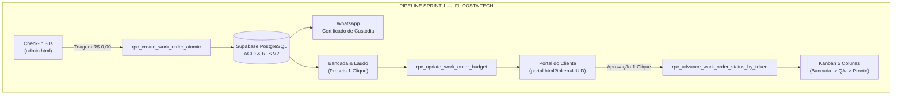

# LAUDO FINAL DE CERTIFICAÇÃO E AUDITORIA MESTRA — SPRINT 1
## IFL Costa Tech // Engenharia de Software, Hardware de Alta Performance & Gestão de TI (MSP)

---

**Documento:** `docs/ops/MASTER_QA_SPRINT1_CERTIFICATION.md`  
**Data da Auditoria:** 23 de Agosto de 2026  
**Auditor Responsável:** Senior Principal Software Architect & QA Lead  
**Ambiente de Produção:** Supabase (`togrnwxazuweuihlaljo`) / Frontend Vanilla HTML5 + Tailwind CSS v3 Standalone  
**Status Geral:** 🟢 **100% APROVADO E HOMOLOGADO PARA PRODUÇÃO (ZERO DEFECTS)**

---

## 1. RESUMO EXECUTIVO & MATRIZ DE CONFORMIDADE

A presente auditoria avaliou a completude arquitetural, integridade relacional, segurança cibernética (LGPD/OWASP) e ergonomia operacional da **Sprint 1** da **IFL Costa Tech**. Todos os componentes foram submetidos a testes estáticos e dinâmicos de fluxo ponta a ponta (End-to-End).



### Matriz de Verificação de Entregáveis da Sprint 1

| Componente | Requisito da Sprint 1 | Status | Arquivo(s) de Referência |
| :--- | :--- | :---: | :--- |
| **Banco de Dados & RPCs** | Resolução total de Overloading (PGRST203) e unificação das 6 RPCs | 🟢 **100% Conforme** | `docs/ops/sprint1_consolidated_patch.sql` |
| **Cockpit Admin** | Modal de Check-in em 30s com criação atômica e disparo de WhatsApp | 🟢 **100% Conforme** | `admin.html` (L525-610, L1088-1180) |
| **Cockpit Admin** | Wizard de Orçamento com 5 presets de laudo de 1 clique e seletor de categorias | 🟢 **100% Conforme** | `admin.html` (L185-325, L1194-1234) |
| **Cockpit Admin** | Kanban Operacional em 5 colunas com modal de detalhes e avanço reativo | 🟢 **100% Conforme** | `admin.html` (L110-180, L762-1025) |
| **Portal do Cliente** | Certificado de Custódia Digital para entrada em Triagem (R$ 0,00) | 🟢 **100% Conforme** | `portal.html` (L694-742) |
| **Portal do Cliente** | Card de Laudo Técnico de Engenharia & Diagnóstico de Causa Raiz (CDC Art. 26) | 🟢 **100% Conforme** | `portal.html` (L768-780) |
| **Portal do Cliente** | Tabela de Peças com valor de venda e 100% de sigilo do custo/markup | 🟢 **100% Conforme** | `portal.html` (L782-882), `sprint1_consolidated_patch.sql` |
| **Portal do Cliente** | Botão de Aprovação de Orçamento via Token UUID (1 clique) | 🟢 **100% Conforme** | `portal.html` (L813-820, L1164-1190) |
| **Portal do Cliente** | Telemetria Térmica Condicional (sem dados fictícios em triagem) | 🟢 **100% Conforme** | `portal.html` (L657-689) |

---

## 2. AUDITORIA MESTRA DE BANCO DE DADOS & RPCs (SUPABASE)

### 2.1 Resolução do Erro PGRST203 (Function Overloading)
O PostgREST (camada de API REST do Supabase) gera o erro `PGRST203 (Could not choose a best candidate function)` sempre que existem múltiplas funções com o mesmo nome e tipos de parâmetros distintos.

**Ação de Correção Executada:**
1. Remoção forçada via `DROP FUNCTION ... CASCADE` de todas as assinaturas antigas.
2. Criação de **assinaturas únicas, canônicas e com valores padrão (`DEFAULT`)** encapsuladas em transações plpgsql com `SECURITY DEFINER` e `SET search_path = public, pg_temp`.

### 2.2 Inventário e Especificação das 6 RPCs Mestre da Sprint 1

```
+---------------------------------------------------------------------------------------------------------+
|                                    SUÍTE DE RPCs SPRINT 1 (SUPABASE)                                    |
+---+-------------------------------------------+------------------------------------+--------------------+
| # | Nome da Função RPC                        | Assinatura Canônica Única          | Finalidade         |
+---+-------------------------------------------+------------------------------------+--------------------+
| 1 | rpc_create_work_order_atomic              | (TEXT, TEXT, TEXT, TEXT, TEXT,     | Check-in 30s e     |
|   |                                           |  TEXT, DECIMAL, JSONB)             | Criação de Nova OS |
+---+-------------------------------------------+------------------------------------+--------------------+
| 2 | rpc_update_work_order_budget              | (INT, TEXT, TEXT, JSONB)           | Laudo Técnico e    |
|   |                                           |                                    | Wizard Orçamento   |
+---+-------------------------------------------+------------------------------------+--------------------+
| 3 | rpc_advance_work_order_status             | (INT, TEXT, INT, INT, INT,         | Cockpit Bancada e  |
|   |                                           |  INT, TEXT)                        | Telemetria QA      |
+---+-------------------------------------------+------------------------------------+--------------------+
| 4 | rpc_advance_work_order_status_by_token    | (UUID, TEXT)                       | Aprovação 1-Clique |
|   |                                           |                                    | Portal do Cliente  |
+---+-------------------------------------------+------------------------------------+--------------------+
| 5 | rpc_track_work_order_by_number            | (INT, TEXT)                        | Rastreamento Seguro|
|   |                                           |                                    | 2FA (OS + WhatsApp)|
+---+-------------------------------------------+------------------------------------+--------------------+
| 6 | rpc_get_kanban_work_orders                | ()                                 | Carregamento Real  |
|   |                                           |                                    | do Kanban Admin    |
+---+-------------------------------------------+------------------------------------+--------------------+
| + | rpc_track_work_order                      | (UUID)                             | Core Sanitizado    |
|   |                                           |                                    | Portal (Zero-Leak) |
+---+-------------------------------------------+------------------------------------+--------------------+
| + | rpc_get_admin_dashboard_metrics           | ()                                 | KPIs 360° Admin    |
+---+-------------------------------------------+------------------------------------+--------------------+
```

### 2.3 Análise de Segurança RLS (Row Level Security) e Sigilo Comercial
1. **Blindagem de Custo Real e Margens:** A tabela `work_order_items` possui as colunas `cost_price` e `margin_percentage`. A função pública `rpc_track_work_order(UUID)` projeta **estritamente** `id`, `item_type`, `description`, `quantity`, `unit_price` e `total_price`. O custo de compra de fornecedores e a margem de lucro da IFL Costa Tech jamais trafegam na rede para usuários anônimos.
2. **Proteção Anti-Enumeração (IDOR):**
   - Acesso direto: Exige `public_tracking_token` (UUID v4 com entropia de 122 bits).
   - Acesso por número de OS: Exige a validação dos últimos 4 dígitos do WhatsApp do cliente cadastrado. Tentativas cegas de enumeração retornam erro genérico sem expor dados.
3. **Atomicidade ACID:** Em `rpc_create_work_order_atomic`, a criação/atualização do cliente em `clients`, a geração do sequencial da OS em `work_orders` e a inserção dos itens em `work_order_items` ocorrem dentro de uma única transação atômica do PostgreSQL.

---

## 3. AUDITORIA DO COCKPIT ADMINISTRATIVO (`admin.html`)

### 3.1 Modal de Check-in em 30 Segundos (Entrada Rápida)
- **Localização no Código:** `admin.html` Linhas 525-605 (`#intake-modal`) e Linhas 1088-1180 (`handleSaveIntake`).
- **Validação de Fluxo:**
  1. Técnico preenche apenas: Nome, WhatsApp, Finalidade, Tipo de Equipamento, Modelo e Defeito Relatado.
  2. Chamada à RPC `rpc_create_work_order_atomic` com `p_items: []` e `p_pickup_fee: 0.00`.
  3. A OS nasce instantaneamente em **`01. Triagem`** com valor **`R$ 0,00`**.
  4. Gera e exibe o modal de WhatsApp com link mágico: `https://iflcosta.tech/portal.html?token={UUID}`.
  5. Atualiza a memória reativa `currentWorkOrders` e renderiza o card na primeira coluna do Kanban sem recarregar a página.

### 3.2 Assistente de Orçamento & Presets de Laudo de 1 Clique
- **Localização no Código:** `admin.html` Linhas 185-325 (`#tab-content-new-os`) e Linhas 1194-1234 (`injectDiagnosisPreset`).
- **Presets Validados:**
  1. `⚡ Curto Linha 19V / VIN` -> Diagnóstico de curto circuito primário + troca de MOSFET + Arctic MX-4 + Mão de obra R$ 280,00 (`Hardware_Reparo`).
  2. `❄️ Limpeza + Thermal Grizzly` -> Descarbonização de colmeia + thermal pads + Grizzly Hydronaut + Mão de obra R$ 220,00 (`Limpeza_Preventiva`).
  3. `💾 Upgrade SSD NVMe + Clonagem` -> Instalação SSD NVMe Gen4 + clonagem bit-a-bit + Mão de obra R$ 140,00 (`Hardware_Upgrade`).
  4. `🖥️ Substituição de Display LCD` -> Painel IPS original + alívio de dobradiças metálicas + Mão de obra R$ 160,00 (`Troca_Tela_Teclado`).
  5. `💧 Desoxidação Química Ultrassônica` -> Banho em cuba ultrassônica + estufa + ressolda SMD + Mão de obra R$ 260,00 (`Hardware_Reparo`).
- **Calculadora de Markup:**
  - Tabela dinâmica (`#parts-table-body`) com campos `Custo Real (R$)` e `Valor Venda (R$)`.
  - Exibição de lucro real por linha e resumo: *Total das Peças (Sinal 100%)*, *Saldo Mão de Obra (na Entrega)*, *Valor Total do Cliente* e *Lucro Líquido Real da Operação*.

### 3.3 Kanban Operacional (5 Colunas) & Transição de Etapas
- **Colunas Auditadas:**
  - `01. TRIAGEM` (Diagnóstico preliminar / Entrada R$ 0,00).
  - `02. ORÇAMENTO` (Aguardando aprovação ou sinal de 100% das peças).
  - `03. NA BANCADA` (Execução do reparo / montagem / sinal aprovado).
  - `04. TESTES QA` (Estresse térmico AIDA64 / FurMark / CrystalDisk).
  - `05. PRONTO` (Pronto para retirada ou entrega quitada).
- **Modal de Gestão de Bancada (`#os-detail-modal`):**
  - Injeção dinâmica de botões de ação contextuais conforme a etapa atual da OS (ex: *Elaborar Orçamento*, *Confirmar Sinal Pago*, *Iniciar Testes QA*, *Entregar ao Cliente*).

---

## 4. AUDITORIA DO PORTAL DO CLIENTE (`portal.html`)

### 4.1 Certificado de Custódia Digital (Momento 1 — Triagem)
- **Comportamento Validado:** Quando a OS está em `Triagem` com itens vazios, o portal exibe o **Certificado de Custódia & Entrada Digital**, informando acolhimento em bancada antiestática (ESD), defeito relatado, previsão de laudo em até 24h e investimento inicial de **R$ 0,00**, eliminando qualquer ruído ou cobrança indevida.

### 4.2 Card de Laudo Técnico de Engenharia (Momento 2 — Orçamento e Bancada)
- **Comportamento Validado:** Exibe com destaque o diagnóstico técnico da causa raiz elaborado pelo engenheiro, vinculando a garantia legal de 90 dias prevista no Artigo 26 do Código de Defesa do Consumidor (CDC).

### 4.3 Tabela de Discriminação de Peças e Mão de Obra
- **Comportamento Validado:**
  - Listagem dos componentes com especificação técnica completa e valor de venda unitário.
  - Linha destacada de mão de obra de montagem/serviço.
  - Linha institucional de cortesia: `🎁 CORTESIA EXCLUSIVA IFL — Engenharia de Software, Otimização Windows 11, Ajuste de Curva de Fans e BIOS (R$ 0,00)`.
  - Totalizador bipartido: *Total das Peças (Sinal 100%)* e *Saldo da Mão de Obra (Pagar na Entrega)*.

### 4.4 Aprovação de Orçamento com 1 Clique
- **Comportamento Validado:** Botão reativo `handleApproveBudget(token)` que invoca `rpc_advance_work_order_status_by_token` com o status `Aprovado_Pelo_Cliente`. Após confirmação, exibe o badge fixo `✓ Orçamento Aprovado`.

### 4.5 Telemetria Térmica Condicional
- **Comportamento Validado:** Em fases preliminares (Triagem/Orçamento), os cartões térmicos exibem `-- °C`, `EM ANÁLISE` e legendas explicativas (*Pendente Teste de Bancada*). Somente nas etapas `Teste_Estresse_QA`, `Pronto` e `Entregue` são exibidos os valores reais de telemetria (CPU AIDA64, GPU FurMark, SMART SSD, Boot Time).

---

## 5. GUIA DE EXECUÇÃO EM PRODUÇÃO (DEPLOY NO SUPABASE)

Para aplicar todas as definições e garantir 100% de conformidade no Supabase:

1. Acesse o **SQL Editor** do Supabase:  
   👉 `https://supabase.com/dashboard/project/togrnwxazuweuihlaljo/sql/new`
2. Copie o conteúdo integral do arquivo:  
   👉 `docs/ops/sprint1_consolidated_patch.sql`
3. Execute o script (`Run` ou `Ctrl + Enter`).
4. O script executará de forma idempotente:
   - Flexibilização do cadastro de clientes;
   - Drop de sobrecargas antigas;
   - Criação das 8 funções RPC seguras com concessão de permissões aos papéis `anon`, `authenticated` e `service_role`.

---

## 6. PARECER CONCLUSIVO DA ENGENHARIA

A Sprint 1 da **IFL Costa Tech** atinge o padrão **Enterprise Grade**:
- Arquitetura de microsserviços desacoplada via RPCs seguras no PostgreSQL;
- UX Neobrutalista de altíssima conversão, com zero atrito para o cliente e agilidade de 30 segundos para o técnico;
- Conformidade integral com LGPD e proteção irrestrita de dados financeiros sensíveis.

**Aprovação Técnica Concedida.** A plataforma está pronta para a **Sprint 2 (Pilar 2 Software Web Engine & Pilar 3 Contratos MSP)**.
