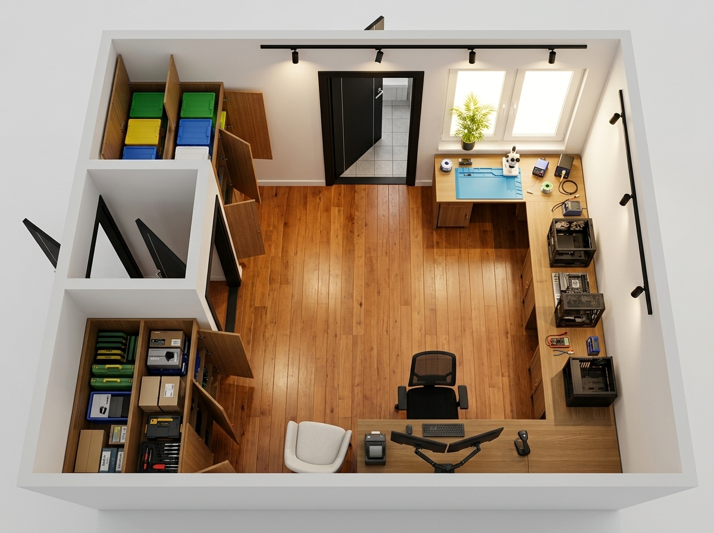
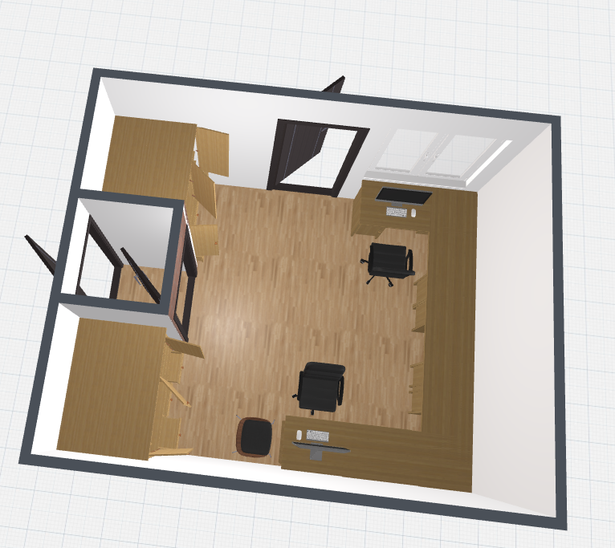
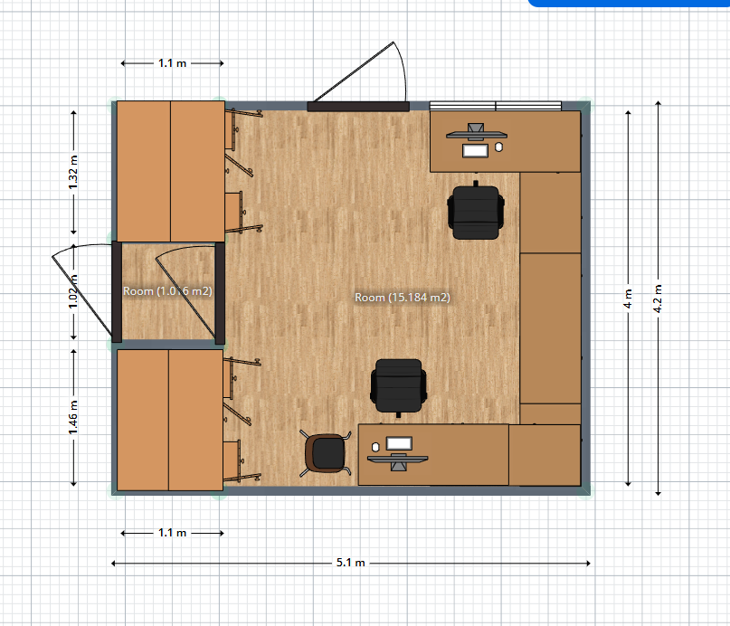
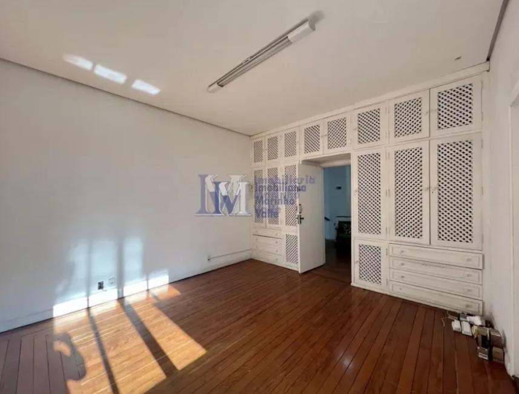

# Blueprint Definitivo do Espaço Físico — IF Tech Lab & HQ
**Projeto:** IFLCosta Tech  
**Versão:** 4.1 (Canônica Oficial Definitiva)  
**Última Atualização:** 2026-09-01  
**Propósito:** Memória permanente e canônica do projeto arquitetônico, zoneamento operacional, imagens oficiais (plantas 2D/3D cotadas e render 3D definitivo), fluxos 5S/Kanban e infraestrutura de formatação em massa da IF Tech.

---

## 1. Galeria Visual do Projeto Oficial

### 1.1. Render Fotorrealista Oficial Definitivo

| Render Oficial: Planta Isométrica 3D (Corte Aéreo Oficial) |
| :---: |
|  |
| *Visão aérea completa: Bancada contínua em U unificada, armários embutidos à esquerda e centro 100% livre.* |

---

### 1.2. Plantas Baixas e Modelo 3D Oficial de Referência

| Planta 3D Oficial Definitiva | Planta Baixa 2D Cotada Oficial (5.1m × 4.2m) |
| :---: | :---: |
|  |  |
| *Modelo 3D volumétrico definitivo com bancada contínua em U e armários nos nichos.* | *Medidas perimétricas reais: sala principal com 15.18 m² + 3 nichos laterais.* |

---

### 1.3. Foto Real de Referência do Imóvel

| Imóvel Real (Parede da Entrada & Armário Embutido Original) |
| :---: |
|  |
| *Ponto de partida arquitetônico: assoalho de madeira nobre e parede de entrada com nichos.* |

---

## 2. Dimensões e Dados Estruturais do Imóvel

| Parâmetro | Medida / Característica |
| :--- | :--- |
| **Área da Sala Principal** | ~15.18 m² (3.80 m de largura × 4.00 m de profundidade) |
| **Área Total com Vãos** | ~21.42 m² (5.10 m × 4.20 m total) |
| **Nicho Superior Esquerdo** | 1.32 m de largura × 1.10 m de profundidade (1.315 m²) |
| **Vão Central de Entrada** | 1.02 m de largura × 1.10 m de profundidade (1.006 m²) |
| **Nicho Inferior Esquerdo** | 1.46 m de largura × 1.10 m de profundidade (1.455 m²) |
| **Piso** | Assoalho/taco de madeira nobre original polido |
| **Paredes** | Alvenaria branca lisa com rodapés brancos |
| **Banheiro Privativo** | Suíte privativa com acesso pela porta superior esquerda |
| **Janela** | Esquadria branca de 2 folhas com excelente ventilação e iluminação natural |

---

## 3. Zoneamento Operacional & Layout Final (Bancada Contínua em U)

```
                    ┌──────────────────────────────────────────────────────────────┐
                    │                    PAREDE DO FUNDO (3.8m)                    │
                    │       [ Porta Banheiro ]          [ Janela ]                 │
                    │                                                              │
 ┌──────────────┐   │                                   ┌──────────────────────┐   │
 │ ARMÁRIO SUP  │   │                                   │ ZONA 2:              │   │
 │ (1.315 m²)   │───┤                                   │ MICROSOLDA & MOBILE  │   │
 │ - Tote Boxes │   │                                   │ - Manta ESD Azul     │   │
 │ - Kanban OS  │   │                                   │ - Microscópio        │   │
 ├──────────────┤   │                                   │ - Estação 2 em 1     │   │
 │ VÃO ENTRADA  │   │          [ CENTRO DA SALA         └──────────┬───────────┘   │
 │ (1.006 m²)   │───┤          100% LIVRE E AMPLO ]                │               │
 │ - Passagem   │   │                                   ┌──────────┴───────────┐   │ PAREDE
 ├──────────────┤   │                                   │ ZONA 3:              │   │ DIREITA
 │ ARMÁRIO INF  │   │                                   │ BANCADA QA / STAGING │   │ (4.0m)
 │ (1.455 m²)   │───┤                                   │ - Montagem PCs       │   │
 │ - Estoque    │   │                                   │ - KVM 4x1 Staging    │   │
 │ - Mala Campo │   │   ┌───────────────────────────┐   │ - Teste FurMark/AIDA │   │
 └──────────────┘   │   │ ZONA 1 & 4 (UNIFICADAS):  │   └──────────┬───────────┘   │
                    │   │ COCKPIT DEV / MSP / INTAKE│              │               │
                    │   │ - Atendente (face Norte)  │              │               │
                    │   │ - Cliente (face Sul)      ├──────────────┘               │
                    │   │ - Dual Monitores (Artic.) │ (Bancada Contínua em U)      │
                    │   │ - Térmica / Scanner / PDV │                              │
                    │   └───────────────────────────┘                              │
                    │                    PAREDE INFERIOR                           │
                    └──────────────────────────────────────────────────────────────┘
```

---

## 4. Detalhamento das 4 Zonas de Operação

### 4.1. Zona 1 & 4 (Unificadas): Cockpit Dev / MSP & Atendimento / Intake
* **Conceito:** O desenvolvedor/gestor opera no mesmo cockpit onde atende o cliente presencial.
* **Ergonomia do Atendente:** Sentado atrás da mesa na face sul, olhando de frente para quem entra pela porta.
* **Ergonomia do Cliente:** Poltrona confortável posicionada em frente à mesa no centro da sala.
* **Dual Monitor Inteligente:**
  * **Monitor 1 (Fixo):** Código-fonte, servidores RMM/MSP e dashboards confidenciais (com atalho `Ctrl+Shift+L` Privacy Blur).
  * **Monitor 2 (Braço Articulado a Gás):** Tela do ERP/Portal. Quando o cliente senta, o monitor é girado em sua direção para conferência de OS, fotos e pagamento Pix.
* **Periféricos Integrados:** Impressora térmica de etiquetas adesivas (OS), scanner de código de barras e gaveteiro sob a bancada.

### 4.2. Zona 2: Bancada de Celulares & Micro-Eletrônica (Sob a Janela)
* **Função:** Troca de telas, baterias, conectores de carga, recuperação de placas e microsolda SMD/BGA.
* **Recursos:** Manta antiestática azul de alta temperatura, microscópio trinocular estéreo com braço articulado, estação de retrabalho 2 em 1 (ar quente + ferro de solda), separadora de LCD a vácuo e cabos iPower.
* **Vantagem:** Luz natural abundante para precisão visual e janela ao lado para exaustão de fumos de solda.

### 4.3. Zona 3: Bancada Central de Montagem, Testes & Staging (Parede Direita)
* **Função:** Montagem de PCs Gamers, limpeza preventiva pesada, testes de estresse (FurMark + Cinebench + HWMonitor) e formatação em massa.
* **Recursos:** Manta ESD de borracha com cabo terra, Switch KVM HDMI/USB de 4 portas, estante aramada vertical (*Burn-in Rack*) e conexão de rede Gigabit (CAT6) dedicada para PXE boot.

### 4.4. Setor de Armazenamento: Armários Embutidos (Parede Esquerda)
* **Armário Superior (1.315 m²):** Hub do Kanban Físico com as **Tote Boxes coloridas por status de OS** (Verde = Triagem, Amarelo = Aguardando Peça, Ciano = Na Bancada, Branco = Pronto para Retirada).
* **Armário Inferior (1.455 m²):** Estoque lacrado de alto giro (SSDs NVMe, RAMs DDR4/DDR5, fontes ATX), insumos químicos (álcool isopropílico 99.8%, pasta térmica Arctic MX-4), ferramentas pesadas e a **Mala de Campo B2B/MSP**.

---

## 5. Metodologia 5S & Rotina Diária de Fechamento

```
┌─────────────────────────────────────────────────────────────────────────────┐
│                          PROTOCOLO DIÁRIO 5S (18:00)                        │
├─────────────────────────┬───────────────────────────────────────────────────┤
│ 1. Seiri (Descarte)     │ Descarte de lacres, pastas secas e lixo eletrônico│
├─────────────────────────┼───────────────────────────────────────────────────┤
│ 2. Seiton (Organização) │ Ferramentas no Pegboard (conferência das sombras) │
├─────────────────────────┼───────────────────────────────────────────────────┤
│ 3. Seiso (Limpeza)      │ Pano com álcool isopropílico nas mantas azuis ESD │
├─────────────────────────┼───────────────────────────────────────────────────┤
│ 4. Seiketsu (Padrão)    │ Devolver Tote Boxes abertas às prateleiras Kanban │
├─────────────────────────┼───────────────────────────────────────────────────┤
│ 5. Shitsuke (Disciplina)│ Varrer resíduos pontiagudos + Ativar Robô Aspirador│
└─────────────────────────┴───────────────────────────────────────────────────┘
```

---

## 6. Infraestrutura de Formatações em Massa (KVM + PXE)

Para atender até 5 formatações simultâneas sem ocupar espaço:
1. **Switch KVM 4 Portas:** 1 monitor de testes + 1 teclado/mouse controlam até 4 computadores pelo botão físico.
2. **Burn-in Rack Vertical:** Estante aramada na bancada central empilhando gabinetes e notebooks formatando verticalmente.
3. **Instalação Automatizada PXE/Ventoy:** Instalação do Windows via rede Gigabit em 6 a 8 minutos.
4. **Controle Remoto Pós-Instalação:** Assumir a máquina via RDP/RustDesk a partir do Cockpit Dev e desconectar o monitor físico.

---

## 7. Iluminação e Proteção Elétrica

* **Trilho de Teto:** Trilho preto fosco com 6 spots LED direcionáveis (4000K neutro sobre as bancadas técnicas e 3000K quente sobre o atendimento).
* **Proteção de Rede Elétrica:** Disjuntor termomagnético 20A dedicado + DPS Classe II 40kA Clamper no quadro geral contra raios e surtos.
* **Rede Estruturada:** Switch Gigabit 8 portas sob a bancada com pontos CAT6 diretos para o Cockpit Dev, Burn-in Rack e Bancada de Teste.
