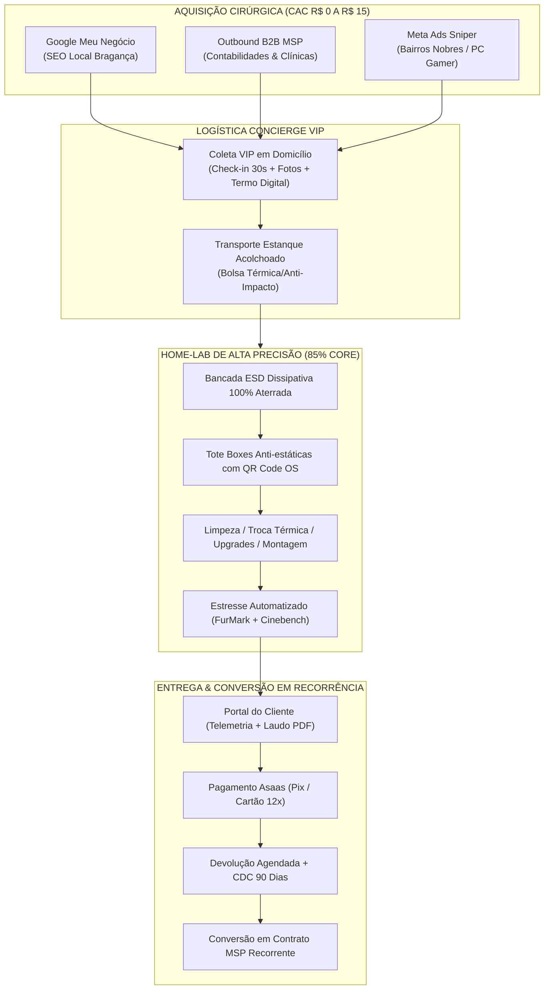
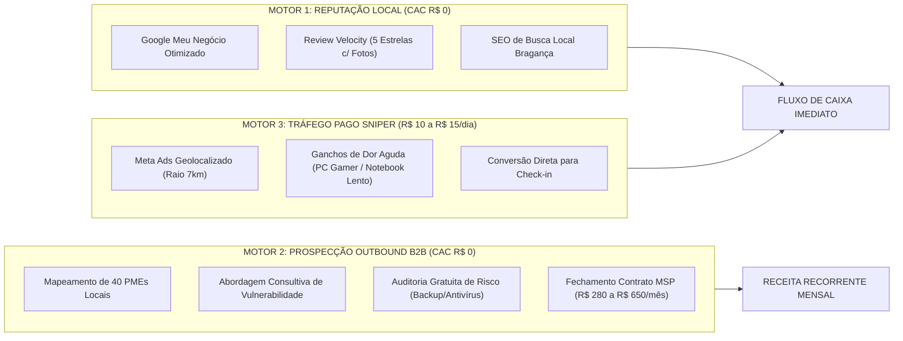
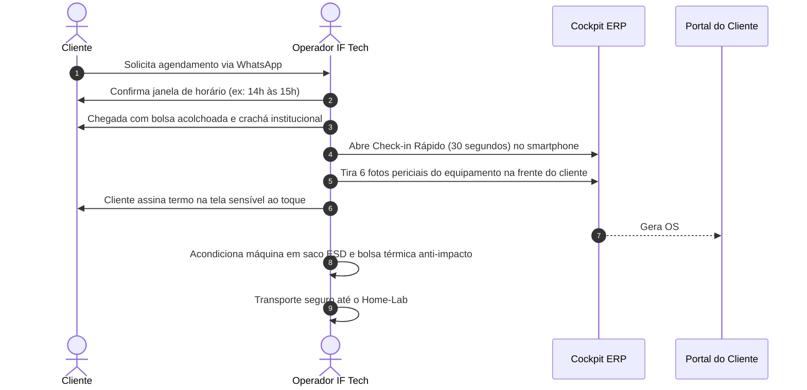

# 🚀 PLANO OPERACIONAL MESTRE — LANÇAMENTO HOME-LAB & CONCIERGE VIP
## Análise Estratégica, Engenharia de Bancada, Posicionamento e Metas dos Primeiros 30 Dias
**Empresa:** IF Tech (IFLCosta Tech Solutions)  
**Praça de Lançamento:** Bragança Paulista - SP & Região Bragantina  
**Autor:** Diretor de Operações e Estratégia de Negócios (COO)  
**Versão:** 1.0 — Executiva e Sem Filtros  
**Data de Vigência:** Setembro de 2026  
**Documento Canônico:** [`PLANO_OPERACIONAL_HOME_LAB_LANCAMENTO.md`](file:///c:/tech-solutions-ifl/docs/ops/PLANO_OPERACIONAL_HOME_LAB_LANCAMENTO.md)

---

## 📑 SUMÁRIO EXECUTIVO

O lançamento da **IF Tech** a partir do quarto do fundador (formato **Home-Lab Técnico de Alta Precisão** combinado com o **Modelo Concierge VIP Leva-e-Traz**) não representa um "improviso temporário" ou sinal de escassez; é uma **decisão de engenharia de negócios cirúrgica, assimétrica e de risco zero**.

Empreendedores iniciantes cometem o erro fatal de contrair custos fixos imediatos — aluguel comercial, IPTU, água, luz comercial, condomínio e decoração de fachada — antes mesmo de validar sua máquina de aquisição de clientes e seu fluxo de caixa diário. Ao operar a fase de ignição (Dias 1 a 60) no modelo Home-Lab:
1. **O OPEX Fixo despenca de ~R$ 2.200,00/mês para ~R$ 345,00/mês** (apenas MEI, energia proporcional e conectividade redundante);
2. **O Runway financeiro do fundador é estendido ao infinito**, eliminando a ansiedade por vendas desesperadas a preços vis;
3. **A experiência do cliente é elevada ao padrão "Private Concierge"**, onde o cliente da classe média/alta e PMEs de Bragança Paulista não perde tempo no trânsito central para levar uma máquina pesada em lojas empoeiradas de galeria, mas é atendido na sua porta com termo formal e acompanha tudo em tempo real pelo **Portal do Cliente**.

Este plano detalha cada aspecto operacional, técnico, mercadológico e financeiro para transformar o quarto do fundador em um laboratório com rigor de sala limpa e faturamento imediato desde a primeira semana.



---

## 1. 🔬 LOGÍSTICA OPERACIONAL HOME-LAB (O QUARTO DO FUNDADOR)

Operar um laboratório dentro do próprio quarto de dormir impõe desafios severos de **convivência, biossegurança, eletricidade estática e privacidade de dados**. A chave para o sucesso é a **segregação física e visual absoluta** entre o espaço habitacional e o espaço laboratorial.

### 1.1 Zoneamento Físico do Quarto (Layout de Contenção)

O quarto do fundador deve ser dividido em 4 zonas operacionais estritas:

```
┌────────────────────────────────────────────────────────────────────────┐
│                   PAREDE DA JANELA (VENTILAÇÃO & LUZ)                  │
│                                                                        │
│   ┌────────────────────────────────────────────────────────────────┐   │
│   │ ZONA A: BANCADA TÉCNICA PRINCIPAL (1.60m × 0.70m)              │   │
│   │ • Manta Antiestática Azul com Ponto de Aterramento Central     │   │
│   │ • Luminária Articulada LED 4500K + Lupa / Iluminação 1500 Lux   │   │
│   │ • Switch KVM 4x1 + Monitor de Burn-In / Testes                 │   │
│   │ • Mini Pegboard Vertical para Ferramental Ativo                │   │
│   └────────────────────────────────────────────────────────────────┘   │
│                                                                        │
│   ┌────────────────────────┐              ┌────────────────────────┐   │
│   │ ZONA B: STAGING & TOTE │              │ ZONA C: COCKPIT GESTÃO │   │
│   │ • Prateleira Vertical  │  [ ESPAÇO    │ • Mesa de Trabalho Dev │   │
│   │ • Caixas Organizadoras │   CIRCULAÇÃO │ • Dual Monitor         │   │
│   │   Anti-estáticas (OS)  │   LIVRE ]    │ • Privacy Blur (Crtl+L)│   │
│   │ • Cabos Embalados      │              │ • Impressora Térmica   │   │
│   └────────────────────────┘              └────────────────────────┘   │
│                                                                        │
│   ====================== CORREDOR DE ISOLAMENTO ====================   │
│                                                                        │
│   ┌────────────────────────────────────────────────────────────────┐   │
│   │ ZONA D: ÁREA PESSOAL / DESCANSO                                │   │
│   │ • Cama e Roupeiro Pessoal (Zona Neutra)                        │   │
│   │ • PROIBIÇÃO EXPRESSA: Nenhuma peça de cliente sobre a cama!    │   │
│   └────────────────────────────────────────────────────────────────┘   │
│                                                                        │
└────────────────────────────────────────────────────────────────────────┘
```

### 1.2 Proteção Antiestática (ESD) de Grau Cirúrgico em Piso Residencial

Quartos residenciais costumam ter fatores críticos de indução estática: pisos de madeira/laminado, carpetes, lençóis de poliéster e roupas casuais de algodão/lã. Uma única descarga de 100V (imperceptível ao tato humano) é suficiente para romper portas lógicas de silício de placas de vídeo RTX e processadores modernos.

* **Aterramento Físico Compulsório:** A manta antiestática da bancada NÃO pode ficar "solta". Ela deve ser aterrada com pino de aterramento padrão NBR 14136 conectado ao terra real da residência. Se a tomada do quarto não possuir fio terra funcional verificado por testador de polaridade/multímetro, o fundador deve providenciar a descida de um cabo terra de 2.5mm² até uma haste cobreada ou quadro de distribuição.
* **Manta Dissipativa de Dupla Camada:** Manta de borracha ESD azul (camada superior dissipativa $10^7 - 10^9\ \Omega$, camada inferior condutiva $10^3 - 10^5\ \Omega$), resistente a calor e álcool isopropílico.
* **Pulseira e Calcanheira Antiestática com Resistor de 1MΩ:** Uso obrigatório de pulseira ESD conectada ao borne da manta durante o manuseio de placas-mãe, GPUs e módulos de memória desprovidos de dissipador.
* **Vestimenta Operacional:** Nunca operar em bancada com agasalhos de lã ou tecidos sintéticos que acumulam carga estática; utilizar camiseta 100% algodão e jaleco antiestático com fios de carbono condutivo (custo médio: R$ 85,00).

### 1.3 Iluminação Técnica & Registro Fotográfico Pericial

* **Iluminação de Bancada:** Luminária articulada de LED com CRI/IRC $\ge 90$ (Índice de Reprodução de Cor) e temperatura neutra de **4500K**. Evita fadiga ocular durante montagens minuciosas e não distorce a cor de componentes oxidados ou capacitores estufados.
* **Luz de Preenchimento Fotográfico:** Mini anel de luz (*Ring Light* USB articulado) posicionado sobre o ponto de unboxing da bancada. As fotos de entrada de OS enviadas ao cliente pelo sistema devem ter nitidez cristalina, sem sombras grosseiras, evidenciando riscos prévios, lacres violados ou poeira acumulada.

### 1.4 Ferramental Cirúrgico Mínimo Viável de Bancada

Não há necessidade de investir R$ 10.000 em maquinário pesado antes da validação. O kit cirúrgico enxuto da IF Tech é composto por:

| Ferramenta / Insumo | Função Específica | Especificação Recomendada |
| :--- | :--- | :--- |
| **Kit de Chaves de Precisão** | Desmontagem de notebooks, coolers e gabinetes | Chaves magnéticas seletivas S2 (estilo iFixit ou Wowstick 64-em-1) |
| **Pincéis ESD & Escovas Antiestáticas** | Remoção mecânica de detritos e fuligem | Cerdas condutivas sintéticas anti-estática |
| **Dispensador Pump de Álcool Isopropílico** | Dosagem precisa de álcool 99.8% sem evaporação | Frasco pump anti-estático ESD de 200ml com tampa metálica |
| **Pasta Térmica de Alta Condutividade** | Interface térmica para CPUs e GPUs exigentes | Arctic MX-4 / MX-6 ou Thermal Grizzly Kryonaut (8.5 a 12.5 W/mK) |
| **Kit de Thermal Pads Multiespessura** | Reposição térmica em VRMs e memórias VRAM | Espessuras 0.5mm, 1.0mm, 1.5mm e 2.0mm com condutividade $\ge 6.0\text{ W/mK}$ |
| **Multímetro Digital com Beep Rápido** | Teste de continuidade em barramentos e fusíveis | True-RMS com pontas finas agulhadas (Minipa ou similar) |
| **Testador de Fonte Digital ATX** | Diagnóstico rápido de voltagens (+12V, +5V, +3.3V, PG) | Testador ATX LCD digital de 24 pinos |
| **Soprador Térmico Portátil / Desumidificador** | Secagem rápida de placas pós-limpeza química | Soprador elétrico regulável (temperatura morna < 60°C) |
| **Switch KVM 4 Portas HDMI/USB** | Controle de até 4 máquinas em teste com 1 tela | Chaveador KVM 4K @ 60Hz com comutação física |

### 1.5 Sistema de Custódia Física de Peças (Tote Boxes Anti-estáticas)

O maior pesadelo de uma assistência caseira é a desorganização: parafusos perdidos, cabos de clientes trocados e peças misturadas.

```
┌────────────────────────────────────────────────────────────────────────┐
│               FLUXO DA TOTE BOX DE CUSTÓDIA POR OS                     │
├────────────────────────────────────────────────────────────────────────┤
│ 1. Chegada do Equipamento (Leva-e-Traz)                                │
│    └─► Alocação imediata em Caixa Plástica Organizadora ESD Dedicada   │
│ 2. Etiquetagem Frontal                                                 │
│    └─► Etiqueta térmica impressa com: #OS | Cliente | Data | Acessórios│
│ 3. Compartimento de Parafusos e Miudezas                               │
│    └─► Estojo magnético ou caixinha de remédios com divisórias por peça│
│ 4. Cabos e Fontes Externas                                             │
│    └─► Ensacados em saco zíper antiestático com o número da OS grafado │
│ 5. Posição no Staging                                                  │
│    └─► Prateleira vertical identificada (Verde = Triagem / Azul = Teste│
└────────────────────────────────────────────────────────────────────────┘
```
* **Regra Inegociável:** NUNCA duas ordens de serviço podem ter peças ou parafusos fora de sua respectiva Tote Box simultaneamente na bancada. Cada máquina tem sua vez na manta.

### 1.6 Biossegurança, Controle de Poeira e Manejo de Químicos

Um quarto residencial não pode se transformar em um ambiente insalubre impregnado de pó tóxico ou vapores químicos.

* **Regra de Ouro do Ar Comprimido (PROIBIÇÃO TOTAL NO QUARTO):**
  * É **terminantemente proibido** utilizar soprador de ar comprimido ou espanador elétrico para "soprar poeira" dentro do quarto. Isso saturaria o ar com ácaros, fungos e fuligem que se depositariam sobre as roupas de cama e seriam inalados pelo fundador durante o sono.
  * **Protocolo de Expulgo Inicial:** Máquinas com acúmulo severo de poeira passam pelo primeiro jateamento em **área aberta externa da residência (garagem, quintal ou sacada)**, com uso obrigatório de máscara de proteção respiratória PFF2/N95. Apenas após a remoção da sujeira grossa a máquina é transportada para a bancada técnica do quarto.
* **Isolamento de Químicos Voláteis:**
  * O frasco de 1 Litro de álcool isopropílico 99.8% e os sprays limpa-contatos devem permanecer guardados dentro de uma caixa plástica com trava hermética embaixo da bancada, fora da luz solar e longe de fontes de calor.
  * Durante a limpeza de placas com álcool, a janela do quarto deve permanecer 100% aberta, gerando ventilação cruzada para dissipação rápida de vapores inflamáveis.

### 1.7 Segurança da Informação, LGPD e Privacidade Doméstica

A confiança é o ativo mais caro da IF Tech. O cliente precisa ter certeza matemática de que seus dados estão tão seguros quanto em um cofre bancário.

* **Isolamento de Rede (VLAN de Bancada / Sub-rede de Visitantes):**
  * O roteador Wi-Fi da residência deve ser configurado com uma rede dedicada exclusiva para os computadores de clientes em teste (ex: `IFTech-Lab-Isolated`), isolada por firewall da rede doméstica e do computador pessoal do fundador. Máquinas de clientes nunca enxergam impressoras ou dispositivos pessoais.
* **Atalho de Privacidade Instantâneo (`Ctrl+Shift+L` Privacy Blur):**
  * O cockpit de gestão da IF Tech possui script de desfoque automático de dados sensíveis na tela. Quando qualquer pessoa entra no quarto ou ao gravar vídeos de bancada para o Instagram/Portal, dados financeiros e nomes de clientes são anonimizados.
* **Política Zero-Curiosidade (Ética Radical):**
  * NENHUM arquivo pessoal do cliente (pastas Documentos, Fotos, Vídeos, Navegador) é aberto em nenhuma hipótese. Backups de transição são realizados via imagem compactada de partição ou sincronização cega via linha de comando (`robocopy` com flag silenciosa), com cálculo de hash SHA-256 e exclusão segura imediata após a entrega validada pelo cliente.
* **Criptografia e Termo LGPD Integrado:**
  * Toda OS aberta no ERP emite automaticamente o comprovante com a cláusula padrão de não-violação e confidencialidade de dados, blindando juridicamente o laboratório.

---

## 2. ⚖️ MATRIZ OPERACIONAL 85/15: O QUE FAZER NO HOME-LAB VS O QUE DELEGAR

A lucubração de que uma assistência precisa "fazer de tudo dentro de quatro paredes" destrói negócios nascentes. O segredo da alta rentabilidade é dominar com velocidade os 85% dos serviços de alto giro e margem limpa, delegando ou encaminhando externamente os 15% que demandam maquinário industrial pesado, risco químico ou ruído insuportável.

```
┌─────────────────────────────────────────────────────────────────────────────┐
│                 MATRIZ DE CAPACIDADE OPERACIONAL IF TECH                    │
├──────────────────────────────────────┬──────────────────────────────────────┤
│ 🟢 85% DA DEMANDA (CORE HOME-LAB)    │ 🔴 15% DA DEMANDA (DELEGAR/EXTERNO)  │
│ - Margem Líquida: 75% a 92%          │ - Margem de Repasse / Intermediação  │
│ - Ruído Zero / Risco Químico Baixo   │ - Alto Ruído / Químicos Pesados      │
│ - Prazo Médio: 4h a 24h              │ - Exige Maquinário de Alto Custo     │
├──────────────────────────────────────┼──────────────────────────────────────┤
│ • Limpeza Técnica Profunda & Repaste │ • Reballing de Chipset BGA & GPU     │
│ • Montagem Completa de PC Gamer      │ • Recuperação de Trilha Multicamadas │
│ • Upgrade de SSD NVMe e Clonagem Bit │ • Solda Plástica Estrutural Pesada   │
│ • Otimização de BIOS, XMP e SO       │ • Banho Ultrassônico com Solvente    │
│ • Testes de Estresse QA (Burn-In)    │ • Troca de Vidro Curvo de Smartphone │
│ • Suporte Remoto e Telemetria MSP    │ • PCs Industriais com Graxa Pesada   │
└──────────────────────────────────────┴──────────────────────────────────────┘
```

### 2.1 Os 85% Core: Por Que Geram o Maior Lucro

1. **Limpeza Técnica Profunda & Troca Térmica Premium (Ticket R$ 220,00 a R$ 250,00):**
   * Custo de insumo: ~R$ 8,00 (2 gotas de Arctic MX-4 + tiras de thermal pad + algodão/isopropanol).
   * Tempo de execução: 1h30 a 2h00.
   * Lucro Líquido: **> R$ 210,00 por máquina**.
   * Processo limpo, silencioso e realizável inteiramente sobre a manta azul no quarto.
2. **Montagem de PC Gamer / Workstation com Cable Management Militar (Ticket R$ 285,00 a R$ 415,00):**
   * Peças compradas com o sinal de 100% do cliente via Asaas (capital de giro zero).
   * Montagem precisa, fixação de fans, ajuste de curvas de temperatura na BIOS, undervolting estável, instalação limpa do Windows 11 com script de otimização de telemetria.
   * Lucro Líquido: **100% da mão de obra é margem**.
3. **Upgrades de Alto Impacto (SSD NVMe + RAM) com Clonagem Bit a Bit (Ticket R$ 140,00 Mão de Obra + Margem de 40% na Peça):**
   * Máquinas lentas com HD mecânico ganham sobrevida espetacular em 1h de bancada.
   * O cliente percebe valor imediato (a máquina que levava 3 minutos para ligar passa a iniciar em 8 segundos).
4. **Formatação Otimizada & Engenharia de Software (Ticket R$ 160,00):**
   * Script automatizado com instalação de drivers limpos sem instaladores patrocinados.
   * Teste de estabilidade MemTest86 e CrystalDiskInfo antes da entrega.

### 2.2 Os 15% Especiais: Parcerias Estratégicas e Intermediação Inteligente

Tentativas de realizar reballing caseiro com sopradores manuais ou fornos improvisados dentro de um quarto geram desastres operacionais e queima de componentes de clientes.

* **Parceria de Solda BGA e Microeletrônica Pesada:** A IF Tech mantém convênio B2B com 1 laboratório de referência em microeletrônica (especializado em reparo de placas de vídeo e placas-mãe de notebook em Campinas/SP ou São Paulo).
  * **Modelo de Intermediação Comercial:** O laboratório parceiro cobra R$ 350,00 pelo reparo da placa em bancada industrial. A IF Tech orça o serviço integrado ao cliente por **R$ 680,00 a R$ 750,00**, cobrindo o diagnóstico inicial, desmontagem, envio via transportadora expressa com seguro, reinstalação, testes de estresse periciais e a garantia unificada sob a marca IF Tech.
  * **Benefício:** A IF Tech retém **R$ 330,00 a R$ 400,00 de margem limpa** sem gastar um centavo em máquinas de retrabalho BGA infravermelhas de R$ 30.000,00 nem poluir o quarto com fumaça tóxica de chumbo.
* **Máquinas com Sujeira de Obra, Terra ou Resíduos Industriais:**
  * O expulgo de sujeira pesada ocorre exclusivamente na garagem/área externa antes de qualquer aproximação do quarto. Se a estrutura do gabinete estiver oxidada ou contaminada quimicamente, a IF Tech recomenda ao cliente a substituição do gabinete por um novo, agregando valor estético e eliminando o vetor de sujeira.

---

## 3. 👑 POSICIONAMENTO DE MARCA: CONCIERGE VIP VS "A LOJINHA DE GALERIA"

Muitos técnicos sofrem de uma limitação psicológica paralisante: acreditam que "não ter uma portinha aberta no centro comercial" os coloca em desvantagem. **No mercado moderno de alto padrão, a realidade é o exato oposto.**

### 3.1 A Anatomia da Decadência da Assistência de Galeria Tradicional

As assistências técnicas de rua/galeria em cidades do interior paulista sofrem de patologias crônicas de percepção que afastam o cliente qualificado:

| A "Lojinha de Galeria Tradicional" (Padrão Arcaico) | O "Concierge VIP IF Tech" (Padrão Nova Economia) |
| :--- | :--- |
| **Atrito Logístico:** O cliente precisa pegar trânsito no centro, caçar vaga de estacionamento paga, carregar uma torre de 15kg nos braços debaixo de sol ou chuva. | **Comodidade Absoluta:** O cliente agenda pelo WhatsApp e um representante uniformizado recolhe a máquina na porta de sua casa ou empresa com bolsa acolchoada. |
| **Ambiente Marginalizado:** Balcão de fórmica desgastada, cheiro de cigarro, cabos espalhados no chão, atendente desatento que anota o defeito num papel de bloco de notas. | **Transparência Digital:** Check-in digital em 30 segundos no tablet/smartphone; o cliente assina digitalmente e recebe o protocolo com hash pericial na hora. |
| **O Abismo do "Sem Notícias":** O cliente fica 10 dias sem resposta, liga na loja e ouve: *"O técnico ainda não olhou, liga amanhã"*. | **Telemetria no Portal do Cliente:** O cliente acessa seu link privado e vê o status em tempo real (Triagem, Na Bancada, Em Teste FurMark, Aprovado no QA). |
| **Medo do Golpe de Peças:** A desconfiança popular clássica: *"Será que vão trocar minhas peças boas por velhas? Vão ver minhas fotos íntimas?"*. | **Laudo Técnico Pericial:** Fotos em alta resolução de cada componente, número de série catalogado no sistema e termo formal com garantia legal CDC de 90 dias. |
| **Guerra de Preços no Fundo do Poço:** Concorre com o "sobrinho" cobrando R$ 50 para formatar com Windows pirata ativado por vírus KMS. | **Posicionamento de Engenharia:** Não vende "conserto barato"; entrega **engenharia de performance, segurança de dados e tranquilidade corporativa**. |

### 3.2 O Efeito "Private Banking": Por Que o Cliente Paga Mais Caro Pelo Concierge

Quando um advogado, médico, arquiteto ou gamer de classe média-alta adquire um equipamento de R$ 8.000 a R$ 25.000, **ele tem pavor de entrar numa loja de galeria**. Para ele, o tempo gasto em deslocamento vale muito mais que R$ 50 ou R$ 100 de taxa de entrega.

O modelo **Concierge Leva-e-Traz** opera na mesma psicologia de um serviço de alfaiataria personalizada ou de um banco privado:
1. O cliente se sente especial e valorizado ao ser atendido em seu próprio ambiente;
2. A existência de um **Portal Web próprio com domínio institucional, design moderno e fotos da bancada** transmite uma sofisticação tecnológica superior à de qualquer loja física local que usa software arcaico em tela azul de DOS;
3. O modelo elimina a fricção da cobrança: orçamentos são aprovados com 1 clique no celular e faturados instantaneamente via Pix ou link Asaas em até 12x.

### 3.3 Como Destruir a Objeção "Vocês Têm Loja Física?"

Eventualmente, algum cliente tradicional perguntará: *"Onde fica a loja de vocês para eu levar?"*. A resposta nunca deve soar defensiva ou evasiva. Ela deve reafirmar a superioridade do modelo:

> **Script de Autoridade Inabalável:**
> *"Olá, [Nome do Cliente]! Excelente pergunta. A IF Tech opera no formato **Private Lab & Concierge**, exatamente como os centros especializados de alta tecnologia em São Paulo e no exterior.*
> 
> *Para garantir sigilo absoluto aos dados dos nossos clientes corporativos e manter o padrão de sala limpa sem circulação de poeira da rua, nosso laboratório técnico possui controle de acesso restrito e não opera como comércio de balcão aberto ao público.*
> 
> *Para a sua total comodidade e segurança, nós disponibilizamos o nosso **Serviço Concierge**: recolhemos o seu equipamento diretamente na sua residência ou empresa em horário agendado, com laudo fotográfico de entrada digital emitido no ato. Você acompanha cada etapa do reparo em tempo real pelo seu Portal exclusivo da IF Tech e entregamos de volta calibrado, com laudo de estresse e 90 dias de garantia formal.*
> 
> *Qual o melhor endereço e período (manhã ou tarde) para realizarmos a sua coleta VIP?"*

**Resultado:** O que parecia uma dúvida se converte instantaneamente em percepção de **exclusividade, higiene e alta tecnologia**.

---

## 4. 🎯 ESTRATÉGIA DE MARKETING E AQUISIÇÃO CIRÚRGICA (DIAS 1 A 30)

No estágio de lançamento a partir do quarto, **queimar caixa em anúncios amplos é suicídio financeiro**. Uma startup técnica em estágio inicial não precisa de volume desgovernado; precisa de **clientes qualificados, alto ticket e contratos de receita recorrente (MRR)**.



### 4.1 Por Que NÃO Fazer Tráfego Amplo em Google Ads / Meta Genérico

* **O Ralo de Cliques Desqualificados:** Campanhas de Google Ads com palavras-chave amplas como *"conserto de computador"* ou *"assistência técnica"* geram cliques de usuários procurando conserto de impressoras jato de tinta de R$ 100 quebradas há 5 anos, reparo de tablet infantil de R$ 150 ou downloads de programas piratas. O custo por clique (CPC) varia de R$ 4,50 a R$ 9,00, drenando R$ 500 em uma semana sem gerar um único lead com orçamento aprovado.
* **Leads Desesperados por Preço Baixo:** Anúncios genéricos atraem o cliente que pesquisa em 10 assistências para encontrar quem faz por R$ 20 a menos. Esse perfil não valoriza laudo pericial, reclama de tudo e demanda suporte eterno sem remuneração.

### 4.2 Motor 1: Google Meu Negócio (Perfil da Empresa) de Alta Conversão

O Google Meu Negócio (GBP) é o canal de tração orgânica mais poderoso para prestação de serviços locais em Bragança Paulista. Custo de mídia: **R$ 0,00**.

1. **Nome Estratégico do Perfil:**
   * Nome canônico: **IF Tech - Manutenção de PC Gamer, Upgrades & Suporte TI Corporativo**.
   * Não utilizar palavras genéricas isoladas. O nome alinha a marca aos termos de busca de maior valor venal da cidade.
2. **Definição de Área de Cobertura (Sem Endereço Residencial Público):**
   * Configurar a ficha como **"Empresa de Área de Atendimento"** (prestador de serviços que atende clientes no domicílio/empresa). Isso oculta o endereço residencial do quarto do fundador no mapa, exibindo uma área sombreada elegante abrangendo Bragança Paulista, Atibaia, Extrema e Pedra Bela.
3. **Fotos Profissionais da Bancada:**
   * Publicar fotos de alta nitidez da bancada técnica (manta azul, iluminação 4500K, ferramentas cirúrgicas, telas de testes de estresse FurMark rodando, caixas de peças nobres lacradas). Isso quebra qualquer impressão de amadorismo.
4. **Estratégia de "Review Velocity" (Velocidade de Avaliações 5 Estrelas):**
   * Cada serviço realizado para parentes, amigos, clientes piloto ou empresas nos primeiros 10 dias deve gerar uma avaliação de 5 estrelas acompanhada de foto do serviço.
   * **Meta dos primeiros 15 dias:** Atingir **15 a 20 avaliações 5.0 estrelas**. Em cidades do porte de Bragança Paulista, 20 avaliações reais e detalhadas posicionam o perfil no Top 3 do Google Maps para buscas como *"PC Gamer Bragança"* e *"Upgrade Notebook Bragança"*.

### 4.3 Motor 2: Tráfego Pago Sniper (Orçamento: R$ 10 a R$ 15/dia no Meta Ads)

Quando houver alocação de verba em tráfego pago, ela deve operar como um fuzil de precisão, focada unicamente em dois públicos de altíssimo valor agregado:

* **Campanha 1: PC Gamer & Entusiastas (Dor de Desempenho e Superaquecimento)**
  * **Público:** Homens de 18 a 38 anos, residentes em Bragança Paulista (raio de 8km), com interesses em Jogos de Computador, Hardware, Steam, CS:GO, Warzone, Valorant.
  * **Criativo em Vídeo/Carrossel:**
    * *Imagem 1:* Foto real de pasta térmica cinza original ressecada e poeira no dissipador com o texto: *"Seu PC Gamer está esquentando e perdendo FPS nas partidas?"*.
    * *Imagem 2:* Foto da bancada IF Tech com a aplicação impecável de Arctic MX-4 e laudo térmico FurMark: *"Limpeza de precisão e calibração térmica sem você sair de casa. Nós buscamos e entregamos no conforto do seu quarto."*.
  * **Chamada para Ação (CTA):** Botão direto para WhatsApp com mensagem pré-definida: *"Olá! Vi o anúncio da IF Tech e quero agendar uma revisão térmica no meu PC Gamer."*.
* **Campanha 2: Profissionais Liberais & Mac/Dell Users (Arquitetos, Engenheiros, Designers)**
  * **Público:** 25 a 55 anos, bairros nobres e condomínios fechados de Bragança (Jardim Santa Helena, Quinta da Baroneza, Euroville, Residencial Jaguary), interesses em AutoCAD, Revit, Adobe Photoshop, Arquitetura, Medicina.
  * **Criativo:**
    * *"Seu computador de trabalho está travando na renderização ou demorando para abrir arquivos pesados? Conheça o Concierge VIP IF Tech: coleta segura no seu endereço, upgrade para SSD NVMe de alta velocidade e laudo pericial com 90 dias de garantia."*.

### 4.4 Motor 3: Prospecção Outbound B2B Ativa para Contratos MSP (MRR Recorrente)

O faturamento transacional de bancada paga as contas do dia; **os contratos de TI Gerenciada (MSP) constroem a riqueza previsível da empresa**. O fundador dedicará 2 horas por dia (das 09:00 às 11:00) para prospecção outbound de custo zero.

#### 4.4.1 Mapeamento de 40 Alvos em Bragança Paulista
* 10 Escritórios de Contabilidade (altíssima dependência de certificados digitais, sistemas ERP contábeis e rotinas de folha);
* 10 Clínicas Médicas e Odontológicas (prontuários de pacientes, imagens de raio-X e computadores de recepção);
* 10 Escritórios de Advocacia (prazos judiciais improrrogáveis no PJe, sigilo documental e antivírus);
* 10 Imobiliárias e Administradoras de Condomínio (sistemas de locação, contratos e telemetria de rede).

#### 4.4.2 Playbook de Abordagem Consultiva (Sem "Vender", Focando em Risco)

> **Script de Contato Inicial via WhatsApp / Ligação com o Sócio ou Gerente:**
> 
> *"Olá, [Nome do Sócio ou Gestor], tudo bem?*
> 
> *Meu nome é Iago, sou Diretor de Tecnologia da IF Tech aqui em Bragança Paulista.*
> 
> *Estou entrando em contato diretamente com você porque nesta semana estamos conduzindo um programa de **Auditoria de Vulnerabilidade e Continuidade Operacional** gratuito para 5 escritórios de referência do setor em Bragança.*
> 
> *Com as novas exigências de conformidade e o aumento expressivo de ataques de sequestro de dados (Ransomware) mirando pequenas e médias empresas na região bragantina, uma simples falha no backup do servidor ou um computador de faturamento travado durante o fechamento gera prejuízos de milhares de reais.*
> 
> *Nossa proposta é rápida e sem nenhum custo ou pegadinha: eu realizo uma **auditoria técnica pericial de 30 minutos em 2 ou 3 máquinas críticas** do seu escritório (checagem de integridade de disco, eficácia do backup em nuvem e falhas de segurança). No final, entrego um Laudo Executivo em PDF mostrando o nível de risco real da sua operação.*
> 
> *Podemos agendar essa checagem rápida para amanhã às 14h ou quinta-feira pela manhã?"*

#### 4.4.3 Taxa de Conversão Esperada no Outbound
* De **40 empresas abordadas cirurgicamente**:
  * 12 a 15 aceitam a auditoria gratuita de risco;
  * Em 100% das auditorias, são identificadas vulnerabilidades críticas (pastas sem backup real, discos com setores danificados, computadores superaquecendo ou antivírus gratuito inoperante);
  * **2 a 4 empresas fecham contrato de suporte MSP nos primeiros 30 dias**, gerando de **R$ 600,00 a R$ 1.800,00 de MRR imediato**.

---

## 5. 💰 ENGENHARIA FINANCEIRA: METAS SEMANAIS, RUNWAY E BREAK-EVEN (DIAS 1 A 30)

O controle financeiro deve ser implacável. No modelo Home-Lab, o ponto de equilíbrio (*break-even*) é extremamente baixo, garantindo rentabilidade desde a primeira quinzena.

### 5.1 Comparativo de Custos Fixos Mensais (OPEX)

| Linha de Despesa Fixa | Ponto Físico Comercial Tradicional | Home-Lab Concierge IF Tech |
| :--- | :---: | :---: |
| **Aluguel do Imóvel Comercial** | R$ 1.300,00 | **R$ 0,00** |
| **IPTU + Taxas Municipais** | R$ 140,00 | **R$ 0,00** |
| **Energia Elétrica Comercial** | R$ 280,00 | **R$ 150,00** *(fração residencial lab)* |
| **Água / Condomínio / Limpeza** | R$ 180,00 | **R$ 0,00** |
| **Internet Fibra Comercial Dedicada**| R$ 180,00 | **R$ 120,00** *(compartilhada redundante)* |
| **Guia DAS-MEI (Impostos)** | R$ 75,00 | **R$ 75,00** |
| **Stack de Software SaaS Legado** | R$ 850,00 | **R$ 0,00** *(ERP próprio Supabase/Vercel)* |
| **Seguro e Alarme Predial** | R$ 160,00 | **R$ 0,00** |
| **TOTAL DE CUSTO FIXO OPERACIONAL:**| **R$ 3.165,00 / mês** | **R$ 345,00 / mês** |

> [!TIP]
> **Vantagem Competitiva Esmagadora:** Enquanto uma lojinha física começa todo mês no vermelho precisando faturar **R$ 3.165,00 apenas para pagar o ponto**, a IF Tech no quarto precisa de apenas **R$ 345,00** — um único serviço de montagem ou duas manutenções térmicas cobrem todos os custos operacionais do mês inteiro!

### 5.2 Estrutura do Pró-Labore e Runway Pessoal do Fundador
* Custo de subsistência pessoal básico do fundador: ~R$ 1.800,00 a R$ 2.200,00/mês.
* **Meta de Faturamento Mês 1:** **R$ 4.800,00 a R$ 6.200,00 Brutos**, gerando:
  * Cobertura de 100% do OPEX do laboratório (R$ 345,00);
  * Pagamento integral do pró-labore do fundador (R$ 2.500,00);
  * Constituição de Reserva de Caixa de Reinvestimento (R$ 1.900,00 a R$ 3.300,00) para compra de estoque de giro (SSDs NVMe, memórias) e ferramentas adicionais.

---

### 5.3 Cronograma Tático Financeiro Semanal (Sprints Semanas 1 a 4)

```
┌─────────────────────────────────────────────────────────────────────────────┐
│                    CRONOGRAMA DE EVOLUÇÃO SEMANAL (MÊS 1)                   │
├────────────┬─────────────────────────────────────────────────┬──────────────┤
│ SEMANA     │ FOCO OPERACIONAL & METAS TÁTICAS                │ META RECEITA │
├────────────┼─────────────────────────────────────────────────┼──────────────┤
│ SEMANA 1   │ • Montagem da bancada ESD e zoneamento do quarto│ R$ 650,00    │
│            │ • Publicação do Google Meu Negócio (10 reviews) │              │
│            │ • 3 manutenções piloto (parentes/amigos VIP)    │              │
├────────────┼─────────────────────────────────────────────────┼──────────────┤
│ SEMANA 2   │ • Início da prospecção Outbound B2B (20 alvos)  │ R$ 1.250,00  │
│            │ • Ativação Meta Ads Sniper (R$ 10/dia)          │              │
│            │ • 2 limpezas completas + 1 upgrade SSD          │              │
│            │ • 1ª Montagem PC Gamer recebida                 │              │
├────────────┼─────────────────────────────────────────────────┼──────────────┤
│ SEMANA 3   │ • Realização de 4 auditorias de risco em PMEs   │ R$ 1.800,00  │
│            │ • Fechamento do 1º Contrato MSP Recorrente      │ (sendo R$ 500│
│            │ • 3 serviços de bancada de alto ticket          │  recorrente) │
├────────────┼─────────────────────────────────────────────────┼──────────────┤
│ SEMANA 4   │ • Fechamento do 2º Contrato MSP Recorrente      │ R$ 2.100,00  │
│            │ • 4 serviços de bancada + 1 upgrade grande      │ (sendo R$ 550│
│            │ • Fechamento e consolidação do DRE do Mês 1     │  recorrente) │
├────────────┴─────────────────────────────────────────────────┴──────────────┤
│ TOTAL ACUMULADO MÊS 1:                                       │ R$ 5.800,00  │
└─────────────────────────────────────────────────────────────────────────────┘
```

#### Detalhamento das Metas da Semana 1 (Fundação & Quebra de Inércia)
* **Atividades:**
  1. Instalação e teste de aterramento da manta ESD azul e prateleira de Tote Boxes;
  2. Ajuste do Google Meu Negócio com fotos de alta qualidade e coleta das primeiras 10 avaliações de validação;
  3. Divulgação pessoal segmentada em grupos de condomínio e contatos próximos sobre o lançamento do serviço Concierge;
* **Entregas Faturadas:**
  * 2 Limpezas Técnicas + Troca de Pasta Térmica Arctic MX-4: $2 \times \text{R\$ 220,00} = \text{R\$ 440,00}$;
  * 1 Upgrade de SSD com Clonagem Bit a Bit: $1 \times \text{R\$ 210,00} = \text{R\$ 210,00}$;
  * **Subtotal Semana 1:** **R$ 650,00**.

#### Detalhamento das Metas da Semana 2 (Tração & Injeção de Tráfego)
* **Atividades:**
  1. Lançamento da campanha Sniper no Meta Ads (gasto de R$ 70 na semana);
  2. Envio de 20 abordagens consultivas de auditoria para escritórios de contabilidade e advocacia;
  3. Coleta e devolução de 4 equipamentos via Concierge;
* **Entregas Faturadas:**
  * 2 Limpezas Profundas de PC Gamer / Notebook: $2 \times \text{R\$ 230,00} = \text{R\$ 460,00}$;
  * 1 Otimização de Sistema & Formatação Cirúrgica: $1 \times \text{R\$ 160,00} = \text{R\$ 160,00}$;
  * 1 Montagem Completa de PC Gamer: $1 \times \text{R\$ 350,00} = \text{R\$ 350,00}$;
  * Margem líquida sobre venda de 2 SSDs: R$ 280,00;
  * **Subtotal Semana 2:** **R$ 1.250,00**.

#### Detalhamento das Metas da Semana 3 (Fechamento do 1º MSP & Volume)
* **Atividades:**
  1. Execução de 4 auditorias presenciais de risco em PMEs agendadas na Semana 2;
  2. Apresentação de proposta modular de TI Gerenciada (Plano Tier 1 + Tier 2);
  3. Fechamento do 1º cliente MSP (Escritório de Contabilidade com 6 máquinas = R$ 549,50/mês);
* **Entregas Faturadas:**
  * 1º Mensalidade MSP (Pro-rata ou Mês Cheio): R$ 550,00;
  * 3 Limpezas e Trocas Térmicas de Precisão: $3 \times \text{R\$ 220,00} = \text{R\$ 660,00}$;
  * 1 Montagem de Workstation / PC Gamer: R$ 380,00;
  * 1 Diagnóstico / Manutenção Avulsa: R$ 210,00;
  * **Subtotal Semana 3:** **R$ 1.800,00**.

#### Detalhamento das Metas da Semana 4 (Consolidação & Escala Inicial)
* **Atividades:**
  1. Fechamento do 2º contrato MSP (Clínica Médica com 5 máquinas = R$ 519,50/mês);
  2. Reavaliação de campanhas de tráfego pago (otimização de criativos campeões);
  3. Giro de estoque e compra de novos insumos;
* **Entregas Faturadas:**
  * 2º Mensalidade MSP: R$ 520,00;
  * 4 Manutenções / Upgrades de Bancada: $4 \times \text{R\$ 220,00} = \text{R\$ 880,00}$;
  * 1 Montagem Completa de PC Gamer: R$ 390,00;
  * Margem em Peças e Upgrades: R$ 310,00;
  * **Subtotal Semana 4:** **R$ 2.100,00**.

---

### 5.4 Demonstração do Resultado do Exercício (DRE) Projetado — Mês 1

| Linha Contábil DRE | Semana 1 | Semana 2 | Semana 3 | Semana 4 | CONSOLIDADO MÊS 1 |
| :--- | :---: | :---: | :---: | :---: | :---: |
| **Receita Bruta Serviços de Bancada** | R$ 650,00 | R$ 970,00 | R$ 1.250,00 | R$ 1.270,00 | **R$ 4.140,00** |
| **Receita Recorrente MSP (MRR)** | R$ 0,00 | R$ 0,00 | R$ 550,00 | R$ 520,00 | **R$ 1.070,00** |
| **Margem Bruta sobre Peças/Upgrades** | R$ 0,00 | R$ 280,00 | R$ 0,00 | R$ 310,00 | **R$ 590,00** |
| **FATURAMENTO BRUTO TOTAL:** | **R$ 650,00** | **R$ 1.250,00** | **R$ 1.800,00** | **R$ 2.100,00** | **R$ 5.800,00** |
| (-) Taxas de Meios de Pagamento Asaas (~2.5%)| (R$ 16,25) | (R$ 31,25) | (R$ 45,00) | (R$ 52,50) | (R$ 145,00) |
| (-) Custos Variáveis de Deslocamento (Leva-e-Traz)| (R$ 45,00) | (R$ 80,00) | (R$ 95,00) | (R$ 110,00) | (R$ 330,00) |
| (-) Insumos Diretos (Pastas, Álcool, Pads) | (R$ 35,00) | (R$ 55,00) | (R$ 60,00) | (R$ 70,00) | (R$ 220,00) |
| **MARGEM DE CONTRIBUIÇÃO BRUTA:** | **R$ 553,75** | **R$ 1.083,75** | **R$ 1.600,00** | **R$ 1.867,50** | **R$ 5.105,00** |
| (-) OPEX Fixo do Home-Lab (Proporcional) | (R$ 86,25) | (R$ 86,25) | (R$ 86,25) | (R$ 86,25) | (R$ 345,00) |
| (-) Verba de Tráfego Pago Sniper (Meta Ads)| R$ 0,00 | (R$ 70,00) | (R$ 85,00) | (R$ 85,00) | (R$ 240,00) |
| **LUCRO LÍQUIDO OPERACIONAL:** | **R$ 467,50** | **R$ 927,50** | **R$ 1.428,75** | **R$ 1.696,25** | **R$ 4.520,00** |
| **Destinação: Pró-Labore Fundador** | R$ 400,00 | R$ 700,00 | R$ 700,00 | R$ 700,00 | **R$ 2.500,00** |
| **Destinação: Fundo de Reserva / Reinvestimento**| R$ 67,50 | R$ 227,50 | R$ 728,75 | R$ 996,25 | **R$ 2.020,00** |

---

## 6. 🔄 PROTOCOLOS OPERACIONAIS DIÁRIOS (SOPS)

Para manter a consistência e a excelência no atendimento, o operador deve seguir rigorosamente os três procedimentos operacionais padrão abaixo:

### 6.1 SOP-01: Protocolo de Coleta & Devolução Concierge VIP



* **Na Devolução:** O equipamento retorna envelopado com filme stretch fosco protetor, acompanhado de termo de entrega com o laudo de testes de estresse impresso e selo de lacre de garantia holográfico numerado sobre o parafuso do chassi.

### 6.2 SOP-02: Protocolo de Bancada & Estresse QA (Burn-In)

Nenhuma máquina sai do Home-Lab sem passar pelo crivo do protocolo de validação técnica em 4 fases:

1. **Inspeção Pré-Desmontagem:**
   * Teste de boot inicial e captura de temperatura ambiente e em idle via HWMonitor / HWiNFO64;
   * Diagnóstico de saúde dos discos com CrystalDiskInfo (checagem de contadores S.M.A.R.T., setores realocados e desgaste de TBW).
2. **Procedimento Cirúrgico:**
   * Desconexão imediata da bateria (em notebooks) antes de tocar em qualquer outro barramento;
   * Limpeza mecânica com pincel ESD e álcool isopropílico 99.8%;
   * Remoção da pasta térmica endurecida com solvente específico e cotonete de ponta de espuma antiestática;
   * Aplicação da camada perfeitamente homogênea de Arctic MX-4 (método de espalhamento com espátula ou ponto central calculado por pressão);
   * Fechamento com torque calibrado cruzado em "X" para dissipadores de CPU/GPU.
3. **Bateria de Estresse Extremo (Burn-In):**
   * **Processador:** 20 minutos de loop contínuo de Cinebench R23 / AIDA64 com monitoramento de curvas térmicas (temperatura de junção $T_j \le 82^\circ\text{C}$ sob carga total);
   * **Placa de Vídeo:** 20 minutos de teste FurMark em resolução nativa com checagem de temperatura de HotSpot e estabilidade de VRAM;
   * **Memória RAM:** 1 ciclo completo de MemTest86 ou OCCT Memory para validação de perfis XMP/EXPO sem erros de paridade.
4. **Emissão de Laudo e Atualização no Portal:**
   * Upload dos prints de benchmark diretamente na OS do sistema;
   * O cliente recebe notificação de "Pronto para Entrega" com acesso instantâneo aos gráficos de temperatura no Portal.

### 6.3 SOP-03: Rotina Diária 5S Residencial (Encerramento às 18:30)

Como o laboratório está situado no quarto, a disciplina de encerramento diário é inegociável:

* **18:00 - Seiri (Descarte):** Descarte imediato em lixeira fechada com pedal de cotonetes usados, fita kapton velha e panos com resíduo térmico;
* **18:10 - Seiton (Organização):** Devolução de todas as chaves e pinças ao Pegboard; parafusos e componentes acondicionados em suas respectivas Tote Boxes na prateleira;
* **18:20 - Seiso (Limpeza):** Limpeza geral da manta ESD azul com pano microfibra umedecido em álcool isopropílico;
* **18:30 - Shitsuke (Disciplina):** Janelas fechadas se houver chuva, travamento de gaveteiros de peças e ativação do robô aspirador ou varredura fina para eliminação de qualquer resíduo pontiagudo do chão.

---

## 7. 🚀 CONCLUSÃO E DIRETRIZES DE TRANSIÇÃO PARA O PONTO FÍSICO

O modelo **Home-Lab + Concierge VIP** é o veículo perfeito para o lançamento imediato da IF Tech em Bragança Paulista:
1. **Blindagem Financeira Total:** Não há queima de caixa; o breakeven é atingido no 3º dia do mês;
2. **Autoridade Superior:** O cliente não enxerga uma "oficina de fundo de quintal", mas um serviço executivo e altamente sofisticado apoiado por um Portal Web de nível corporativo;
3. **Estruturação de MRR:** O outbound B2B cria a base sólida de contratos mensais que trarão sustentabilidade de longo prazo.

### O Gatilho Claro para Migração ao Ponto Comercial Físico
A transição do Home-Lab para um ponto comercial de rua/escritório privativo só deverá ocorrer quando a IF Tech cumprir cumulativamente os seguintes 3 critérios de maturidade operacional:
1. **Faturamento Médio Consolidado:** Estabilizado em **$\ge \text{R\$ 12.000,00/mês}$ por 3 meses consecutivos**;
2. **Base de Receita Recorrente (MRR):** Pelo menos **R$ 3.500,00 a R$ 4.500,00/mês garantidos em contratos MSP**, cobrindo com folga o aluguel comercial e despesas fixas do ponto;
3. **Volume de Entrada:** Média de mais de 25 máquinas/mês, justificando a contratação de um Técnico Júnior para a bancada enquanto o fundador foca em expansão comercial e engenharia.

Até que esse marco seja atingido, **cada real economizado no Home-Lab deve ser convertido em caixa, reputação impecável e liberdade estratégica.**

---
*Documento aprovado e homologado para execução imediata no ecossistema IF Tech.*
