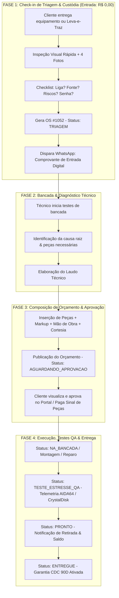
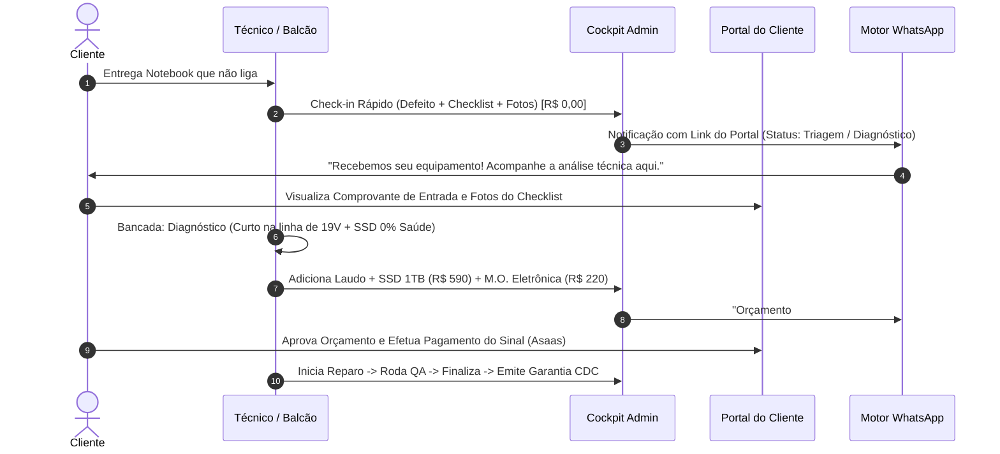
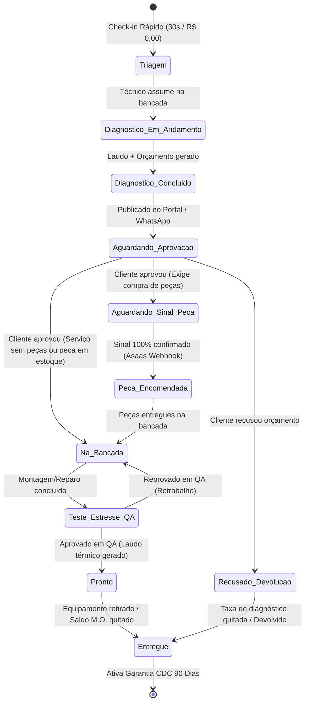

# Blueprint Arquitetural de Fluxos de Atendimento & Máquina de Estados da OS
**Empresa:** IF Tech  
**Praça:** Bragança Paulista - SP & Região  
**Versão:** 2.0 (Redesenho Operacional de Bancada & ERP)  
**Status:** Arquitetura Aprovada para Implementação  
**Autor:** Principal Product Architect & Especialista em Operações de TI  

---

## 📑 Sumário Executivo & Diagnóstico da Falha do Modelo Anterior

### 1.1 A Dúvida Operacional do Gestor
> *"Eu sou obrigado a pôr mão de obra e valor na criação da OS? E quando é caso que entra para análise/diagnóstico?"*

### 1.2 O Diagnóstico da Falha Estrutural
No modelo conceitual anterior (v1.0), o ERP assumia uma **premissa falsa**: que toda Ordem de Serviço nasce como uma *venda fechada* ou um *orçamento pré-calculado*. Isso forçava o técnico/atendente a preencher tabela de peças e valor de mão de obra logo na abertura do chamado.

Na realidade diária de uma assistência técnica especializada e bancada de precisão:
1. **80% dos chamados de reparo (Break-Fix) chegam sem diagnóstico prévio:** O cliente relata sintomas como *"o PC bipa e não dá vídeo"*, *"desliga sozinho após 15 minutos"* ou *"caiu café no teclado"*. É tecnicamente impossível e antiético precificar peças e mão de obra antes da desmontagem, inspeção visual com microscópio, teste de bancada com fonte assimétrica, osciloscópio ou teste de estresse de memória/controladora.
2. **A criação da OS na entrada é um ato de CUSTÓDIA e SEGURANÇA JURÍDICA (30 a 60 segundos):** O objetivo imediato do check-in não é cobrar, mas registrar a posse do bem, estado estético, número de série, pertences acompanhantes (carregadores, adaptadores) e fornecer ao cliente um protocolo com validade legal e link de telemetria. O valor financeiro da OS no momento da entrada em diagnóstico é **R$ 0,00**.
3. **A precificação e inserção de peças é um ato TÉCNICO POSTERIOR:** Ocorre exclusivamente na bancada, após a elaboração do laudo técnico.

---

## 🏛️ 2. Desacoplamento Arquitetural: Triagem vs. Orçamento

O novo modelo opera com **dois ciclos de vida desacoplados e assíncronos**:



---

## 🔄 3. Os 4 Casos de Uso Reais da Operação

A arquitetura do ERP IF Tech suporta nativamente 4 modalidades distintas de atendimento:

### 3.1 Fluxo A: Entrada para Diagnóstico / Break-Fix (Aparelho com Defeito)
*A modalidade mais frequente no dia a dia da assistência.*

| Atributo | Especificação Operacional |
| :--- | :--- |
| **Público-Alvo** | Clientes B2C e profissionais liberais com equipamentos inoperantes ou instáveis. |
| **Valor Inicial de Entrada** | **R$ 0,00** (Sem obrigatoriedade de preenchimento financeiro). |
| **Tempo de Check-in** | **30 a 60 segundos** no balcão ou via formulário mobile no Leva-e-Traz. |
| **Campos Obrigatórios no Check-in** | 1. Dados do Cliente (Nome, WhatsApp, CPF/CNPJ).<br>2. Dados do Aparelho (Marca, Modelo, Nº de Série).<br>3. Checklist (Liga? Carregador original? Avarias visuais).<br>4. Defeito Reclamado pelo Cliente (Texto livre ou tags).<br>5. Senha/PIN de Testes (ou autorização de teste sem senha). |
| **Ação do Técnico na Bancada** | Abre o equipamento, executa testes de bancada e clica em `[ + Elaborar Orçamento / Laudo ]` no Cockpit Admin. |
| **Composição do Orçamento** | Adiciona laudo técnico detalhado, peças necessárias (Custo Real vs Valor Venda) e mão de obra de reparo. |
| **Política de Diagnóstico** | Taxa de check-up (HW-01: R$ 90,00) é **100% isenta/abatida** se o cliente aprovar o reparo. Se reprovado, cobra-se apenas a taxa de bancada. |



---

### 3.2 Fluxo B: Montagem de PC Gamer / Workstation Sob Medida (Custom Build)
*Projetos novos em que a configuração nasce cotada antes da execução física.*

| Atributo | Especificação Operacional |
| :--- | :--- |
| **Público-Alvo** | Gamers, streamers, arquitetos, editores de vídeo e engenheiros. |
| **Valor Inicial de Entrada** | **Valor Total Cotado** (Soma das peças + Mão de obra de montagem). |
| **Tempo de Elaboração** | 5 a 15 minutos via **Wizard de Montagem / Calculadora de Markup**. |
| **Campos Específicos** | Processador, Placa-Mãe, RAM, Armazenamento, GPU, Fonte, Gabinete/Coolers, Mão de Obra de Precisão (HW-05: R$ 285 a R$ 415), Otimização de BIOS/Windows (R$ 0,00 - Cortesia). |
| **Regra Financeira de Sinal** | **100% das Peças Adiantadas (Sinal)** via Pix/Cartão antes da compra no distribuidor (Kabum, Terabyte, Pichau, All Nations). Mão de obra paga na entrega. |
| **Transição de Status** | `Orcamento_Gerado` ➔ `Aguardando_Sinal_Pecas` ➔ `Peca_Encomendada` ➔ `Na_Bancada` (Montagem) ➔ `Teste_Estresse_QA` (AIDA64/FurMark) ➔ `Pronto`. |

---

### 3.3 Fluxo C: Serviços Pré-Fixados de Tabela (Manutenção & Higienização)
*Serviços padronizados com escopo fechado e preço de tabela.*

| Atributo | Especificação Operacional |
| :--- | :--- |
| **Público-Alvo** | Clientes que trazem computadores funcionais para manutenção preventiva periódica. |
| **Serviços Típicos** | • **HW-03A:** Limpeza Preventiva Express (R$ 119,00)<br>• **HW-03B:** Limpeza Profunda & Arctic MX-4 (R$ 220,00 PC / R$ 250,00 Notebook)<br>• **HW-02:** Formatação Limpa + Otimização Windows 11 Pro (R$ 160,00) |
| **Comportamento no ERP** | Ao selecionar o serviço no check-in, o valor de mão de obra é preenchido automaticamente com o valor do catálogo. Nenhuma peça de reposição é exigida inicialmente. |
| **Transição de Status** | O chamado já nasce como **Aprovado** pelo cliente: `Triagem` ➔ `Na_Bancada` ➔ `Teste_Estresse_QA` ➔ `Pronto`. |

---

### 3.4 Fluxo D: Upgrade Rápido com Peça Definida (Plug-and-Play)
*Instalação de componentes de alta performance com fornecimento próprio ou local.*

| Atributo | Especificação Operacional |
| :--- | :--- |
| **Público-Alvo** | Clientes que querem acelerar máquinas lentas (SSD NVMe Gen4, expansão de RAM). |
| **Composição do Pedido** | Componente em estoque ou cotação direta (ex: SSD Kingston NVMe 1TB: R$ 590,00) + Mão de Obra de Instalação e Clonagem (HW-04: R$ 140,00). |
| **Comportamento no ERP** | Baixa imediata do saldo de estoque no almoxarifado local (`inventory_items`) ou geração automática de Pedido de Compra (`purchase_orders`). |
| **Transição de Status** | `Triagem` ➔ `Aguardando_Sinal` (se sob encomenda) ou `Na_Bancada` (se peça em estoque) ➔ `Teste_Estresse_QA` (CrystalDiskInfo) ➔ `Pronto`. |

---

## ⚙️ 4. A Máquina de Estados da Ordem de Serviço (Work Order State Machine)

### 4.1 Diagrama Formal de Estados & Transições



### 4.2 Matriz de Estados, Permissões e Regras de Negócio

| Código do Estado | Nome Exibido no Admin | Nome Exibido no Portal do Cliente | Requisitos / Validações para Entrar no Estado | Impacto Financeiro / Estoque | Ações Permitidas |
| :--- | :--- | :--- | :--- | :--- | :--- |
| `TRIAGEM` | 01. Triagem & Entrada | 🔍 Em Triagem Inicial | Formulário de Check-in salvo (Cliente + Aparelho + Defeito + Checklist). | R$ 0,00 registrado. Nenhum lançamento financeiro. | • Editar dados do aparelho<br>• Anexar fotos<br>• Iniciar Diagnóstico |
| `DIAGNOSTICO_EM_ANDAMENTO` | 01B. Em Análise | 🔬 Em Diagnóstico de Bancada | Técnico alocado para a OS. | Custo interno de bancada alocado. | • Inserir laudo técnico<br>• Adicionar peças/serviços |
| `AGUARDANDO_APROVACAO` | 02. Orçamento Publicado | 📋 Orçamento Disponível | Pelo menos 1 item cadastrado (M.O. ou Peça) e Laudo preenchido. | Orçamento emitido (Previsto). | • Disparar WhatsApp com proposta<br>• Cliente: Aprovar/Rejeitar |
| `AGUARDANDO_SINAL_PECA` | 02B. Aguardando Sinal | 💳 Aguardando Pagamento do Sinal | Orçamento aprovado contendo peças sob encomenda. | Fatura Asaas gerada (Cobrança do sinal de peças). | • Reenviar Pix Copia-e-Cola<br>• Baixa manual de pagamento |
| `PECA_ENCOMENDADA` | 02C. Peça Comprada | 📦 Peça em Trânsito | Sinal de peças 100% quitado (ou confirmado pelo gestor). | Pedido de compra ativado em `purchase_orders`. | • Inserir código de rastreio<br>• Registrar chegada da peça |
| `NA_BANCADA` | 03. Na Bancada | 🛠️ Em Execução na Bancada | Peças disponíveis no almoxarifado ou recebidas do fornecedor. | Reserva física das peças no estoque. | • Registrar notas de montagem<br>• Anexar fotos de bancada |
| `TESTE_ESTRESSE_QA` | 04. Testes de Estresse QA | ⚡ Em Testes de Estresse & QA | Montagem física finalizada. | Nenhum. | • Preencher CrystalDiskInfo<br>• Preencher Cinebench/AIDA64 temps<br>• Aprovar/Reprovar QA |
| `PRONTO` | 05. Pronto para Entrega | ✅ Pronto para Retirada | QA aprovado + Tempo de estresse validado + Laudo final gerado. | Gera cobrança do saldo residual de Mão de Obra. | • Disparar aviso de retirada<br>• Agendar Leva-e-Traz |
| `ENTREGUE` | 06. Entregue / Finalizado | 🏆 Entregue com Garantia | Equipamento devolvido ao cliente + Saldo 100% quitado. | Baixa no contas a receber. Início da contagem de 90 dias CDC. | • Download Certificado de Garantia<br>• Consulta de Histórico |
| `CANCELADO` | 99. Cancelado / Recusado | ❌ Atendimento Encerrado | Orçamento recusado ou inviabilidade técnica constatada. | Cobrança da taxa mínima de check-up (R$ 90) ou isenção por cortesia. | • Registrar motivo do cancelamento<br>• Devolução do equipamento |

---

## 🗄️ 5. Atualização da Modelagem de Dados (PostgreSQL / Supabase)

### 5.1 Evolução dos Enums e Schema das Ordens de Serviço

```sql
-- Atualização do ENUM de status da OS para refletir o ciclo real
ALTER TYPE os_status_enum ADD VALUE IF NOT EXISTS 'Diagnostico_Em_Andamento';
ALTER TYPE os_status_enum ADD VALUE IF NOT EXISTS 'Aguardando_Aprovacao';
ALTER TYPE os_status_enum ADD VALUE IF NOT EXISTS 'Recusado_Devolucao';

-- Estrutura aprimorada da tabela de Ordens de Serviço
CREATE TABLE IF NOT EXISTS work_orders (
    id UUID PRIMARY KEY DEFAULT gen_random_uuid(),
    os_number SERIAL UNIQUE,
    public_tracking_token UUID DEFAULT gen_random_uuid() UNIQUE NOT NULL,
    client_id UUID NOT NULL REFERENCES clients(id) ON DELETE RESTRICT,
    technician_id UUID REFERENCES technicians(id) ON DELETE SET NULL,
    
    -- Tipo e Status
    service_type os_service_type_enum NOT NULL DEFAULT 'Hardware_Reparo',
    status os_status_enum NOT NULL DEFAULT 'Triagem',
    is_budget_approved BOOLEAN DEFAULT false,
    budget_approved_at TIMESTAMP WITH TIME ZONE,
    
    -- Dados de Custódia e Equipamento (Check-in 30s)
    device_brand VARCHAR(100) NOT NULL,
    device_model VARCHAR(150) NOT NULL,
    serial_number VARCHAR(100),
    device_password VARCHAR(255),
    accessories_included TEXT, -- "Fonte original + cabo de força + capa neoprene"
    
    -- Checklist Físico de Entrada
    is_powering_on BOOLEAN NOT NULL DEFAULT true,
    has_charger_included BOOLEAN NOT NULL DEFAULT false,
    aesthetic_damage_notes TEXT, -- "Tampa com risco superficial, parafuso traseiro faltante"
    intake_photos_urls JSONB DEFAULT '[]'::jsonb, -- Array de URLs de custódia
    
    -- Relato Inicial vs Laudo de Bancada
    reported_defect TEXT NOT NULL, -- O que o cliente disse
    technical_diagnosis_laudo TEXT, -- O que o técnico descobriu na bancada
    
    -- Telemetria & Testes de Estresse QA
    crystaldisk_health_pct INT CHECK (crystaldisk_health_pct BETWEEN 0 AND 100),
    cpu_stress_max_temp_celsius DECIMAL(4, 1),
    gpu_stress_max_temp_celsius DECIMAL(4, 1),
    stress_test_duration_minutes INT DEFAULT 15,
    boot_time_seconds INT,
    qa_approved BOOLEAN DEFAULT false,
    qa_notes TEXT,
    
    -- Totais Consolidados (Calculados via Trigger / RPC)
    total_parts DECIMAL(10, 2) NOT NULL DEFAULT 0.00,
    total_labor DECIMAL(10, 2) NOT NULL DEFAULT 0.00,
    pickup_fee DECIMAL(10, 2) NOT NULL DEFAULT 0.00,
    total_order DECIMAL(10, 2) NOT NULL DEFAULT 0.00,
    parts_downpayment_paid BOOLEAN DEFAULT false,
    
    -- Garantia Legal CDC 90 Dias
    warranty_valid_until DATE,
    warranty_hash VARCHAR(64),
    
    created_at TIMESTAMP WITH TIME ZONE DEFAULT CURRENT_TIMESTAMP,
    updated_at TIMESTAMP WITH TIME ZONE DEFAULT CURRENT_TIMESTAMP
);
```

### 5.2 RPC de Check-in Rápido Atômico (Sem Exigência de Itens ou Preço)

```sql
-- Função Segura para Criação de OS de Entrada (30 Segundos)
CREATE OR REPLACE FUNCTION rpc_checkin_work_order_fast(
    p_client_name VARCHAR,
    p_client_whatsapp VARCHAR,
    p_client_document VARCHAR DEFAULT NULL,
    p_device_brand VARCHAR DEFAULT 'Genérico',
    p_device_model VARCHAR DEFAULT 'Notebook/Desktop',
    p_serial_number VARCHAR DEFAULT NULL,
    p_service_type os_service_type_enum DEFAULT 'Hardware_Reparo',
    p_reported_defect TEXT DEFAULT 'Equipamento para diagnóstico e análise técnica',
    p_is_powering_on BOOLEAN DEFAULT true,
    p_has_charger BOOLEAN DEFAULT false,
    p_device_password VARCHAR DEFAULT NULL,
    p_aesthetic_notes TEXT DEFAULT NULL,
    p_intake_photos JSONB DEFAULT '[]'::jsonb,
    p_pickup_fee DECIMAL DEFAULT 0.00
) RETURNS JSONB
LANGUAGE plpgsql
SECURITY DEFINER
AS $$
DECLARE
    v_client_id UUID;
    v_clean_phone VARCHAR;
    v_clean_doc VARCHAR;
    v_wo_id UUID;
    v_os_num INT;
    v_token UUID;
BEGIN
    v_clean_phone := regexp_replace(p_client_whatsapp, '\D', '', 'g');
    v_clean_doc := regexp_replace(COALESCE(p_client_document, ''), '\D', '', 'g');
    IF v_clean_doc = '' THEN v_clean_doc := NULL; END IF;

    -- Localiza ou cria cliente
    SELECT id INTO v_client_id FROM clients 
    WHERE whatsapp = v_clean_phone OR (v_clean_doc IS NOT NULL AND document = v_clean_doc)
    LIMIT 1;

    IF v_client_id IS NULL THEN
        INSERT INTO clients (name, whatsapp, document, street, number, neighborhood, city, state)
        VALUES (
            p_client_name, 
            v_clean_phone, 
            COALESCE(v_clean_doc, '00000000000'), 
            'Atendimento Balcão/Remoto', 
            'S/N', 
            'Centro', 
            'Bragança Paulista', 
            'SP'
        )
        RETURNING id INTO v_client_id;
    END IF;

    -- Cria OS em Triagem com R$ 0,00 inicial
    INSERT INTO work_orders (
        client_id,
        service_type,
        status,
        device_brand,
        device_model,
        serial_number,
        device_password,
        is_powering_on,
        has_charger_included,
        aesthetic_damage_notes,
        intake_photos_urls,
        reported_defect,
        pickup_fee,
        total_parts,
        total_labor,
        total_order
    ) VALUES (
        v_client_id,
        p_service_type,
        'Triagem',
        p_device_brand,
        p_device_model,
        p_serial_number,
        p_device_password,
        p_is_powering_on,
        p_has_charger,
        p_aesthetic_notes,
        p_intake_photos,
        p_reported_defect,
        p_pickup_fee,
        0.00,
        0.00,
        p_pickup_fee
    )
    RETURNING id, os_number, public_tracking_token INTO v_wo_id, v_os_num, v_token;

    RETURN jsonb_build_object(
        'success', true,
        'work_order_id', v_wo_id,
        'os_number', v_os_num,
        'tracking_token', v_token,
        'client_id', v_client_id,
        'status', 'Triagem'
    );
END;
$$;
```

---

## 🖥️ 6. Desenho da Interface no Cockpit Admin (`admin.html`)

Para solucionar a fricção operacional apontada pelo usuário, a interface do Cockpit Administrativo é estruturada em **dois fluxos visuais independentes**:

### 6.1 Modal de Check-in Rápido de Entrada (30 Segundos)
*Acionado pelo botão fixo no Header: `[ + Nova Entrada / Triagem ]`*

```
┌────────────────────────────────────────────────────────────────────────┐
│ ⚡ CHECK-IN RÁPIDO DE ENTRADA // PROTOCOLO DE CUSTÓDIA                 │
│ Status Inicial: [ 01. TRIAGEM (R$ 0,00) ]                              │
├────────────────────────────────────────────────────────────────────────┤
│ [ Dados do Cliente ]                                                   │
│ Nome Completo: [ João Silva__________________ ]  WhatsApp: [ (11) 98765-4321 ]
│                                                                        │
│ [ Identificação do Equipamento ]                                       │
│ Marca: [ Dell_________ ]  Modelo: [ Inspiron 15 3520___________ ]       │
│ Nº Série / Service Tag: [ 8XYZ123_________ ]  Senha/PIN: [ 1234______ ]│
│                                                                        │
│ [ Checklist Visual de Custódia ]                                       │
│ [X] Liga e Apresenta Vídeo?     [ ] Veio com Carregador Original?     │
│ Avarias Estéticas: [ Risco na tampa superior próximo à dobradiça____ ] │
│                                                                        │
│ [ Defeito Relatado pelo Cliente ]                                      │
│ [ "Não conecta no Wi-Fi e desliga após 10 minutos de uso intenso"____ ] │
│                                                                        │
│ [ Fotos de Entrada (4 Ângulos) ]                                       │
│ [ 📷 Anexar Foto Tampa ] [ 📷 Foto Teclado ] [ 📷 Foto Serial/Etiqueta ]│
├────────────────────────────────────────────────────────────────────────┤
│ [ CANCELAR ]                  [ 💾 REGISTRAR ENTRADA & GERAR PROTOCOLO ]│
└────────────────────────────────────────────────────────────────────────┘
```

### 6.2 Ações Rápidas em 1 Clique no Kanban de Bancada
Cada card de OS no Kanban exibe badges e gatilhos contextuais de transição:

1. **Card em Triagem (Sem Orçamento):**
   - Exibe badge amarela: `SEM ORÇAMENTO • EM DIAGNÓSTICO`
   - Botão de ação: `[ ➕ Elaborar Orçamento / Laudo ]` ➔ Abre o Modal de Precificação e Peças.
2. **Card com Orçamento Publicado:**
   - Exibe badge: `AGUARDANDO APROVAÇÃO (R$ 730,00)`
   - Botão de ação: `[ 📲 Reenviar Proposta WhatsApp ]` | `[ ✅ Marcar como Aprovado ]`
3. **Card Aprovado com Peças Sob Encomenda:**
   - Exibe badge: `SINAL DE PEÇAS PENDENTE (R$ 590,00)`
   - Ao receber Webhook do Asaas ➔ Transita automaticamente para `[ 📦 Comprar Peça ]`.
4. **Card na Bancada:**
   - Botão de ação: `[ ⚡ Avançar para Testes QA ]`
5. **Card em Testes QA:**
   - Botão de ação: `[ 📝 Registrar Telemetria & Finalizar OS ]`

---

## 📱 7. A Experiência do Cliente no Portal (`portal.html`)

O portal reage dinamicamente ao estado atual da OS, eliminando ruídos e transmitindo máxima transparência e profissionalismo:

### 7.1 Visão na Etapa 1: Triagem & Diagnóstico (Antes do Orçamento)
Quando o cliente acessa o link nos primeiros minutos/horas após a entrega:

```
┌────────────────────────────────────────────────────────────────────────┐
│ IF TECH // TELEMETRIA DE BANCADA                     OS #1052   │
├────────────────────────────────────────────────────────────────────────┤
│ 🔍 STATUS ATUAL: EM DIAGNÓSTICO TÉCNICO CIRÚRGICO                      │
│ Equipamento: Dell Inspiron 15 // Entrada: 23/08/2026 às 14:20          │
├────────────────────────────────────────────────────────────────────────┤
│ 📋 COMPROVANTE DE CUSTÓDIA & ENTRADA DIGITAL                           │
│ • Defeito Relatado: "Desliga após 10 minutos de uso e não conecta Wi-Fi"│
│ • Condição Física Registrada: Risco na tampa superior                  │
│ • Carregador Original: Não entregue                                    │
│ • Fotos de Custódia Registradas na Entrada: [ Ver 3 Fotos Anexadas ]   │
├────────────────────────────────────────────────────────────────────────┤
│ ℹ️ PRÓXIMA ETAPA:                                                      │
│ Nossos especialistas estão realizando testes com câmera térmica e     │
│ diagnóstico de placa. Assim que concluído, seu orçamento detalhado     │
│ estará disponível aqui para sua aprovação.                             │
└────────────────────────────────────────────────────────────────────────┘
```

### 7.2 Visão na Etapa 2: Orçamento Publicado (Para Aprovação)
Assim que o técnico conclui a análise e lança os itens no Cockpit:

```
┌────────────────────────────────────────────────────────────────────────┐
│ 📋 ORÇAMENTO TÉCNICO DISPONÍVEL PARA SUA APROVAÇÃO                     │
├────────────────────────────────────────────────────────────────────────┤
│ 🔬 LAUDO TÉCNICO DA BANCADA:                                           │
│ "Constatada obstrução severa no dissipador de calor e ressecamento     │
│ total da pasta térmica original, gerando thermal throttling a 98°C.    │
│ Módulo Wi-Fi em curto intermitente na linha PCIe."                     │
├────────────────────────────────────────────────────────────────────────┤
│ ITENS & COMPONENTES PROPOSTOS:                                         │
│ 1. Placa de Rede Wi-Fi 6 Intel AX210 M.2 ................. R$ 170,00   │
│ 2. Limpeza Profunda & Pasta Térmica Arctic MX-4 .......... R$ 220,00   │
│ 3. Otimização de BIOS & Curva Térmica ........... R$ 0,00 (🎁 CORTESIA)│
├────────────────────────────────────────────────────────────────────────┤
│ VALOR TOTAL: R$ 390,00 (Sinal Peça: R$ 170,00 • M.O. na Entrega: R$ 220)│
├────────────────────────────────────────────────────────────────────────┤
│ [ 💬 TIRAR DÚVIDA NO WHATSAPP ]      [ ✅ APROVAR ORÇAMENTO AGORA ]    │
└────────────────────────────────────────────────────────────────────────┘
```

---

## 📋 8. Matriz de Mensagens WhatsApp Automatizadas por Etapa

| Gatilho / Evento | Template de Mensagem Disparado no WhatsApp |
| :--- | :--- |
| **01. Check-in de Entrada (Triagem)** | *“Olá {nome}! 👋 Seu {equipamento} deu entrada na bancada da IF Tech sob a **OS #{numero}**.<br><br>📸 Registramos as fotos de entrada e o checklist de custódia.<br>🔍 **Acompanhe o andamento da análise em tempo real pelo link:**<br>👉 https://iflcosta.tech/portal.html?token={token}”* |
| **02. Orçamento Concluído** | *“Olá {nome}! 🔬 O laudo técnico e orçamento da sua **OS #{numero}** estão prontos com a discriminação completa das peças e mão de obra.<br><br>📋 **Consulte e aprove pelo link:**<br>👉 https://iflcosta.tech/portal.html?token={token}”* |
| **03. Confirmação de Sinal / Peça Comprada** | *“Pagamento do sinal confirmado com sucesso! 📦 Já efetuamos o pedido das suas peças com garantia oficial. Em breve seu equipamento entra em bancada.”* |
| **04. Conclusão & QA Aprovado (Pronto)** | *“Boas notícias {nome}! 🎉 Seu {equipamento} passou por todos os testes de estresse térmico com 100% de estabilidade e já está **PRONTO PARA RETIRADA**!<br><br>Consulte seu laudo final no portal e combine a entrega: https://iflcosta.tech/portal.html?token={token}”* |

---

## 🎯 9. Conclusão & Próximos Passos de Engenharia

Este blueprint arquitetural resolve em definitivo a dor levantada pelo gestor:
1. **Zero fricção na entrada:** Check-in realizado em 30 segundos com R$ 0,00 e sem bloqueios de peças/valores.
2. **Segurança de custódia:** Fotos e checklist integrados para resguardar a IF Tech contra avarias pré-existentes.
3. **Orçamento estruturado:** Cálculo automático de lucro real, margem e cortesias comerciais somente quando o diagnóstico estiver pronto.
4. **Telemetria de ponta a ponta:** O cliente acompanha cada micro-etapa no Portal com transparência de nível industrial.

---
*Documento homologado para atualização de `admin.html`, `portal.html` e migrations SQL do Supabase.*
