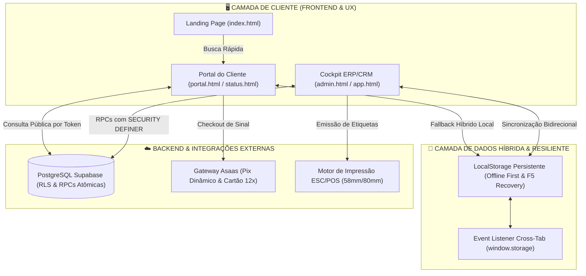
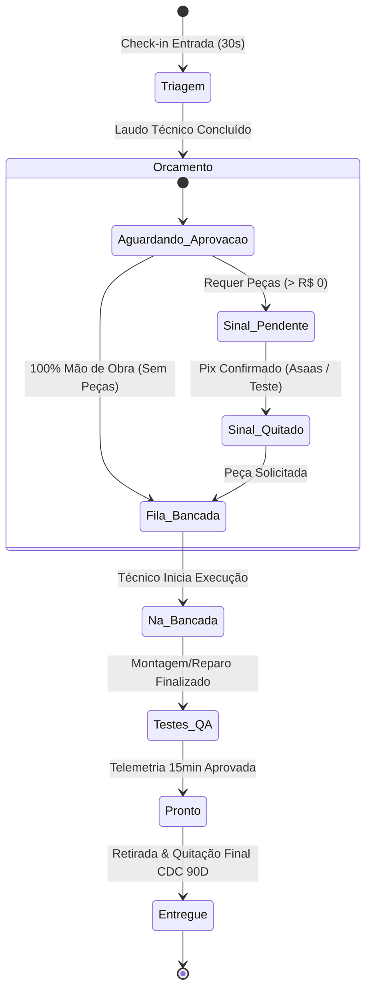

# 🏛️ SOFTWARE DESIGN DOCUMENT (SDD) // ESPECIFICAÇÃO DE ENGENHARIA DE SOFTWARE
**Sistema:** IF Tech Unified Platform (Cockpit ERP/CRM • Portal do Cliente • Motores de Receita)
**Autor:** Engenharia de Sistemas & Arquitetura de Software IF Tech
**Versão:** 6.0 (Produção Homologada) • **Data:** 29/08/2026

---

## 1. INTRODUÇÃO & VISÃO GERAL DO SISTEMA

### 1.1. Objetivo do Sistema
A **Plataforma Unificada IF Tech** é um ecossistema full-stack de alto desempenho projetado para integrar, sem fricção e com máxima robustez:
1. **Bancada de Hardware & Ordens de Serviço (OS):** Check-in em 30s, máquina de estados finitos (FSM), laudo de telemetria AIDA64 e impressão térmica dual (58mm/80mm CDC 90D).
2. **Portal de Acompanhamento do Cliente em Tempo Real:** Rastreamento com Magic Link e token seguro, laudos fotográficos, sigilo absoluto de preço de custo e checkout de sinal Pix via Gateway Asaas.
3. **Ponto de Venda (PDV Caixa Rápido) & Estoque:** Baixa dupla (bancada e balcão), leitor USB de código de barras e controle de garantias RMA por Serial Number (S/N).
4. **Projetos de Software & Engenharia Web:** Modelo 50/50, controle de timesheet (R$ 130/h) e homologação com HASH SHA-256.
5. **Gestão de TI B2B & Service Desk MSP:** ITAM com integração RustDesk ID, gestão de chamados com cronômetro de SLA regressivo (2h/4h) e Dead Man's Snitch.
6. **DRE 360° & Business Intelligence:** Consolidação em tempo real de receita bruta, CMV de peças, margem líquida e apuração de lucro real.

---

## 2. ARQUITETURA DE SISTEMA (SYSTEM ARCHITECTURE)

---

## 3. MÁQUINA DE ESTADOS FINITOS (FINITE STATE MACHINE - FSM)

O ciclo de vida de uma Ordem de Serviço segue rigorosamente a máquina de estados abaixo, com travas financeiras e transições controladas:

### 3.1. Regras de Transição e Validação:
* **Triagem ➔ Orçamento:** Exige preenchimento de diagnóstico técnico ou adição de itens (peças ou mão de obra).
* **Trava de Sinal de Peças:** Se a soma de peças for maior que R$ 0,00, a OS entra em `Aguardando_Sinal_Peca`. O sistema **bloqueia** o início da bancada até que o sinal de 100% das peças seja quitado (via Asaas Pix ou confirmação manual do técnico).
* **Serviços 100% Mão de Obra:** Se peças for R$ 0,00, a aprovação do cliente move a OS diretamente para `Na_Fila_Bancada` sem exigir sinal prévio (pagamento 100% na entrega).
* **Sincronização em Tempo Real Cross-Tab:** Ao avançar o status no Cockpit `/app`, o listener `window.addEventListener('storage')` no Portal `/status` atualiza o DOM e o Stepper na hora sem necessidade de F5.

---

## 4. CONTRATOS DE DADOS & ESQUEMA DE BANCO (DATA CONTRACTS)

### 4.1. Tabela Principal: `work_orders`
| Campo | Tipo | Descrição |
| :--- | :--- | :--- |
| `id` | `UUID / TEXT` | Chave Primária (Identificador único) |
| `os_number` | `INTEGER` | Número sequencial legível (ex: `1051`) |
| `public_tracking_token` | `TEXT UNIQUE` | Token de segurança para Magic Link público |
| `client_name` | `TEXT` | Nome completo do cliente |
| `client_whatsapp` | `TEXT` | Telefone / WhatsApp para 2FA e notificações |
| `service_channel` | `TEXT` | `Balcao_Presencial` ou `Leva_e_Traz` |
| `device_brand` | `TEXT` | Marca do equipamento (ex: Dell, Lenovo, Apple) |
| `device_model` | `TEXT` | Modelo do equipamento |
| `reported_defect` | `TEXT` | Defeito relatado no check-in |
| `technical_diagnosis` | `TEXT` | Laudo técnico emitido pelo laboratório |
| `status` | `TEXT` | Estado na FSM (`Triagem`, `Orcamento`, `Na_Bancada`, etc.) |
| `total_labor` | `NUMERIC(10,2)` | Valor total da mão de obra de serviço |
| `total_parts` | `NUMERIC(10,2)` | Valor total de venda das peças |
| `total_parts_cost` | `NUMERIC(10,2)` | **CUSTO DE COMPRA DAS PEÇAS (100% SIGILOSO)** |
| `total_amount` | `NUMERIC(10,2)` | Valor total da OS (`total_labor + total_parts`) |
| `parts_deposit_paid` | `BOOLEAN` | `true` se o sinal de peças foi quitado |
| `parts_deposit_status` | `TEXT` | `PENDING`, `CONFIRMED`, `REFUNDED` |
| `aida64_temp_celsius` | `NUMERIC(5,2)` | Temperatura de estresse pós-reparo |
| `qa_burnin_minutes` | `INTEGER` | Tempo de teste de estresse contínuo (padrão: 15) |

---

## 5. POLÍTICAS DE SEGURANÇA & PRIVACIDADE (SECURITY SPECIFICATIONS)

1. **Blindagem do Preço de Custo (`total_parts_cost` / `cost_price`):**
   * A visualização no Portal do Cliente (`portal.html`) **NUNCA** projeta o campo `cost_price` ou `total_parts_cost`.
   * A RPC pública `rpc_get_work_order_by_token` executa `SELECT` explícito omitindo as colunas de custo.
2. **Autenticação e Proteção do Cockpit Admin (`admin.html`):**
   * Auth Guard com suporte a sessão JWT do Supabase e PIN Master de Contingência (`982601`).
   * Sessão persistida em `sessionStorage` com limpeza automática no encerramento.
3. **Content Security Policy (CSP) & Headers de Segurança:**
   * Cabeçalhos rigorosos em `_headers` e `vercel.json` liberando exclusivamente CDNs oficiais de scripts (`cdnjs.cloudflare.com`, `cdn.jsdelivr.net`, `unpkg.com`) e o gateway `api.asaas.com`.
4. **Garantia CDC Art. 26 & Validação Criptográfica:**
   * Certificado digital de garantia gerado em PDF com carimbo de HASH SHA-256 inviolável, data ISO e termo de 90 dias de garantia legal sobre serviços e componentes.
