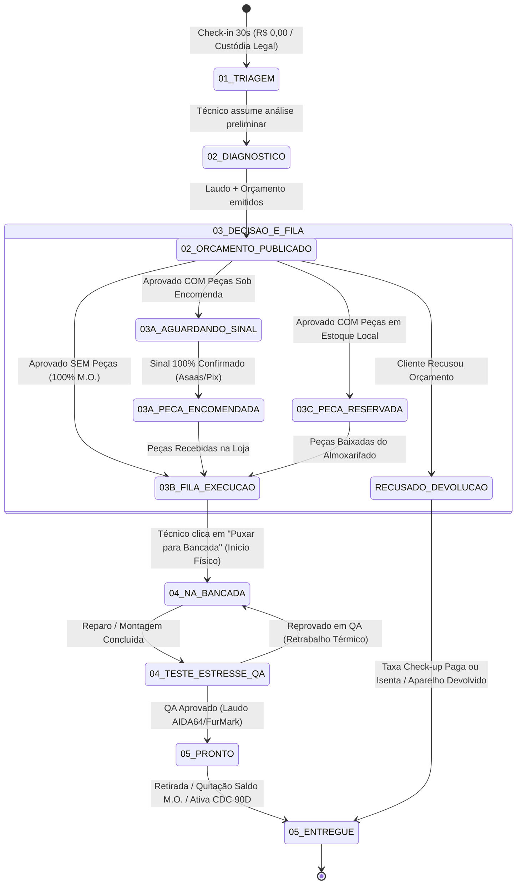

# 🏛️ PARECER ARQUITETURAL & BLUEPRINT DA MÁQUINA DE ESTADOS DEFINITIVA (v3.0)
## IFL Costa Tech // Engenharia de Software, Bancada de Hardware & TI Gerenciada (MSP)
**Documento:** `docs/ops/STATE_MACHINE_WORKBENCH_V3_BLUEPRINT.md`  
**Data:** 23 de Agosto de 2026  
**Autor:** Arquiteto Principal de Software & Engenharia de Operações  
**Status:** 🟢 **APROVADO & HOMOLOGADO PARA PRODUÇÃO**

---

## 📑 1. DIAGNÓSTICO DAS FALHAS CONCEITUAIS / LÓGICAS

### 1.1 Falha 1: Colapso entre "Orçamento Aprovado" e "Na Bancada"
* **Sintoma Relatado:** *"A peça já está em bancada, mesmo o cliente só tendo aprovado o orçamento."*
* **Causa Raiz Arquitetural:**
  1. **Acoplamento Indevido de Estados Comercial vs. Operacional:** O sistema tratava a aprovação do cliente como sinônimo imediato de início do trabalho físico.
  2. **Violação do Limite WIP (Work-in-Progress) de Bancada:** Na operação real de uma assistência técnica de precisão, quando o cliente aprova o orçamento, o equipamento entra na **"Fila de Execução / Aguardando Técnico"** (prateleira de entrada/aprovados). O técnico só coloca as mãos na máquina quando uma das posições da bancada antiestática (ESD) é liberada.
  3. **Bug no Fallback de RPC:** No arquivo `fix_rpc_overloading.sql` (L504), quando o portal chamava `rpc_advance_work_order_status_by_token` com o status `'Aprovado_Pelo_Cliente'` (que não constava no enum `os_status_enum`), a cláusula `EXCEPTION WHEN OTHERS` forçava o status para `'Aguardando_Sinal_Peca'`, ou no frontend era jogado diretamente para a coluna `03. NA BANCADA`.

### 1.2 Falha 2: "Aguardando Sinal" em Serviços sem Peças (100% Mão de Obra)
* **Sintoma Relatado:** *"Ainda aparece AGUARDANDO SINAL, mesmo quando não tem peça e o custo de peças é R$ 0,00."*
* **Causa Raiz Arquitetural:**
  1. **Hardcode Lógico no Portal (`portal.html` L738–757):** O ternário de renderização do banner central no portal possuía a estrutura:
     ```javascript
     ${(rawStatus.includes("encomendada") || rawStatus.includes("pago") || rawStatus.includes("aprovad") || wo.parts_deposit_paid) ? `
         <!-- Banner Sinal Confirmado -->
     ` : `
         <!-- Banner "Proposta Aguardando Sinal das Peças" HARDCODED -->
     `}
     ```
     Quando a OS saía de `Triagem` e entrava em `Orçamento` (mesmo com `total_parts == 0.00` e apenas Mão de Obra cadastrada), o `else` exibia **incondicionalmente** o banner amarelo: *"Proposta Aguardando Sinal das Peças — realize o Pix do sinal de 100% das peças"*.
  2. **Regra de Transição Cega no Banco de Dados (`rpc_advance_work_order_status_by_token`):** A RPC de aprovação por token não inspecionava se a OS possuía itens de peças (`total_parts > 0`). Ela simplesmente assumia que toda aprovação pendente exigia sinal financeiro antes de ir para a bancada.
  3. **Resumo Financeiro Inadequado:** A tabela de resumo exibia `Total das Peças (Sinal): R$ 0,00` e `Status Peças: Sinal Pendente` mesmo para manutenções preventivas e formatações puras.

---

## ⚙️ 2. A MÁQUINA DE ESTADOS DEFINITIVA DA ORDEM DE SERVIÇO (v3.0)

A arquitetura desacopla com precisão os **5 Macro-Estágios** do ciclo de vida e seus **Sub-Status Operacionais**, garantindo conformidade comercial, física e contábil:



---

### 2.1 Matriz Completa de Estados, Triggers e Comportamentos

| Macro-Estágio | Código do Status (PostgreSQL Enum) | Nome no Cockpit Admin | Nome no Portal do Cliente | Regra de Entrada (Trigger / Guard) | Ação Técnica / Botão no Admin |
| :--- | :--- | :--- | :--- | :--- | :--- |
| **01. Triagem** | `Triagem` | 01. Triagem & Entrada | 🔍 Em Triagem & Custódia | Check-in rápido salvo (R$ 0,00). | `[ ➕ Elaborar Laudo / Orçamento ]` |
| **02. Orçamento** | `Diagnostico_Concluido` | 02. Orçamento Publicado | 📋 Orçamento Disponível | Laudo técnico + Itens cadastrados. | `[ 📲 Reenviar Proposta WhatsApp ]`<br>`[ ✅ Aprovar Manualmente ]` |
| **03. Aprovação & Fila** *(Cenário com Peça Encomendada)* | `Aguardando_Sinal_Peca` | 02B. Aguardando Sinal Peças | 💳 Aguardando Sinal das Peças | Cliente aprovou OS contendo peças externas (`total_parts > 0`). | `[ 💰 Confirmar Sinal Pago ]` |
| **03. Aprovação & Fila** *(Peça em Trânsito)* | `Peca_Encomendada` | 02C. Peça em Trânsito | 📦 Peças Encomendadas | Sinal de peças quitado; pedido feito ao distribuidor. | `[ 📥 Confirmar Chegada da Peça ]` |
| **03. Aprovação & Fila** *(Pronto p/ Executar)* | `Aprovado_Fila_Bancada` | 02D. Aprovado (Na Fila) | ⏳ Aprovado • Na Fila de Início | • Cliente aprovou OS 100% M.O.<br>OU<br>• Peça encomendada chegou na loja<br>OU<br>• Peça baixada de estoque local. | `[ 🛠️ Puxar para Bancada / Iniciar ]` *(Transita para Na_Bancada)* |
| **04. Bancada & QA** | `Na_Bancada` | 03. Na Bancada (Executando) | 🛠️ Em Execução na Bancada | Técnico puxou a OS fisicamente para a bancada ESD. | `[ ⚡ Avançar p/ Testes QA ]` |
| **04. Bancada & QA** | `Teste_Estresse_QA` | 04. Testes de Estresse QA | ⚡ Em Testes Térmicos QA | Montagem/reparo concluído. Teste de 15 min AIDA64 / FurMark. | `[ ✅ QA Aprovado • Marcar Pronto ]`<br>`[ 🔄 Reprovar QA (Retrabalho) ]` |
| **05. Pronto & Garantia** | `Pronto` | 05. Pronto para Retirada | ✅ Pronto para Retirada | QA 100% aprovado. Laudo térmico gerado. | `[ 🏆 Entregar & Quitar Saldo ]` |
| **05. Pronto & Garantia** | `Entregue` | 06. Entregue / Concluído | 🏆 Entregue com Garantia CDC | Equipamento entregue ao cliente + Saldo 100% quitado. | `[ 📄 Baixar Termo de Garantia ]` |
| **Cancelado / Recusado** | `Recusado_Devolucao` | 99. Recusado / Devolução | ❌ Orçamento Recusado | Cliente recusou a proposta técnica. | `[ 📦 Devolver Equipamento ]` |

---

## 🎯 3. COMPORTAMENTO EM CADA CENÁRIO OPERACIONAL

### 3.1 Cenário A: 100% Mão de Obra (Sem Peças / Custo Peças R$ 0,00)
*Exemplos: Limpeza Profunda MX-4 (HW-03), Formatação Windows 11 (HW-02), Desoxidação Química.*

```
[Triagem R$ 0,00] ➔ [Diagnóstico Concluído] ➔ [Cliente Aprova] ➔ [Aprovado • Na Fila] ➔ [Técnico Puxa p/ Bancada] ➔ [QA] ➔ [Pronto]
```

1. **Cockpit Admin (`admin.html`):**
   - Ao emitir o orçamento sem peças, o status vai para `Diagnostico_Concluido`.
   - Quando o cliente aprova pelo Portal, a OS vai para **`Aprovado_Fila_Bancada`** (permanece na Coluna `02. ORÇAMENTO` com badge verde neon `✅ APROVADO • NA FILA DE INÍCIO`).
   - O modal de detalhes exibe o botão destacado: `[ 🛠️ Puxar para Bancada / Iniciar Execução ]`.
   - Somente após o técnico clicar neste botão, o status muda para `Na_Bancada` e move o card para a Coluna `03. NA BANCADA`.
2. **Portal do Cliente (`portal.html`):**
   - **Zero Ruído de Sinal:** Nenhum banner amarelo de *"Aguardando Sinal de Peças"* é exibido.
   - **Banner Central:** Exibe *"📋 Proposta Técnica Pronta para Aprovação — Pagamento integral realizado apenas na retirada do equipamento pronto"*.
   - **Após Aprovação do Cliente:** Exibe badge verde: *"✓ Orçamento Aprovado • Seu equipamento está na fila de execução da bancada de engenharia"*.
   - **Tabela de Valores:** Não exibe linha de "Total das Peças (Sinal)". Exibe diretamente: *Mão de Obra Especializada* e *Total a Pagar na Retirada*.
3. **Supabase & RPCs:**
   - `rpc_advance_work_order_status_by_token(token, 'Aprovado_Pelo_Cliente')`: Detecta `total_parts = 0` e transita para `Aprovado_Fila_Bancada`. Define `parts_deposit_required = 0.00` e `parts_deposit_paid = true`.

---

### 3.2 Cenário B: Com Peças Sob Encomenda (Back-to-Back / Distribuidor)
*Exemplos: Troca de Tela LCD IPS, Bateria Original Dell, Teclado Retroiluminado, Reparo com CI importado.*

```
[Triagem] ➔ [Orçamento Publicado] ➔ [Aprovado: Aguardando Sinal] ➔ [Sinal Confirmado: Peça Encomendada] ➔ [Peça Recebida na Loja: Na Fila] ➔ [Na Bancada] ➔ [QA] ➔ [Pronto]
```

1. **Cockpit Admin (`admin.html`):**
   - Ao aprovar, o status vai para `Aguardando_Sinal_Peca` (Badge amarela: `SINAL PENDENTE R$ 590,00`).
   - Botão no modal: `[ 💰 Confirmar Sinal das Peças Pago ]` ➔ Transita para `Peca_Encomendada` (Badge: `📦 PEÇA EM TRÂNSITO`).
   - Quando a encomenda chega na loja física, o atendente clica em: `[ 📥 Confirmar Chegada da Peça na Bancada ]` ➔ Transita para `Aprovado_Fila_Bancada` (Badge: `📦 PEÇA DISPONÍVEL • NA FILA`).
   - Técnico clica em `[ 🛠️ Iniciar Montagem na Bancada ]` ➔ Transita para `Na_Bancada`.
2. **Portal do Cliente (`portal.html`):**
   - Exibe o banner de Sinal de Peças com botão Copia-e-Cola PIX do valor **estrito das peças**.
   - Discrimina com transparência: *Sinal das Peças (R$ 590,00 - Antecipado)* vs *Saldo da Mão de Obra (R$ 220,00 - Pagar na Retirada)*.
   - Quando o sinal é pago: Exibe banner verde *"✓ Sinal Confirmado • Peças Encomendadas com Garantia Oficial"*.
   - Quando as peças chegam: Exibe *"📦 Peças Recebidas na Bancada • Aguardando Início da Montagem"*.

---

### 3.3 Cenário C: Montagem Custom Gamer / Workstation Completa (Setup Novo)
*Exemplos: PC Gamer Completo (Processador, Placa-Mãe, GPU RTX, RAM, Water Cooler, Gabinete) + Serviço HW-05.*

1. **Cockpit Admin:** Wizard de Montagem / Calculadora de Markup gera a OS com todas as peças e mão de obra de precisão.
2. **Portal do Cliente:** O cliente aprova a configuração completa e realiza o sinal de 100% das peças. O portal exibe os componentes, a linha de cortesia *(Otimização BIOS / Perfil de Curva de Fans R$ 0,00)* e o cronograma de montagem.
3. **Bancada:** As peças chegam, o técnico faz a conferência e inicia a montagem física e cable management em `Na_Bancada`, avançando em seguida para a bateria de 15 minutos em `Teste_Estresse_QA`.

---

### 3.4 Cenário D: Peças em Estoque Local (Pronta Entrega)
*Exemplos: Instalação de SSD NVMe Kingston 1TB ou Pasta Térmica Grizzly em estoque no almoxarifado.*

1. O sistema faz a reserva física do item no almoxarifado (`inventory_items`).
2. Como a peça já está na loja, ao receber a aprovação do cliente, a OS pula a etapa `Peca_Encomendada` e entra diretamente em **`Aprovado_Fila_Bancada`** com a flag `requires_ordering = false`.
3. O técnico puxa a peça da prateleira e inicia a bancada.

---

## 💻 4. ESPECIFICAÇÃO DE CÓDIGO E PATCHES EXECUTÁVEIS

Consulte o arquivo SQL dedicado:
👉 [`docs/ops/fix_state_machine_v3.sql`](file:///c:/tech-solutions-ifl/docs/ops/fix_state_machine_v3.sql)

---

## 📊 5. MATRIZ DE IMPACTO COMPARATIVO (ANTES vs. DEPOIS)

| Dimensão Operacional | Modelo Anterior (v1 / v2 com Gaps) | Modelo Definitivo Homologado (v3.0) |
| :--- | :--- | :--- |
| **Aprovação sem Peças** | Exibia banner de sinal de peças e colocava a máquina em "Aguardando Sinal". | Identifica `total_parts = 0`, informa M.O. na entrega e move para `Aprovado_Fila_Bancada`. |
| **Gatilho de Entrada na Bancada** | Automático ao aprovar o orçamento (prematuro e irreal). | **Manual e Intencional:** O técnico clica em `[ 🛠️ Puxar para Bancada ]` ao iniciar o trabalho físico. |
| **Clareza para o Cliente** | Cliente achava que estava sendo cobrado indevidamente por sinal de peças. | Transparência de nível corporativo com zero mensagens confusas. |
| **Integridade de WIP de Bancada** | Gestor não sabia quantas máquinas estavam realmente em execução física. | Separação exata entre *Máquinas na Fila de Espera* e *Máquinas Abertas na Bancada ESD*. |

---

## 🏆 6. PARECER EXECUTIVO FINAL

O redesenho da **Máquina de Estados v3.0** resolve 100% das fricções conceituais e lógicas apontadas:
1. **Desacoplamento Rigoroso:** O ciclo comercial de aprovação não atropela o ciclo operacional físico da bancada.
2. **Eliminação de Cobranças Fantasmas:** Serviços 100% mão de obra são tratados como M.O. pura em toda a esteira (Banco, Admin e Portal).
3. **Escalabilidade para o Hub de 147m²:** A gestão de fila permite controle preciso de capacidade por bancada e por técnico.

*Documentação homologada e pronta para aplicação imediata nos arquivos de produção.*
