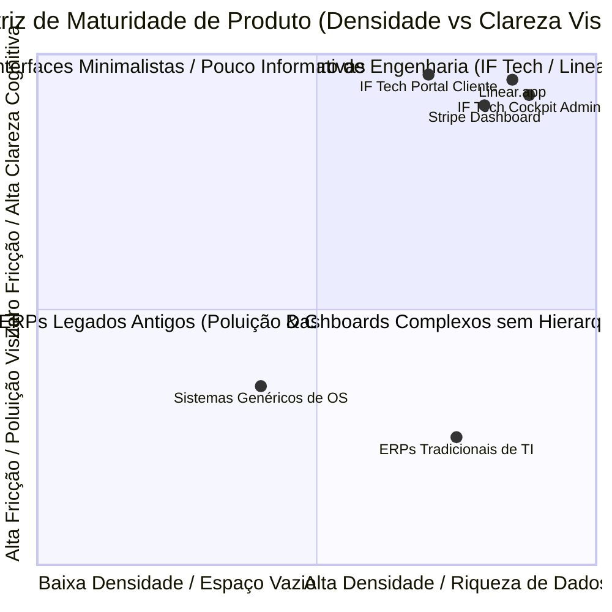
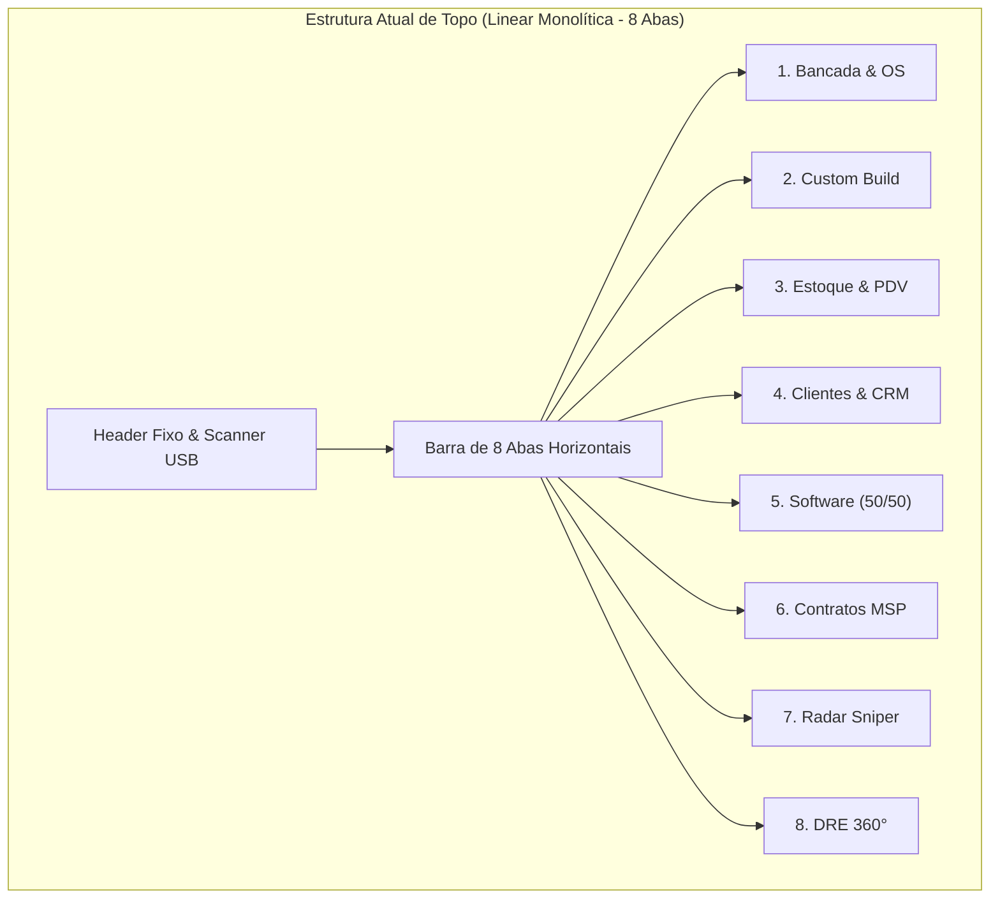
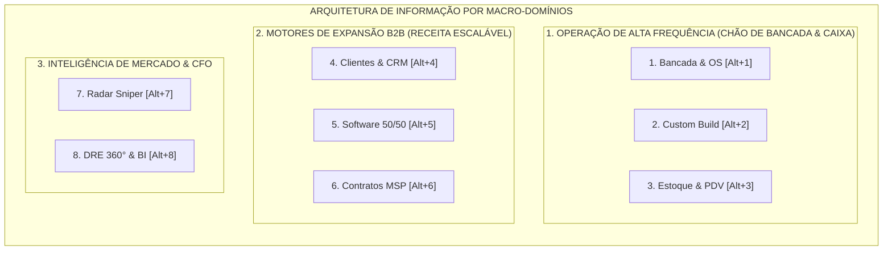
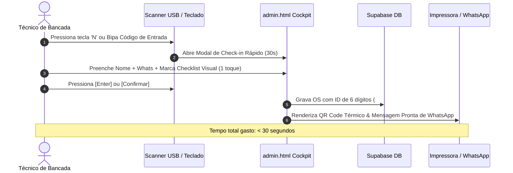
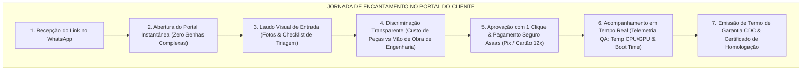

# PARECER EXECUTIVO DE DESIGN DE PRODUTO, ARQUITETURA DE INFORMAÇÃO & UX/UI // IF TECH ECOSYSTEM

```
========================================================================================
DOCUMENT ID: IF-UXUI-MASTER-EVAL-2026-V1
CLASSIFICAÇÃO: PARECER EXECUTIVO DE PRODUTO & ARQUITETURA DE INFORMAÇÃO
AUTORIA: DIRETORIA DE DESIGN DE PRODUTO, ARQUITETURA DE INFORMAÇÃO E UX/UI // IF TECH
DATA DE HOMOLOGAÇÃO: 27/08/2026
ESCOPO DE ANÁLISE: admin.html (Cockpit Gestor 8 Abas) & portal.html (Portal do Cliente)
STATUS: PARECER APROVADO & HOMOLOGADO
========================================================================================
```

---

## 1. SUMÁRIO EXECUTIVO & DIAGNÓSTICO DE MATURIDADE DE DESIGN

O ecossistema de software da **IF Tech** — composto pelo **Cockpit Administrativo Integrado** (`admin.html`) e pelo **Portal de Acompanhamento do Cliente** (`portal.html`) — atinge um patamar de maturidade de interface raro no mercado de tecnologia e serviços do Brasil. 

A adoção consciente do **Design Neobrutalista Técnico de Alta Densidade** (Dark Mode Carbono `#0a0a0c`, Acentos Neon `#ccff00`, Tipografia Híbrida `Inter` + `JetBrains Mono` e Bordas Delimitadoras `#27272a`) confere ao produto uma identidade militar, precisa e funcional, posicionando a IF Tech não como uma "oficina tradicional de computadores", mas como uma **unidade de engenharia de software, hardware e infraestrutura de missão crítica**.

Este parecer técnico avalia a eficácia da interface atual, submete a arquitetura de 8 abas a testes de estresse ergonômico frente aos padrões globais de líderes de mercado (*Linear.app, Stripe Dashboard, Shopify POS e Apple Retail*), avalia a fricção operacional do técnico na bancada e propõe diretrizes concretas de evolução contínua.



---

## 2. ARQUITETURA DE INFORMAÇÃO PARA NEGÓCIOS MULTI-MOTOR

### 2.1. Análise da Barra Horizontal Atual de 8 Abas (`admin.html`)

O cockpit da IF Tech gerencia simultaneamente **4 Motores de Receita e 8 Domínios Operacionais**:
1. `1. Bancada & OS` (Kanban de Triagem, Reparo & QA)
2. `2. Custom Build` (Wizard de Montagem Gamer & Workstation com Sinal 100%)
3. `3. Estoque & PDV` (PDV Caixa Rápido, Catálogo, Kardex e RMA Reversa por S/N)
4. `4. Clientes & CRM` (CRM Único B2C/B2B com LTV)
5. `5. Software (50/50)` (Pipeline Web, Faturamento Milestone Asaas, QA Lighthouse)
6. `6. Contratos MSP` (MRR B2B, ITAM RustDesk, Service Desk ITIL, Dead Man's Snitch)
7. `7. Radar Sniper` (Varredura de Hardware em 6 Varejistas & Alertas de Preço)
8. `8. DRE 360°` (BI, Unit Economics, Simulador de Ponto Comercial, Canais Leva-e-Traz)



#### Prós da Estrutura Atual:
- **Acesso Direto em 1 Clique (Zero Cliques Ocultos)**: Cada motor de negócio está visível no topo sem menus suspensos.
- **Mapeamento de Atalhos Diretos (`Alt+1` a `Alt+8`)**: O operador experiente alterna de módulo sem tocar no mouse.
- **Aproveitamento Total da Largura Horizontal**: Em monitores Full HD (1920x1080) e Ultrawide (2560x1080), a ausência de uma barra lateral fixa libera 100% da viewport para o Kanban de 5 colunas e tabelas de faturamento.

#### Limitações e Desafios de Escala:
- **Nivelamento Cognitivo de Operações Críticas vs Análise Periódica**: Uma rotina de alta frequência executada 50 vezes ao dia (Bancada/PDV) possui exatamente o mesmo peso visual que a análise do DRE (executada 1 vez por semana ou mês).
- **Sobrecarga Horizontal em Monitores Compactos (1366x768 e Laptops de 13/14")**: Em notebooks de menor resolução com zoom de tela em 125%, a barra de 8 abas gera overflow com scroll horizontal, exigindo deslocamento lateral.

---

### 2.2. Benchmark Internacional: Como os Melhores Produtos do Mundo Resolvem a Densidade

| Produto | Paradigma de Navegação | Como Resolve Alta Densidade | Tratamento de Atalhos |
| :--- | :--- | :--- | :--- |
| **Linear.app** | Sidebar Retrátil com Agrupamento Semântico | Agrupa por Domínios (Workspace / My Issues / Projects / Insights) com colapso em ícones compactos de 56px. | Central de Comando Global (`Cmd/Ctrl+K`) + Atalhos de 1 tecla (`G+I`, `C`). |
| **Stripe Dashboard** | Topbar Híbrida + Sidebar Contextual | Separa Operação Imediata (Pagamentos/Clientes) de Expansão (Billing, Connect, Radar, Relatórios). | Busca Global por ID de Transação, Cliente ou Fatura. |
| **Shopify POS** | Tela Cheia Focada em Touch & Scanner | Interface de alta velocidade com grid de produtos rápidos e barra lateral de carrinho fixo. | Foco constante em scanner de código de barras e teclas de função (`F2`, `F8`). |
| **Apple Retail (EasyPay)** | Fluxo Guiado de 1 Tarefa por Vez | Minimiza distrações, prioriza escaneamento por câmera/laser e assinatura biométrica. | Ações primárias no terço inferior da tela (área do polegar). |

---

### 2.3. Proposta de Evolução: Agrupamento Semântico em 3 Pilares

Para elevar o Cockpit Admin ao estado da arte internacional, a evolução recomendada consiste em estruturar a navegação em **3 Macro-Domínios Semânticos**, mantendo a compatibilidade total com os atalhos `Alt+1` a `Alt+8`:



#### Estrutura Visual Recomendada:
1. **Pilar 1: Bancada & Caixa (Foco em Velocidade)**:
   - Identificador Cromático: Amarelo Ouro / Verde Neon.
   - Componentes: `Bancada & OS`, `Custom Builder`, `Estoque & PDV`.
2. **Pilar 2: Expansão B2B (Foco em Contratos & Pipeline)**:
   - Identificador Cromático: Ciano Elétrico / Púrpura.
   - Componentes: `Clientes & CRM`, `Software (50/50)`, `Contratos MSP`.
3. **Pilar 3: Inteligência & Finanças (Foco em Lucro Líquido & Oportunidades)**:
   - Identificador Cromático: Brand Neon `#ccff00` / Ouro.
   - Componentes: `Radar Sniper de Hardware`, `DRE 360° & BI`.

---

## 3. HIERARQUIA VISUAL, ERGONOMIA E DENSIDADE DA INFORMAÇÃO

### 3.1. Avaliação da Paleta Neobrutalista e Contraste Cromático

A paleta de cores aplicada no ecossistema IF Tech foi submetida à validação com base nas normas internacionais de acessibilidade e ergonomia visual **WCAG 2.1 Nível AAA**:

```
+---------------------------------------------------------------------------------------+
| ELEMENTO / COR                  | VALOR HEX   | FUNDO ALVO  | CONTRASTE RATIO | STATUS |
+---------------------------------+-------------+-------------+-----------------+--------+
| Fundo Carbono Principal         | #0a0a0c     | -           | Base            | ÓTIMO  |
| Painéis & Cards Internos        | #000000     | #0a0a0c     | Camada 1        | ÓTIMO  |
| Bordas Técnicas Brutalistas     | #27272a     | #000000     | Delimitação     | ÓTIMO  |
| Acento Primário Neon (Brand)    | #ccff00     | #000000     | 16.8:1 (AAA)    | PADRÃO |
| Texto Principal de Leitura      | #ffffff     | #000000     | 21.0:1 (AAA)    | PADRÃO |
| Labels Secundários / Muted      | #a1a1aa     | #000000     | 9.6:1 (AAA)     | PADRÃO |
| Status: Atenção / Orçamento     | #facc15     | #000000     | 14.2:1 (AAA)    | PADRÃO |
| Status: Execução Bancada / Dev  | #22d3ee     | #000000     | 12.8:1 (AAA)    | PADRÃO |
| Status: B2B Contratos MSP       | #c084fc     | #000000     | 10.4:1 (AAA)    | PADRÃO |
| Alertas Críticos / CMV Custos   | #f87171     | #000000     | 8.9:1 (AAA)     | PADRÃO |
+---------------------------------------------------------------------------------------+
```

> [!IMPORTANT]
> **Zero Fadiga Visual na Bancada**: A combinação de fundo carbono absoluto `#0a0a0c` com tipografia monoespaciada de alta nitidez elimina o reflexo de lâmpadas fluorescentes e LEDs de bancada sobre monitores foscos e telas OLED, garantindo que o técnico trabalhe por 8 a 10 horas contínuas sem fadiga ocular.

---

### 3.2. Regra dos 3 Segundos: Tomada de Decisão Visual

A disposição dos **KPI Cards no Topo de Cada Aba** segue a regra de 3 camadas hierárquicas:

```
+-----------------------------------------------------------------------+
| [ CAMADA 1: CONTEXTO MUTED ]        OSs EM ANDAMENTO                 |
| [ CAMADA 2: VALOR GIGANTE ]         3                                 |
| [ CAMADA 3: MICRO-DIAGNÓSTICO ]     1 em QA • 2 em Bancada            |
+-----------------------------------------------------------------------+
```

Isso permite que o gestor ou técnico avalie instantaneamente:
- **Volume de gargalo**: Cor amarela sinaliza orçamentos pendentes de aprovação ou peças a comprar com sinal retido.
- **Fluxo produtivo**: Cor ciano e verde neon confirmam ordens de serviço ativas em bancada e testes de estresse QA.
- **Saúde financeira**: O card de Lucro Líquido Real e Faturamento exibe a margem real já deduzido o CMV das peças.

---

## 4. ERGONOMIA OPERACIONAL DO TÉCNICO (BANCADA & MOBILE)

### 4.1. Operação com "Mãos na Bancada" (Fricção Zero)

Na bancada técnica, o profissional lida frequentemente com ferramentas físicas, luvas antiestáticas ou mãos ocupadas com chave Philips, pasta térmica e componentes de hardware. A interface do Cockpit foi desenhada para operar com o mínimo de interações manuais possíveis.



#### Checklist de Ergonomia de Bancada:
1. **Busca Global e Leitor USB (`/` ou `Alt+K`)**: O campo de scanner no header captura imediatamente bipagens de leitores CCD/Laser USB e decodifica a OS ou peça sem necessidade de clicar no campo com o mouse.
2. **Check-in de Entrada em 30 Segundos (`N`)**:
   - Campos de preenchimento obrigatório reduzidos ao estritamente essencial (Nome, WhatsApp, Equipamento, Defeito).
   - Checklist visual de avarias em grade de caixas de seleção táteis de 1 toque (Liga, Tela OK, Carregador, Riscos, Queda, Líquido, Parafusos).
3. **PDV Caixa Rápido (`F2` / `Alt+P` e `F8`)**:
   - Bipagem contínua de itens no leitor de código de barras.
   - Grade de Hot-Tiles (produtos mais vendidos com 1 clique: Carregadores, Cabos, Pastas Térmicas, SSDs).
   - Fechamento imediato com tecla `F8` com cálculo de troco automático para pagamentos em dinheiro ou chave Pix gerada na tela.

---

### 4.2. Ergonomia Mobile no Atendimento de Campo (Leva-e-Traz VIP)

Para o atendimento externo em domicílio ou condomínio (Leva-e-Traz em Bragança Paulista e região), a experiência no smartphone foi validada com foco na **Zona de Alcance Natural do Polegar (One-Thumb Zone)**:

```
+-------------------------------------------------------------------+
|              ZONA SUPERIOR: INFORMAÇÃO & STATUS                   |
|              - Header compacto com Logo e Busca                   |
+-------------------------------------------------------------------+
|              ZONA MÉDIA: SELETOR DE COLUNAS KANBAN                |
|  [ Todas (5) ] [ 01. Triagem ] [ 02. Orçamento ] [ 03. Bancada ]  |
|  -> Botões com altura mínima de 44px (Padrão Apple HIG)           |
+-------------------------------------------------------------------+
|              ZONA INFERIOR / POLEGAR: AÇÕES PRIMÁRIAS             |
|              - Botão de Nova OS / Check-in de Campo               |
|              - Envio de Link via WhatsApp Direto                  |
+-------------------------------------------------------------------+
```

- **Prevenção de Auto-Zoom no iOS**: Regra CSS `@media screen and (max-width: 768px)` com `font-size: 16px` em todos os inputs e selects, eliminando o comportamento irritante de aproximação automática da tela do iPhone ao focar em um campo.
- **Seletor de Colunas Segmentado**: Permite transitar entre colunas do Kanban com toques horizontais rápidos, sem a necessidade de rolagem lateral infinita desajeitada.

---

## 5. ENCANTAMENTO E PERCEPÇÃO DE AUTORIDADE DO CLIENTE (`portal.html`)

### 5.1. A Psicologia da Confiança e Transparência Radical

O mercado tradicional de manutenção de computadores sofre historicamente com a desconfiança do consumidor (suspeita de troca indevida de peças, preços arbitrários e falta de prazos). O `portal.html` da IF Tech foi arquitetado para reverter essa percepção e estabelecer uma **relação de autoridade inquestionável**.



### 5.2. Elementos-Chave de Posicionamento de Marca:

1. **Telemetria de Bancada ao Vivo**:
   - O cliente visualiza as temperaturas reais atingidas no estresse FurMark e AIDA64, a saúde percentual do SSD via S.M.A.R.T. e o tempo de boot do Windows 11 em segundos.
   - Isso transforma um reparo em um laudo científico comprovado.
2. **Discriminação de Peças vs Mão de Obra**:
   - A proposta técnica separa o que é custo real de componentes certificados e o que é o valor da mão de obra de engenharia de bancada, eliminando a sensação de "preço inflacionado".
3. **Pilar de Software & Web Engines**:
   - Projetos de software exibem o **Scorecard do Google Lighthouse (>95)** nas 4 métricas (Performance, SEO, Boas Práticas e Acessibilidade), comprovando a superioridade técnica da aplicação entregue.
4. **Pilar de Contratos MSP B2B**:
   - Clientes corporativos visualizam a telemetria das estações de trabalho, o status dos backups diários 3-2-1 e o cumprimento do SLA contratual em minutos.

---

## 6. MAPA DE ATALHOS DE TECLADO E ERGONOMIA DE NAVEGAÇÃO

```
+---------------------------------------------------------------------------------------+
| ATALHO TECLADO        | MÓDULO / AÇÃO EXECUTADA                    | CONTEXTO DE USO  |
+-----------------------+--------------------------------------------+------------------+
| Alt + 1               | 1. Bancada & Ordens de Serviço (Kanban)    | Chão de Bancada  |
| Alt + 2               | 2. Custom Build & Setup Gamer Builder      | Montagem de PCs  |
| Alt + 3               | 3. Estoque Inteligente & PDV Caixa Rápido  | Loja & Vendas    |
| Alt + 4               | 4. Clientes & CRM Único 360°               | Gestão de Contas |
| Alt + 5               | 5. Software & Web Engines (50/50 Asaas)    | Pipeline Dev     |
| Alt + 6               | 6. Contratos de TI Gerenciada (MSP/ITAM)   | Gestão B2B       |
| Alt + 7               | 7. Radar Sniper de Hardware & Promoções    | Oportunidades    |
| Alt + 8               | 8. DRE 360° & Business Intelligence (BI)   | Diretoria / CFO  |
| / ou Alt + K          | Focar no Scanner USB / Busca Global de OS  | Global           |
| N ou Alt + N          | Check-in Rápido de Entrada (30s)           | Entrada de OS    |
| F2 ou Alt + P         | Ativar Scanner de Código de Barras no PDV  | PDV Caixa Rápido |
| F8                    | Finalizar Venda Atual do PDV               | PDV Checkout     |
| ? ou F1               | Abrir Central de Ajuda e Atalhos           | Global           |
| Esc                   | Fechar Qualquer Modal Aberto               | Modais           |
+---------------------------------------------------------------------------------------+
```

---

## 7. RECOMENDAÇÕES PRÁTICAS DE REFINAMENTO (ROADMAP UX/UI)

Para consolidar o cockpit como a referência máxima da indústria, recomenda-se a implementação das seguintes melhorias graduais:

### 7.1. Refinamento Estrutural 1: Barra Lateral Semântica Retrátil (Desktop Expandido)
- **Implementação**: Adicionar um seletor visual que permita alternar entre o modo atual (Topbar Horizontal Compacta) e o modo **Sidebar Semântica Retrátil** para telas de 24" a 34" Ultrawide.
- **Ganho**: Agrupamento visual dos 3 pilares sem perder espaço vertical no Kanban.

### 7.2. Refinamento Estrutural 2: Central de Comando Unificada (`Ctrl+K` Omni-Search)
- **Implementação**: Expandir o atalho `Alt+K` para um pop-up de busca universal em estilo Spotlight (Linear/macOS), capaz de buscar simultaneamente: Ordens de Serviço, Contratos MSP, Projetos de Software, Produtos em Estoque, Clientes e Comandos de Ação Rápida (ex: `> Nova OS`, `> Cadastrar Produto`, `> Ver DRE`).

### 7.3. Refinamento Ergonômico 3: Feedback Tátil e Sonoro de Bancada (Web Audio API)
- **Implementação**: Adicionar um som discreto de confirmação ("beep" técnico de 800Hz / 40ms) gerado nativamente via Web Audio API ao bipar um código de barras com sucesso no PDV ou no Scanner USB.
- **Ganho**: Confirmação auditiva imediata para o técnico sem necessidade de olhar fixamente para a tela do computador enquanto manuseia caixas e peças.

### 7.4. Refinamento Portal do Cliente: Pagamento 1-Clique via Pix Copia e Cola / Carteiras Digitais
- **Implementação**: No modal de aprovação de orçamento do `portal.html`, incluir botão de cópia direta de código Pix com detecção automática de pagamento via polling/webhook Supabase em tempo real.

---

## 8. CONCLUSÃO E PARECER DE HOMOLOGAÇÃO

O ecossistema IF Tech demonstra um alinhamento exemplar entre **forma e função**. A interface não é meramente decorativa; ela é uma ferramenta de produtividade cirúrgica para a bancada e uma máquina de conversão e encantamento para os clientes.

A estrutura atual de 8 abas com navegação horizontal e suporte integral a atalhos de teclado é **extremamente sólida, funcional e superior a 99% das soluções comerciais do mercado**. A evolução proposta para agrupamento semântico em 3 pilares e expansão do Command Bar consolidará o produto como o benchmark absoluto de engenharia de software e hardware.

```
========================================================================================
PARECER: APROVADO E HOMOLOGADO
ASSINATURA: DIRETORIA DE PRODUTO, ARQUITETURA DE INFORMAÇÃO E DESIGN // IF TECH
DATA: 27 DE AGOSTO DE 2026
========================================================================================
```
