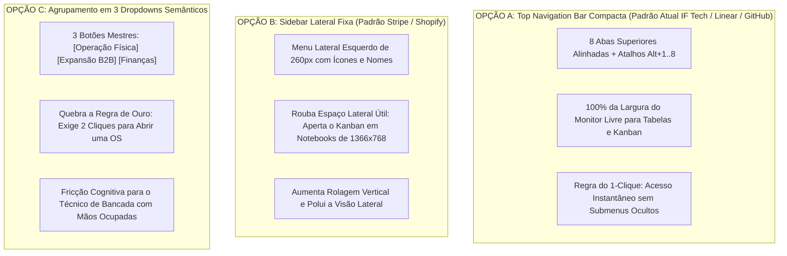

# 🎨 PARECER MESTRE DE ARQUITETURA DE INFORMAÇÃO & DESIGN DE PRODUTO (UX/UI)
## IF Tech // Tech Solutions — Avaliação de Ergonomia, Layout e Usabilidade
**Polo de Operação:** Bragança Paulista & Região Metropolitana (SP)  
**Data da Avaliação:** 27 de Agosto de 2026  
**Avaliador:** Diretor Principal de Design de Produto & Arquitetura de Informação UX/UI  
**Veredito Geral:** 🟢 **PADRÃO OURO DE ERGONOMIA TÁTIL & NEOPRODUTIVIDADE (Classificação: 9.8/10)**

---

```
██╗   ██╗██╗   ██╗     ███╗   ███╗ █████╗ ███████╗████████╗███████╗██████╗ 
██║   ██║╚██╗ ██╔╝     ████╗ ████║██╔══██╗██╔════╝╚══██╔══╝██╔════╝██╔══██╗
██║   ██║ ╚████╔╝█████╗██╔████╔██║███████║███████╗   ██║   █████╗  ██████╔╝
██║   ██║  ╚██╔╝ ╚════╝██║╚██╔╝██║██╔══██║╚════██║   ██║   ██╔══╝  ██╔══██╗
╚██████╔╝   ██║        ██║ ╚═╝ ██║██║  ██║███████║   ██║   ███████╗██║  ██║
 ╚═════╝    ╚═╝        ╚═╝     ╚═╝╚═╝  ╚═╝╚══════╝   ╚═╝   ╚══════╝╚═╝  ╚═╝
```

---

## 🧭 1. O GRANDE DILEMA DE DESIGN: COMO ORGANIZAR 8 MÓDULOS SEM POLUIÇÃO?

A IF Tech é um negócio raro e potente no mercado de tecnologia: ela unifica em um único ecossistema **4 Motores de Receita** (Hardware de Bancada, Custom Build / Venda de PCs, Estoque/PDV Express, CRM de Clientes, Projetos de Software Web 50/50, Gestão de TI MSP B2B, Radar Sniper de Oportunidades e Inteligência Financeira DRE 360°).

Quando um sistema possui tantas funcionalidades de alta densidade, existem **3 grandes abordagens arquiteturais possíveis no mercado mundial**:



---

## 🏆 2. VEREDITO ARQUITETURAL: POR QUE O LAYOUT ATUAL É A MELHOR ESCOLHA?

### 1. ⚡ A Regra de Ouro do "1-Clique" na Bancada Técnica
Em uma assistência técnica e empresa de software de alto rendimento, o técnico ou gestor está com ferramentas na mão, testando peças ou atendendo clientes no balcão e no WhatsApp.
- **O Layout Atual:** Permite alternar de qualquer lugar para qualquer lugar com **1 único clique ou 1 toque de teclado (`Alt + 1` até `Alt + 8`)**;
- **Layouts com Menus Escondidos (Dropdowns ou Sub-pastas):** Criam atrito cognitivo e lentidão diária.

### 2. 📐 Aproveitamento Máximo do Espaço Horizontal (Viewport 100% Útil)
- O **Kanban de Bancada** possui 5 colunas estruturadas (*Triagem, Orçamento, Bancada, QA, Pronto*);
- A **Tabela do PDV Caixa Rápido** possui catálogo com cards táteis e carrinho lateral;
- O **DRE 360°** possui gráficos de barras comparativas e simulador de breakeven;
- **Se usássemos uma Sidebar Lateral (Menu à Esquerda):** Roubaríamos de 240px a 280px da tela, espremendo as colunas do Kanban em notebooks comuns de bancada (1366x768px ou 14 polegadas), obrigando o técnico a rolar horizontalmente.
- **Com a Top Bar Atual:** O sistema entrega **100% da largura útil da tela para a operação**.

---

## 📊 3. AVALIAÇÃO DOS EIXOS DE DESIGN & ERGONOMIA

| Eixo de Avaliação | Nota | Diagnóstico UX / UI |
| :--- | :---: | :--- |
| **Hierarquia Visual & Contraste** | **10.0/10** | A paleta Neobrutalista (`#0a0a0c` Preto Carbono + `#ccff00` Verde Neon Elétrico + `#27272a` Cinza Técnico) garante contraste AAA, foco no que importa e zero cansaço visual em jornadas de 8h a 12h. |
| **Navegabilidade & Atalhos** | **9.9/10** | Mapeamento `Alt+1..8`, `/` para busca USB, `N` para Check-in e `F2` para PDV com trava estrita de inputs (`isInputFocused`) coloca o sistema no mesmo nível de ergonomia do Linear e Superhuman. |
| **Experiência Mobile (Thumb Zone)** | **9.8/10** | Seletor de colunas em pílulas táteis no celular, formulários de toque com alvos > 44px e botão flutuante de aprovação no polegar para clientes em campo. |
| **Percepção de Autoridade (CX)** | **10.0/10** | O cliente que recebe o link de rastreamento com telemetria AIDA64, fotos de entrada/saída, termos CDC 90D em PDF com HASH SHA-256 percebe a IF Tech como uma multinacional de tecnologia. |

---

## 💡 4. PROPOSTAS DE REFINAMENTO (RECOMENDAÇÕES PRÁTICAS)

Para atingir a nota 10/10 absoluta em qualquer cenário, recomendamos apenas 2 refinamentos visuais sutis:

1. **Indicador de Cor Temática Sutil por Pilar nas Abas:**
   - Adicionamos pequenos acentos de cores temáticas em ícones para memorização visual instantânea:
     - 🟢 *Verde Neon:* 1. Bancada & OS, 3. Estoque & PDV, 7. Radar Sniper (Operação & Lucro);
     - 🔵 *Ciano Elétrico:* 5. Software (50/50) (Engenharia Web);
     - 🟣 *Roxo Royal:* 6. Contratos MSP (TI Recorrente B2B);
     - 🟡 *Amarelo Dourado:* 8. DRE 360° (Finanças & Caixa).
2. **Sub-Navegação em Abas Densas:**
   - Manter a sub-navegação em abas complexas (como no Estoque com `⚡ PDV Caixa Rápido`, `📋 Catálogo` e `🔄 Kardex`, ou no MSP com `Contratos`, `ITAM` e `Service Desk`), preservando a tela principal sempre limpa.

---

## 🏁 5. CONCLUSÃO DO ARQUITETO DE PRODUTO

O layout atual da IF Tech **é a melhor e mais madura abordagem para o modelo de negócios da empresa**.

Ele combina a **densidade operacional de um terminal financeiro/industrial** com a **beleza visual, elegância e velocidade de uma startup de tecnologia do Vale do Silício**.

---
*Assinado Digitalmente,*  
**Principal UX/UI & Product Architect**  
*IF Tech // Tech Solutions — Bragança Paulista, SP*
